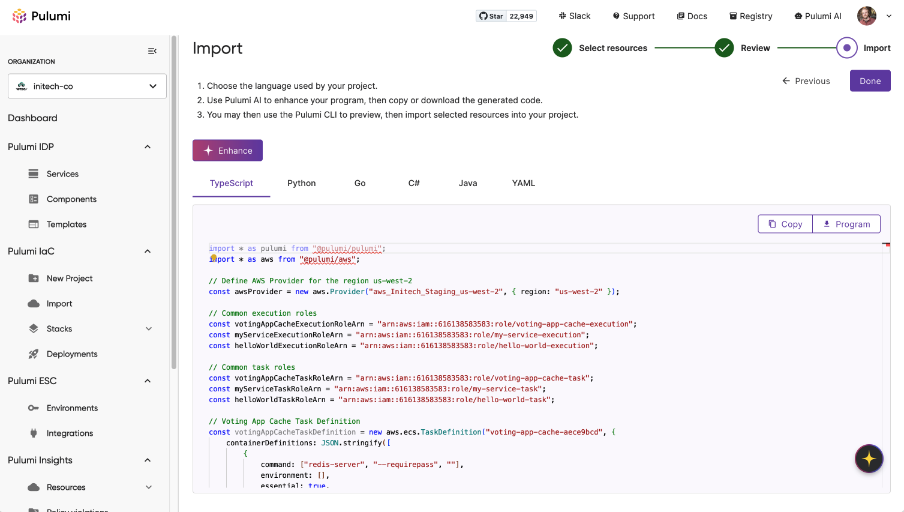

Pulumi is excited to announce the release of **Visual Import**, a new feature that transforms the way platform teams onboard existing cloud infrastructure into Pulumi. With Visual Import, you can discover unmanaged cloud resources across your organization, organize them into logical units, and instantly generate high-quality Pulumi code—with AI enhancements built in.

Visual Import is now available for all Team, Enterprise and Business Critical customers with [Pulumi Insights](/docs/insights/) enabled.

## Modern Infrastructure, Codified Faster

One of the biggest challenges platform teams face when adopting infrastructure as code is migrating existing cloud deployments. Legacy scripts, manual configurations, and scattered resource ownership all slow down progress. Visual Import solves this by making the journey from cloud to code seamless and intuitive.

Instead of manually digging through consoles and writing boilerplate code by hand, Visual Import enables teams to:

* **Discover** all cloud resources—across any number of accounts—via [Pulumi Insights](/docs/insights/).
* **Select** and group resources into meaningful stacks, services, or projects.
* **Generate** production-ready Pulumi code in your language of choice.
* **Enhance** that code using Pulumi Copilot, which refines formatting, naming, references, and documentation.
* **Integrate** with your development workflows by downloading, editing, and importing Pulumi code into your existing repositories.

Whether you're modernizing infrastructure, unifying multi-account environments, or enabling developers to adopt infrastructure as code more easily, Visual Import gives you a fast, repeatable onramp to scalable, consistent cloud management.

## How It Works

Visual Import is a guided three-step workflow within the Pulumi Cloud Console:

1. Select Resources: Use powerful filters and grouping tools to find the resources you want to codify. Whether you're capturing a full service or just a few related components, Visual Import gives you visibility and precision.
2. Review References: Automatically discover and select dependent resources—ensuring your code captures the right context and connectivity between infrastructure elements.
3. Generate Code: Choose your preferred language and preview or download fully-formed Pulumi code. You can refine it manually or invoke Pulumi Copilot to improve naming, structure, and comments.

Throughout the workflow, you maintain full control. Select what you need, tweak it as required, and integrate on your terms.  You can find full documentation and usage details in the [Visual Import docs](/docs/pulumi-cloud/import/).

## Key Benefits

### Accelerated Migration

Visual Import dramatically shortens the time it takes to transition existing cloud infrastructure into a managed, version-controlled state. What previously required weeks of manual discovery, scripting, and trial-and-error can now be accomplished in a matter of hours.

Whether you're consolidating legacy environments, auditing infrastructure before a cloud cost review, or preparing for a compliance milestone, Visual Import automates much of the busywork—so your team can focus on what matters.

### Increased Developer Productivity

Manually transitioning existing infrastructure to code often pulls developers away from their primary focus—building and improving services. By automating code generation and applying intelligent AI enhancements, Visual Import lets teams spend less time writing boilerplate code and fighting resource drift, and more time shipping meaningful changes.
  
Pulumi Copilot adds a layer of polish that typically requires hands-on review and iteration, saving your team valuable time while helping new contributors write clear, consistent infrastructure code from the start.

### Consistent, Reliable Infrastructure

Unifying your cloud environments under a single IaC framework brings consistency, accountability, and repeatability to operations. Pulumi's typed IaC model makes configurations explicit and auditable, while policies and CI/CD integrations enforce best practices from the start.  

By codifying your infrastructure, you reduce the risk of configuration drift, simplify onboarding, and ensure reproducibility across staging and production.

### From Insights to IaC—Seamlessly

Visual Import builds on Pulumi Insights, providing a natural path from discovery to codification. If you're already using Insights to monitor and visualize your infrastructure, you can now convert those resources into managed, versioned code in just a few clicks.

And with built-in support for dependency analysis and cross-account visibility, you can finally treat your entire infrastructure portfolio as a single, coherent system—even if it wasn't built that way.

### Leverage the Full Power of Pulumi Cloud

Once resources are in code, you can take full advantage of Pulumi Cloud's full suite of features: define and enforce policies with CrossGuard, gain visibility into your entire infrastructure through [Pulumi Insights](/docs/insights/), manage state with [ESC's secrets management](/docs/esc/get-started/), and automate workflows through [Pulumi Deployments](/docs/pulumi-cloud/deployments). Together, these features turn your infrastructure into a governed, observable, and continuously deployable system built for modern cloud operations.

## Try It Today

Visual Import is now available in the Pulumi Cloud Console for Team, Enterprise and Business Critical users. If you're ready to modernize your infrastructure and empower your teams with a fast path to Infrastructure as Code, there's no better place to start.

[Log in to Pulumi Cloud](https://app.pulumi.com/) and select **IaC / Import** to get started.
