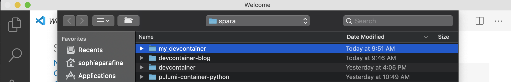
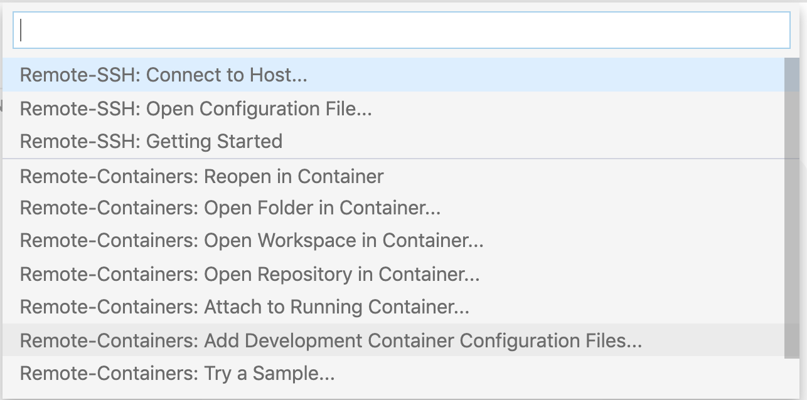
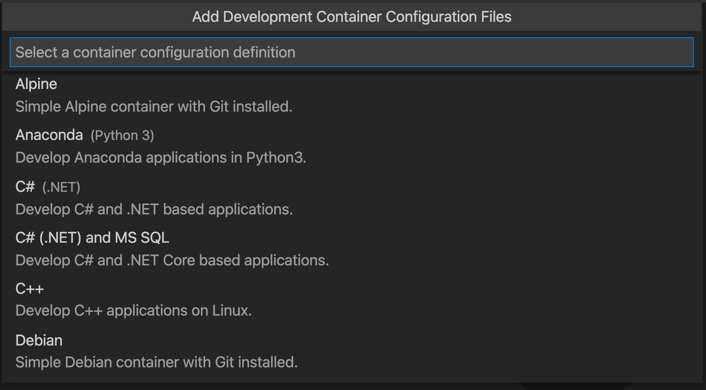
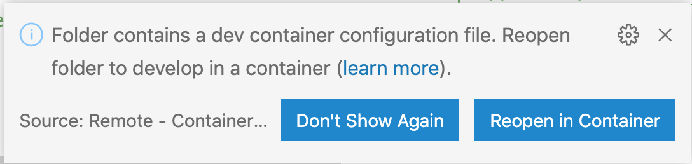
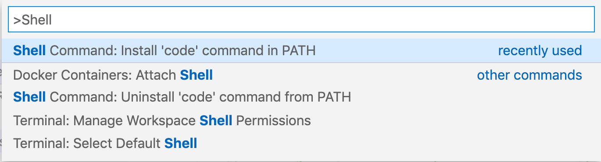
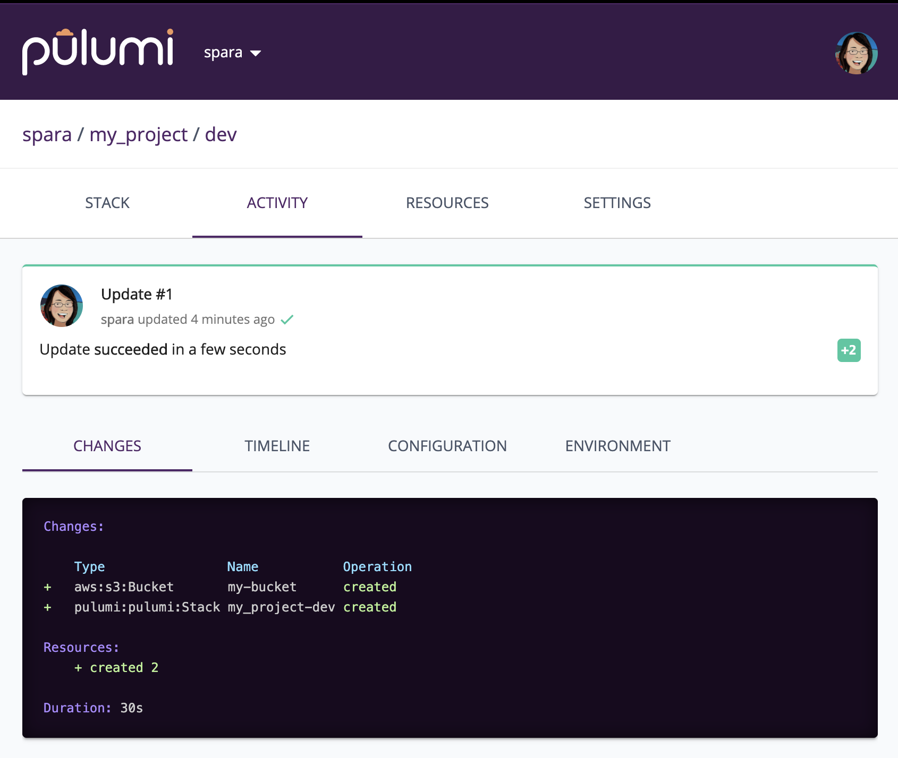

One of the major advantages of using containers for development is reducing the need to install software and associated dependencies. Developers can start writing code without configuring a development environment that emulates production. The Visual Studio Code Remote - Containers extension lets you develop inside a container. If you want to use Pulumi’s infrastructure as code engine without installing the Pulumi CLI, this blog post is for you!

<!--more-->

## Pre-requisites

To set up your development environment, you’ll need Visual Studio Code, [Docker Desktop](https://www.docker.com/products/docker-desktop), and the [Remote - Containers extension](https://marketplace.visualstudio.com/items?itemName=ms-vscode-remote.remote-containers).

1. Check to see if Docker is running:

    ```bash
    $ docker --version
    Docker version 19.03.8, build afacb8b
    ```

1. Check to see if the **Remote - Containers** is installed:

    

    Click on the green icon in the Remote Status Bar to display the commands:

    

## Building the Pulumi container

Now we can start!

1. Create a directory for your project.

    ```bash
    $ mkdir my_devcontainer
    $ cd my_devcontainer
    ```

    Open the directory in VS Code.

    

1. Next, we’ll create the devcontainer configuration files. Click on the Remote Status button and select **Add Development Container Configuration Files ...**.

    

1. Select the latest version for **Alpine**. We’ll replace the Dockerfile with the Pulumi Dockerfile.

    

    VS Code will display a popup asking to build the container. Dismiss the popup, we will replace the Dockerfile with the Pulumi Dockerfile.

    

In your project directory, you’ll see a *.devcontainer* directory with a Dockerfile that builds the container and a *devcontainer.json* for configuring the container environment.

## Dockerfile

For this example, we’ll use the standard Pulumi Dockerfile, which includes the SDK for all the supported languages. Download the [Dockerfile](https://raw.githubusercontent.com/pulumi/pulumi/master/.devcontainer/Dockerfile) and save it to the .devcontainer directory.

```bash
$ cd .devcontainer
$ curl "https://raw.githubusercontent.com/pulumi/pulumi/master/.devcontainer/Dockerfile" -o Dockerfile
```

## Container configuration

Next, we'll clean up the `.devcontainer/devcontainer.json` file and set up the necessary credentials.

First edit `devcontainer.json` as follows:

- Replace the "name" field with `Pulumi`
- Remove the "args" line
- Replace the "remoteUser" value with `user`

Regardless of your cloud provider, you will have to provide your credentials to deploy resources. If you want to save your project to Github or another repository, you don’t want your credentials stored in the repository. There are several ways to do this securely. Using AWS as an example, you can export them inside the container, e.g.,

Linux/macOS:

```bash
export AWS_ACCESS_KEY_ID=AKIAI44QH8DHBEXAMPLE
export AWS_SECRET_ACCESS_KEY=wJalrXUtnFEMI/K7MDENG/bPxRfiCYEXAMPLEKEY
```

Windows:

```cmd
SET AWS_ACCESS_KEY_ID=AKIAI44QH8DHBEXAMPLE
SET AWS_SECRET_ACCESS_KEY=wJalrXUtnFEMI/K7MDENG/bPxRfiCYEXAMPLEKEY
```

The disadvantage of this method is that you will have to set these environment variables every time you start the devcontainer.

### Use local environment variables

One alternative is to set the environment variables on your local machine and pass them to the container through the *devcontainer.json* file. This method requires that you have VS Code in your path and launch it from the shell.

1. Use CTRL+SHIFT+P or CMD+SHIFT+P to bring up the command palette and type *Shell Command: Install ‘code’ command in PATH*. You can set your credentials as environmental variables and launch the VS Code from the shell

    

    ```bash
    $ export AWS_ACCESS_KEY_ID=AKIAI44QH8DHBEXAMPLE
    $ export AWS_SECRET_ACCESS_KEY=wJalrXUtnFEMI/K7MDENG/bPxRfiCYEXAMPLEKEY
    $ code .
    ```

1. Next, set your provider credentials on your machine and add the following to *devcontainer.json*.

    ```json
    "containerEnv": {
        "AWS_ACCESS_KEY_ID": "${localEnv:AWS_ACCESS_KEY_ID}",
        "AWS_SECRET_ACCESS_KEY": "${localEnv:AWS_SECRET_ACCESS_KEY}"
    },
    ```

### Use an .env file

Another alternative is to use a devcontainer.env file, which contains your credentials.

1. Create a file with your crendentials.

    ```
    AWS_ACCESS_KEY_ID=AKIAI44QH8DHBEXAMPLE
    AWS_SECRET_ACCESS_KEY=wJalrXUtnFEMI/K7MDENG/bPxRfiCYEXAMPLEKEY
    ```

1. Then add it to the *devcontainer.json* file.

    ```json
    "runArgs": ["--env-file","devcontainer.env"],
    ```

1. To prevent it from exposing your credentials on a public repository, add the file to *.gitignore* or similar for you repository, e.g.,

    ```bash
    echo devcontainer.json > .gitignore
    ```

There are many more [configuration options available](https://code.visualstudio.com/docs/remote/containers-advanced), including mounts and remote configurations.

## Try it out

Again, use the command palette to start the container. Use the **Open Folder in Container...** command, and select the project folder. If you’ve already got the folder open locally, you could also use the **Reopen in Container** command.

Check to see if your credentials are set. Open a terminal in VS Code if it isn’t already open.

```bash
$ user@973a612c1555:/workspaces/my_devcontainer# env | grep AWS
AWS_SECRET_ACCESS_KEY=wJalrXUtnFEMI/K7MDENG/bPxRfiCYEXAMPLEKEY
AWS_ACCESS_KEY_ID=AKIAI44QH8DHBEXAMPLE
```

Now we ready to use Pulumi in our VS Code development environment! Let’s try it out by creating an S3 bucket. First, we’ll make a directory for our project and use `pulumi new` to create a default project.

```bash
$ mkdir my_project
$ cd my_project
$ pulumi new aws-typescript
```

Follow the prompts, then run `pulumi up` to deploy.

```bash
$ pulumi up
Previewing update (dev):
     Type                 Name            Plan
 +   pulumi:pulumi:Stack  my_project-dev  create
 +   └─ aws:s3:Bucket     my-bucket       create

Resources:
    + 2 to create

Do you want to perform this update? yes
Updating (dev):
     Type                 Name            Status
 +   pulumi:pulumi:Stack  my_project-dev  created
 +   └─ aws:s3:Bucket     my-bucket       created

Outputs:
    bucketName: "my-bucket-cbdec06"

Resources:
    + 2 created

Duration: 31s

Permalink: https://app.pulumi.com/spara/my_project/dev/updates/1
```

You can CMD + click on the link to open a browser and display the status of your project on the Pulumi Service.



## Build a Pulumi examples devcontainer

Pulumi has a repository of examples, and we can create a devcontainer from the repository so you can try them out.

1. Clone the repository, then follow the steps above to create and configure the Pulumi container image.

    ```bash
    $ git clone https://github.com/pulumi/examples.git
    ```

1. Create the configuration files, add the Pulumi Docker file, and add your credentials.

1. Let’s deploy a Kubernetes cluster! With `pulumi stack init`, we can create a stack, but we will need to install the project dependencies and set configuration variables such as the region.

    ```bash
    $ cd aws-ts-eks
    $ pulumi stack init
    $ npm install
    $ pulumi config set aws:region us-west-2
    $ pulumi up
    ```

Here’s the kubeconfig file's output, which you can use with kubectl to manage the cluster.

```bash
Outputs:
    kubeconfig: {
        apiVersion     : "v1"
        clusters       : [
            [0]: {
                cluster: {
                    certificate-authority-data: "LS0tLS1CRUdJTiBDRVJUSUZJQ0FURS0tLS0tCk1JSUN5RENDQWJDZ0F3SUJBZ0lCQURBTkJna3Foa2lHOXcwQkFRc0ZBREFWTVJNd0VRWURWUVFERXdwcmRXSmwKY201bGRHVnpNQjRYRFRJd01EY3hNVEl5TXpZMU9Wb1hEVE13TURjd09USXlNelkxT1Zvd0ZURVRNQkVHQTFVRQpBeE1LYTNWaVpYSnVaWFJsY3pDQ0FTSXdEUVlKS29aSWh2Y05BUUVCQlFBRGdnRVBBRENDQVFvQ2dnRUJBTHFvCk9wTDBiQWo2TFFMNlh2anRsMFZ6TUN5WTJmYlo4cXEvNGd3bkJxcVI2RFV6Q1RwbkJmOHJVRjVrUXhBQXRUNysKTTFZblp5VEFBYndOZ3NIL3lObk5sMnFCQmRSQ0JZTVVlN1I2MVBxcGdabFZpN0JaNHRlek9DalRqeGV0SXlaMwoxRW9TdTNBYnhzTmh6dDVBTjVYZklnZlBuM3B2eEtwYTA1MEg3aWhFaUptSEl3M0Z5TVovUHpxY2JHczh3RHVCCk1jYjNzOHMwZDBIVExsb2dCL2svOVBLbGVpZDgyWFkxMEdBN0YxeFM2cFdZODkwQ1BwNXpWZ0pRWGhuRGR2S1gKVlFValdCTDZQYU14U0lBZEZQM1BZYk1FdXk5Vyt0c2lqc2VydThVNTVpUDlWSUdMdTZzdEdycTNuQUhtUk40UQpqeXRCRWd4RjN1R0dtZ0dMOStFQ0F3RUFBYU1qTUNFd0RnWURWUjBQQVFIL0JBUURBZ0trTUE4R0ExVWRFd0VCCi93UUZNQU1CQWY4d0RRWUpLb1pJaHZjTkFRRUxCUUFEZ2dFQkFEcUtyVGVnZmhWbElNUklQNjFVZEtvaGtnS3MKblUyZjUvTHBzU3ozbmliUCt3Y2VpNktYL3RSNjAzTHhFMlVXUTlmR0ZycTBCMTlJR1JaK0VVQjl2Vy9JdWowTApVK2UwUUtWc01qd2dMWm4rS3IyN0VQNUNGay8vZEVCRUZqa01PMmNlTFFRaFcvUXFzSFhJb2ZjZ0UvZnJ3YzErCmQwdGROWmxJa3JRdzJwYnVhcVI0VmRlWlpVSitqbW8rdEo1SlZ5a2Rwa29JYml1ZEZ6Q0N5YVB1LzhJc09CTUsKcWtvTFpNazdBMzh5SWxDK2RCTnJwdkQvRTF5U1lhcXlDaE5CdVBkd1VqcWZaWmJmaWR5N050emd2VjMvUWFtWgpuZUJJcWs0c1AzSWU0TUN0QmV4bU9iSWowdVBLTnVCQ01UTStxSVI2UWdnYXdEbWxXcXE4V0ZiUlNJMD0KLS0tLS1FTkQgQ0VSVElGSUNBVEUtLS0tLQo="
                    server                    : "https://3FE47B904E57AF9E16E0B7F00C7EEABA.yl4.us-west-2.eks.amazonaws.com"
                }
                name   : "kubernetes"
            }
        ]
        contexts       : [
            [0]: {
                context: {
                    cluster: "kubernetes"
                    user   : "aws"
                }
                name   : "aws"
            }
        ]
        current-context: "aws"
        kind           : "Config"
        users          : [
            [0]: {
                name: "aws"
                user: {
                    exec: {
                        apiVersion: "client.authentication.k8s.io/v1alpha1"
                        args      : [
                            [0]: "eks"
                            [1]: "get-token"
                            [2]: "--cluster-name"
                            [3]: "cluster-eksCluster-367b66b"
                        ]
                        command   : "aws"
                    }
                }
            }
        ]
    }
```

You can now try out any of our infrastructure as code examples with this devcontainer.

## Conclusion

As you can see, we’ve built our development with VS Code and Docker. Using a Pulumi devcontainer lets you build and deploy infrastructure without installing Pulumi or any associated dependencies on your computer. Moreover, you can share your development environment by creating a repository. Give it a try and let us know what you’re building on [Slack](https://pulumi.slack.com) or [Twitter](https://twitter.com/pulumicorp).
