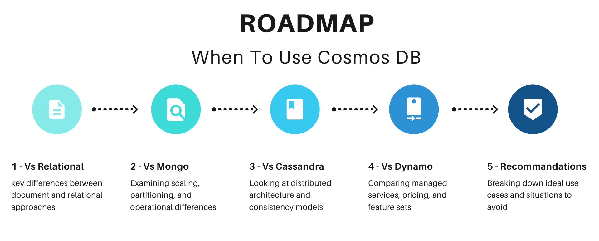
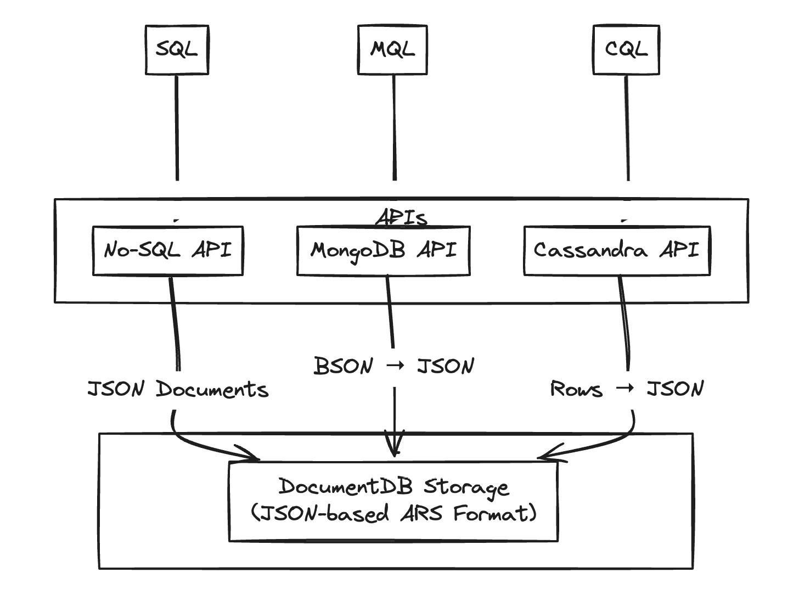
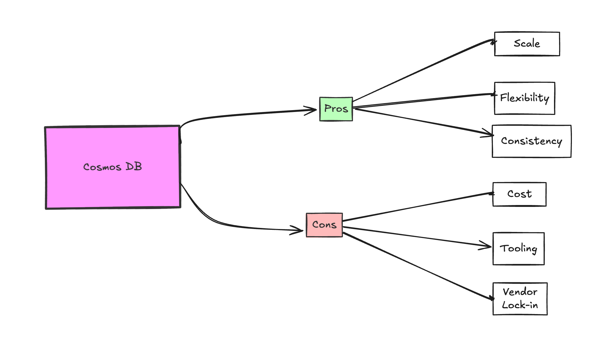

When should you use Cosmos DB on Azure? It's a hard question to answer.

Azure Cosmos DB tries to do it all - which makes it both powerful and, honestly, kind of confusing. The marketing doesn't help either. Yeah, it's a flexible database, but before you jump in, you need to understand how it actually works under the hood, what it'll cost you, and what trade-offs you're making by choosing it.

I'm going to break all that down. Here's a roadmap:

<!--more-->


## TL;DR

The short version is: **you should use it on Azure when you'd use DynamoDB on AWS.** That's to say, you should use it when you're OK with being cloud-specific, when you want hands-off scalability, and when you know the query pattern and potential cost ramifications ahead of time.



But let's start at the beginning.

## What is Cosmos DB? Features & Architecture Explained

[Cosmos DB](https://azure.microsoft.com/en-us/products/cosmos-db) is Microsoft high availability distributed database. First released as DocumentDB in 2014 and rebranded to Cosmos DB in 2017, its used interally at MS for Bing and Office 365 and available on Azure in all regions.

## Types Of Databases

Different databases are good at different things. Relational databases focus on strong consistency and complex relationships. Key-value stores are optimized for speed and simplicity. Document databases trade schema rigidity for flexibility. NewSQL systems attempt to combine consistency and scale.

| Type             | Example          | Best For                                                                      |
|-----------------|-------------------|------------------------------------------------------------------------------|
| Relational      | PostgreSQL       | Traditional business applications with complex transactions                    |
| Key-Value       | Redis            | Caching and session management                                                  |
| Document        | MongoDB          | Applications with evolving data structures                                      |
| NewSQL | Spanner, CockroachDB | Global applications requiring both scale and consistency      |
| Dynamo-Inspired | DynamoDB, Cassandra | High write throughput, eventually consistent applications                        |

Cosmos DB can look like each of those categories. This is because it's a multi-model DB, with a number of APIs that correspond to each model type. Despite it having a SQL interface (often recognized as the most used and recommended interface), and despite it purporting to be multi-model, at its lowest layer, it is actually backed by a document-based storage layer. It is a powerful document database, one with tunable consistency, distribution by logical and physical partition, and more, but it's helpful to know how the storage layer works to understand everything else. I'm going to show some examples, but first let's clear up what Cosmos DB is not.



{}
If you are going to use Cosmos DB, you should probably be using the Core API, also called the "API for NoSQL". It's the quickest to get new features. Confusingly, despite being called a NoSQL API, data is queried and added using SQL.
{}

## Cosmos DB Vs. SQL Server ( Azure SQL Database ) or Postgres

This is a personal opinion, but if you have a use case that is well served by a traditional relational database, you should choose that. Postgres and SQL Server are both great and both available on Azure ( Postgres as Azure Database for PostgreSQL ). They both have great query planners; they have great tooling for migration and backups, as well as schema management. The SQL API from Cosmos should **not** be considered an alternative to a relational database unless you have specific needs because it's a different type of beast designed for different use cases. But let me show you.

If you grab our [CosmoDB how to guide](https://www.pulumi.com/registry/packages/azure-native/how-to-guides/azure-cs-cosmosdb-logicapp/) and `pulumi up`, you'll see from that, the first hint of its [document roots](https://github.com/pulumi/examples/blob/master/azure-cs-cosmosdb-logicapp/MyStack.cs#L6) in that the pulumi namespace is `Pulumi.AzureNative.DocumentDB`, but it goes deeper because although I can insert and select with sql in Cosmos DB, there is no schema.

### How to Insert & Query Data in Cosmos DB NoSQL

If I insert this customer:

```csharp
CosmosDatabase database = await client.
    CreateDatabaseIfNotExistsAsync(databaseId);
CosmosContainer container = await database.
    CreateContainerIfNotExistsAsync(containerId, "/customerId");

// Insert a customer document
var customer = new Customer
{
    Id = Guid.NewGuid().ToString(),
    CustomerId = "12345", // Cosmos DB Partition key
    Name = "John Doe",
    Email = "john.doe@example.com"
};

await InsertCustomer(container, customer);
```

I can do selects against it like `SELECT * FROM c WHERE c.customerId = '12345"` but when I look in that container in Azure Data Explorer, I see something like this:

```csharp
{
    "id": "1d4e26b3-7a02-4e97-8a9d-eccc0b2fd537",
    "customerId": "12345",
    "name": "John Doe",
    "email": "john.doe@example.com",
    "_rid": "<resource id>",
    "_self": "<document URI>",
    "_etag": "\"00000000-0000-0000-0000-000000000000\"",
    "_attachments": "attachments/",
    "_ts": 1609459200
}
```

As with any document database, rather than a schema, it's just a JSON document. That's all good, but because there is no schema, if I needed to do something like migrate `name` to `fullname`, how do I do it? Well, there are a bunch of strategies, but they all involve writing some application code to go record by record and move the value from `name` to `full name`.

So don't be fooled by the SQL usage in the API. Cosmos DB is not a relational database; before you use a document database, you should be clear of the trade-offs.

## Document Database / NoSQL Trade-Offs

- **Joins and Relationships**: Cosmos DB lacks support for complex joins and foreign key constraints. Cosmos DB typically requires denormalization or application-level management of relationships.

- **ACID Transactions and Consistency**: Cosmos DB supports ACID transactions but only within single partitions (more on partitions soon). Cross-partition operations in Cosmos DB may require manual consistency handling.

- **Schema Evolution and Migrations**: Relational databases enforce a schema and support migration tools. Cosmos DB's schemaless design offers flexibility but requires custom logic for data migrations, which can increase operational overhead with frequent schema changes.

- **Query Optimization and Indexing**: Postgres, SQL Server, and any relational database will have a query optimization layer with a sophisticated planner and manual indexing control. Cosmos DB auto-indexes all fields, simplifying queries but potentially increasing costs. Custom indexing policies offer less control than you would see in SQL Server or Postgres.

- **Cost Structure**: Relational database costs are tied to compute and storage resources. Scaling might be a challenge past some point, but costs are fixed. Cosmos DB uses Request Units (RUs) for billing and charging per read, write, and query. This can lead to unpredictable costs if not carefully tuned.

- **Operational Maturity**: Relational databases are mature with mature solutions for backup, replication, and monitoring. Cosmos DB is fully managed but has fewer third-party tools. Postgres or another relational DB may be easier to integrate into existing workflows requiring mature operational support.

If your use case aligns well with relational databases, consider using PostgreSQL or SQL Server. You have multiple Azure options, including Azure Database for PostgreSQL and Azure SQL Database. There's even Azure Cosmos DB for PostgreSQL, which confusingly uses native PostgreSQL combined with the Citus extension for distributed capabilities. It's **not** based on Cosmos DB's NoSQL DocumentDB storage layer and is a Postgres database.

Cosmos DB is best for other use cases, so on we go to 'NoSQL' document databases.

{}
Azure offers various services under the "Cosmos DB" brand like Azure Cosmos DB for PostgreSQL, Azure Cosmos DB for MongoDB (VCore), and a managed instance for Cassandra.  These are *not* based on the core Cosmos DB engine, they are not an API into Cosmos, they are a whole diffent things - hosted instances of specific database types.
{}

## Cosmos DB Vs MongoDB

So, let's talk MongoDB then. Cosmos DB is multi-model in a specific way. It has a single storage layer, the DocumentDB, and then various APIs. One of these is a MongoDB interface. This Mongo interface, on top of Cosmos DB, might be a great choice if you are used to Mongo, because you can often just change your query string on your existing mongodb code and start using cosmos.

```csharp
using MongoDB.Driver;
using MongoDB.Bson;

// Connect to Cosmos DB using MongoDB API
var client = new MongoClient("mongodb://<account>:<key>@<account>.mongo.cosmos.azure.com:10255/?ssl=true");
var db = client.GetDatabase("customersdb");
var collection = db.GetCollection<BsonDocument>("customers");

var docs = await collection.Find(
    new BsonDocument("customerId", "12345")
).ToListAsync();
```

That will totally work. You can query using MQL, assuming you avoid Mongo's advanced features. Still, you will quickly need to understand Cosmos-specific things, like RUs and partitions, or else you might end up with unexpected performance or costs.

{}
Reddit Azure users report some challenges with using the Mongo API, and Microsoft also recommends using the SQL-based "API for NoSQL" if you can. So Mongo fans may want to consider not choosing Cosmos' Mongo API.
{}

However, the big advantage of Cosmos over Mongo is distribution and scaling up. But to understand that, we need to explain partitions.

With MongoDB, you're setting up shards, configuring keys, and managing replica sets. Sure, you get control, but you're also the one staying up late managing infrastructure as your data grows.

In Cosmos DB, scaling and partitioning are more hands-off – you just have to enable 'automatic scaling' – but you need the correct partition key from the start. So you need to understand your access patterns and be aware that 'automatic scaling' does what it says, but costs will increase as you scale.

## How Cosmos DB Partitions & Scales Data Efficiently


In MongoDB, a shard is a collection of data stored on a specific server, used to distribute data across multiple servers for horizontal scaling. Partitioning is really an improvement on this idea. Cosmos separates partitions into logical and physical partitions. You choose the logical partitions only and leave the DB to decide the best way to group these onto specific physical servers. The physical groupings are physical partitions, and the system manages scaling by handling data distribution across physical partitions without user intervention.

### Cosmos DB Partitioning

- **Logical Partitions:** Like MongoDB's shards, logical partitions group documents with the same partition key. However, each logical partition can store up to 20 GB of data and is automatically managed by Cosmos DB.
- **Physical Partitions:** Cosmos DB hides the complexity of managing the physical servers. Physical partitions store and serve one or more logical partitions, and Cosmos DB handles how data is distributed across physical partitions for you. This allows Cosmos DB to automatically scale and balance the load as needed.

### Comparison To MongoDB

| **Feature**                       | **MongoDB Sharding**                                  | **Cosmos DB Partitioning**                      |
|-------------------------------|--------------------------------------------------|---------------------------------------------|
| **Data Distribution**          | Manual sharding with shard key and replica sets  | Automatic partitioning with partition key   |
| **Scaling**                    | Manual scaling (add shards)                      | Automatic scaling (Azure-managed)           |
| **Operational Complexity**     | Requires manual setup and maintenance            | Minimal operational overhead                |
| **Global Distribution**        | Requires manual setup of replica sets            | Built-in global distribution                |
| **Consistency Models**         | Eventual (with strong for replica sets)          | 5 consistency models, including strong      |
| **Query Performance**          | Requires index management, can result in scatter-gather queries | Auto-indexing, but cross-partition queries can be costly |
| **Cost Model**                 | Based on instance, storage, and IO usage         | Request Units (RUs) per operation, with potential for high costs |

## MongoDB Vs. Cosmos DB Cost Comparison

Your exact numbers may vary, but by my back-of-the-napkin math, Cosmos DB is cheaper more than MongoDB Atlas for similar workloads. It also has SLAs on read speed and scaling is much easier.

| **Service**      | **Cost (500 reads/sec, 50 writes/sec, 10 KB document)** | **Pricing Model**                                       |
|------------------|--------------------------------------------------------|---------------------------------------------------------|
| **MongoDB Atlas**| ~$387.62/month                                             | Based on instance size (M30), fixed pricing              |
| **Cosmos DB**    | ~$227.28/month                                        | Request Units (RUs) based, scales with document size and operations |

{}
See also [Cosmos DB vs MongoDB, Know The Differences](/what-is/cosmos-db-vs-mongodb-know-the-differences/)
{}

## Cosmos DB Vs Cassandra



After learning about partitioning and seeing the Cassandra API, you might think Cosmos DB is basically managed by Cassandra. And there are some key similarities. In many ways, Cosmos DB is Cassandra-inspired, but there are key differences.



### How Cosmos DB and Cassandra Relate

1. **Partitioning**: Both use logical partition keys for scalability to distribute data across nodes. Cassandra requires manual management, while Cosmos DB automates partitioning and scaling, reducing operational burdens, though at the cost of flexibility.
2. **Tunable Consistency**: Like Cassandra, Cosmos DB offers tunable consistency but expands on it with five levels: Strong, Bounded Staleness, Session, Consistent Prefix, and Eventual—allowing finer control over consistency vs. performance.

### Key Differences

1. **Cassandra API**: Though Cosmos DB offers a Cassandra API, it's not running Cassandra under the hood. So, while the API is familiar, the system behaves differently, especially in terms of performance.

2. **Operational Complexity**: Cassandra gives complete control over nodes and replication but requires hands-on management. Cosmos DB automates these tasks, offering hands-off operations while maintaining high availability, making it easier to manage at scale.

### API for Apache Cassandra

If you have existing Apache Cassandra usage, in theory, the  API for Apache Cassandra lets you use CosmosDB equivalently by just changing the query string. As with the Mongo API above, if possible you are probably better to use Core NoSQL API, but that will required rewriting dataaccess code.

### Cosmos DB CQL Querying

```csharp
using Cassandra;

// Connect to Cosmos DB's Cassandra API
var cluster = Cluster.Builder()
    .WithCredentials("<username>", "<password>")  // From Azure Portal
    .WithPort(10350)
    .AddContactPoint("<account>.cassandra.cosmos.azure.com")
    .WithSSL()
    .Build();

var session = await cluster.ConnectAsync();

var cql = "SELECT * FROM customersdb.customers WHERE customer_id = ?";
var results = await session.ExecuteAsync(cql, "12345");

foreach (var row in results)
{
    Console.WriteLine($"Customer: {row["name"]}");
}

```

### When to Use Cassandra Vs Cosmos DB

- **Cassandra**: Use when you need control and can manage partitioning and scaling manually.
- **Cosmos DB**: Use when you want hands-off scalability and a fully managed service with the option to use Cassandra-like APIs.

So use Cassandra when you need complete control over partitioning and scaling and are prepared to manage infrastructure manually. Opt for Cosmos DB when you want a hands-off managed service that handles the operational complexity for you, even if you're using the familiar Cassandra API.

## Dynamo DB Vs Cosmos DB

After comparing Cosmos DB to Cassandra, it's natural to think of DynamoDB next. Like Cosmos DB, DynamoDB is fully managed and Dynamo-inspired, but being part of AWS, it operates differently from both Cassandra and Cosmos DB, especially in terms of operational simplicity and pricing.

### Managed Operations

DynamoDB and Cosmos DB remove the ops overhead you'd get with Cassandra. If Cassandra gives you full control over nodes and partitioning, DynamoDB and Cosmos DB automate much of the complexity behind the scenes. With DynamoDB, you don't have to manually manage shards or replication—AWS handles that for you, just like Cosmos DB on Azure.

Both databases also rely heavily on partition keys for data distribution. In DynamoDB, choosing the right partition key is critical to avoid hot spots, just like you need a well-thought-out partition key in Cosmos DB to balance the load across physical partitions. But where DynamoDB allows you to toggle between on-demand and provisioned capacity to manage scaling, Cosmos DB simply auto-scales as your traffic grows, offering a more seamless experience if you're willing to pay for it.

### Cosmos DB Consistency Levels

While Cassandra offers tunable consistency, DynamoDB simplifies this down to just two options: eventual consistency (default) or strong consistency. It's enough for many use cases, but Cosmos DB follows Cassandra in covering many levels of consistency ranging from strong to eventual. One level, Session level consistency, seems both unique to Cosmos and valuable. It ensures you are always able to read your writes in the same session without impacting performance as much as higher consistency levels can. This makes Cosmos DB pretty unique if you to fine-tune consistency for globally distributed applications.

### Cosmos DB vs Dynamo DB Costs

Again, using some back-of-the-napkin math, DynamoDB in provisioned Mode is more cost-effective than Cosmos DB for the same workload with 10 kb document sizes, but the numbers could swing the other way based on your use case. This is with estimating 500 reads / second ( 400 point reads or get-time, 100 more complex queries) and 50 writes.

| **Service**         | **Workload** (500 reads/sec, 50 writes/sec) | **3 KB Document Size**  | **10 KB Document Size**  | **Key Difference**                   |
|---------------------|--------------------------------------------|-------------------------|--------------------------|---------------------------------------|
| **DynamoDB**         | 500 reads/sec, 50 writes/sec               | $137.67/month           | $54.84/month            |  |
| **Cosmos DB**        | 500 reads/sec, 50 writes/sec               | $227.28/month           | $212.92/month     |     |

{}
See also [Cosmos DB vs DynamoDB, Know The Differences](/what-is/database-comparison-cosmos-db-vs-dynamodb/)
{}

## Tangent: Azure Table Storage vs. Cosmos DB

Cosmos DB also has a Azure Table API and marketing material saying it's a better choice than Azure Table Storage. My take is Azure Table and Cosmos DB's Table API both provide key-value storage with distinct trade-offs. Azure Table Storage is cost-effective and ideal for simpler, predictable workloads, requiring minimal complexity. Cosmos DB's Table API adds flexibility, optional global distribution, and tunable consistency, but also brings more complexity and cost.

While both offer similar functionality, Cosmos DB's advanced features will cost you. If you know you aren't going to need scale read and writes or need multi-region writes or other features, Azure Table Storage's simpler, predictable pricing is the way to go.

## When Cosmos DB Makes Sense



OK, I think all these comparisons give us a solid grounding to talk about trade-offs. So, with all this in mind, when should you use Cosmos DB?

1. **Document Database with Global Distribution**: Cosmos DB is a strong choice if you need a document database that supports global distribution with multiple consistency models. Its automatic scaling and geo-replication mean you can reach a global audience and a high level of throughput with minimal operational overhead.

2. **Hands-Off Scalability**: This came up again and again. When you want to focus more on development and less on database administration, Cosmos DB offers hands-off scalability. It automatically handles partitioning, indexing, and replication, which is great for teams that prefer highly managed services.

3. **Schema Flexibility**: When your data structure is not fixed and might evolve over time, Cosmos DB's schema-less nature is an advantage. This flexibility is helpful in cases where your application data needs to adapt frequently without the constraints of a rigid schema. Also, there is a taste aspect to this. While I like schemas and structure, some teams have extensive experience working with document-based NoSQL solutions, and they will find CosmosDB a great fit.

## When to Avoid Cosmos DB

1. **Cost Sensitivity**: Cosmos DB can be expensive, when you start working multi-region or start writing a lot of data per partition. If cost is a primary concern, especially for smaller projects, it might be better to consider alternatives.

2. **Complex Joins and Transactions**: If your application requires complex joins, foreign key relationships, or cross-partition transactions, Cosmos DB might not be the best fit. A relational database like PostgreSQL or SQL Server would serve these requirements more effectively.

3. **Predictable Workloads with Lower Complexity**: For applications that have predictable workloads and do not need the complexity of multi-region consistency or scaling to varying demand levels, a simpler solution like a traditional relational database might be more cost-effective and easier to manage.

4. **Need for Strong Schema Enforcement**: Long-term, there is a lot to be said for having a scheme and an easy way to evolve your data. If your application benefits from strict schema enforcement to ensure data integrity and reduce developer errors, a relational database like PostgreSQL or SQL Server will be a better choice than Cosmos DB. Cosmos DB's schema-less nature can introduce challenges if your data model needs strict consistency and structure.

5. **Avoiding Vendor Lock-In**: If you want to maintain portability and avoid vendor lock-in, Cosmos DB might not be ideal for you. A highly managed database service, whether CosmosDB, Dynamo, or Spanner, will be hard to replace on another cloud vendor. A more portable database like PostgreSQL or Cassandra might be preferable for multi-cloud or cloud-agnostic strategies.

{}

## More Reasons for Cosmos DB ( Update )

Since this article came out, I've had a chance to talk to several Cosmos DB users inside and outside Microsoft. I spoke with Mark Brown on the Cosmos DB team, and he highlighted two additional reasons why teams choose Cosmos DB, that I had originally under emphasized:

- **High Availability:**  Cosmos DB is designed for mission-critical applications requiring always-on availability. It's the only Azure database with five 9s availability and active-active multi-region writes.  This high availability is why services like Azure Active Directory and Teams use it.

- **Guaranteed Low Latency:** Cosmos DB offers SLAs on read and write latency (<10ms P99), a guarantee few other databases can match.  This speed is achieved by co-locating compute and storage on the same cluster, minimizing data access times.
{}

## Managing Database Infrastructure with Pulumi

Whether you choose Cosmos DB, PostgreSQL, or Azure Table Storage Pulumi simplifies the process of provisioning and managing database infrastructure on Azure. With infrastructure as code in your favorite programming languages, you can define, deploy, and maintain your entire database infrastructure using familiar development practices. Pulumi's [Azure Native provider](/docs/iac/clouds/aws/) helps you implement the right database solution for your specific needs.

With Pulumi, you get:

- [Rich Azure database provisioning](/docs/iac/clouds/azure/) capabilities for Cosmos DB, PostgreSQL, and Azure SQL
- [Automated configuration management](/docs/iac/concepts/config/) to handle connection strings and secrets securely
- [Infrastructure testing capabilities](/docs/iac/concepts/testing/) to validate your database configuration before deployment
- [Stack references](/docs/concepts/stack/#stackreferences) for managing multiple database environments
- [Custom components](/docs/concepts/resources/components/) for creating reusable database infrastructure patterns

Ready to streamline your database infrastructure management?



## Summary

| **Feature**            | **Azure Cosmos DB**          | **PostgreSQL**              | **MongoDB**                  | **DynamoDB**                   |
|------------------------|----------------------------|----------------------------|------------------------------|-------------------------------|
| **Best For**           | Global, scalable NoSQL     | Relational apps, analytics | Flexible document storage    | High-scale key-value workloads |
| **Scalability**        | Auto-scaled, multi-region  | Vertical scaling needed    | Horizontal scaling with sharding | Auto-scaled, per-request pricing |
| **Query Language**     | SQL-like NoSQL, Mongo API  | SQL                        | MongoDB Query Language      | Key-value queries only       |
| **Consistency Levels** | 5 tunable levels          | Strong consistency         | Eventual consistency        | Strong/Eventual consistency  |
| **Operational Overhead** | Fully managed            | Requires DB admin          | Requires DB admin           | Fully managed                 |

If you need something that is document-based, scales globally, and handles different consistency levels well, Cosmos DB could be a great choice - especially if you're already using Azure. Azure takes it seriously - it's in every data center they have, and they treat it as mission-critical. But here's the thing - while it's easier to manage than the alternatives we looked at, you'll pay more for that convenience.

Many times, that cost is not the variable being optimized for. Data is paramount, and Cosmos DB works well for many. James Thurley, Co-founder of Canopy Simulations, found it a perfect fit for their needs:

> We've been using Cosmos DB as a document database since it was called DocumentDB, and it's been fast, reliable, and straightforward for our needs. We store large, arbitrarily structured JSON documents, and Cosmos DB's full indexing has handled that effortlessly. For us, the simplicity works—we don't need to scale to millions of users, and with auto-scaling, each customer's database runs smoothly without any partitioning.

For help provisioning Cosmos DB, check out our [Azure Cosmos DB How to guide](https://www.pulumi.com/registry/packages/azure-native/how-to-guides/azure-cs-cosmosdb-logicapp/) and if you decide to go with Azure Tables instead, our [Azure Native provider](https://www.pulumi.com/registry/packages/azure-native/) is there to help you all the same.

And if you have a Cosmos DB experience to share ( or I got something wrong ): [reach out](/blog/author/adam-gordon-bell/). And, if you haven't already, give Pulumi IaC a try:


