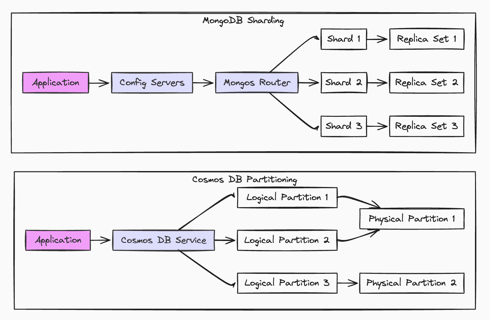
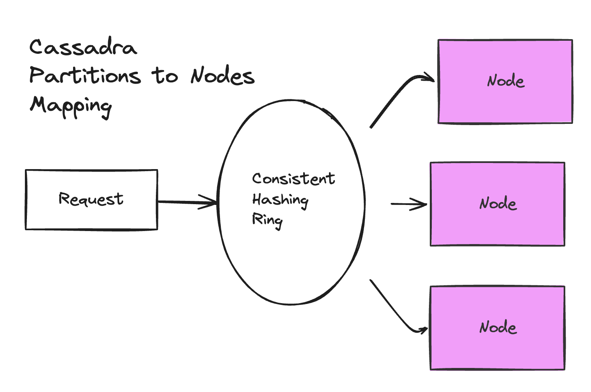

When to use Cosmos DB? It's a hard question to answer.

Cosmos DB's versatility can be both a strength and a source of confusion. And the marketing around it, promising everything for everyone, further muddies the waters. So while its flexibility is appealing, choosing it wisely requires a thorough understanding of its underlying implementation, performance characteristics, cost model, and operational considerations.

I'm going to break all that down.

<!--more-->

But the short version is you should use it on Azure when you'd use DynamoDB on AWS. That is when you are OK being cloud specific; when you want hands-off scalability; and when you know the query pattern and potential costs ramifications ahead of time. Also, cost is a big caveat on that, because Cosmos DB will likely cost more than an equivalent DynamoDB workload.

But let's start at the beginning.

# Types of Databases

Different database types prioritize different needs.  Relational databases focus on strong consistency and complex relationships. Key-value stores are optimized for speed and simplicity. Document databases trade schema rigidity for flexibility.  Distributed SQL systems attempt to combine consistency and scale.

| Type             | Example          | Best For                                                                      |
|-----------------|-------------------|------------------------------------------------------------------------------|
| Relational      | PostgreSQL       | Traditional business applications with complex transactions                    |
| Key-Value       | Redis            | Caching and session management                                                  |
| Document        | MongoDB          | Applications with evolving data structures                                      |
| NewSQL | Spanner, CockroachDB | Global applications requiring both scale and consistency      |
| Dynamo-Inspired | DynamoDB, Cassandra | High write throughput, eventually consistent applications                        |

Cosmos DB can look like each of those categories. This is because it's a multi-model DB, with number of APIs, but fundamentally it's backed by a document based storage layer. 


{}
If you are going to use Cosmos DB, probably you should be using the Core API, also called the "API for NoSQL". It's the quickest to get new features. Confusingly, the API for NoSQL is queried and inserted into using SQL.
{}

So even while it has a SQL interface, that is the most used and recommended interface, and while it purports to be multi-model, at its lowest layer it's based on DocumentDB, and it is a Document database. It is a powerful document database, one with tunable consistency, distribution by logical and physical partition and more, but it's helpful to know how the storage layer works to understand everything else. I'm going to show some examples, but first let's clear up what Cosmos DB is not.

## Cosmos DB vs Postgres and SQL Server

Personal opinion, but if you have a use case that is well served by a traditional relational database, you should choose that. Postgres and SQL Server are both great. They have great query planners, they have great tooling for migration and backups and schema management. The SQL API from Cosmos should **not** be considered an alternative to a relational database unless you have specific needs, because it's a different type of beast, designed for different use cases. But let me show you.

If you grab our [CosmoDB how to](https://www.pulumi.com/registry/packages/azure-native/how-to-guides/azure-cs-cosmosdb-logicapp/) and pulumi up and provision a database, you'll  see from that, the first hint of its document roots in that the pulumi namespace is documentDB, but it goes deeper, because although I can insert and select with sql in Cosmos DB, there is no schema.

If I insert this customer:

```csharp
CosmosDatabase database = await client.
    CreateDatabaseIfNotExistsAsync(databaseId);
CosmosContainer container = await database.
    CreateContainerIfNotExistsAsync(containerId, "/customerId");

// Insert a customer document
var customer = new Customer
{
    Id = Guid.NewGuid().ToString(),
    CustomerId = "12345", // Partition key
    Name = "John Doe",
    Email = "john.doe@example.com"
};

await InsertCustomer(container, customer);
```

I can do selects against it like ((insert example)) but when I look in that container in Azure Data Explorer I will see something like this:

```csharp
{
    "id": "1d4e26b3-7a02-4e97-8a9d-eccc0b2fd537",
    "customerId": "12345",
    "name": "John Doe",
    "email": "john.doe@example.com",
    "_rid": "<resource id>",
    "_self": "<document URI>",
    "_etag": "\"00000000-0000-0000-0000-000000000000\"",
    "_attachments": "attachments/",
    "_ts": 1609459200
}
```

It's a JSON document. That's all well and good, but because there is no schema, as with any document database, if I need to migrate name to fullname how do I do it? Well, there a bunch of strategies, but they all involve writing some application code to, record by record, move the value from "name" to "fullname".

So don't be fooled by the SQL usage in the API, Cosmos DB is not a relational database. 

The differences are huge:

### 1. **Joins and Relationships**
   Cosmos DB lacks support for complex joins and foreign key constraints. Cosmos DB typically requires denormalization or application-level management of relationships.

### 2. **ACID Transactions and Consistency**
   Cosmos DB supports ACID transactions but only within single partitions ( more on partitions soon). Cross-partition operations in Cosmos DB may require manual consistency handling.

### 3. **Schema Evolution and Migrations**
   As shown, while relational databases enforce a schema and support migration tools. Cosmos DB’s schemaless design offers flexibility but requires custom logic for data migrations, which can increase operational overhead with frequent schema changes.

### 4. **Query Optimization and Indexing**
   Postgres, SQL Server, any relational database really has a query optimization layer with a sophisticated planner and manual indexing control. Cosmos DB auto-indexes all fields, simplifying queries but potentially increasing costs. Custom indexing policies offer less control than you would see in SQL Server or Postgres.

### 5. **Cost Structure**
   Relational database costs are tied to compute and storage resources. Cosmos DB uses Request Units (RUs) for billing, charging per read, write, and query. This can lead to unpredictable costs if not carefully tuned.

### 6. **Operational Maturity**
   Relational databases are mature with mature solutions for backup, replication, and monitoring. Cosmos DB is fully managed but has fewer third-party tools. Postgres or another relational DB may be easier to integrate into existing workflows requiring mature operational support.

If your use case aligns well with relational databases, consider using PostgreSQL or SQL Server. On Azure, you have multiple options, including Azure Database for PostgreSQL and Azure SQL Database. There's even Azure Cosmos DB for PostgreSQL, which confusingly uses native PostgreSQL combined with the Citus extension for distributed capabilities. It's **not** based on Cosmos DB’s NoSQL DocumentDB storage layer and is a postgres database.

Cosmos DB is best for other use cases, so on we go to document dbs.

## Cosmos DB vs MongoDB

So, let's talk MongoDB then. Cosmos DB is multi-model in a specific way. It has a single storage layer, the DocumentDB and then various APIs. One of these is a MongoDB interface. This Mongo interface, on top of Cosmos DB might be a great choice if you are used to Mongo, but has some trade offs. If you are doing non-trivial stuff you will quickly need to understand Cosmos specific things, even if you can query like Mongo.

{}
Reddit Azure users report some challenges with using the Mongo API and Microsoft also recommends using the SQL based "API for NoSQL" if you can. So Mongo fans may to consider not choosing Cosmos' Mongo API.
{}

The big advantage of Cosmos over Mongo though is distribution and consistency models. But to understand that, we need to explain partitions.

In MongoDB, scaling requires explicitly setting up shards and configuring shard keys, replica sets, and other infrastructure—so you get control, but it demands manual setup and management as your data grows.

In Cosmos DB, scaling and partitioning are automatic, but you must define a partition key from the start, which is central to how Cosmos manages data distribution and performance. This initial choice affects scalability and query efficiency long-term, so while Cosmos DB gives you seamless scaling "for free," it requires up-front consideration of the partitioning strategy.

## Cosmos DB Partitions



In MongoDB, a shard is a collection of data stored on a specific server, used to distribute data across multiple servers for horizontal scaling. Partitioning is really an improvement on this idea. Cosmos separates partitions into logical and physical partitions. You choose the logical partitions only and leave the DB to decide the best way to group these onto specific physical servers. The physical groupings are physical partitions and the system manages scaling by handling the distribution of data across physical partitions without user intervention.

### Cosmos DB Partitioning

- **Logical Partitions:** Like MongoDB’s shards, logical partitions group documents with the same **partition key**. However, each logical partition can store up to 20 GB of data and is automatically managed by Cosmos DB.
- **Physical Partitions:** Cosmos DB hides the complexity of managing the physical servers. These physical partitions store and serve one or more logical partitions, and Cosmos DB handles how data is distributed across physical partitions for you. This allows Cosmos DB to automatically scale and balance the load as needed.

### Comparison To MongoDB

| Feature                       | MongoDB Sharding                                  | Cosmos DB Partitioning                      |
|-------------------------------|--------------------------------------------------|---------------------------------------------|
| **Data Distribution**          | Manual sharding with shard key and replica sets  | Automatic partitioning with partition key   |
| **Scaling**                    | Manual scaling (add shards)                      | Automatic scaling (Azure-managed)           |
| **Operational Complexity**     | Requires manual setup and maintenance            | Minimal operational overhead                |
| **Global Distribution**        | Requires manual setup of replica sets            | Built-in global distribution                |
| **Consistency Models**         | Eventual (with strong for replica sets)          | 5 consistency models, including strong      |
| **Query Performance**          | Requires index management, can result in scatter-gather queries | Auto-indexing, but cross-partition queries can be costly |
| **Cost Model**                 | Based on instance, storage, and IO usage         | Request Units (RUs) per operation, with potential for high costs |

## MongoDB vs Cosmos DB Cost Comparison

Cosmos DB is significantly more expensive than MongoDB Atlas for similar workloads, primarily due to Cosmos DB's throughput-based pricing model (RUs), which can lead to higher costs as operation volume or document size increases. However, the operational burden is much smaller, if you have selected the correct partition key.

| **Service**      | **Cost (500 reads/sec, 50 writes/sec, 10 KB document)** | **Pricing Model**                                       |
|------------------|--------------------------------------------------------|---------------------------------------------------------|
| **MongoDB Atlas**| ~$205/month                                             | Based on instance size (M30), fixed pricing              |
| **Cosmos DB**    | ~$1,567.70/month                                        | Request Units (RUs) based, scales with document size and operations |


## Cosmos DB vs Cassandra



After learning about partitioning in Cosmos DB, you might think Cosmos DB, and seeing the **Cassandra API**, you might be thinking that Cosmos DB is basically managed Cassandra. In many ways, Cosmos DB is **Cassandra-inspired**, but there are key differences.

### How Cosmos DB and Cassandra relate:

1. **Partitioning**: Both use logical partition keys to distribute data across nodes for scalability. Cassandra requires **manual management**, while Cosmos DB automates partitioning and scaling—reducing operational burden, though at the cost of flexibility.
2. **Tunable Consistency**: Like Cassandra, Cosmos DB offers **tunable consistency** but expands on it with five levels: **Strong**, **Bounded Staleness**, **Session**, **Consistent Prefix**, and **Eventual**—allowing finer control over consistency vs. performance.

### Key Differences:
1. **Cassandra API**: Though Cosmos DB offers a **Cassandra API**, it’s not running Cassandra under the hood. So while the API is familiar, the system behaves differently, especially in terms of performance.

2. **Operational Complexity**: **Cassandra** gives full control over nodes and replication but requires **hands-on management**. **Cosmos DB** automates these tasks, offering **hands-off operations** while maintaining high availability, making it easier to manage at scale.

### When to Use:
- **Cassandra**: Use when you need **control** and can manage partitioning and scaling manually.
- **Cosmos DB**: Use when you want **hands-off scalability** and a fully managed service with the option to use Cassandra-like APIs.

So use Cassandra when you need full control over partitioning and scaling and are prepared to manage infrastructure manually. Opt for Cosmos DB when you want a hands-off managed service that handles the operational complexity for you, even if you're using the familiar Cassandra API.

## Dynamo DB vs Cosmos DB

After comparing Cosmos DB to Cassandra, it’s natural to think of DynamoDB next. Like Cosmos DB, DynamoDB is fully managed and Dynamo-inspired, but being part of AWS, it operates differently from both Cassandra and Cosmos DB, especially in terms of operational simplicity and pricing.

## Managed Operations

DynamoDB, like Cosmos DB, removes the manual operations that Cassandra requires. If Cassandra gives you full control over nodes and partitioning, DynamoDB and Cosmos DB automate much of the complexity behind the scenes. With DynamoDB, you don’t have to manually manage shards or replication—AWS handles that for you, making DynamoDB a hands-off solution, just like Cosmos DB on Azure.

However, both databases rely heavily on partition keys for data distribution. In DynamoDB, choosing the right partition key is critical to avoid hot spots, just like you need a well-thought-out partition key in Cosmos DB to balance the load across physical partitions. But where DynamoDB allows you to toggle between on-demand and provisioned capacity to manage scaling, Cosmos DB simply auto-scales as your traffic grows, offering a more seamless experience if you’re willing to pay for it.

## Consistency Models: Simple vs Flexible
While Cassandra offers tunable consistency, DynamoDB simplifies this down to just two options: eventual consistency (default) or strong consistency. It’s enough for many use cases, but it’s here where Cosmos DB offers far more flexibility with five consistency levels ranging from strong to eventual. This makes Cosmos DB more attractive if you need to fine-tune consistency for globally distributed applications.

## Costs 
DynamoDB in Provisioned Mode is significantly more cost-effective than Cosmos DB for the same workload with 10 kb document sizes. For a scenario with 500 reads/sec, 50 writes/sec, and 10 KB document size, DynamoDB costs about $392.10/month compared to Cosmos DB’s $1,567.70/month. With smaller document sizes, the cost difference is less but still Dynamo has the edge. On the pro Cosmos side, Cosmos DB adjusts throughput and partitions as your data and traffic grow, ensuring seamless scaling without manual intervention, it just costs more.


| **Service**         | **Workload** (500 reads/sec, 50 writes/sec) | **3 KB Document Size**  | **10 KB Document Size**  | **Key Difference**                   |
|---------------------|--------------------------------------------|-------------------------|--------------------------|---------------------------------------|
| **DynamoDB**         | 500 reads/sec, 50 writes/sec               | $131.13/month           | $392.10/month            | Lower cost, ideal for predictable workloads |
| **Cosmos DB**        | 500 reads/sec, 50 writes/sec               | $479.06/month           | $1,567.70/month          | Higher cost, scales automatically    |

### When Cosmos DB Makes Sense

OK, I think all these comparisons give us a strong grounding to talk about trade offs. So with all this in mind, when should you use Cosmos DB?

1. **Document Database with Global Distribution**: If you need a document database that supports global distribution with multiple consistency models, Cosmos DB is a strong choice. Its automatic scaling and geo-replication make it ideal for applications that need to reach a global audience with minimal operational overhead.

2. **Hands-Off Scalability**: When you want to focus more on development and less on database administration, Cosmos DB offers hands-off scalability. It automatically handles partitioning, indexing, and replication, which is great for teams that prefer managed services.

3. **Schema Flexibility**: When your data structure is not fixed and might evolve over time, Cosmos DB’s schema-less nature is an advantage. This flexibility is helpful in cases where your application data needs to adapt frequently without the constraints of a rigid schema.

### When to Avoid Cosmos DB

1. **Cost Sensitivity**: Cosmos DB can be significantly more expensive compared to other databases like DynamoDB or MongoDB, especially for high read/write workloads. If cost is a primary concern, especially for smaller projects, it might be better to consider alternatives.

2. **Complex Joins and Transactions**: If your application requires complex joins, foreign key relationships, or cross-partition transactions, Cosmos DB might not be the best fit. A relational database like PostgreSQL or SQL Server would serve these requirements more effectively.

3. **Predictable Workloads with Lower Complexity**: For applications that have predictable workloads and do not need the complexity of multi-region consistency, a simpler solution like a traditional relational database might be more cost-effective and easier to manage.

4. **Need for Strong Schema Enforcement**: If your application benefits from strict schema enforcement to ensure data integrity and reduce developer errors, a relational database like PostgreSQL or SQL Server will be a better choice than Cosmos DB. Cosmos DB's schema-less nature can introduce challenges if your data model needs strict consistency and structure.

5. **Avoiding Vendor Lock-In**: If you want to maintain portability and avoid vendor lock-in, Cosmos DB might not be ideal. For multi-cloud or cloud-agnostic strategies, a more portable database like PostgreSQL or Cassandra might be preferable.

## Summary

Cosmos DB is an excellent choice for scenarios that need scalability, global distribution, and flexible consistency, especially if you are already working within Azure. Azure considers it a tier 0 service, its in every Azure data center and it's reliability is considered paramount. However, comparedto some the options we've gone over, it comes with a higher cost, and the operational simplicity it provides needs to be weighed against those costs.  

James Thurley Co-founder of Canopy Simulations found it a perfect fit for their needs:

> We’ve been using Cosmos DB as a document database since it was called DocumentDB, and it’s been fast, reliable, and straightforward for our needs. We store large, arbitrarily structured JSON documents, and Cosmos DB’s full indexing has handled that effortlessly. For us, the simplicity works—we don’t need to scale to millions of users, and with auto-scaling, each customer’s database runs smoothly without any partitioning.

For help provisioning Cosmos DB check out our Azure Cosmos DB How to guide: https://www.pulumi.com/registry/packages/azure-native/how-to-guides/azure-cs-cosmosdb-logicapp/ and if you decide to go with Azure Tables instead, our Azure Native provider is there to help you all the same.
