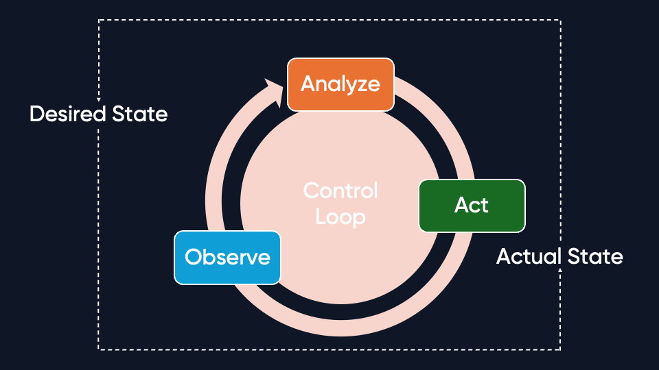

In one of my recent talks, I mentioned that the foundation of a successful [Kubernetes](/kubernetes)-powered platform is the use of [Kubernetes Operators](https://kubernetes.io/docs/concepts/extend-kubernetes/operator/), as they are a great way to automate operational tasks and the lifecycle of complex applications and services on Kubernetes.
<!--more-->
In case you missed the talk, here is the link to the recording:



After the talk, I received feedback from the audience that they would like to have more information about Kubernetes operators and some of the advanced operators I would recommend to use in their Kubernetes-powered platforms. And who am I to reject such a great opportunity to share my knowledge with the community?

As you guess, the base for a Kubernetes Operator is, well, Kubernetes. So, if you are not familiar with Kubernetes, let me give you a brief introduction. Kubernetes, or K8s in short, is by far the most powerful open-source container orchestration platform out there - especially for its capability to maintain a desired state. This means you, as the platform admin, can define how you want your cluster and the workload on top of it to look, and Kubernetes (aka the control plane) executes the necessary steps to ensure the desired state is achieved using a feedback loop.

And how does Kubernetes achieve this complex operational task management? Kubernetes leverages the concept of controllers and operators. Both ensure that the cluster resources are in the desired state. But why is there a distinction between controllers and operators inside the Kubernetes ecosystem? There is also great confusion when folks talk about controllers and operators, as the differences are in the details and operators are a subcategory of controllers.

## Kubernetes Controllers vs. Operators



K8s controllers are control loops that watch your resources and reconcile the current state with the desired state in a continuous loop. Think about how a thermostat works in your house. The thermostat watches the current temperature and, if it is below the desired temperature, it turns on the heating. If it is above the desired temperature, it turns off the heating. This is how a controller works in Kubernetes - it watches the resources and conditions defined in the desired state and executes the necessary steps to make sure the current state matches the desired state.

Here are some typical Kubernetes controller key functions as part of the maintain, observe, and enforce loop of the control loop:

| Function               | Description                                                                                                                                   |
|------------------------|-----------------------------------------------------------------------------------------------------------------------------------------------|
| Rollouts and Rollbacks | Deployment controller takes care of rolling out new versions of your application and rolling back to the previous version in case of failure. |
| Cluster maintenance    | Node controller watches the nodes in the cluster and makes sure that the nodes are in the desired state.                                      |
| Event handling         | Event controller watches for events and takes action based on the events.                                                                     |
| Schedule               | Controller to run jobs and cron jobs at a specific time.                                                                                      |
| Resource enforcement   | Resource controller watches the resource usage and enforces resource limits in a namespace.                                                   |
| State enforcement      | Different controllers watch the state of the resources and enforce the desired state.                                                         |

As you can see, controllers automate the routine operational tasks, enforce policies, handle failures and take actions to continuously maintain the desired state of the cluster.

Some of the typical use cases for controllers are:

- **Limit resource usage** - Prevent the overload of the cluster by enforcing resource limits with controllers like ResourceQuota.
- **Auto-scaling** - Automatically scales the number of pods based on the different metrics with HorizontalPodAutoscaler.
- **Task scheduling** - Run jobs and cron jobs at a specific time with Job and CronJob controllers.
- **Run stateful workloads** - Deploy and manage stateful workloads like databases with StatefulSet controller, by ensuring that the pods are created in a specific order and have a stable network identity.
- **Scaling deployments** - Deploy and manage stateless workloads like web applications with the Deployment controller, by ensuring that the desired number of pods is running and handling the rolling updates and rollbacks.

Controllers, as you see, reduce the manual effort for the platform engineering teams and gives the cluster self-managing
capabilities.

With all the above points, the benefits of controllers are clear - Let me list some of the main ones:

- **Automation** - Controllers automate the routine operational tasks and enforce policies.
- **Availability** - Controllers ensure that the resources are always available, addressing failures and taking actions to maintain the desired state.
- **Efficiency** - Controllers provide an efficient way to manage the resources and workloads in the cluster with quota management and auto-scaling.
- **Reliablity** - Controllers help to make workload management more reliable with features like replica management, [pod](/registry/packages/kubernetes/api-docs/core/v1/pod/) creation and deletion, and scheduling.
- **Flexibility** - Controllers provide a flexible way to handle a variety of workloads and resources in the cluster, such as [DaemonSet](/registry/packages/kubernetes/api-docs/apps/v1/daemonset/), [StatefulSet](/registry/packages/kubernetes/api-docs/apps/v1/statefulset/), [jobs](/registry/packages/kubernetes/api-docs/batch/v1/job/), [cron jobs](/registry/packages/kubernetes/api-docs/batch/v1/cronjob/), [deployments](/registry/packages/kubernetes/api-docs/apps/v1/deployment/), and [services](/registry/packages/kubernetes/api-docs/core/v1/service/).
- **Observability** - Controllers provide a view into the cluster resources and the state of the resources via the [Kubernetes API](/blog/yaml-terraform-pulumi-whats-the-smart-choice-for-deployment-automation-with-kubernetes/#kubernetes-components-and-the-kubernetes-api).

With Controllers explained, let's move on to the next level of automation in Kubernetes and talk about Kubernetes Operators.

## Kubernetes Operators

As mentioned before, Kubernetes Operators are a subcategory of controllers that use API extensions (Custom Resource) to complete the automation task. Operators are a set of independent controllers, with each controller responsible for its own task. And while controllers can share similar functions with a controller, it is only focused on one domain and only uses Custom Resources to manage the domain.

> Keep in mind that controllers work without the need for custom resources or a link to a specific domain.

Operators are custom-built controllers that focus on the deployment, management, and operation of a specific application or service. Some key functions of operators include:

| Function                      | Description                                                                                                                                                                                                                                 |
|-------------------------------|---------------------------------------------------------------------------------------------------------------------------------------------------------------------------------------------------------------------------------------------|
| Security                      | Operators integrate security best practices and policies, such as encryption, access control, and [secret management](/what-is/what-is-secrets-management/), to protect the application. You can customise these measures and adjust them to the specific needs of the application. |
| Workload Lifecycle management | Operators manages the full lifecycle of complex stateful applications through deployment, upgrades, and scaling. It even applies logic to automate operations like backup and restore.                                                      |
| Error Handling                | Operators detects and handles errors, such as application crashes, network failures, and resource constraints.                                                                                                                              |
| Migration                     | Operators help to migrate the application to a new version, a new cluster, or a new cloud provider.                                                                                                                                         |
| Disaster Recovery             | Operators help to recover the application from a disaster, such as data loss, network failure, or hardware failure.                                                                                                                         |

Operators are a great way to encode the operational knowledge of the platform engineering team into automated controllers. This way, the platform engineering team can focus on the strategic tasks and let the operators handle the boring routine operational tasks. This reduces the manual effort and increases the reliability of the platform.

Some of the typical use cases for operators are:

- **Database management** - Deploy and manage databases such as MySQL, PostgreSQL, and MongoDB.
- **Storage management** - Deploy and manage storage such as Ceph, GlusterFS, or NFS.
- **Logging and monitoring** - Simplify the deployment and management of logging and monitoring solutions like Prometheus, Grafana, or ELK stack.
- **CI/CD** - Automate the deployment and management of CI/CD pipelines like Jenkins, GitLab, or Tekton. - Backup and restore - Automate the backup and restore of applications and data.
- **Messaging and event streaming** - Simplify the deployment and management of messaging and event streaming solutions like Kafka, RabbitMQ, or NATS.
- **Machine learning** - Automate the deployment and management of machine learning workloads such as TensorFlow, PyTorch, or Kubeflow.

With the applications-centric approach provided by operators, the platform engineering team can now enable fully automated operations while enhancing the reliability, efficiency, and observability of the platform and ensuring adherence to best practices and compliance requirements.

And similar to controllers, operators also have distinct benefits:

- **Simplification** - Operators simplify the deployment and management of complex applications and services by providing a declarative way (via Custom Resources).
- **Higher Productivity** - Operators increase the productivity of the platform engineering team by automating the routine operational tasks and allowing users to focus on delivering business value.
- **Extensibility** - Extending the K8s API with Custom Resource Definitions (CRDs) allows administrators to support new applications and services without changing the core Kubernetes code.
- **Consistency** - Operators ensure that they deploy and run the applications and services consistently across different environments, such as on-premises, cloud, or hybrid.
- **Modularity** - Operators are modular and focused on a specific domain.
- **Legacy** Transformation - Operators help to transform legacy applications into cloud-native applications by automating the deployment and management of complex applications.

Here is a visual representation of a Kubernetes Operator in action, which I found very nice and helpful:



## Comparison of Kubernetes Controllers and Operators

Here is a quick summary of the differences between Kubernetes controllers and operators:

| **Feature**                 | **Kubernetes Controllers**                                                                                                                                | **Kubernetes Operators**                                                                                                                                                                                                  |
|-----------------------------|-----------------------------------------------------------------------------------------------------------------------------------------------------------|---------------------------------------------------------------------------------------------------------------------------------------------------------------------------------------------------------------------------|
| **Definition**              | Core control loops within Kubernetes that reconcile the current state with the desired state of resources.                                                | Custom-built controllers with domain-specific logic, typically extending Kubernetes API with Custom Resource Definitions (CRDs).                                                                                          |
| **Scope**                   | General-purpose automation for cluster-wide resource management and workload operations.                                                                  | Focused on application or service-specific lifecycle management and operations.                                                                                                                                           |
| **Custom Resources (CRDs)** | Not mandatory. Most controllers work with built-in Kubernetes resources like Pods, Deployments, and StatefulSets.                                         | Mandatory. Operators depend on CRDs to define and manage application-specific resources.                                                                                                                                  |
| **Domain-Specific Logic**   | Limited. Primarily focuses on generic Kubernetes operations like scheduling, scaling, and resource enforcement.                                           | Extensive. Includes application-specific tasks such as backups, upgrades, migrations, and disaster recovery.                                                                                                              |
| **Automation**              | Automates operational tasks like resource scheduling, scaling, and maintaining cluster states.                                                            | Automates both operational and domain-specific tasks, often encoding deep operational knowledge of specific applications.                                                                                                 |
| **Complexity**              | Relatively low complexity as they focus on Kubernetes-native workflows.                                                                                   | Higher complexity due to domain-specific implementations and integrations with external systems.                                                                                                                          |
| **Observability**           | Provides insight into cluster resource states via Kubernetes API and built-in events.                                                                     | Enhances observability with application-specific metrics, logs, and health checks tailored to the managed application.                                                                                                    |
| **Use Cases**               | - Pod scaling (e.g., HPA)  <br> - Resource enforcement (e.g., ResourceQuota) <br> - Rolling updates and rollbacks <br> - Scheduling jobs (e.g., CronJob). | - Database management (e.g., MySQL Operator) <br> - CI/CD pipelines (e.g., Tekton) <br> - Backup and restore <br> - Monitoring solutions (e.g., Prometheus Operator) <br> - Stateful applications (e.g., Kafka Operator). |
| **Deployment**              | Part of Kubernetes core components or extensions like kube-controller-manager.                                                                            | External tools developed by vendors, community, or in-house, deployed using Custom Resources.                                                                                                                             |
| **Key Benefits**            | - Cluster-wide automation <br> - Ensures resource availability <br> - Efficient and reliable workload management.                                         | - Simplifies application lifecycle management <br> - Increases productivity with domain-specific automation <br> - Consistent deployments across environments.                                                            |
| **Flexibility**             | Flexible for general Kubernetes operations but limited to built-in resources.                                                                             | Highly flexible and extensible for custom applications and domain-specific requirements.                                                                                                                                  |
| **Target Audience**         | Platform administrators and Kubernetes users looking to automate Kubernetes-native workflows.                                                             | Developers and platform engineers needing advanced automation and lifecycle management for specific applications or services.                                                                                             |
| **Maintenance**             | Managed and updated by Kubernetes core or community projects.                                                                                             | Requires domain-specific knowledge and regular updates to accommodate application changes and best practices.                                                                                                             |

With this detailed explanation of Kubernetes controllers and operators, I would like to share some advanced Kubernetes operators that I recommend for use in your Kubernetes-powered platform.

## Advanced Kubernetes Operators

As we have seen, Kubernetes Operators are the go-to way to automate operational tasks and lifecycle management. I should mention that not all operators are created equal. Some operators are more advanced and provide more features than others. That is why, for example, [OperatorHub.io](https://operatorhub.io/) categorises operators into [five capability levels](https://sdk.operatorframework.io/docs/overview/operator-capabilities/):

- **Basic Install** - Installs the application on the cluster.
- **Seamless Upgrades** - Manages Application upgrades.
- **Full Lifecycle Management** - Manages the full lifecycle of the application.
- **Deep Insights** - Provides monitoring and metrics.
- **Auto Pilot** - Automatically optimizes and tunes the application.

The more advanced the operator, the more features it provides and the more automation it offers. At its most advanced level, the Auto Pilot, the operator automatically optimizes and tunes the application based on the workload and environment.

Here is a list of advanced Kubernetes operators that I recommend using in your Kubernetes-powered platform:

### CloudNativePG Operator



[CloudNativePG Operator](https://cloudnative-pg.io/) is a PostgreSQL operator that covers the full lifecycle of PostgreSQL databases on Kubernetes. It simplifies the deployment, management, and scaling of PostgreSQL databases by providing a declarative way to define and manage PostgreSQL clusters using custom resources.

Some of the key features of CloudNativePG Operator are:

- **Automated Backups** - Schedule and manage backups of PostgreSQL databases.
- **High Availability** - Deploy and manage high-availability PostgreSQL clusters.
- **Scaling** - Scale the number of PostgreSQL instances based on the workload.

#### Installation

Either use the Helm chart or the Kubernetes manifests to deploy the CloudNativePG Operator:

```bash
helm repo add cloudnative-pg https://cloudnative-pg.io/charts/
helm repo update
helm upgrade --install cloudnativepg cloudnative-pg/cloudnative-pg --namespace cnpg-system --create-namespace
```

Or use Pulumi to deploy the CloudNativePG Operator:



{}

```typescript


```

{}

{}

```javascript


```

{}

{}

```python


```

{}

{}

```go



```

{}

{}

```csharp




```

{}


#### Usage

Here is a simple example of a PostgreSQL cluster with backup configured on S3 API-compatible storage:

```yaml
apiVersion: postgresql.cnpg.io/v1
kind: Cluster
metadata:
  name: cluster-example-with-backup
spec:
  instances: 3
  primaryUpdateStrategy: unsupervised

  # Persistent storage configuration
  storage:
    storageClass: standard
    size: 1Gi

  # Backup properties
  # This assumes a local minio setup
  backup:
    barmanObjectStore:
      destinationPath: s3://backups/
      endpointURL: http://minio:9000
      s3Credentials:
        accessKeyId:
          name: minio
          key: ACCESS_KEY_ID
        secretAccessKey:
          name: minio
          key: ACCESS_SECRET_KEY
      wal:
        compression: gzip
```

Or use Pulumi:



{}

```typescript

```

{}

{}

```javascript

```

{}

{}

```python


```

{}

{}

```go



```

{}

{}

```csharp




```

{}

#### Summary

CloudNativePG Operator is a great way to deploy and manage PostgreSQL databases on Kubernetes. It simplifies a wide range of tasks, including backups, high availability, and scaling, making it a must-have for PostgreSQL users.



### Flux Operator



The [Flux Operator](https://fluxcd.control-plane.io/operator/) is a full autopilot solution that provides an alternative to the traditional Flux Bootstrap procedure, removing the operational burden of managing Flux across multiple clusters by automating the installation, configuration, and upgrade of Flux fully.

Some of the key features of Flux Operator are:

- **GitOps Deployment** - Automate the deployment of applications and services using GitOps.
- **Lifecycle Management** - Manage the full lifecycle of Flux, including upgrades and rollbacks.
- **Deep Insights** - Provide deep insights into the state of Flux and the applications deployed with Flux.

#### Installation

Use the Helm chart to deploy the Flux Operator:

```bash
helm upgrade -i flux-operator oci://ghcr.io/controlplaneio-fluxcd/charts/flux-operator --namespace flux-system --create-namespace
```

Or use Pulumi to deploy the Flux Operator:



{}

```typescript


```

{}

{}

```javascript


```

{}

{}

```python


```

{}

{}

```go



```

{}

{}

```csharp



```

{}

#### Usage

Here is an example of a FluxInstance Custom Resource that defines a Flux instance:

```yaml
apiVersion: fluxcd.controlplane.io/v1
kind: FluxInstance
metadata:
  name: flux
  namespace: flux-system
  annotations:
    fluxcd.controlplane.io/reconcileEvery: "1h"
    fluxcd.controlplane.io/reconcileTimeout: "5m"
spec:
  distribution:
    version: "2.x"
    registry: "ghcr.io/fluxcd"
    artifact: "oci://ghcr.io/controlplaneio-fluxcd/flux-operator-manifests"
  components:
  - source-controller
  - kustomize-controller
  - helm-controller
  - notification-controller
  - image-reflector-controller
  - image-automation-controller
  cluster:
    type: kubernetes
    multitenant: false
    networkPolicy: true
    domain: "cluster.local"
  kustomize:
    patches:
    - target:
        kind: Deployment
        name: "(kustomize-controller|helm-controller)"
      patch: |
        - op: add
          path: /spec/template/spec/containers/0/args/-
          value: --concurrent=10
        - op: add
          path: /spec/template/spec/containers/0/args/-
          value: --requeue-dependency=5s
```

Or use Pulumi:



{}

```typescript

```

{}

{}

```javascript

```

{}

{}

```python


```

{}

{}

```go




```

{}

{}

```csharp




```

{}

#### Summary

The Flux Operator is another excellent example of an advanced Kubernetes operator, providing full lifecycle management with numerous automation features.

### Strimzi Operator



Last but not least, the [Strimzi Operator](https://strimzi.io/) is a full lifecycle management operator for Apache Kafka on Kubernetes. As event-driven architectures are becoming increasingly popular, Apache Kafka has become the de-facto standard for building scalable and reliable event streaming platforms. The Strimzi Operator makes it easier to deploy, manage, and scale Apache Kafka clusters on Kubernetes.

Some of the key features of Strimzi Operator are:

- **Cluster Management** - Deploy and manage Apache Kafka clusters.
- **Mirror Clusters** - Deploy and manage mirror clusters for disaster recovery.
- **Streaming Capabilities** - With Kafka Connect you can stream data between Kafka and other systems.

#### Installation

Use the Helm chart to deploy the Strimzi Operator:

```bash
helm repo add strimzi https://strimzi.io/charts/
helm repo update
helm install strimzi strimzi/strimzi-kafka-operator -n kafka --create-namespace
```

Or use Pulumi to deploy the Strimzi Operator:



{}

```typescript


```

{}

{}

```javascript


```

{}

{}

```python


```

{}

{}

```go




```

{}

{}

```csharp




```

{}

#### Usage

Here is an example of a Kafka Custom Resource that defines a Kafka cluster:

```yaml
apiVersion: kafka.strimzi.io/v1beta2
kind: KafkaNodePool
metadata:
  name: example-kafka-node-pool
  labels:
    strimzi.io/cluster: example-kafka-cluster
spec:
  replicas: 1
  roles:
  - controller
  - broker
  storage:
    type: ephemeral
---
apiVersion: kafka.strimzi.io/v1beta2
kind: Kafka
metadata:
  name: example-kafka-cluster
  annotations:
    strimzi.io/kraft: enabled
    strimzi.io/node-pools: enabled
spec:
  kafka:
    replicas: 1
    version: 3.8.0
    storage:
      type: ephemeral
    metadataVersion: 3.8-IV0
    listeners:
    - name: plain
      port: 9092
      type: internal
      tls: false
    - name: tls
      port: 9093
      type: internal
      tls: true
    config:
      offsets.topic.replication.factor: 1
      transaction.state.log.replication.factor: 1
      transaction.state.log.min.isr: 1
      default.replication.factor: 1
      min.insync.replicas: 1
  entityOperator:
    topicOperator: {}
    userOperator: {}
```

This example defines a Kafka cluster with one replica and two listeners, one for plain and one for TLS and uses
ephemeral storage.

To create a topic, you can use the following KafkaTopic Custom Resource:

```yaml
apiVersion: kafka.strimzi.io/v1beta2
kind: KafkaTopic
metadata:
  name: example-kafka-cluster
  labels:
    strimzi.io/cluster:
spec:
  partitions: 5
  replicas: 1
  config:
    retention.ms: 7200000
    segment.bytes: 1073741824
```

Or use Pulumi:



{}

```typescript

```

{}

{}

```javascript

```

{}

{}

```python


```

{}

{}

```go




```

{}

{}

```csharp




```

{}


#### Summary

The Strimzi Operator demonstrates the power of Kubernetes Operators by providing full lifecycle management for Apache Kafka on Kubernetes. It takes care of the heavy lifting of deploying and managing Kafka clusters, making the Strimzi Operator a valuable tool that should be part of every Kubernetes-powered platform, as it covers a wide range of use cases.

## Conclusion

In this blog post, I highlighted the importance of Kubernetes Operators for platform engineers and how they can harness the advanced automation capabilities of operators to simplify deploying, managing, and scaling applications and services on Kubernetes. 

I provided some examples of advanced Kubernetes operators that I recommend, but if you want to try using Kubernetes Operators in your Kubernetes-powered platform, here are some great guides to get you started with Pulumi and Kubernetes:


