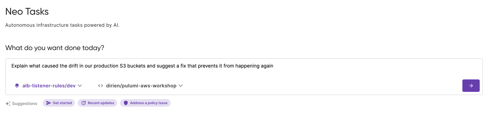
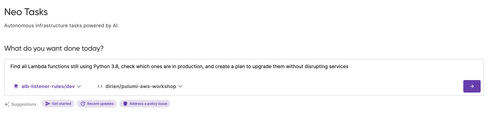

Ask ChatGPT to "fix my broken deployment," and you'll get generic advice. Ask Pulumi Neo the same question, and you'll get a fix plan grounded in your actual infrastructure state.

The difference isn't about better prompts or newer models. It's about what the AI actually knows. ChatGPT has been trained on the internet. Neo has been trained on your infrastructure.
<!--more-->
This distinction matters more than you'd think.

## The shift beneath the headline

Look at any recent hiring trend and you'll notice something strange. The "DevOps Engineer" title is disappearing from job boards, yet the work has never been more relevant. Those same responsibilities are now spread across platform engineers, cloud engineers, SREs, and AI-driven automation specialists.

The old idea of DevOps as "the people who deploy" is dissolving into something broader. Pipelines are no longer static YAML files; they're becoming interactive systems that respond, adapt, and even reason.

A few years ago, you'd build a Jenkins pipeline, test it, and hope it didn't break during a release. Today, teams using Pulumi Cloud can wire [Pulumi Neo](/blog/pulumi-neo/) (an AI agent trained on infrastructure context) directly into that workflow.

Neo doesn't just autocomplete code. It [understands state, resources, dependencies](/docs/ai/), and cloud behavior. When something fails, Neo explains why, not just what.

That's not a replacement. That's cognition layered on top of automation.

## What makes Neo different

The foundation matters more than you'd think.

Traditional AI tools fail in DevOps because they operate in a vacuum. Ask ChatGPT to "fix my broken deployment," and you'll get generic advice that ignores your specific infrastructure, your state, your constraints.

The difference with systems like Pulumi Neo comes down to what powers them: not just data, but **context**.

Think of it this way: a data lake is a massive repository of information sitting inert, waiting to be queried. A **context lake** is something else entirely. It's a structured repository that aggregates knowledge about your domain and feeds it to AI systems.

A context lake contains things that matter:

Your infrastructure programs, resource definitions, API schemas, service dependencies. In Pulumi's case, this includes your program graph, component models, stack configurations.

Real-time metrics, deployment history, drift detection, policy violations. The live pulse of your infrastructure as it actually runs in production.

Ownership information, compliance policies, access controls, quality signals. The organizational context that determines what changes are safe, who can make them, and why they matter.

Pulumi's approach builds on this principle. Your infrastructure programs, state files, resource metadata, policy definitions. All of this becomes queryable context. Neo doesn't hallucinate solutions because it's grounded in your actual infrastructure. It knows what you've deployed, how resources relate to each other, what dependencies exist, what's drifted.

This is the architectural shift that makes AI-powered DevOps actually work. AI agents are only as effective as the context they can access and the guardrails you have in place to keep them in check. You're not just automating actions anymore. You're automating understanding.

## When pipelines learn to reason

During a recent panel on AI-powered DevOps, one speaker described the pattern perfectly: early DevOps automated actions, while modern AI agents automate decisions.

In traditional environments, AI helps by predicting failures or recommending optimizations. But when you combine observability data, infrastructure-as-code templates, and event streams into a single reasoning loop grounded in a context lake, the line between DevOps and AI operations starts to blur.

For example, [Neo can watch infrastructure drift](/blog/10-things-you-can-do-with-neo/), identify whether it stems from a human push or a misconfigured resource, and generate a fix plan that maps back to your Pulumi program. That feedback isn't magic. It's grounded in the same infrastructure metadata developers already use. The context lake ensures Neo isn't guessing. It's reasoning from your specific infrastructure truth.

This is the new cognitive layer of DevOps. A system that doesn't simply automate deployment, but understands the intent behind it.

## Why engineers still matter

Every engineer who's tried to prompt an LLM to "write a Pulumi program for me" knows how quickly hallucinations creep in. You still need human context: the judgment to choose the right platform, the discipline to model dependencies, the awareness of compliance and cost.

That's where Pulumi Neo fits best. It's not a chatbot for infrastructure. [It's an extension of your own reasoning](/docs/ai/get-started/).

Neo learns from the same program graph and state data you already manage, drawing from a continuously updated context lake of your infrastructure reality. Its recommendations stay grounded in your environment, not a generic prompt window trained on the public internet.

The real opportunity isn't about fewer engineers. It's about smarter loops between human expertise and machine feedback.

## Where this goes next

If the first generation of DevOps automated deployment, the next generation automates understanding.

We're entering a phase where infrastructure as code becomes infrastructure as cognition.

AI-powered observability will learn to correlate incidents before they cascade. CI/CD will become continuous reasoning rather than continuous execution. [Platform teams](/blog/why-every-platform-engineer-should-care-about-kubernetes-operators/) will spend less time fighting YAML and more time guiding systems that can think with them.

The context lake architecture makes this possible. Instead of static documentation and scattered tribal knowledge, your infrastructure context becomes something AI agents can actually query and reason over.

So no, AI won't kill DevOps.

But it might finally force us to admit what the job actually is: understanding systems, not just running them.

## Try it yourself

Want to see what infrastructure cognition looks like in practice? [Get started with Neo](/docs/ai/get-started/) and ask it about your infrastructure. Watch it reason through drift detection, generate fix plans, or explain complex resource relationships in plain English.

Neo is available today for teams using Pulumi Cloud. The cognitive layer isn't coming. It's already here.
