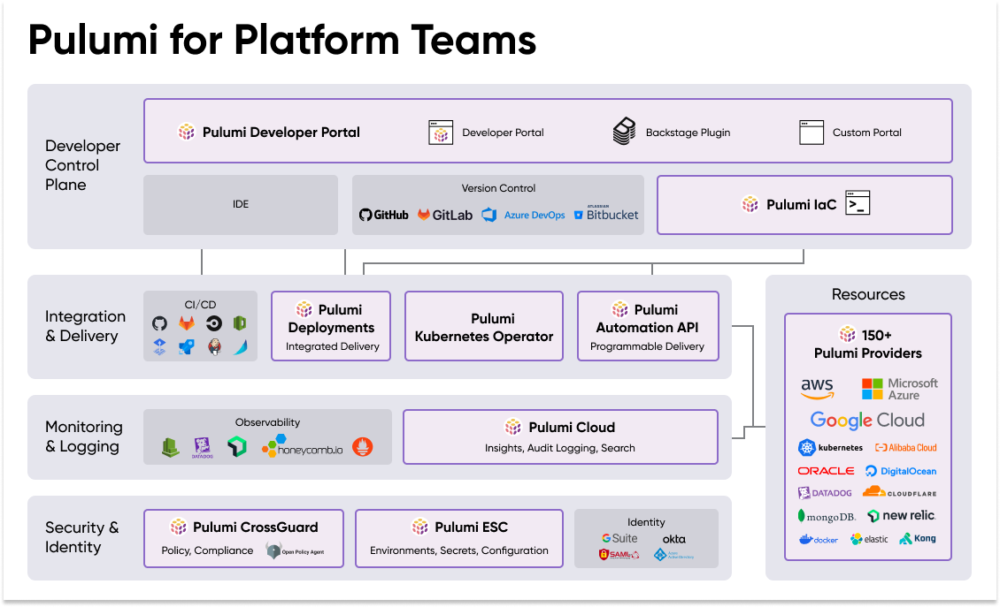

The cloud promised to revolutionize your business.

**Faster innovation. Lower costs. Unlimited scalability.**

But for many companies, that promise remains frustratingly out of reach.
Instead of accelerating your product development, infrastructure has
become a bottleneck. Your engineers are bogged down by clunky tools and
manual processes. Provisioning a simple test environment takes days.
Rolling out updates across regions? Weeks.

Meanwhile, the complexity of modern cloud architectures is spiraling out
of control. Microservices, containers, serverless -- the combinations
seem infinite. You know there has to be a better way. A way to truly
harness the power of the cloud and turn it into your competitive
advantage.

**But how?**

Enter Pulumi -- the open source infrastructure as code (IaC) platform
that\'s accelerating time to value for thousands of companies worldwide.

So why should you switch to Pulumi? How is it different from other
infrastructure as code tools? This post is intended to answer all those
questions.

# What is Pulumi?

Pulumi is an infrastructure as code platform that allows teams to manage
and scale infrastructure, configurations, policies, and secrets with
programming languages. Pulumi facilitates clear collaboration across
infrastructure, development, and security teams.

**Pulumi's approach is better.**

**10x Better.** Pulumi takes a unique and 10x better approach to
infrastructure as code by empowering developers with the familiar
languages and tools they love for application development. While modern
programming languages have evolved to provide powerful features like AI
copilots, Intellisense, linting tools, testing frameworks, and CICD
pipelines, infrastructure management has lagged behind, relying on rigid
scripting languages and error-prone manual processes. Pulumi bridges
this gap by allowing engineers to use industry-standard programming
languages to manage infrastructure with the same level of sophistication
and tooling they enjoy for application development. Pulumi embraces the
change and direction the industry is going, so developers never fall
behind with their IaC tooling.

**Powering the Next Wave.** Pulumi is at the forefront of the industry.
It helps developers embrace the latest practices (e.g., GitOps) and
builds the latest technologies (e.g., AI Copilots) into the core user
experience. It also helps developers build and manage new technology
paradigms (e.g., AI workloads, LLM, internal developer platforms).

**Powerful Automations.** Another unique approach is Pulumi makes it
easy to automate and scale modern cloud architectures. In the last
decade, the industry has moved from monolithic to microservices
architectures, which operate as distributed systems over shared
infrastructure platforms, to achieve greater resilience, team agility,
flexible scaling, and modular codebases. The cloud\'s programmability,
infinite elasticity, and on-demand nature made it easy to spin up
micro-sized services tailored to business demands, facilitated by
technologies like containers, Kubernetes, and serverless. Pulumi enables
software engineering to be applied to managing infrastructure of this
modern and immense scale.

**AI-Powered.** Pulumi builds AI into the core infrastructure management
experience. Pulumi combines the power of large language models with
semantic understanding of the cloud to unlock greater insights and
controls over managing cloud infrastructure. Pulumi leverages the
familiar GPT experience everyone knows, loves, and uses daily, so
engineers can find and take action on any resource in their cloud
environments.

## Ok, but why does this matter enough for me to switch?

Only you can answer that question, but there are some compelling reasons
to adopt the platform trusted by hundreds of thousands of developers.

**Faster Time to Value.** Companies moved to the cloud as a way to
increase innovation and reduce costs. However, getting infrastructure to
developers is a bottleneck for many companies which can slow down
prototyping new products or shipping new features. Spinning up new
development or testing environments takes days and rolling out
production updates across many regions can take weeks. The existing
tools don't allow you to set security and compliance guardrails and
enable easy self-service of infrastructure.\
\
*Pulumi will speed up your deployments and time to value.*

**Open Platform Commitment.** Some platforms, such as Terraform, have
altered their licensing and left users uncertain. They are no longer
true open source, and they tie their previously open source software to
their commercial services. The lack of an open source approach fragments
the community and introduces proprietary constraints to cloud
infrastructure.\
\
*Pulumi provides an approach to open source and community that provides
stability and choice.*

**Increased Productivity:** Engineers and developers expect their tools
and workflows to keep up with the industry: AI copilots, Intellisense,
linting tools, testing frameworks, and CICD pipelines. But most of these
innovations are just for building applications and services and not for
infrastructure, configurations, policies, and secrets. Existing
infrastructure tools are fraught with bad UX, rigid scripting languages,
and error prone manual processes.

*Pulumi will increase the productivity and velocity of developers
through better tooling.*

**Infinite Scale.** Modern cloud architectures are distributed systems
that are microservices that are dynamic and ephemeral in nature. The
number of infrastructure resource types and the configurable input
properties is staggering. Engineers face the daunting task of how to
combine these resources to solve their unique problems. Without software
engineering, managing these modern distributed systems is fruitlessly
manual.

*Pulumi uses software engineering to tackle the scale of infinite
combinations.*

# Frequently Asked Questions - Why Pulumi?

Some frequently asked questions about why Pulumi based on use cases and
alternatives. Choose your own adventure:

* [Why Pulumi, by use case?](#why-pulumi-by-use-case)
    * [Why Pulumi for Internal Developer Platforms?](#why-pulumi-for-internal-developer-platforms)
    * [Why Pulumi for AI Workloads?](#why-pulumi-for-ai-workloads)
* [Why is Pulumi better than the alternatives?](#why-is-pulumi-better-than-the-alternatives)
    * [Why Pulumi vs. clickops?](#why-pulumi-vs-clickops)
    * [Why Pulumi vs. Terraform?](#why-pulumi-vs-terraform)
    * [Why Pulumi vs. AWS CDK?](#why-pulumi-vs-aws-cloud-development-kit-cdk)
    * [Why Pulumi vs. 3rd party IDP providers?](#why-pulumi-vs-3rd-party-idp-providers-think-port-cortex-backstage)
* [How can I switch to Pulumi?](#how-can-i-switch-to-pulumi)

## Why Pulumi, by use case?

There are many different use cases for why engineers use Pulumi:
infrastructure CICD, modern applications, internal developer platforms,
AI/ML workloads, and infrastructure modernization. Below are more
details on two popular use cases.

### Why Pulumi for Internal Developer Platforms?

Organization's build internal developer platforms (IDPs) as a way to
maximize the use of the cloud at scale across the organization while
being secure and compliant so they can ship faster. IDPs enable
infrastructure engineers to build a bridge to their developers and
empower them to leverage the cloud with security, scalability,
repeatability, and consistency. There are a number of components/layers
that are considered basic requirements when building an internal
developer platform for an organization. The layers are as follows:

*   **Developer Control Plane.** Curated experiences that empower
    developers by meeting them at their level of expertise, whether
    it\'s an abstracted developer portal, custom CLI, or shared IaC
    templates.

*   **Integration & Delivery.** Automations to version control, test,
    trace, and deploy all infrastructure from resources, configurations,
    environments, and secrets as well as orchestration automations to
    manage provisioning workflows.

*   **Monitoring & Logging.** Components to log, monitor, and observe
    all infrastructure for greater operational control as well as
    optimize against unnecessary costs.

*   **Security & Identity.** Security and compliance guardrails that
    regulate every piece of infrastructure from policies to fine-grained
    access controls to secrets.

*   **Resources.** Providers that support modern cloud architectures
    such as Kubernetes, containers, serverless, generative AI, machine
    learning, data lakes, hybrid cloud/on-premises, and more.

This diagram illustrates the different layers of an internal developer
platform:

{width="6.5in" height="3.9305555555555554in"}

Most solutions struggle to keep up with the requirements of each layer.
Many of the alternative solutions can't handle the scale of resources to
be managed, find it difficult to tie infrastructure automation directly
into the core business, have leaky secrets, and enforce compliance and
security incompletely.

Pulumi is a platform engineering solution that enables engineers to
build a bridge to their developers and empower them to leverage the
cloud with security, scalability, repeatability, and consistency. It is
designed to fulfill the modern requirements and allow organizations to
leverage the cloud as a competitive advantage, providing the building
blocks to build each of the five layers.

{width="6.5in" height="3.888888888888889in"}

*   **Developer Control Plane.** Pulumi is the simplest and most
    intuitive way to manage cloud infrastructure because of its ability
    to use standard programming languages, including YAML. This removes
    the friction to the basic requirements of managing cloud
    infrastructure well. Pulumi Automation API makes it simple to code
    any user interface for a developer portal / CLI. Pulumi also
    provides private templates that can be integrated with developer
    portals like AWS Proton and Backstage.

*   **Integration & Delivery.** Pulumi Automation API can embed IaC
    programs directly in applications, resulting in 10x greater
    management of resources per engineer. Pulumi can take advantage of
    all existing testing frameworks supported by the selected
    programming language.

*   **Monitoring & Logging.** Pulumi Insights adds advanced search,
    analytics, and AI to any cloud infrastructure, giving unique
    insights into cloud usage and cost optimizations. Pulumi partners
    with leading observability solutions making it easy to manage
    monitoring and logging resources through IaC.

*   **Security & Identity.** Pulumi provides policy as code with
    auto-remediation and centralized environments, secrets, and
    configurations manager. Every resource access can be granularly
    controlled and audited.

*   **Resources.** Pulumi supports modern cloud architectures such as
    Kubernetes, containers, serverless, generative AI, machine learning,
    data lakes, hybrid cloud/on-premises, and more. Pulumi makes it
    simple to create components that abstract away the complexity of
    managing thousands of resources across hundreds of distinct clouds.

***Pulumi is purpose built to make all aspects of platform engineering
vastly simpler.***

### Why Pulumi for AI Workloads?

Companies are using AI as a way to increase innovation and reduce costs.
AI gives them the ability to design richer and more intuitive interfaces
for their products and/or services to connect better with their
customers. The hardest part of AI is many times not the AI pieces but
the cloud infrastructure parts: how to provision and manage the
infrastructure that AI workloads run on (e.g., compute and networking)
and depend on (e.g., databases and storage).

There are many layers to building and managing AI applications: model
training, data pipelines, backend services, frontend applications.

{width="6.5in" height="7.25in"}

Pulumi provides an abstraction across all the different layers of the AI
stack (web framework, LLM, containers, databases, secrets, policies,
configurations, etc) as a simple Python library. Through this
abstraction AI engineers and developers can manage stacks of
infrastructure as code.

{width="6.5in" height="3.6666666666666665in"}

***Pulumi makes it trivial to take local AI development to production in
the cloud.***

## Why is Pulumi better than the alternatives?

There are many methods that can be used to approach the needs of cloud
modernization and infrastructure management. However, Pulumi enables
companies to ship faster, provides a more productive authoring
experience, and provides more powerful automations to manage the
infinite scale of cloud infrastructure. Read on for how we compare to
specific options: clickops, Terraform, CDK, and IDP services.

### Why Pulumi vs. clickops?

Manually provisioning and managing infrastructure for production via the
cloud console (i.e., clickops) is a bad idea. There isn't repeatability
or consistency which leads to errors, and that can lead to downtime or
worse, security breaches. That is why infrastructure as code was
invented as a way to have a single source of truth for all
infrastructure with changes 100% automated.

If you don't believe us, just ask any cloud or devops
subreddit, Slack group, or Discord server.

### Why Pulumi vs. Terraform?

Pulumi and Terraform are both infrastructure as code (IaC) platforms,
however they have fundamental differences in how they approach the needs
of infrastructure management. Let's first start with the similarities.

Both Pulumi and Terraform include the ability to create, deploy, and
manage infrastructure as code on any cloud. Both Terraform and Pulumi
follow a desired state infrastructure as code model, where the IaC code
represents the desired state of the infrastructure. The deployment
engine compares this desired state with the current state of the stack
and determines the necessary actions, such as creating, updating, or
deleting resources. Both Terraform and Pulumi support many cloud
providers, including AWS, Azure, and Google Cloud, plus other services
like CloudFlare, Digital Ocean, and more.

However, beyond the basics of infrastructure as code there are
significant differences in terms of productivity experience,
scalability, and collaboration.

1.  **Increased Productivity.** Pulumi's promise is to build in all the
    latest advancements in both the developer and operations experience.
    When engineers write code, they now have AI copilots that generate
    code and pair-program alongside them. Their IDEs have autocompletion
    and Intellisense squiggles. They have powerful libraries of low
    level and abstract functions. They have testing frameworks. They
    have tools to do code reviews and automated release controls via
    CICD pipelines. They have great software packaging tools. When it
    comes to managing infrastructure, they have AI copilots that find
    unique insights and automate cloud tasks. This is all available with
    Pulumi. Terraform, on the other hand, has built a proprietary
    ecosystem that doesn't tap into the latest advancements of how code
    is written or how infrastructure is managed. Pulumi Copilot combines
    the best generative AI models available in the industry today with
    access to the data and actions of each user from within Pulumi
    Cloud. Pulumi Copilot incorporates the context of where the user is
    in the Pulumi Cloud console to easily answer questions about "this
    stack", or "the latest update", offering an even more natural,
    conversational and persistent experience across Pulumi Cloud. Pulumi
    Copilot is Enterprise-Ready on day one - it adheres to all the same
    identity and role based access control (RBAC) rules that exist
    across Pulumi Cloud, ensuring that users only have access to stacks,
    environments and resources that they have permissions for within
    Pulumi Cloud. This means that each organization gets AI-generated
    responses based solely on their own organizational data.

2.  **Greater Scalability.** Pulumi embraces software engineering as a
    way to solve and manage the exponentially increasing complexity of
    modern architectures. Programming languages with their loops,
    conditional logic, class inheritance, object orientedness allows
    engineers to design more complex and sophisticated infrastructure
    compared to using HCL. Pulumi also allows engineers to build custom
    workflows atop their infrastructure programs, giving rise to
    event-driven automations or internal developer portals that provide
    self-service.

3.  **Better Collaboration.** Pulumi makes it easy to prototype new
    products and quickly ship them into production because it is easier
    for the platform, development, and security teams to collaborate.
    Platform engineering and devops teams can define and manage common
    infrastructure across the organization, work with the security teams
    to set security and compliance guardrails, and enable easy
    self-service of infrastructure whether through custom developer
    platforms or shared infrastructure libraries. DevOps teams that
    don't want to program can use use YAML, platform engineering orgs
    that do can use Python, TypeScript, Golang, C\#, to define common
    organization-wide components. These components can be consumed by
    the development team in their own IaC program in any programming
    language with the development tools they already know. It\'s easy to
    start with YAML and move to other languages when more power is
    desired. With Terraform, everyone has to understand and use HCL. It
    is harder to build self-service infrastructure platforms because it
    lacks the programmability and ability to apply software engineering.
    It\'s just harder to bring together platform, development, and
    security teams and empower them with tools that work. Whereas Pulumi
    unblocks infrastructure as the bottleneck for software delivery.

### Why Pulumi vs. AWS Cloud Development Kit (CDK)?

Pulumi and CDK are similar in that both allow the usage of programming
languages to write infrastructure as code. However there are some key
differences:

1.  **No Vendor Lock-In.** CDK supports only AWS, whereas Pulumi
    supports over 150 cloud and SaaS providers, with more being added
    all the time. CDK depends on CloudFormation as the deployment
    engine; it shares many of the same benefits and limitations as
    CloudFormation (see [Pulumi vs.
    CloudFormation](https://www.pulumi.com/docs/concepts/vs/cloud-templates/cloudformation/))

2.  **Translation versus Execution.** Pulumi and CDK support similar
    programming languages but differ fundamentally in their deployment
    approaches. Pulumi\'s engine directly understands these languages
    and communicates with cloud providers. In contrast, CDK transpiles
    code into AWS Cloud Assembly, an intermediate format consisting of
    CloudFormation templates and other assets, before deployment via
    CloudFormation. This difference impacts development speed and
    correctness. CDK\'s approach can lead to slower deployments and
    delayed error discovery, potentially hours into the process since
    the errors aren't caught during compile time. Additionally, CDK
    users need expertise in both CloudFormation and CDK for effective
    debugging and successful deployments, whereas Pulumi\'s direct
    approach simplifies this process.

3.  **Versatility.** CDK and Pulumi both support automated testing, but
    Pulumi offers more versatile options. While both allow unit testing,
    Pulumi\'s deep integration between language and runtime enables
    fast, offline tests (in-memory) with mocked cloud provider calls. In
    contrast, CDK only permits assertions against synthesized
    CloudFormation templates and lacks offline testing capabilities.
    This makes Pulumi\'s testing approach more comprehensive and
    flexible than CDK\'s.

### Why Pulumi vs. 3rd party IDP providers? (think: Port, Cortex, Backstage)

There are many third party providers of internal developer platforms.
Some are services and others are open source software. These providers
are generally similar in that they offer simple developer portals that
are a single part of a greater infrastructure management platform.

As we discussed earlier, internal developer platforms have five layers:
developer control plane, integration & delivery, monitoring & logging,
resources management, and security & identity. Most of these providers
offer easy to use GUI consoles, simple CICD integrations, comprehensive
suite of monitoring & logging, and some form of role-based access
controls. However, they lack the infrastructure as code fundamentals and
automation capabilities that Pulumi has, which enable powerful
customizations through software engineering. Many of these solutions
also lack strong secrets management and policy enforcement capabilities
that are critical for production and enterprise deployments.

That said, if an off the shelf solution is needed, then one of these
services or software might be a good choice. Some of these solutions can
integrate with Pulumi, and if needs become more complex, a switch to
Pulumi can always be made later.

{}
We are happy to share specific thoughts on a particular ***Pulumi vs X***
comparison if you have one in mind. Feel free to join our
[Slack](http://pulumi) if you have quick technical
questions, or talk to a Solutions Architect if you need more detailed
consultation about your specific architecture.
{}

How can I switch to Pulumi?
---------------------------

Switching to Pulumi doesn't have to be intimidating. We've done this
with thousands of customers before, and we can guide you through it.

We provide self-service conversion tools that allow you to Import
infrastructure no matter how it was provisioned, click-ops included. You
can also use tools to convert your HashiCorp Terraform, AWS
CloudFormation, Azure Resource Manager (ARM) templates, or Kubernetes
YAML.

[Self-service Tool
Guide](https://www.pulumi.com/docs/using-pulumi/adopting-pulumi/)

If you need help, we have a team of cloud experts who can answer your
questions, give you a demo, or roll up their sleeves to get your
migration done.

[Contact Expert
Services](https://www.pulumi.com/contact/?form=tf-migration)

We have done lots of migrations from all types of infrastructure as code
tools, and we are happy to help you think through how to make switching
to Pulumi as easy as possible.

{{blog/cta-button "Switch to Pulumi" "https://www.pulumi.com/contact/?form=tf-migration" "_blank"}}
