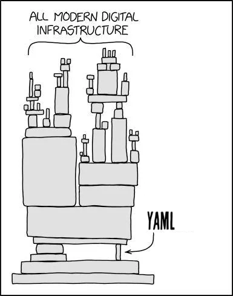

YAML and [Kubernetes](https://kubernetes.io/) go together like peanut butter and jelly. While Kubernetes objects can be defined in JSON, YAML has emerged as the de facto standard.

It's often the first tool developers encounter when diving into Kubernetes, and for good reason - its human-readable format makes it the preferred choice in most tutorials, documentation, and even production deployments.
<!--more-->

<div style="display: flex; align-items: center; justify-content: center; height: 600px;">
    
</div>

**But is it the best way to manage your Kubernetes resources?** Let's compare YAML, Terraform, and Pulumi and see which is best for managing your Kubernetes resources.

I also gave a talk before on `No YAML!` and what alternatives you have if you would only stick with the Go language:



## Kubernetes Components and the Kubernetes API

Before we discuss the ways to manage Kubernetes objects, let's look at the components of a typical Kubernetes cluster and their interactions.



A Kubernetes cluster has two component categories: control plane and node. The control plane components manage the cluster. They consist of:

- **kube-apiserver** - The API server is the front end for the Kubernetes control plane. It exposes the Kubernetes API.

- **etcd** - A consistent, highly available key-value store. It is Kubernetes' backing store for all API data.

- **kube-scheduler** - Watches for newly created Pods with no assigned node and selects a node for them to run on.

- **kube-controller-manager** - Runs a controller to implement the control loop.

- **cloud-controller-manager** - Runs controllers that interact with the underlying cloud providers.

The node components run on every node in the cluster. They provide the runtime environment for the containers.

- **kubelet** - An agent that runs on each node in the cluster. It ensures that pods are running.

- **kube-proxy** - Maintains network rules on nodes.

- **Container Runtime** - Is responsible for running containers.

The Kubernetes API is the central component in a Kubernetes cluster. It is the interface to the cluster and the only way to work with Kubernetes objects.

A Kubernetes object is a "record of intent". It represents the desired state of the workload running on the cluster. The whole Kubernetes system will continuously work to ensure that the object exists.

## YAML Manifests

If you are long enough exposed to Kubernetes, you will have seen a lot of YAML files. You can define many Kubernetes objects in a YAML file. These include [`Deployments`](https://kubernetes.io/docs/concepts/workloads/controllers/deployment/), [`Services`](https://kubernetes.io/docs/concepts/services-networking/service/), [`ConfigMaps`](https://kubernetes.io/docs/concepts/configuration/configmap/), [`Secrets`](https://kubernetes.io/docs/concepts/configuration/secret/), and more.

Let's have a look at an example of a `Deployment` object in YAML for an `Nginx` web server:

### Example

```yaml
apiVersion: apps/v1
kind: Deployment
metadata:
  name: nginx-deployment
spec:
  replicas: 1
  selector:
    matchLabels:
      app: nginx
  template:
    metadata:
      labels:
        app: nginx
    spec:
      containers:
      - name: "nginx:latest"
        image: nginx
```

### Pros and Cons of YAML

#### Pros

- **Simple:** Kubernetes YAML files are easy to read and write.
- **The standard:** YAML is the standard way to define Kubernetes objects. It is a first-class citizen in the `kubectl` command-line tool.

#### Cons

- **Multiple environments:** If you have multiple environments, like development, staging, and production, you need to maintain multiple YAML files.
- **Too manual:** You must create and update the YAML files by hand. Also, you must track changes across many files.
- **Not DRY:** You cannot use the [DRY principle](https://en.wikipedia.org/wiki/Don%27t_repeat_yourself) (Don't Repeat Yourself) in YAML files. If you have the same configuration in many files, you need to update all of them by hand.
- **No real abstraction:** The advantage of a static configuration file is also its disadvantage. You cannot use dynamic values in the YAML files.
- **Need for tools from the ecosystem:** You need to use tools like `helm` or `kustomize` to manage the complexity of many YAML files, environments, and templating.

To sum it up, YAML is a good choice for simple Kubernetes objects and small projects. But, if you have a complex project, and to be honest, most are, you need a better way to manage your Kubernetes resources.

Or to rephrase it: Friends don't let friends manage Kubernetes resources with YAML.



## Terraform Kubernetes Provider

[Terraform](https://www.terraform.io/) is an Infrastructure as Code tool. It lets you define and manage your infrastructure in a declarative way. It uses a high-level configuration language called HashiCorp Configuration Language (HCL). To manage Kubernetes objects with Terraform, use the Kubernetes provider. It allows you to define Kubernetes objects in Terraform HCL.

The [Kubernetes provider](https://registry.terraform.io/providers/hashicorp/kubernetes/latest) allows you to define Kubernetes objects like `kubernetes_deployment`, `kubernetes_service`, `kubernetes_config_map`, `kubernetes_secret`, and more in code, leveraging the language features of Terraform. You can use, to a certain extent, loops, conditions, and variables in a way that is not possible with plain YAML files.

Let's have a look at an example of a `Deployment` object in Terraform HCL for an `Nginx` web server:

### Example

```hcl
resource "kubernetes_deployment" "nginx" {
  metadata {
    name = "nginx-deployment"
  }

  spec {
    replicas = 1

    selector {
      match_labels = {
        app = "nginx"
      }
    }

    template {
      metadata {
        labels = {
          app = "nginx"
        }
      }

      spec {
        container {
          image = "nginx:latest"
          name  = "nginx"
        }
      }
    }
  }
}
```

This is a very simple example of a `Deployment` object in Terraform HCL. Let's add some complexity to the example by adding variables and loops:

### Example with Variables and Loops

```hcl
variable "namespace" {
  description = "The namespace to deploy the resources"
  type        = string
  default     = "default"
}

variable "nginx_image" {
  description = "The Nginx image to use"
  type        = string
  default     = "nginx:latest"
}

variable "replicas" {
  description = "The number of replicas to deploy"
  type        = number
  default     = 1
}

variable "number_of_deployments" {
  description = "The number of deployments to create"
  type        = number
  default     = 2
}

locals {
  nginx_image           = var.nginx_image
  replicas              = var.replicas
  namespace             = var.namespace
  number_of_deployments = var.number_of_deployments
}

resource "kubernetes_deployment" "nginx" {
  for_each = {for i in range(local.number_of_deployments) : i => i}

  metadata {
    name      = "nginx-deployment-${each.key}"
    namespace = local.namespace
  }

  spec {
    replicas = local.replicas
    selector {
      match_labels = {
        app = "nginx-${each.key}"
      }
    }

    template {
      metadata {
        labels = {
          app = "nginx-${each.key}"
        }
      }

      spec {
        container {
          image = local.nginx_image
          name  = "nginx"
        }
      }
    }
  }
}
```

In this example, we can already see the advantage of Terraform over plain YAML files. We can use variables and loops to define multiple `kubernetes_deployment` objects in a more dynamic way.

### Pros and Cons of Terraform

#### Pros

- **Dynamic:** You can use variables, loops, and conditions in Terraform HCL. This lets you define your Kubernetes objects in a more dynamic way.
- **Abstraction:** You can apply the DRY principle in Terraform HCL by defining and reusing modules across projects.
- **Environment management:** By defining variables, you can manage multiple environments, like development, staging, and production. This is a more structured way to do it, without needing extra tools.

#### Cons

- **Complexity:** Terraform is more complex than plain YAML files. You must learn Terraform's HCL to define your Kubernetes objects.
- **DSL:** Terraform is a Domain-Specific Language (DSL). You need to learn it to define your Kubernetes objects.
- **Testability:** Testing Terraform code is harder. You need tools like Terratest and Kitchen-Terraform for it.
- **Helm Support:** Terraform does not support Helm charts out of the box. You need to use the [Helm provider](https://registry.terraform.io/providers/hashicorp/helm/latest) to manage them with Terraform. This can add complexity to your Terraform code, and you need to keep track of the Helm provider dependency.
- **IDE Support:** Terraform lacks the same IDE support as YAML files. You need plugins, like the [Terraform Extension for Visual Studio Code](https://marketplace.visualstudio.com/items?itemName=HashiCorp.terraform), for syntax highlighting and autocompletion.

Terraform is a good choice for managing your Kubernetes resources if you have a complex project and you do not mind the complexity of the Terraform language. It gives you more flexibility and abstraction than plain YAML files, and you can manage multiple environments in a more structured way.

But is there a better way to manage your Kubernetes resources? Let's have a look at Pulumi.

## Pulumi and the Power of General Purpose Languages

Last but not least, let's have a look at Pulumi. Pulumi is an Infrastructure as Code tool. It lets you define and manage your Kubernetes objects using general-purpose programming languages. Pulumi [supports multiple languages](/docs/iac/languages-sdks/) like Python, Go, TypeScript, JavaScript, .NET, and JVM-based languages. This gives you all the benefits of a full programming language. It includes native IDE support, code completion, and debugging.

You need to install the [Pulumi CLI](/docs/iac/cli/). Then, create a [new Pulumi project](/docs/iac/cli/commands/pulumi_new/). Finally, add the [Kubernetes library](/registry/packages/kubernetes/) to it. It depends on the language you choose. You could use a package manager, like `npm` or `pip`.

Let's have a look at an example of what a `Deployment` object would look like in all the supported languages.



{}

```typescript

```

{}

{}

```javascript

```

{}

{}

```python

```

{}

{}

```go

```

{}

{}

```csharp

```

{}

{}

```java

```

{}

Now have a look into the more complex example with variables and loops in Pulumi. I am using `TypeScript` as an example,
but you can of course use any of the Pulumi supported languages.

### Example with Variables and Loops







In this example, you can see how easy it is to define multiple `Deployment` objects with variables and loops syntax provided by `TypeScript`. This is a big advantage over plain YAML files and Terraform HCL. Blending the full power of a general-purpose programming language with the Kubernetes API is a natural process. Consider the possibilities of creating reusable functions, classes, and modules. You could share them across multiple projects and teams.



### Pros and Cons of Pulumi

#### Pros

You can use general-purpose languages to define your Kubernetes objects. These include Python, Go, TypeScript, JavaScript, .NET, and JVM-based languages.

- **Full IDE support:** You get full IDE support. It includes syntax highlighting, code completion, and debugging.
- **Testability:** You can use the full power of your programming language to test your Pulumi code.
- **Abstraction:** You can use the DRY principle in Pulumi. Define reusable functions, classes, and modules in your chosen programming language.
- **Environment management:** You can manage multiple environments, like development, staging, and production, by defining config variables. This is a more structured way, without needing extra tools.
- **Kubernetes Helm Support:** Pulumi supports [Helm charts](/registry/packages/kubernetes/api-docs/helm/) out of the box. You can manage Helm charts with Pulumi without needing extra tools or providers.
- **Programmatic execution of Pulumi:** You can further blend Pulumi code into your projects using the [Pulumi Automation API](/docs/iac/packages-and-automation/automation-api/).

#### Cons

- **Runtime dependency:** You must have the runtime of your chosen programming language installed on your machine, or use a containerised version of it in your CI/CD pipeline.
- **Follow best practices and compliance:** Set up a code review process. It should ensure the Pulumi code follows the best practices of your chosen programming language and your organization's additional best practices.
- **No possibility to convert one Pulumi language to another:** If you start with one language, you can't convert the Pulumi code to another language. You need to rewrite the Pulumi code in the new language.

## YAML vs. Terraform vs. Pulumi - Results

| Feature                    | YAML                                           | Terraform                                 | Pulumi                                         |
|----------------------------|------------------------------------------------|-------------------------------------------|------------------------------------------------|
| **Readability**            | ✅ Simple and human-readable                    | ⚠️ Requires learning HCL                  | ✅ Uses familiar programming languages          |
| **Environment Management** | ❌ Requires manual management of multiple files | ✅ Structured management via variables     | ✅ Structured management via config variables   |
| **DRY Principle**          | ❌ No reusability, requires manual updates      | ✅ Supports modules and reusable code      | ✅ Full support via functions, classes, modules |
| **Dynamic Configuration**  | ❌ Static configuration only                    | ✅ Supports loops, conditions, variables   | ✅ Full programming language capabilities       |
| **IDE Support**            | ✅ Good support                                 | ⚠️ Limited, requires plugins              | ✅ Full language-native IDE support             |
| **Testing**                | ❌ Limited testing options                      | ⚠️ Requires specialized tools (Terratest) | ✅ Native language testing frameworks           |
| **Helm Support**           | ✅ Native support                               | ⚠️ Requires additional provider           | ✅ Built-in support                             |
| **Learning Curve**         | ✅ Low                                          | ⚠️ Medium (new DSL)                       | ⚠️ Varies by language knowledge                |
| **Dependencies**           | ✅ Minimal                                      | ⚠️ Terraform installation                 | ❌ Language runtime required                    |
| **Ecosystem Tools**        | ❌ Requires additional tools (Helm, Kustomize)  | ✅ Integrated tooling                      | ✅ Integrated tooling                           |
| **Abstraction**            | ❌ Limited                                      | ✅ Good                                    | ✅ Excellent                                    |

Legend:

- ✅ Good/Supported
- ⚠️ Partial/With limitations
- ❌ Poor/Not supported

## Time to say Goodbye to YAML?


So, what's the smart choice for deployment automation with Kubernetes? Is YAML still the best choice for Kubernetes? Or, is there a better way to manage your resources? I understand if you are a YAML fan. Despite complaints, it is still the most popular way to define Kubernetes objects. Many folks feel a sense of accomplishment when their YAML file works on the first try.

If you have a complex project, you will soon hit the limits of YAML. You want to manage your Kubernetes resources in a more structured, dynamic way while following best practices and compliance. Then, you keep adding more complexity to your YAML files. You do this by using tools like `helm` and `kustomize` to fix YAML's flaws. Or, you adopt a hybrid approach with `jsonnet`, `cuelang`, or `ytt`. This makes it even more complex.

Giving up on YAML is not easy, but it does not mean that you have to give up on control. You can still have full control by using Terraform or Pulumi.

## Conclusion

Now it's time to make a decision. What's the smart choice for deployment automation with Kubernetes? Is it YAML, Terraform, or Pulumi? For me, the smart choice is Pulumi. It gives you all the benefits of a general-purpose programming language. You gain full control, a more streamlined workflow, and the power to define all your infrastructure needs as code beyond Kubernetes. Especially on complex projects, use Pulumi. It's better than dealing with many YAML files and the complexity of Terraform HCL.

Next time you start a new project, try Pulumi. See for yourself that it's a smart choice. It's an upgrade to your productivity and happiness.

But that's my opinion. What's your opinion? What's your smart choice for deployment automation with Kubernetes?

If you want to try out Pulumi or play around to prove [me](/blog/author/engin-diri) wrong, you can start with:


