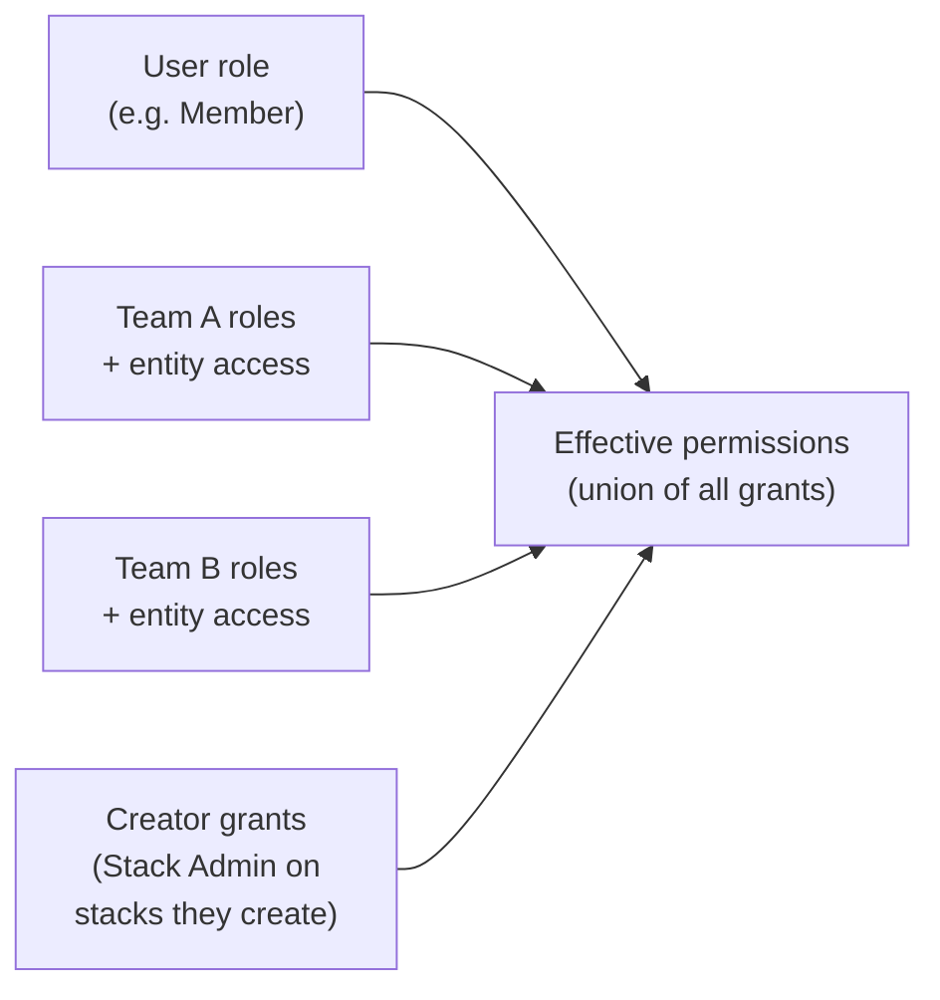

Role-Based Access Control (RBAC) in Pulumi Cloud controls who can access which resources in your organization and what actions they can take. You compose access from reusable building blocks — scopes, permission sets, and roles — and assign it to users, teams, and machine tokens. [Organization-wide role settings](/docs/administration/access-identity/rbac/roles#organization-wide-role-settings) establish the baseline permissions that every member receives by default.

{}
Pulumi Cloud's configurable RBAC features — custom roles, custom permission sets, teams, and tag-based (ABAC) rules — are only available in the Pulumi Enterprise or Business Critical editions. The built-in roles (Admin, Member, and Billing Manager) and [organization-wide role settings](/docs/administration/access-identity/rbac/roles#organization-wide-role-settings) are available in all editions, including Team. To learn more, see the [pricing page](/pricing/).
{}

This model lets you:

- Define precise access levels for each type of resource.
- Reuse permission sets and roles instead of configuring access one resource at a time.
- Set organization-wide defaults that every member inherits through the built-in Member role.
- Enforce least-privilege access across the organization.

## Where roles apply

Roles apply to these kinds of principals in Pulumi Cloud:

- **Users**: Each organization member has exactly one organization role (Admin, Member, Billing Manager, or a custom role).
- **[Teams](/docs/administration/access-identity/rbac/teams/)**: A team can be granted access two ways — through **roles** and through **entity access** granted directly on specific stacks, environments, and Insights accounts (outside of any role). Members of a team receive the union of the team's roles, its direct entity access grants, and their own user role.
- **[Team tokens](/docs/administration/access-identity/access-tokens/#team-access-tokens)**: Machine tokens that act on behalf of a team. A team token's permissions are the union of the roles assigned to its team — they are not assigned a role directly — and they also inherit the organization's default Member permissions configured in [Organization-wide role settings](/docs/administration/access-identity/rbac/roles#organization-wide-role-settings).
- **[Organization access tokens](/docs/administration/access-identity/access-tokens/#creating-an-organization-access-token)**: Machine tokens that are assigned exactly one role defining the token's permissions across the organization.

## How permissions accumulate for users

Access in Pulumi Cloud is built up progressively. A user's effective permissions are the union of every grant that applies to them — from the broadest organizational constraints down to the most resource-specific automatic grants.

{}
All grants are strictly **additive**: no rule can revoke access that another rule provides.
{}

For example, a member who belongs to two teams accumulates the permissions of their own user role plus every role assigned to each of those teams, as well as any entity access those teams grant directly:

### User role

Every member of a Pulumi organization has a user role — a built-in role (Admin, Member, or Billing Manager) or a custom role. New members will receive the specified default role for the organization.

### Team roles and entity access grants

Members who belong to teams inherit all roles assigned to those teams, in addition to their user role. Teams can also be granted [entity access](/docs/administration/access-identity/rbac/teams#team-entity-access-grants) directly on specific stacks, environments, and Insights accounts, outside of any role; team members receive that access too. Users in multiple teams accumulate permissions from all of the teams of which they are a member.

### Creator grants

Any user who creates a stack is automatically granted the Stack Admin permission set on that stack, regardless of their organization role or team memberships. A stack's owner can be changed after creation from the stack's details page, under **Access** > **Settings** > **Change owner**.

## RBAC Constructs

Pulumi Cloud's RBAC system is built on these core concepts:

- [**Scopes**](/docs/administration/access-identity/rbac/scopes): Granular access rights that define specific actions on resources
- [**Permission sets**](/docs/administration/access-identity/rbac/permission-sets): Predefined bundles of scopes that are commonly used together
- [**Entities and organization-level access**](/docs/administration/access-identity/rbac/entities): The Pulumi Cloud objects that permission sets are granted on — stacks, environments, and insights accounts — plus the organization-level access that governs org-wide operations. (Pulumi uses "entity" rather than "resource" here to avoid confusion with cloud infrastructure resources.)
- [**Roles**](/docs/administration/access-identity/rbac/roles): Collections of permission sets applied to entities and assigned to principals. The access rules in a role that apply to entities may be applied to all entities of that type, explicitly selected entities, or they can be [tag-based (ABAC) rules](/docs/administration/access-identity/rbac/roles#tag-based-abac-rules).
- [**Teams**](/docs/administration/access-identity/rbac/teams): Groups of users that can be assigned roles

These constructs build on one another. Scopes are bundled into permission sets; a permission set applied to a set of entities forms an entity access rule; and a role combines one or more entity access rules with an organization access level. The completed role is then assigned to principals. See [Roles](/docs/administration/access-identity/rbac/roles) for a diagram of how a role is composed.
