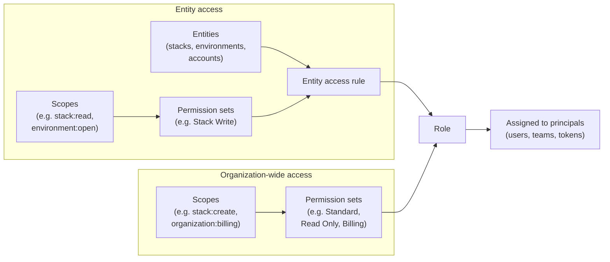

A role in Pulumi Cloud is the primary way to define what resources a principal (user, team, or machine token) can access and what they can do with them. Roles allow you to apply [permission sets](/docs/administration/access-identity/rbac/permission-sets) to a set of [entities](/docs/administration/access-identity/rbac/entities) and assign this access to a principal.

A role combines two kinds of access, both built from [scopes](/docs/administration/access-identity/rbac/scopes) bundled into [permission sets](/docs/administration/access-identity/rbac/permission-sets): **entity access** — permission sets applied to specific [entities](/docs/administration/access-identity/rbac/entities) (stacks, environments, and accounts) to form entity access rules — and an **organization access level** built from org-wide permission sets (such as Standard, Read Only, or Billing) for [org-wide operations](/docs/administration/access-identity/rbac/entities#organization-level-access). The completed role is then assigned to principals.

## Pulumi-defined roles

Pulumi Cloud provides several roles that you can use to quickly get started:

| 
Role
| Description |
|------|-------------|
| `Admin` | Full access to all organization resources and settings. Can manage members, roles, and organization-wide configurations. |
| `Member` | Basic access to view organization resources and participate in stack operations. Cannot modify organization settings. The baseline permissions every member receives are configured in [Organization-wide role settings](#organization-wide-role-settings). |
| `Billing Manager` | Access to view and manage billing information. Cannot modify other organization settings or resources. |

{}
By default, new members of a Pulumi Cloud organization have the Member role. To change the default, select a role and choose **Actions** > **Set as organization default role**.
{}

### Organization-wide role settings

Organization-wide role settings configure the built-in **Member** role: its default access levels for stacks, environments, and accounts, plus a few org-wide capabilities. They adjust part of the Member role — the role also carries a fixed baseline of permissions that this panel doesn't expose. These settings apply only to members on the Member role who have not been given an explicit custom role; a member with an assigned custom role uses that role instead.

Only organization admins can change these settings. To open them, navigate to **Settings** > **Access management**, select the **Roles** tab, and choose **View organization-wide role settings**.

{}
Organization-wide role settings are a leftover from Pulumi Cloud's pre-RBAC permission system, retained for backward compatibility. For new, fine-grained access control, use [custom roles](#custom-roles) and [permission sets](/docs/administration/access-identity/rbac/permission-sets) instead.
{}

#### Stack permissions

The **Stack permissions** dropdown sets the access level that members on the Member role have to all [stacks](/docs/iac/concepts/stacks/) in the organization:

- **None** — Members have no default access to stacks. They can only access stacks granted to them through a role, team, or creator grant.
- **Read** — Members can view stacks, including their resources and state.
- **Write** — Members can view stacks and run updates on them, including `pulumi up` and `pulumi destroy`. Removing a stack itself (`pulumi stack rm`) is *not* included — that requires the `stack:delete` [scope](/docs/administration/access-identity/rbac/scopes/stacks), which is granted by the Stack Admin permission set and gated by the **Allow stack admins to delete stacks** toggle below.

This group also includes the following capability toggles:

- **Allow organization members to create stacks and transfer stacks to this organization** — When enabled, members on the Member role can create new stacks and transfer existing stacks into the organization. When disabled, only members whose role includes the `stack:create` scope can do so.
- **Allow stack admins to transfer stacks to another organization** — When enabled, stack admins can move stacks out of the organization.
- **Allow stack admins to delete stacks** — When enabled, stack admins can delete the stacks they administer.

#### Environment permissions

The **Environment permissions** dropdown sets the access level that members on the Member role have to all [environments](/docs/esc/) (Pulumi ESC):

- **None** — Members have no default access to environments.
- **Read** — Members can view environment definitions.
- **Open** — Members can open environments, resolving and decrypting their values for use.
- **Write** — Members can create and edit environment definitions.

#### Account permissions

The **Account permissions** dropdown sets the access level that members on the Member role have to all [Pulumi Insights accounts](/docs/insights/):

- **None** — Members have no default access to accounts.
- **Read** — Members can view accounts, their scan configurations, and scan results.
- **Write** — Members can update existing accounts and run and manage their scans (start, cancel, pause, and resume). Write does *not* include creating or deleting accounts: creating is governed by the **Allow organization members to create accounts** toggle below, and deleting requires **Admin**.
- **Admin** — Full control: everything **Write** allows, plus deleting accounts and managing who else can access them.

This group also includes a capability toggle:

- **Allow organization members to create accounts** — When enabled, members on the Member role can create new Insights accounts. When disabled, only members whose role includes the `insights_account:create` scope can do so.

#### Team permissions

This group includes a single capability toggle:

- **Allow organization members to create teams** — When enabled, members on the Member role can create new [teams](/docs/administration/access-identity/rbac/teams). When disabled, only members whose role includes the `team:create` scope can do so.

## Custom roles

{}
Custom roles are only available in the Pulumi Enterprise or Business Critical editions. Pulumi Enterprise allows up to 25 custom roles; Pulumi Business Critical allows unlimited custom roles. To learn more, see the [pricing page](/pricing/).

The baseline permissions for members who have not been given an explicit custom role are configured in [Organization-wide role settings](#organization-wide-role-settings).
{}

You can create and manage custom roles to define more granular access controls for your organization. Custom roles combine entity access rules (direct, global, or tag-based) with an organization access level.

### Creating custom roles

To create a custom role, you must be an organization admin.

Navigate to **Settings** > **Access management** and select the **Roles** tab to see your organization's roles.

To create a new role, select **Create custom role**. Provide a unique name and, optionally, a description to contextualize the role's purpose.

A custom role can include any combination of the following entity access rule types, plus an organization access level.

#### Rule types

##### Direct entity access

Direct rules grant a permission set to individually selected entities. Choose the entity type (stack, environment, or insights account), select **Select specific [type]**, then select **Choose [type]** to open a searchable list.

A dialog lists the entities in your organization. You can search by name to filter the list.

Check the entities to include in the rule, then select **Confirm selection**.

After confirming, select **Save rule**. The **Entity Access** section displays a table of all configured rules, and you can add more with **Add rule**.

##### Global entity access

Global rules apply a permission set to all entities of a given type within the organization. Choose the entity type and select **Apply to all [type]** to grant the chosen permission set across all current and future entities of that type.

##### Tag-based rules (ABAC) {#tag-based-abac-rules}

Tag-based rules (also called ABAC — attribute-based access control) grant a permission set when a resource's tags match defined conditions. Each rule has:

- **Entity type** — Stack, environment, or insights account.
- **Tag conditions** — One or more conditions on resource tags (e.g. tag `env` equals `production`, or tag `team` exists).
- **Permission set** — The permission set to grant when the conditions match a resource.

**Why use them:** Grant access to many resources at once by tag (e.g. all stacks with `team=platform`) without listing each resource individually. Useful for large organizations.

**How it works:** When evaluating access, Pulumi Cloud checks the user's roles (and the roles of the teams they belong to). For each tag rule in those roles, it evaluates the resource's tags against the rule's conditions. If they match, the rule's permission set is applied to that resource.

To configure a tag-based rule, choose the entity type and select **Set conditions**, then enter one or more tag key/value conditions and choose a permission set.

In the Pulumi Cloud UI and API, these rules may be labeled "tag rules" or "tag-based access control rules"; ABAC (attribute-based access control) is the general industry term.

**Organization access** sets the permission level for organization-level operations (e.g. creating stacks, managing billing, audit logs). This applies to the organization as a whole and is separate from the entity-based rules above.

When done, select **Create role**.

You can now assign this role to principals in your organization.

## Role assignment

Roles can be assigned to organization access tokens, users, and teams. Effective permissions are the **union** of the user's organization role and all roles assigned to the teams they belong to (composability).

### Organization access tokens

[Organization access tokens](/docs/administration/access-identity/access-tokens/#organization-access-tokens) can be assigned exactly **one** role (default or custom) that defines the token's permissions across the organization.

Follow the process to [create an organization token](/docs/administration/access-identity/access-tokens/#creating-an-organization-access-token), then choose a default or custom role to assign to the token. The token's access is limited to the permissions of that role within your organization.

### Users

Each organization member has exactly **one** organization role (Admin, Member, Billing Manager, or a custom role). When your organization has custom roles enabled, admins can replace a member's role with any custom role. Members who have the Member organization role and have not been given an explicit custom role receive the baseline permissions defined in [Organization-wide role settings](#organization-wide-role-settings).

### Teams

When your organization has custom roles enabled, [teams can have role assignments](/docs/administration/access-identity/rbac/teams#role-assignments): **one or more** roles (default or custom). Team members receive the **union** of their own user role and all roles assigned to the teams they belong to. So team role assignments add on top of each member's baseline role.

## Best practices

When working with roles in Pulumi Cloud, consider these best practices:

1. **Principle of least privilege**: Assign only the scopes necessary for users to perform their tasks.
1. **Role reusability**: Design custom roles and permission sets in a way that maps to real-world concepts within your org, allowing for easy reuse.
1. **Tag-based rules**: Use tag-based rules to grant access to many resources by tag (e.g. `team=platform`) without listing each resource.
1. **Regular review**: Periodically schedule reviews of role assignments and scopes.
1. **Documentation**: Document the purpose and scopes of custom roles both internally and within the role's metadata.

## Related resources

- [Scopes](/docs/administration/access-identity/rbac/scopes): The most granular access rights in Pulumi Cloud, written as `object:action`. Each scope belongs to one entity type and is the building block of permission sets.
- [Permission sets](/docs/administration/access-identity/rbac/permission-sets): Reusable bundles of related scopes for a single entity type. You grant them on entities or use them to set a role's organization access level.
- [Entities and organization-level access](/docs/administration/access-identity/rbac/entities): The objects that permission sets are granted on (stacks, environments, and Insights accounts), plus the organization-level access that governs org-wide operations.
- [Teams](/docs/administration/access-identity/rbac/teams): Groups of users that can be assigned roles and entity access. Each member inherits the union of the team's roles on top of their own role.
