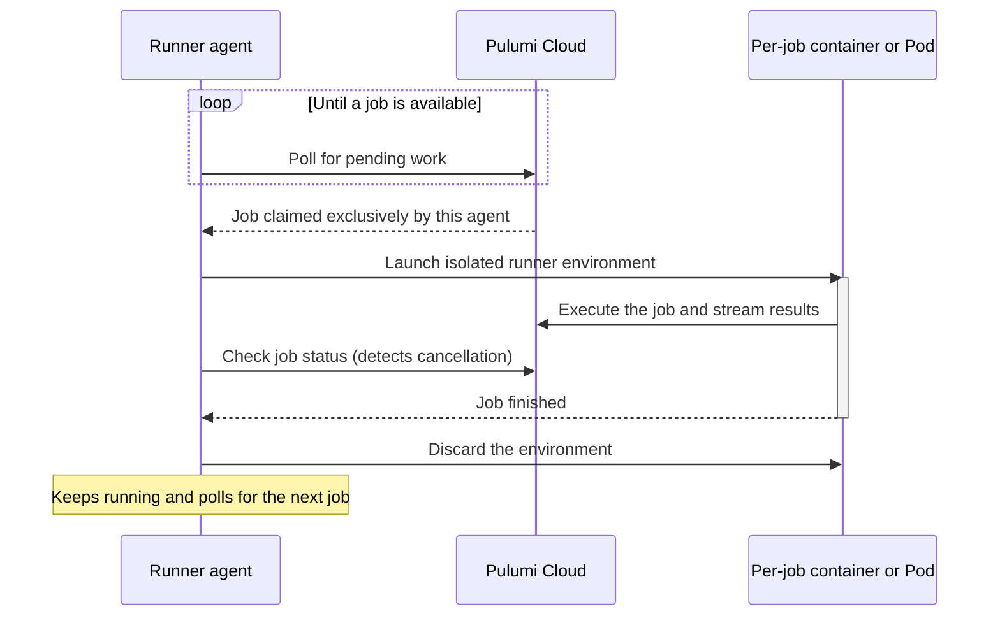

Customer-managed runners let you run [Pulumi Deployments](/docs/deployments/), [Discovery](/docs/discovery-governance/concepts/discovery/) scans, and audit [policy evaluations](/docs/discovery-governance/concepts/policy-as-code/) on runners you host in your own infrastructure. By default, this work runs on [Pulumi-managed runners](/docs/deployments/concepts/pulumi-managed-runners/). You group your runners into one or more runner pools, then choose which pool each stack, cloud account, or policy group uses.

Common reasons to use customer-managed runners:

- **Private network access**: Runners can live inside fully private VPCs and reach resources that aren't accessible from the public internet.
- **Credentials and data stay in your network**: Cloud provider credentials, scan data, and policy evaluation results are processed on hardware you control.
- **Your own environment**: Run on hardware of your choice and configure the runner image and environment you need. Linux and macOS are supported.
- **Mix and match**: Keep using Pulumi-managed runners for some work, such as development stacks, while routing private-network work to your own pools.
- **Scale on your terms**: Create multiple pools and add runners to a pool to increase concurrency, up to 150 concurrent workflows per organization.

To create, scale, and assign a runner pool, see the [customer-managed runners setup guide](/docs/administration/guides/customer-managed-runners/). The rest of this page explains what runs on customer-managed runners, how each kind of work picks a pool, the execution model, how to supply cloud credentials, and the full configuration reference.

## What runs on customer-managed runners

A runner can run three workflow types. All three are enabled by default, and the [`enabled_workflow_types`](#configuration-reference) setting lets you dedicate a runner to a subset.

| Workflow type | `enabled_workflow_types` value | What it covers |
|---|---|---|
| Deployments | `deployment` | Every Pulumi Deployments operation on a stack, from any [deployment trigger](/docs/deployments/concepts/triggers/): on-demand runs from the console or REST API, git push to deploy, [review stacks](/docs/deployments/concepts/review-stacks/), remote Automation API, scheduled [drift detection and remediation](/docs/deployments/concepts/drift/), and [time-to-live stacks](/docs/deployments/concepts/ttl/). |
| Discovery scans | `insights_scan` | On-demand and scheduled [scans of a cloud account](/docs/discovery-governance/concepts/discovery/cloud-accounts/). |
| Policy evaluations | `policy_evaluation` | Evaluations run by [audit policy groups](/docs/discovery-governance/concepts/policy-as-code/policy-groups/). Preventative policy groups run inside `pulumi up` and `pulumi preview` wherever the CLI runs, so they don't use a runner pool. |

## How work chooses a runner pool

Each kind of work resolves its pool independently. If nothing more specific is set, it falls back to the organization's [default runner pool](/docs/administration/guides/customer-managed-runners/#setting-an-organization-default-pool), and then to the Pulumi hosted pool.

- **Deployments**: the pool set in the stack's **Settings** > **Deploy** page (the **Deployment runner pool** dropdown), then the organization default, then the Pulumi hosted pool. See [Runner pools](/docs/deployments/concepts/settings/runner-pools/).
- **Discovery scans**: a pool chosen for an individual scan, then the cloud account's pool, then the organization default, then the Pulumi hosted pool. Scheduled scans use the account's pool. See [Run scans and policy evaluations on customer-managed runners](/docs/discovery-governance/operations/customer-managed-runners/).
- **Policy evaluations**: the audit policy group's pool, then the organization default, then the Pulumi hosted pool.

Self-hosted Pulumi Cloud installations have no Pulumi hosted pool, so all of this work must run on a customer-managed runner pool.

## Not supported on customer-managed runners

The following features run only on Pulumi-managed runners:

- **[Dependency caching](/docs/deployments/concepts/settings/dependency-caching/)**: if a stack is assigned to a customer-managed pool, the setting has no effect. Because you control the runner environment and image, you can manage caching yourself, for example by persisting package manager caches and the Pulumi plugin directory (`~/.pulumi/plugins`) across jobs, or by pre-baking them into your runner image.
- **[Terraform remote execution](/docs/integrations/terraform/remote-execution/)**: Terraform runs can't be assigned to a customer-managed pool.
- **Terraform module conversion** in Pulumi Cloud.
- **[Pulumi Neo](/docs/ai/) tasks**.

## Terminology

The same concept appears under a few names across Pulumi tools:

- The CLI, REST API, and [RBAC scopes](/docs/administration/reference/rbac-scopes/) call a runner pool an **agent pool** (for example, the `agent_pool:*` scopes and agent pool access tokens).
- The runner binary is `customer-managed-workflow-agent`, and its configuration file is `pulumi-workflow-agent.yaml`.
- The Pulumi Cloud console lists pools under **Workflow runner pools** in organization settings, and labels a stack's pool setting **Deployment runner pool**.

## Execution model

A workflow runner is a long-lived agent process. It polls Pulumi Cloud for pending work, claims one job at a time through an exclusive claim, launches an isolated runner environment to execute that job, streams the results back to Pulumi Cloud, and then discards the per-job environment. The agent itself keeps running and polls for the next job.

The [`deploy_target`](#configuration-reference) setting controls *how* the agent creates that per-job environment. It has two values — `docker` and `kubernetes` — and the choice determines the isolation model, the prerequisites, and how you scale.



### Docker

With `deploy_target: docker` (the default), the agent connects to the local Docker socket and launches a **separate runner container for each job**. Because a runner container runs Pulumi operations that may themselves build images or start containers, this pattern is often referred to informally as **Docker-in-Docker (DinD)**. Mechanically, though, the agent starts a runner container through the Docker socket rather than nesting a Docker daemon.

Docker-specific behavior:

- **`pull_image`** — when `true` (the default), the agent pulls the workflow image from the registry for each job; when `false`, it uses a locally cached image.
- **`env_forward_allowlist`** — host environment variables named here are forwarded into the runner container, which is how you pass cloud provider credentials or other host-defined secrets into a job. `DOCKER_HOST` is always forwarded.
- **`shared_volume_directory`** — the host directory used to create the temporary directories that are mounted into the runner container. Leave it empty to use the operating system's default temporary location.

This mode requires only a Docker daemon on the host, which makes it the simplest way to run an agent on a single VM or bare-metal host.

### Kubernetes

With `deploy_target: kubernetes`, the agent uses the in-cluster Kubernetes API to launch a **runner Pod for each job**, so every job gets Pod-level isolation and is scheduled by Kubernetes across your cluster. In this mode the agent runs as a Kubernetes Deployment, and its configuration is supplied as environment variables on that Deployment or through a configuration file mounted into the agent Pod. The Kubernetes-specific [`PULUMI_AGENT_IMAGE_PULL_POLICY`](#kubernetes-managed-workflow-runners) controls the runner image pull policy.

This mode fits environments that already run Kubernetes and want the cluster to handle scheduling and resource limits. It also enables ephemeral, per-job runners: set [`single_run: true`](#configuration-reference) so the agent exits after one job, and drive it with a Kubernetes `Job` or `CronJob` so a fresh agent starts for each job.

### One job per runner

Regardless of the deploy target, each agent process runs **one deployment at a time** — plus, optionally, one Discovery scan or policy evaluation in parallel — and has no internal worker pool to configure. To run more jobs concurrently, add more agents to the pool rather than trying to scale a single agent. For the full set of scaling patterns, per-organization concurrency limits, and crash-recovery behavior, see [Scaling and concurrency](/docs/administration/guides/customer-managed-runners/#scaling-and-concurrency) in the setup guide.

### Choosing between Docker and Kubernetes

| | Docker (`deploy_target: docker`) | Kubernetes (`deploy_target: kubernetes`) |
|---|---|---|
| **Prerequisite** | A Docker daemon on the host | A Kubernetes cluster |
| **Per-job unit** | A runner container launched via the Docker socket | A runner Pod launched via the in-cluster API |
| **Isolation** | Container-level, sharing the host Docker daemon | Pod-level, scheduled and isolated by the cluster |
| **Scaling** | Run more agent processes (for example, more hosts or systemd units) | Run more agent replicas, or use `single_run` with a `Job`/`CronJob` for ephemeral per-job runners |
| **Best fit** | A single VM or host where you want the simplest setup | An existing Kubernetes environment that should schedule and bound runner resources |

## Providing cloud credentials to runners

Where a job gets its cloud provider credentials depends on its workflow type.

### Deployments

Deployments support three ways to supply credentials:

1. **[Pulumi ESC](/docs/esc/)** (recommended): import an ESC environment into the stack's [environment](/docs/esc/guides/pulumi-iac/), and the Pulumi CLI opens it on the runner during the deployment. ESC environments can issue short-lived credentials themselves, for example with the [`aws-login`](/docs/esc/providers/login/aws-login/) provider.
1. **[Pulumi Deployments OIDC](/docs/deployments/guides/oidc/)**: if your runners can't reach Pulumi Cloud to use ESC, configure OIDC in the stack's deployment settings. Pulumi Cloud issues an OIDC token for each deployment, and the runner exchanges it with your cloud provider before the Pulumi program runs. The runner needs outbound access to the cloud provider's token endpoint, such as AWS STS, and the cloud provider must trust the Pulumi OIDC issuer, just as with Pulumi-managed runners.
1. **Host environment variables**: forward credentials that already exist on the runner host into each job with [`env_forward_allowlist`](#forwarding-host-environment-variables).

For a comparison of ESC and Deployments OIDC, see [Supplying cloud credentials to Pulumi Deployments](/docs/deployments/guides/cloud-credentials/).

### Discovery scans

Discovery scans always use the ESC environment attached to the [cloud account](/docs/discovery-governance/concepts/discovery/cloud-accounts/#configure-esc-credentials). The scanner opens that environment on your runner and uses the credentials it exports, so a scan on a customer-managed runner needs no extra credential configuration. Deployments OIDC doesn't apply to scans.

The runner needs network access to Pulumi Cloud, which it already has in order to poll for work, and to the cloud provider APIs being scanned.

### Policy evaluations

Policy evaluations don't call cloud provider APIs. They read stack state and discovered resources from Pulumi Cloud, so they need no cloud credentials. If a policy pack needs configuration or secrets, [attach an ESC environment](/docs/discovery-governance/concepts/policy-as-code/policy-groups/#esc-environments) to it. The runner opens that environment and passes its `environmentVariables` and `policyConfig` to the policy pack.

### Forwarding host environment variables

The `env_forward_allowlist` setting forwards named environment variables from the runner host into every job, whatever its workflow type. To use it, set the variables on the host, or pass them when you start the runner:

```bash
VARIABLE=value customer-managed-workflow-agent run
```

Then list the variable names in `pulumi-workflow-agent.yaml`:

```yaml
token: pul-d2d2….
version: v0.0.5
env_forward_allowlist:
    - key_one
    - key_two
    - key_three
```

Don't forward variables that Pulumi sets for each job, such as `PULUMI_ACCESS_TOKEN`. A forwarded variable can replace the value Pulumi provides.

## Configuration reference

All configuration for customer-managed runners is done through the `pulumi-workflow-agent.yaml` file. This can be created manually or with the `customer-managed-workflow-agent configure` command.

The workflow runner will look for `pulumi-workflow-agent.yaml` in the following directories:

- Current directory
- Home directory
- `/etc`
- Location of the `customer-managed-workflow-agent` binary

Below are the available configuration parameters and their default values. In most cases, only `token` is required.

Any setting can also be provided as an environment variable using the `PULUMI_AGENT_` prefix and the upper-cased key name (for example, `token` → `PULUMI_AGENT_TOKEN`, `polling_interval` → `PULUMI_AGENT_POLLING_INTERVAL`). Environment variables take precedence over values in the configuration file.

Duration values use Go duration syntax: a sequence of decimal numbers each with an optional fraction and a unit suffix, such as `300ms`, `30s`, `1m`, or `1h30m`. Valid units are `ns`, `us` (or `µs`), `ms`, `s`, `m`, and `h`.

```yaml
# pulumi-workflow-agent.yaml

## Required settings

# Pulumi token provided when creating a new workflow runner pool.
# Required unless using OIDC.
# Environment variable override: PULUMI_AGENT_TOKEN
token: pul-xxx

## Optional settings

# If using Self-Hosted Pulumi, set this to the API domain of your instance.
# Trailing slashes are stripped automatically.
# Environment variable override: PULUMI_AGENT_SERVICE_URL
service_url: "https://api.pulumi.com"

# The base path from which to load the runner binaries (workflow-runner and,
# for Docker, workflow-runner-embeddable). Defaults to the directory of the
# customer-managed-workflow-agent binary (usually ~/.pulumi/bin/).
# Environment variable override: PULUMI_AGENT_WORKING_DIRECTORY
working_directory: "<location of customer-managed-workflow-agent binary>"

# Host directory used to create temporary directories that are mounted into
# the runner container. Leave empty to use the OS default temporary location.
# Environment variable override: PULUMI_AGENT_SHARED_VOLUME_DIRECTORY
shared_volume_directory: ""

# Where workflow jobs are executed. One of: docker, kubernetes.
# - docker: the agent launches runner containers via the local Docker socket.
# - kubernetes: the agent launches runner Pods via the in-cluster Kubernetes API.
# See the "Execution model" section above for how each target runs a job.
# Environment variable override: PULUMI_AGENT_DEPLOY_TARGET
deploy_target: "docker"

# If true, the runner exits after completing a single workflow job.
# Useful for ephemeral, one-shot runners (for example, Kubernetes Jobs).
# Environment variable override: PULUMI_AGENT_SINGLE_RUN
single_run: false

# If true, the runner pulls the workflow image from the registry on each
# job. If false, it uses a locally cached image. (Docker target only.)
# Environment variable override: PULUMI_AGENT_PULL_IMAGE
pull_image: true

# Workflow types this runner is allowed to claim. All types are enabled by
# default. Set this to dedicate runners to specific kinds of work.
# Valid values: deployment, insights_scan, policy_evaluation.
# Environment variable override: PULUMI_AGENT_ENABLED_WORKFLOW_TYPES
# Environment variable format is comma-separated:
#   PULUMI_AGENT_ENABLED_WORKFLOW_TYPES="deployment,insights_scan,policy_evaluation"
enabled_workflow_types:
    - deployment
    - insights_scan
    - policy_evaluation

# Host environment variables that are forwarded into runner containers.
# Use this to pass cloud provider credentials or other secrets defined on the
# host into workflow jobs. DOCKER_HOST is always forwarded.
# Environment variable override: PULUMI_AGENT_ENV_FORWARD_ALLOWLIST
# Environment variable format is space-separated:
#   PULUMI_AGENT_ENV_FORWARD_ALLOWLIST="VAR1 VAR2"
env_forward_allowlist: []

## OpenID Connect (OIDC) settings
## See the "Leveraging OpenID authentication" section. When oidc_token_file is set,
## `organization_name` and `runner_pool_id` are required, and `token` is not used.

# Path to a file containing an OIDC token that will be exchanged for a
# Pulumi token. The file is re-read whenever the Pulumi token expires.
# Environment variable override: PULUMI_AGENT_OIDC_TOKEN_FILE
oidc_token_file: ""

# Pulumi organization name. Required when using OIDC.
# Environment variable override: PULUMI_AGENT_ORGANIZATION_NAME
organization_name: ""

# Pool ID this runner will connect to. Required when using OIDC.
# (Without OIDC, the pool is inferred from the token.)
# Environment variable override: PULUMI_AGENT_RUNNER_POOL_ID
runner_pool_id: ""

# Requested lifetime for tokens issued via the OIDC exchange (duration).
# Environment variable override: PULUMI_AGENT_TOKEN_EXPIRATION
token_expiration: ""

## Polling and retry settings

# Default polling interval for checking for new workflow jobs. The server
# may return a Retry-After hint that supersedes this value (see
# polling_interval_override).
# Environment variable override: PULUMI_AGENT_POLLING_INTERVAL
polling_interval: "1m"

# If true, ignore any Retry-After header from the server and always use
# polling_interval instead.
# Environment variable override: PULUMI_AGENT_POLLING_INTERVAL_OVERRIDE
polling_interval_override: false

# How often the runner checks the status of an in-progress job (used to
# detect cancellations).
# Environment variable override: PULUMI_AGENT_JOB_STATUS_LOOP_INTERVAL
job_status_loop_interval: "30s"

# Per-call timeout for API requests to Pulumi Cloud.
# Environment variable override: PULUMI_AGENT_REQUEST_TIMEOUT
request_timeout: "30s"

# Maximum number of retries for rate-limited or transient API failures.
# Environment variable override: PULUMI_AGENT_REQUEST_RETRY_COUNT
request_retry_count: 2

# Initial backoff between retries.
# Environment variable override: PULUMI_AGENT_REQUEST_RETRY_WAIT
request_retry_wait: "20s"

# Cap on the backoff between retries.
# Environment variable override: PULUMI_AGENT_REQUEST_RETRY_MAX_WAIT
request_retry_max_wait: "2m"

# Number of consecutive API failures before the circuit breaker trips and
# polling pauses. Each failure already includes its own retries, so the
# effective number of failed requests is higher than this value.
# Environment variable override: PULUMI_AGENT_CIRCUIT_BREAKER_FAILURES
circuit_breaker_failures: 2

# How long the circuit breaker stays open after tripping.
# Environment variable override: PULUMI_AGENT_CIRCUIT_BREAKER_TIMEOUT
circuit_breaker_timeout: "10m"

## Health and observability

# Port for the runner's local HTTP server, which exposes a health check
# endpoint.
# Environment variable override: PULUMI_AGENT_HTTP_SERVER_PORT
http_server_port: 8080

# Maximum time the runner can go without making progress before the health
# endpoint reports unhealthy. If unset (the default), the threshold is
# automatically derived as twice the longer of polling_interval and
# job_status_loop_interval.
# Environment variable override: PULUMI_AGENT_HEALTH_THRESHOLD
health_threshold: ""

# If true, write log output to syslog instead of stderr.
# Environment variable override: PULUMI_AGENT_SYSLOG
syslog: false
```

### Kubernetes-managed runners

For Kubernetes-native installations, configuration for customer-managed runners is set on the Kubernetes Deployment that runs the workflow runner. Configuration values may be set as environment variables, or by mounting a configuration file in the workflow runner Pod.

The following Kubernetes-specific configuration options are available:

```yaml
# Kubernetes image pull policy https://kubernetes.io/docs/concepts/containers/images/#image-pull-policy
PULUMI_AGENT_IMAGE_PULL_POLICY: IfNotPresent
```
