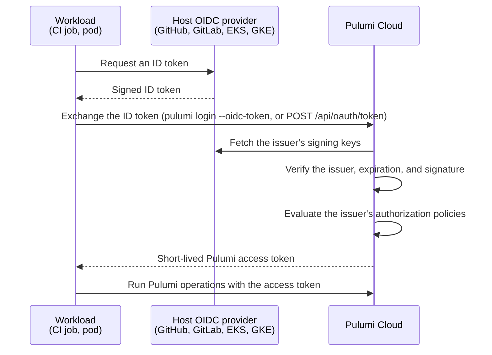

An OIDC issuer is a trust relationship between Pulumi Cloud and an external service that issues OpenID Connect (OIDC) ID tokens, such as GitHub Actions, GitLab CI, Amazon EKS, or Google Kubernetes Engine. Once you register a service as a trusted issuer, workloads running on it can exchange their own short-lived ID tokens for short-lived Pulumi [access tokens](/docs/administration/concepts/access-tokens/). You don't have to create a long-lived Pulumi access token and store it as a secret in your CI system or cluster.

To register an issuer and write its policies, see the [OIDC issuers guide](/docs/administration/guides/oidc-issuers/).

## How token exchange works

1. The workload asks its host service for an ID token. The token's claims describe the workload, for example the repository and branch of a GitHub Actions run, or the namespace and service account of a Kubernetes pod.
1. The workload sends the ID token to Pulumi Cloud, either with `pulumi login --oidc-token` or by calling the OAuth 2.0 token exchange endpoint directly.
1. Pulumi Cloud matches the token's `iss` claim to a registered issuer, checks that the token hasn't expired, fetches the issuer's signing keys over a verified TLS connection, and verifies the token's signature.
1. Pulumi Cloud evaluates the issuer's authorization policies against the token's claims. If an allow policy matches and no deny policy does, Pulumi Cloud returns a Pulumi access token of the type and scope that the policy specifies.

## Issuer trust

Each registered issuer has the following settings:

- **URL**: the issuer URL. It must match the `iss` claim in the tokens the service issues. When you register the issuer, Pulumi Cloud appends `/.well-known/openid-configuration` to this URL to fetch the issuer's OpenID configuration, which tells it where to find the issuer's signing keys.
- **Thumbprints**: fingerprints of the issuer's TLS certificates. By default, Pulumi Cloud records the thumbprint of the certificate it sees at registration time. Pulumi Cloud verifies the issuer's certificate against trusted certificate authorities, so routine certificate rotations don't break token exchange, and it checks thumbprints only as a fallback when that verification fails.
- **Max expiration**: the longest lifetime of a Pulumi access token issued through this issuer. The default is 25 hours.

An organization can register any number of issuers. Each issuer is registered with one organization, and the tokens it issues are scoped to that organization.

## Authorization policies

Registering an issuer doesn't let anything exchange tokens yet. Pulumi Cloud denies any exchange that no allow policy matches, and a new issuer starts with no allow policies, so an admin adds **allow** policies to grant access.

A policy has the following parts:

- **Decision**: allow or deny.
- **Rules**: claims that the incoming ID token must match. A rule can target a top-level claim such as `sub` or `aud`, or a nested claim by its path, such as `"kubernetes.io".pod.name`. Quote any object key that contains a dot.
- **Token type**: the kind of Pulumi access token the policy applies to and, for team, personal, and deployment runner tokens, which team, user, or runner it acts as. An allow policy issues this kind of token. A policy, allow or deny, only matches exchange requests for its own token type, team, user, or runner.

Claim values and team scopes support wildcards: `*` matches zero or more characters, `?` matches zero or one character, and `.` matches exactly one character. For example, a rule of `runner-*` on a pod-name claim matches every pod whose name begins with `runner-`.

When an exchange request matches more than one policy, **deny always takes precedence over allow**. Policy order and how specific each rule is have no effect. To carve an exception out of a broad allow policy, add a deny policy for the exception with the same token type, team, user, or runner as the allow policy.

## Token types

The token type on an allow policy determines what the issued access token can do:

| Token type | Issued token acts as | Policy names | Available in |
|---|---|---|---|
| Personal | the named user, with that user's permissions | the user |  |
| Organization | an [organization access token](/docs/administration/concepts/access-tokens/#creating-an-organization-access-token) | nothing further |  |
| Team | a [team access token](/docs/administration/concepts/access-tokens/#team-access-tokens), with that team's permissions | the team |  |
| Deployment runner | a [customer-managed workflow runner](/docs/deployments/concepts/customer-managed-runners/) | the runner |  |

When requesting a team or personal token, the workload names the same team or user in the exchange request's scope (`team:<team-name>` or `user:<user-login>`), and Pulumi Cloud issues the token only if an allow policy grants it.

Tokens issued through OIDC exchange don't receive admin privileges unless the exchange explicitly requests the admin scope. See [OIDC issued tokens](/docs/administration/concepts/access-tokens/#oidc-issued-tokens).

## Token lifetime

The workload can request a lifetime for the access token when it exchanges its ID token. If it doesn't, the token lasts two hours. Pulumi Cloud never issues a token that outlives the issuer's max expiration.

Because these tokens are short-lived and issued on demand, an organization's [access token expiry policy](/docs/administration/concepts/access-tokens/#access-token-expiry-policy) doesn't apply to them.

## Inbound and outbound OIDC

OIDC issuers handle the *inbound* direction: an external service proves its identity to Pulumi Cloud. They have no part in the opposite, *outbound* direction, where Pulumi Cloud is the identity provider and other services trust it. That direction is how [Pulumi ESC](/docs/esc/guides/configuring-oidc/) gets short-lived credentials from AWS, Azure, Google Cloud, Vault, and other providers when an environment is opened.

A CI pipeline often uses both: it exchanges its CI system's token for a Pulumi access token through an OIDC issuer, then opens an ESC environment that uses outbound OIDC to fetch cloud credentials.

## Security recommendations

- **Check both the audience and the subject.** A policy that checks only `aud` accepts any workload on the issuer that can request that audience, which on a shared service like GitHub Actions can include repositories you don't control. Pin `sub` to your own organization, repository, branch, environment, or service account, following your provider's guidance.
- **Issue the narrowest token type that works.** Prefer a team token scoped to a team with only the permissions the pipeline needs over an organization token.
- **Keep max expiration short.** Set it close to the longest job that uses the issuer.
- **Use deny policies for exceptions.** Since deny always wins, a deny policy with the same token type, team, user, or runner as a broader allow policy reliably blocks a branch or namespace that the allow policy would otherwise admit.

For more on limiting what automation can do, see [Least privilege](/docs/administration/guides/least-privilege/).

## Next steps

- [Register an OIDC issuer and configure its policies](/docs/administration/guides/oidc-issuers/)
- Provider guides: [GitHub](/docs/administration/guides/oidc-issuers/github/), [GitLab](/docs/administration/guides/oidc-issuers/gitlab/), [Amazon EKS](/docs/administration/guides/oidc-issuers/kubernetes-eks/), and [Google Kubernetes Engine](/docs/administration/guides/oidc-issuers/kubernetes-gke/)
- Manage issuers with the [OIDC issuers REST API](/docs/reference/cloud-rest-api/oidc-issuers/) or as code with the [`OidcIssuer`](https://www.pulumi.com/registry/packages/pulumiservice/api-docs/oidcissuer/) resource in the Pulumi Service provider
