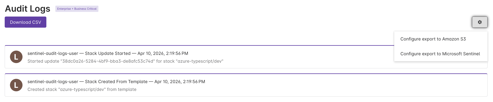

{}
Automated export is only available on the Pulumi Business Critical Edition. If you don't see it in your organization, [contact sales](/contact?form=sales).
{}

Pulumi Cloud can continuously export audit log events into [Microsoft Sentinel](https://learn.microsoft.com/en-us/azure/sentinel/overview) using a [Codeless Connector (CCF)](https://learn.microsoft.com/en-us/azure/sentinel/create-codeless-connector). The connector deploys as a Pulumi program and uses Sentinel's managed RestApiPoller to poll the Pulumi Cloud REST API every 5 minutes — no Azure Functions, Logic Apps, or other compute resources needed.

Events are transformed via a KQL Data Collection Rule and written to a custom `PulumiAuditLogs_CL` table in your Log Analytics workspace. The template also deploys three pre-built analytic rules for common security scenarios.

## Prerequisites

- A Pulumi Cloud organization with a **Business Critical** subscription
- A [Pulumi access token](https://app.pulumi.com/account/tokens) with audit log read permissions — an **org-scoped service token** is recommended
- An Azure resource group with a Log Analytics workspace and Microsoft Sentinel enabled

If you don't have a workspace and Sentinel enabled, create them with the Azure CLI:

```bash
az group create -n <resource-group> -l <region>
az monitor log-analytics workspace create -g <resource-group> -n <workspace-name> -l <region>
az sentinel onboarding-state create -g <resource-group> -w <workspace-name> -n default --customer-managed-key false
```

## Setup option 1: Pulumi Cloud console (recommended)

1. In the Pulumi Cloud console, navigate to **Audit Logs** and click the gear icon. Select **Configure export to Microsoft Sentinel**.

   

1. Click **Deploy with Pulumi**. This opens the New Project Wizard with the template pre-selected.

1. Fill in the config values:
   - **orgName**: Your Pulumi Cloud organization name
   - **accessToken**: Your Pulumi access token (masked input, stored encrypted)
   - **workspaceName**: Name of your existing Log Analytics workspace
   - **resourceGroupName**: Azure resource group containing the workspace
   - **azure-native:location**: Azure region (defaults to `eastus`)

1. Choose **"Pulumi Deployments (No-code)"** as the deployment method.

1. Select an ESC environment with your Azure credentials. The environment needs standard `ARM_*` environment variables (`ARM_CLIENT_ID`, `ARM_CLIENT_SECRET`, `ARM_TENANT_ID`, `ARM_SUBSCRIPTION_ID`). If you already use Azure with Pulumi Deployments, your existing ESC environment will work.

   If you don't have one, create an ESC environment via **Environments** > **Create new environment** with this YAML:

   ```yaml
   values:
     azure:
       login:
         fn::open::azure-login:
           clientId: <service-principal-app-id>
           clientSecret:
             fn::secret: <service-principal-password>
           tenantId: <tenant-id>
           subscriptionId: <subscription-id>
     environmentVariables:
       ARM_CLIENT_ID: ${azure.login.clientId}
       ARM_CLIENT_SECRET: ${azure.login.clientSecret}
       ARM_TENANT_ID: ${azure.login.tenantId}
       ARM_SUBSCRIPTION_ID: ${azure.login.subscriptionId}
   ```

1. Select **Deploy**. Pulumi Deployments runs `pulumi up` server-side.

1. Verify: navigate to **Microsoft Sentinel** > your workspace > **Data connectors** > find "Pulumi Cloud Audit Logs". Wait ~5 minutes for the first poll, then check **Logs**:

   ```kql
   PulumiAuditLogs_CL
   | sort by TimeGenerated desc
   | take 10
   ```

## Setup option 2: CLI

1. Ensure you have the Azure CLI installed and authenticated (`az login`).

1. Create a new project from the example:

   ```bash
   mkdir sentinel-connector && cd sentinel-connector
   pulumi new https://github.com/pulumi/examples/tree/master/azure-ts-sentinel-audit-logs
   ```

1. When prompted, enter the config values:
   - **orgName**: Your Pulumi Cloud organization name
   - **accessToken**: Your Pulumi access token (masked input, stored encrypted in stack config)
   - **workspaceName**: Name of your existing Log Analytics workspace
   - **resourceGroupName**: Azure resource group containing the workspace
   - **azure-native:location**: Azure region (defaults to `eastus`)

1. Deploy:

   ```bash
   pulumi up
   ```

1. Verify: navigate to **Microsoft Sentinel** > your workspace > **Data connectors** > find "Pulumi Cloud Audit Logs". Wait ~5 minutes for the first poll, then check **Logs**:

   ```kql
   PulumiAuditLogs_CL
   | sort by TimeGenerated desc
   | take 10
   ```

## What gets ingested

| Column | Type | Description |
|--------|------|-------------|
| `TimeGenerated` | datetime | When the event occurred (UTC) |
| `Event_s` | string | Event type (e.g., `stack-created`, `member-added`) |
| `Description_s` | string | Human-readable event description |
| `SourceIP_s` | string | Client IP address |
| `UserName_s` / `UserLogin_s` | string | User display name / login |
| `TokenID_s` / `TokenName_s` | string | Access token ID and name (if applicable) |
| `ActorName_s` / `ActorUrn_s` | string | Non-human actor name and Pulumi URN |
| `RequireOrgAdmin_b` | boolean | Action required org admin privileges |
| `RequireStackAdmin_b` | boolean | Action required stack admin privileges |
| `AuthFailure_b` | boolean | Failed authentication attempt |

## Pre-built analytic rules

The template deploys three analytic rules:

- **Excessive Authentication Failures** — more than 5 auth failures from a single IP in 15 minutes
- **Stack Deleted** — alerts when a Pulumi stack is destroyed
- **Organization Membership Change** — tracks members added, removed, or role-changed

## Configuration reference

| Config key | Description | Required | Default |
|------------|-------------|----------|---------|
| `orgName` | Pulumi Cloud organization name | Yes | -- |
| `accessToken` | Pulumi access token (stored as encrypted secret) | Yes | -- |
| `workspaceName` | Log Analytics workspace name | Yes | -- |
| `resourceGroupName` | Azure resource group containing the workspace | Yes | -- |
| `enableAnalyticRules` | Deploy pre-built Sentinel analytic rules | No | `true` |
| `azure-native:location` | Azure region | No | `eastus` |

## Sample KQL queries

### Excessive authentication failures

```kql
PulumiAuditLogs_CL
| where AuthFailure_b == true
| summarize FailCount = count() by SourceIP_s, bin(TimeGenerated, 15m)
| where FailCount > 5
```

### Stack deletions

```kql
PulumiAuditLogs_CL
| where Event_s == "stack-deleted"
```

### Organization membership changes

```kql
PulumiAuditLogs_CL
| where Event_s in ("member-added", "member-removed", "member-role-changed")
```

## Updating the access token

```bash
pulumi config set --secret accessToken <new-token>
pulumi up
```

This replaces the data connector (delete + create). The poller reconnects in seconds with no data loss.

## Tearing down

```bash
pulumi destroy
pulumi stack rm <stack-name>
```

## Known limitations

- **No historical backfill**: The connector ingests events forward from deployment time only, consistent with the existing S3 audit log export. Historical events can be exported via CSV or the audit log REST API.
- **Org name changes**: If the Pulumi org is renamed, the poller's hardcoded `orgName` becomes invalid. Update the config and run `pulumi up`.
- **Token rotation requires resource replacement**: Changing the access token replaces the data connector (delete + create). This takes seconds with no data loss.
