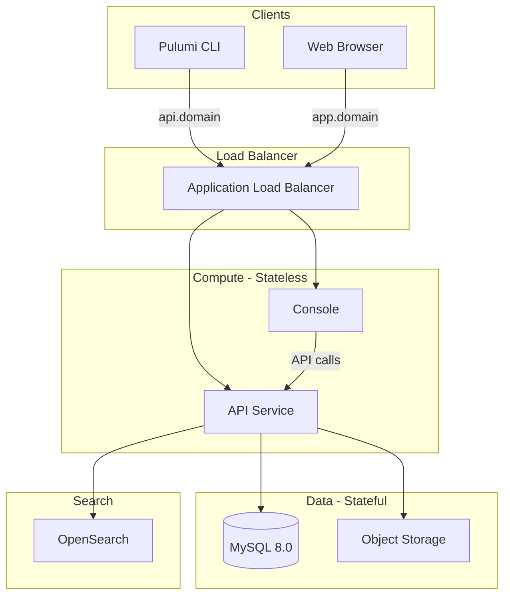

{}
Self-hosting is only available with **Pulumi Business Critical**. If you would like to evaluate the self-hosted Pulumi Cloud, sign up for the [30-day trial](/product/self-hosted#self-hosted-trial) or [contact us](/contact/).
{}

This page describes the high-level architecture of a self-hosted Pulumi Cloud deployment. For detailed configuration of individual components, see [Components](/docs/administration/self-hosting/components/).

## Core components

| Component | Description |
| :-- | :-- |
| API service | Go-based REST API that handles CLI requests, state management, and all backend operations |
| Console | Web UI served as a static Angular application |
| Database | MySQL 8.0.x for metadata, stack state references, and user/organization data |
| Workflow runners | Docker hosts or Kubernetes cluster that runs the workflow runners for Pulumi Deployments |

## Supporting infrastructure

| Component | Description |
| :-- | :-- |
| Object storage | Blob storage for checkpoint (state) files and policy packs. Supported: S3 and compatible implementations, Azure Blob Storage, Google Cloud Storage |
| Search | OpenSearch 2.x or Elasticsearch 7.x for resource search and AI features |

## Data flow

The API and Console services are stateless - all persistent data lives in the database and object storage. This makes the compute tier straightforward to scale horizontally and recover from failures.

## Next steps

- [Database best practices](/docs/administration/self-hosting/operations/database/) - MySQL HA, sizing, and migration guidance
- [Compute sizing](/docs/administration/self-hosting/operations/compute-sizing/) - Container resource allocation by platform
- [Object storage](/docs/administration/self-hosting/operations/object-storage/) - Bucket architecture, versioning, and lifecycle
- [Networking](/docs/administration/self-hosting/operations/networking/) - Multi-AZ deployment, load balancing, and TLS
