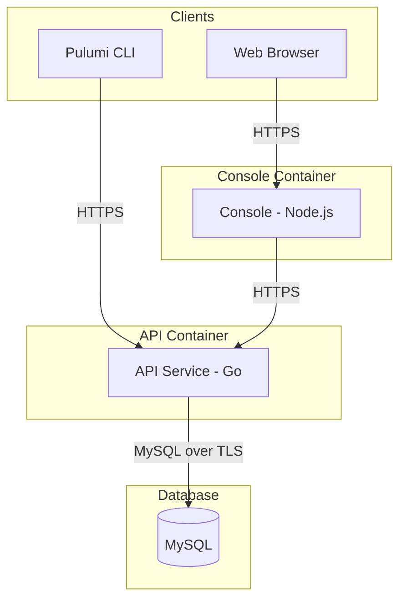

{}
Self-hosting is only available with **Pulumi Business Critical**. If you would like to evaluate the self-hosted Pulumi Cloud, [request a Proof of Concept (PoC)](/product/self-hosted/#self-hosted-trial) or [contact us](/contact/).
{}

This page covers security hardening recommendations for production self-hosted Pulumi Cloud deployments. For authentication configuration, see [SAML SSO](/docs/administration/self-hosting/saml-sso/).

## Network security

- Place the database and application containers in private subnets with no direct internet access.
- Use security groups or network policies to restrict traffic between tiers.
- Consider using an ingress allowlist (`ingressAllowList` config) to restrict access by IP range.
- All self-hosted installers support configuring CIDR-based allowlists on the ingress controller.

## Encryption

- **At rest**: Enable storage encryption on database clusters and object storage buckets.
- **In transit**: Enforce TLS on all connections — see [Encryption in transit](#encryption-in-transit) below.
- **Secrets**: Store sensitive configuration (license keys, TLS certificates, SMTP credentials, database passwords) using `pulumi config set --secret`.

## Encryption in transit

Every network hop in a self-hosted deployment can be encrypted with TLS. The diagram below shows the three hops and the environment variables that control each one.

### Hop 1: Clients → Console

The Console serves the web UI. Configure TLS on the **Console container** (see [Console component reference](/docs/administration/self-hosting/components/console/#tls-environment-variables) for full details):

| Variable | Description |
|---|---|
| `CONSOLE_TLS_CERTIFICATE` | TLS certificate in X.509 PEM format |
| `CONSOLE_TLS_PRIVATE_KEY` | Private key in PEM format |
| `CONSOLE_MIN_TLS_VERSION` | Minimum TLS version (e.g., `1.2`). Optional |

When set, the Console serves on port `3443` (HTTPS) instead of `3000` (HTTP). The `PORT` environment variable can override either default. If a load balancer terminates TLS in front of the Console, these variables are not needed.

### Hop 2: Clients and Console → API

The Pulumi CLI and automation clients connect directly to the API over HTTPS. The Console's Node backend also makes server-side requests to the API (e.g., OAuth callbacks). Configure TLS on the **API container** (see [API component reference — TLS](/docs/administration/self-hosting/components/api/#tls-environment-variables) for full details):

| Variable | Description |
|---|---|
| `API_TLS_CERTIFICATE` | TLS certificate in X.509 PEM format |
| `API_TLS_PRIVATE_KEY` | Private key in PEM format |
| `API_MIN_TLS_VERSION` | Minimum TLS version (e.g., `1.2`) |

When set, the API serves on port `8443` (HTTPS) instead of `8080` (HTTP). The `PORT` environment variable can override either default.

If the API uses a self-signed or internal CA certificate, the Console must trust that CA. Set `NODE_EXTRA_CA_CERTS` on the **Console container** to the path of the CA PEM file (see [Console — Trusting the API service certificate](/docs/administration/self-hosting/components/console/#trusting-the-api-service-certificate)).

### Hop 3: API → MySQL

Configure TLS between the API service and MySQL by setting `DATABASE_CA_CERTIFICATE` and `DATABASE_MIN_TLS_VERSION` on the **API container**. Both are required to enable TLS.

See [Database best practices — Encrypting connections with TLS](/docs/administration/self-hosting/operations/database/#encrypting-connections-with-tls) for full configuration details, including managed service CA certificates, hostname verification, and verification steps.

## SMTP and email

Configure SMTP to enable email-based features:

- User invitation workflows
- Organization notifications
- Password reset emails (only relevant if not using SAML SSO)

SMTP is optional if your organization uses SAML SSO exclusively and does not need email notifications. See the [API component reference](/docs/administration/self-hosting/components/api/) for SMTP environment variables.

## CAPTCHA and bot protection

Configure Cloudflare Turnstile for signup protection. Despite the `recaptcha` naming, these config keys accept Cloudflare Turnstile credentials:

- Set `recaptchaSiteKey` (Turnstile site key)
- Set `recaptchaSecretKey` (Turnstile secret key)
