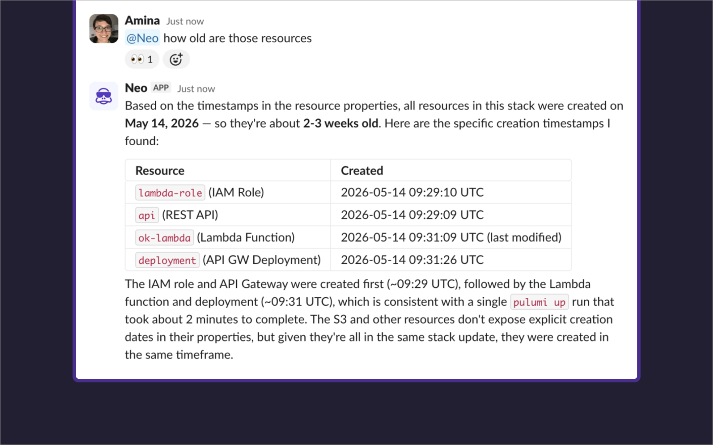

Mention `@Neo` in any channel where Neo has been added to start a Neo [task](/docs/ai/tasks/) without leaving Slack. The response lands in the same thread, and follow-up messages continue the conversation, so the full exchange stays where the discussion is already happening.

## What you can do with `@Neo`

Neo has the same capabilities it does anywhere else: it can check stack state, investigate failures, walk through what a change will do, and carry out actions the team has agreed on. The difference is that the conversation happens in a Slack thread instead of the Pulumi Cloud console, which means the rest of the channel has visibility into what was asked and what Neo found.

## Setting up the integration

### 1. Install the Pulumi Neo Slack app

A Slack workspace admin installs the [**Pulumi Neo Slack app**](https://api.pulumi.com/api/slack/neo/install) to the workspace.

### 2. Connect your Pulumi user to Slack

In Pulumi Cloud, open your **Account settings**, then **Neo settings** and connect your Slack identity. This lets Neo recognize you when you mention it in Slack.

### 3. Mention `@Neo` in a channel

Mention `@Neo` followed by what you want:

> @Neo summarize the production stack.

Neo replies in the same thread.

_Slack will prompt you to add Neo to the channel if it's not there already._

## How permissions work

Tasks started from Slack run with the [RBAC permissions](/docs/administration/access-identity/rbac/) of the Pulumi Cloud user linked to your Slack identity.

## Limitations

- Starting a conversation with Neo in a direct message isn't supported.
- One task per thread.

<em>Neo is powered by AI, and AI-generated content can be inaccurate. Review Neo's responses and actions before relying on them.</em>

