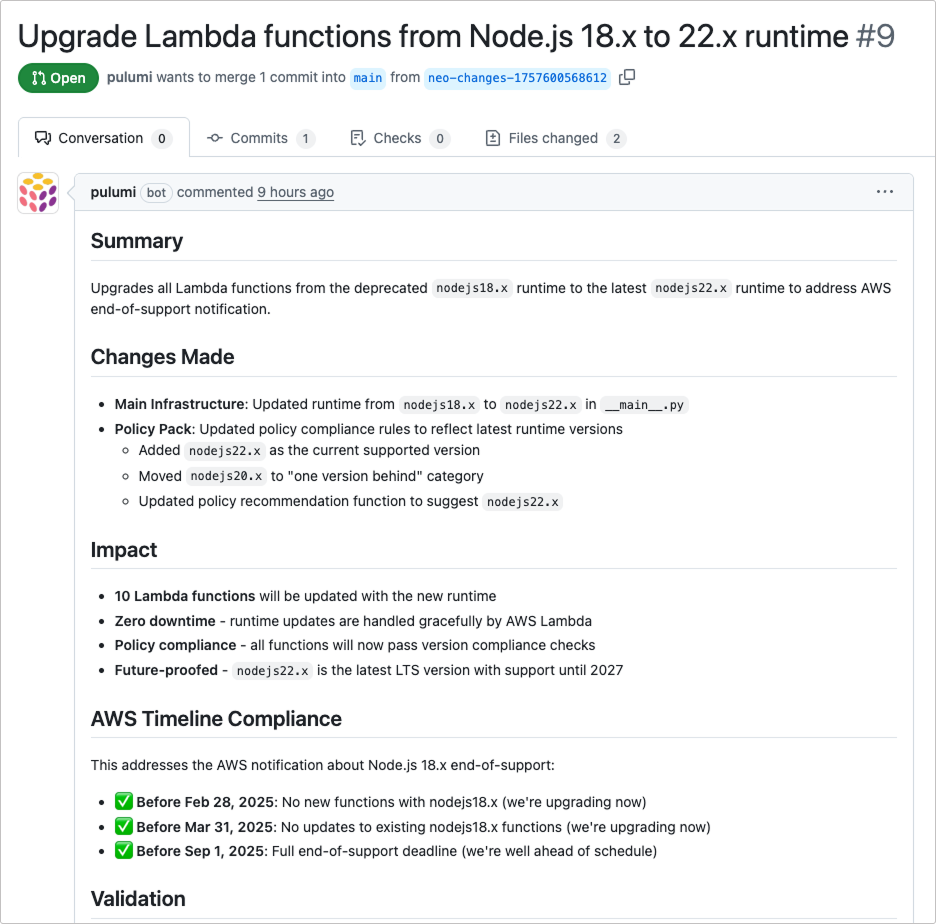

Pull requests are the bridge between Neo's AI capabilities and your production infrastructure. Every change Neo proposes goes through a PR, ensuring:

- Human review of all changes
- CI/CD pipeline validation
- Team collaboration and knowledge sharing
- Audit trail and rollback capability

## Prerequisites

At this time, Neo only supports reading code from and creating pull requests in GitHub.

### GitHub App Installation

Neo requires the [Pulumi GitHub App](/docs/iac/using-pulumi/continuous-delivery/github-app/) to be installed to create pull requests. Additionally, without the Pulumi GitHub App, Neo will not be able to view the IaC code backing a stack. Neo can still propose code changes, but they will not be fully contextualized to your IaC code.

### Code Access

When a stack is created, its git location is added as stack tags. Neo uses these tags to locate and fetch the git repository.

### Pull Requests

Neo will offer to open a pull request after a preview is run. You can also ask Neo to open or update a pull request at any time. Neo opens a PR with:

- Clear title describing the change
- Description of what problem it solves
- List of modified resources
- Preview output summary
- Link back to the Neo task

### Requesting Changes

When reviewing Neo's pull requests, you can ask for modifications through follow-up prompting. Neo understands context from both the PR and your conversation history.

### GitHub Actions Integration

If you use GitHub Actions for CI/CD, Neo's pull requests can automatically trigger your existing workflows. When configured, your Pulumi previews, security scans, policy checks, and tests will run automatically on Neo's PRs, just like any other pull request. If a workflow fails, you can ask Neo to address the specific issue, and it will push fixes to the same PR.

To set up GitHub Actions with Pulumi, see the [GitHub Actions documentation](/docs/iac/using-pulumi/continuous-delivery/github-actions/).
