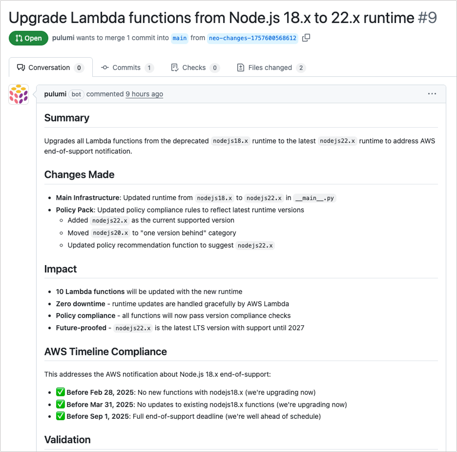

Pull requests are the bridge between Neo's AI capabilities and your production infrastructure. Every change Neo proposes goes through a PR, ensuring:

- Human review of all changes
- CI/CD pipeline validation
- Team collaboration and knowledge sharing
- Audit trail and rollback capability

## Prerequisites

### VCS integration

Neo requires a [version control integration](/docs/version-control/) to read code from and create pull requests. Pulumi supports [GitHub](/docs/version-control/github-app/), [Azure DevOps](/docs/version-control/azure-devops-integration/), and [GitLab](/docs/version-control/gitlab/). Without a VCS integration, Neo will not be able to view the IaC code backing a stack. Neo can still propose code changes, but they will not be fully contextualized to your IaC code.

### Code Access

When a stack is created, its git location is added as stack tags. Neo uses these tags to locate and fetch the git repository.

### Pull Requests

Neo will offer to open a pull request after a preview is run. You can also ask Neo to open or update a pull request at any time. Neo opens a PR with:

- Clear title describing the change
- Description of what problem it solves
- List of modified resources
- Preview output summary
- Link back to the Neo task

### Requesting Changes

When reviewing Neo's pull requests, you can ask for modifications through follow-up prompting. Neo understands context from both the PR and your conversation history.

### CI/CD integration

Neo's pull requests can automatically trigger your existing CI/CD workflows. When configured, your Pulumi previews, security scans, policy checks, and tests will run automatically on Neo's PRs, just like any other pull request. If a workflow fails, you can ask Neo to address the specific issue, and it will push fixes to the same PR.

To set up CI/CD with Pulumi, see the documentation for [GitHub Actions](/docs/iac/using-pulumi/continuous-delivery/github-actions/), [Azure DevOps Pipelines](/docs/iac/using-pulumi/continuous-delivery/azure-devops/), or [GitLab CI](/docs/iac/using-pulumi/continuous-delivery/gitlab-ci/).
