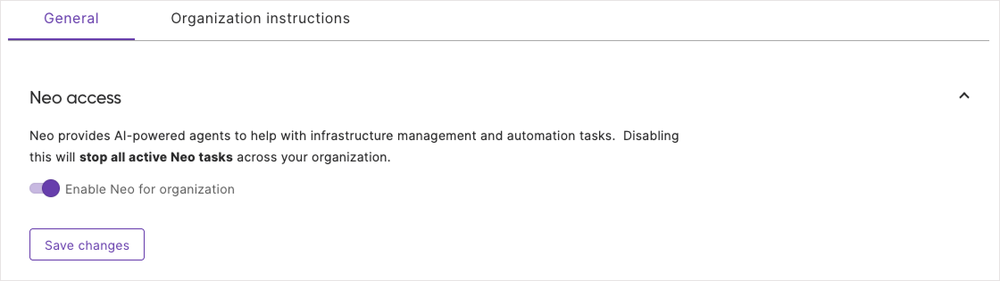
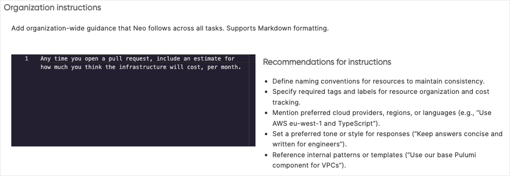
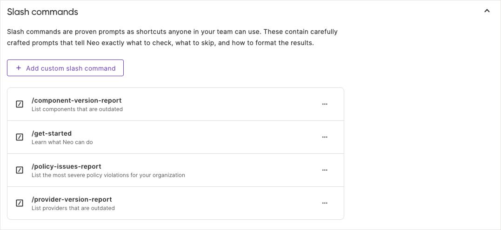
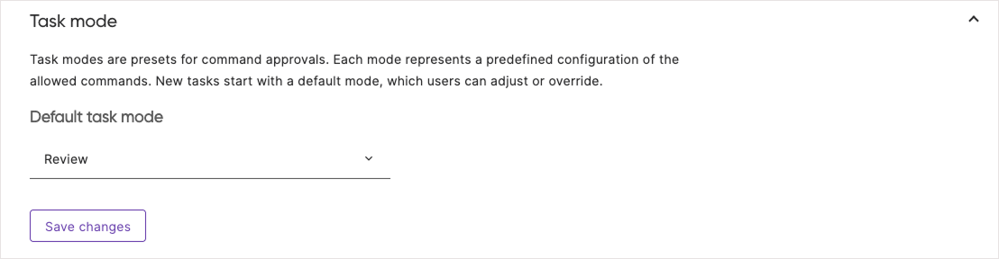

Neo can be configured at both the organization and repository level. Organization-level settings control default behaviors and capabilities for your team, while repository-level instructions let you define project-specific conventions that Neo follows automatically.

## Neo Access

Neo is enabled by default. To control Neo access for your organization:

1. Navigate to Neo Settings from the Pulumi left navigation
1. Select the "General" tab
1. Toggle "Enable Neo for organization" on or off



{}
If Pulumi Copilot was previously disabled, Neo will need to be enabled as outlined below.
{}

## Custom Instructions

Custom Instructions teach Neo your organization's standards, preferences, and requirements so they're applied automatically to every task. Instead of repeating context in each task, you define it once from a central location.

### What to Include

Custom Instructions can define many things, including:

- **Naming conventions**: How resources, stacks, and projects should be named
- **Compliance requirements**: Required tags, labels, or configurations
- **Technology preferences**: Preferred languages, frameworks, or cloud services
- **Cost guidelines**: Budget considerations or cost optimization preferences
- **Automatic actions**: Behaviors Neo should apply automatically, like including cost estimates

### Example

```text
All AWS resources must follow these standards:
- Naming convention: {service}-{environment}-{region}
- Required tags: environment and owner
- Use encryption at rest for all storage resources
- Always include estimated monthly costs in pull requests when proposing new infrastructure
```

When you ask Neo to create resources, it automatically applies your organization's standards without you needing to repeat them in every conversation.

### Configuring Custom Instructions

1. Navigate to Neo Settings in Pulumi Cloud
1. Select the "Organization instructions" tab
1. Enter your organization's standards and preferences
1. Save changes



### Custom Instructions Best Practices

- Keep instructions concise and focused on standards that apply across all tasks
- Update instructions as your team's practices evolve
- Test instructions in individual prompts before rolling out broadly

## Repository Instructions

While Custom Instructions apply to all tasks across your organization, you can also define project-specific instructions that Neo follows when working in a particular repository. This is done through an `AGENTS.md` file placed in the root of your repository.

### How it works

When Neo enters a repository, it automatically reads the `AGENTS.md` file and applies the instructions without being asked. This makes project-specific conventions explicit and consistent across all tasks in that codebase.

### What to include

Use `AGENTS.md` to capture conventions that aren't enforced by linters or formatters:

- **Coding standards**: Language-specific conventions, preferred patterns, or internal style rules
- **Naming conventions**: How functions, variables, files, or resources should be named
- **Test commands**: How to run tests, which test framework to use, or specific flags required
- **Build processes**: Commands for building, linting, or validating the project
- **Architecture guidelines**: Preferred project structure, module organization, or design patterns
- **Other guidance**: Any team-specific requirements your team needs to follow

### Example

```markdown
# Project Instructions

## Build commands
- Install dependencies: `npm install`
- Run tests: `npm test`
- Lint code: `npm run lint`

## Coding standards
- Use TypeScript for all new files
- Prefer async/await over callbacks
- All exported functions must have JSDoc comments

## Naming conventions
- React components: PascalCase (e.g., `UserProfile.tsx`)
- Utility functions: camelCase (e.g., `formatDate.ts`)
- Test files: `*.test.ts` suffix
```

### Subdirectory support

You can place `AGENTS.md` files in subdirectories for more specific instructions. When Neo works in a subdirectory, it reads the nearest `AGENTS.md` file, with subdirectory files taking precedence over parent files. This lets you define general project-wide conventions at the root while providing specialized guidance for specific areas of your codebase.

### Repository Instructions Best Practices

- Start simple with a few key conventions, then expand as needed
- Focus on conventions that can't be enforced by automated tools
- Keep instructions actionable and specific
- Review and update as your project's practices evolve

## Slash Commands

Slash Commands capture proven prompts as shortcuts that anyone on your team can use. When you type `/` in a Neo conversation, you'll see available commands. Selecting a command sends the full prompt to Neo.

### Built-in Commands

Neo includes several built-in commands for common infrastructure tasks:

| Command | Description |
|---------|-------------|
| `/get-started` | Learn what Neo can do and how to structure effective requests |
| `/policy-issues-report` | Lists your most severe policy violations |
| `/component-version-report` | Lists components that are outdated in your private registry |
| `/provider-version-report` | Lists providers that are outdated |

### Creating Custom Commands

You can create organization-specific commands to capture your team's proven prompts:

1. Navigate to Neo Settings in Pulumi Cloud
1. Select the "General" tab
1. Scroll to the "Slash commands" section
1. Click "Add custom slash command"
1. Enter a name and description
1. Define the prompt
1. Save the command



Once saved, the command is immediately available to all team members.

### Viewing Slash Command Instructions

When you have selected a slash command in a new or existing Neo task, click on the highlighted command name to view the actual prompt.

### Slash Command Best Practices

- Create commands for frequently-used prompts that have proven effective
- Use clear, descriptive names that indicate what the command does

## Task Modes

Task modes are presets that control what actions Neo can take automatically. Each mode represents a predefined configuration of allowed commands. New tasks start with a default mode, which users can adjust or override during the task.

### Available Modes

Organization administrators can set the default task mode. The available modes determine how much automation Neo applies:

- **Auto mode**: Automatically approves all requests without user intervention
- **Balanced mode**: Automatically approves requests that don't run `pulumi up`
- **Review mode**: Requires manual approval before any request runs

### Configuring Default Task Mode

1. Navigate to Neo Settings in Pulumi Cloud
1. Select the "General" tab
1. Locate the "Task mode" section
1. Select the default mode from the dropdown
1. Save changes



### Task Mode Best Practices

- Start with the most restrictive mode -- it's best for most organizations
- Remember, users can override the default for individual tasks when needed
