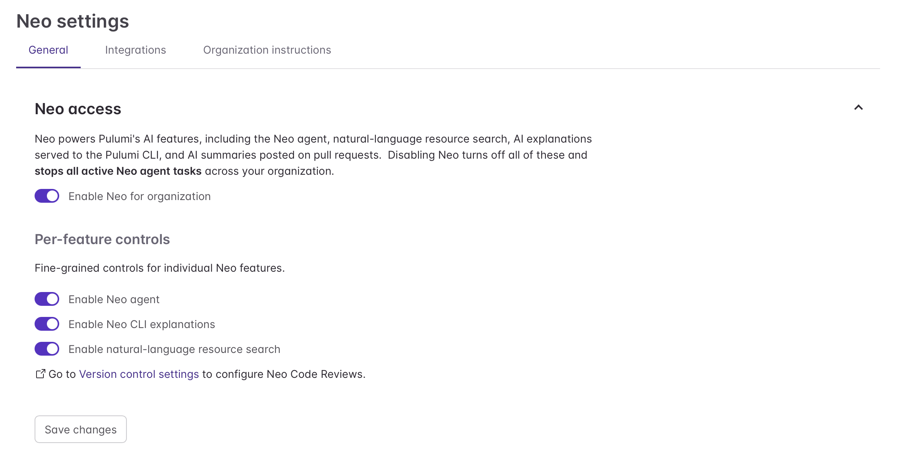
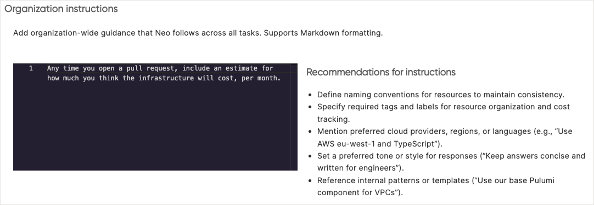
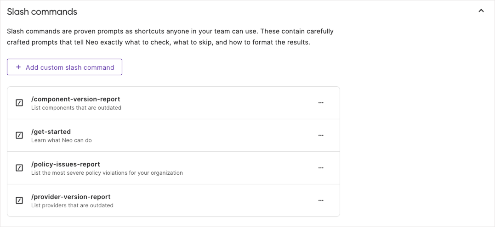
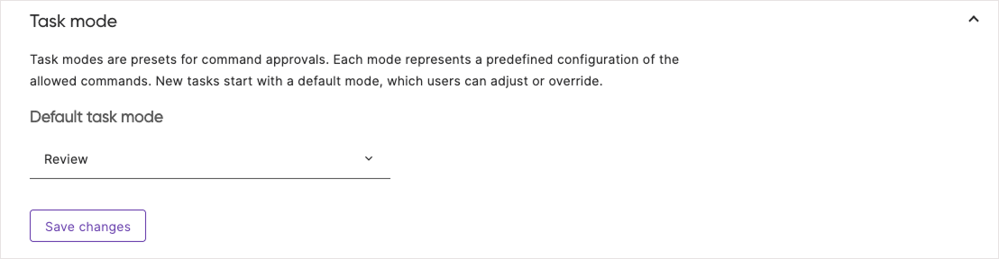

Neo can be configured at the organization, repository, and user level. Organization-level settings control default behaviors and capabilities for your team, repository-level instructions let you define project-specific conventions that Neo follows automatically, and user-level settings let each person tailor their own experience.

## Neo access

Neo is enabled by default. To control Neo access for your organization:

1. Navigate to Neo Settings from the Pulumi left navigation
1. Select the "General" tab
1. Toggle "Enable Neo for organization" on or off



{}
If Neo was previously disabled, it will need to be enabled as outlined below.
{}

## Custom instructions

Custom Instructions teach Neo your organization's standards, preferences, and requirements so they're applied automatically to every task. Instead of repeating context in each task, you define it once from a central location.

### What to include

Custom Instructions can define many things, including:

- **Naming conventions**: How resources, stacks, and projects should be named
- **Compliance requirements**: Required tags, labels, or configurations
- **Technology preferences**: Preferred languages, frameworks, or cloud services
- **Cost guidelines**: Budget considerations or cost optimization preferences
- **Automatic actions**: Behaviors Neo should apply automatically, like including cost estimates

### Example

```text
All AWS resources must follow these standards:
- Naming convention: {service}-{environment}-{region}
- Required tags: environment and owner
- Use encryption at rest for all storage resources
- Always include estimated monthly costs in pull requests when proposing new infrastructure
```

When you ask Neo to create resources, it automatically applies your organization's standards without you needing to repeat them in every conversation.

### Configuring custom instructions

1. Navigate to Neo Settings in Pulumi Cloud
1. Select the "Organization instructions" tab
1. Enter your organization's standards and preferences
1. Save changes



### Custom instructions best practices

- Keep instructions concise and focused on standards that apply across all tasks
- Update instructions as your team's practices evolve
- Test instructions in individual prompts before rolling out broadly

### Bootstrapping repository instructions

Neo reads `AGENTS.md` files when it enters a repository, but it needs to clone the repository first. To ensure Neo picks up your repository instructions early in every task, add a bootstrapping instruction to your Custom Instructions:

```text
When working on a task, immediately clone the associated repository
(and any additional repositories involved) and look for an AGENTS.md
file. Follow any setup instructions it contains before proceeding
with the task.
```

This ensures that environment setup, git hooks, and coding standards defined in `AGENTS.md` are applied before Neo starts working.

## Configuration precedence

Neo applies configuration in layers, with later layers taking priority:

1. **Custom Instructions** set organization-wide defaults that apply to every task
1. **Repository instructions** (`AGENTS.md`) add project-specific conventions when Neo enters a repository
1. **Conversation instructions** override both when you give Neo direct guidance in a task

This layering means you can set broad standards in Custom Instructions, refine them per-repository in `AGENTS.md`, and override anything for a specific task in the conversation.

## Repository instructions

While Custom Instructions apply to all tasks across your organization, you can also define project-specific instructions that Neo follows when working in a particular repository. This is done through an `AGENTS.md` file placed in your repository.

### How it works

When Neo enters a repository, it reads the `AGENTS.md` file and follows the instructions it contains. This makes project-specific conventions explicit and consistent across all tasks in that codebase.

Common uses for `AGENTS.md` include:

- **Build and test commands**: How to install dependencies, run tests, and lint
- **Environment setup**: Required tool versions, environment variables, and runtime configuration
- **Git hooks**: Hook paths and setup commands that must run before committing
- **Coding standards**: Language preferences, naming conventions, and style requirements

Use `AGENTS.md` to capture conventions that aren't enforced by linters or formatters: coding standards, naming conventions, how to run tests, or any other guidance your team needs.

### Example

```markdown
# Project Instructions

## Environment setup
- Run `git config core.hooksPath .githooks` to enable git hooks
- Tool requirements: Node.js 20+, Python 3.11+

## Build commands
- Install dependencies: `npm install`
- Run tests: `npm test`
- Lint code: `npm run lint`

## Git hooks
Pre-commit and pre-push hooks are located in `.githooks/`.
Always run `git config core.hooksPath .githooks` before committing.

## Coding standards
- Use TypeScript for all new files
- Prefer async/await over callbacks
- All exported functions must have JSDoc comments
```

### Subdirectory support

You can place `AGENTS.md` files in subdirectories for more specific instructions. When Neo works in a subdirectory, it reads the nearest `AGENTS.md` file, with subdirectory files taking precedence over parent files. This lets you define general project-wide conventions at the root while providing specialized guidance for specific areas of your codebase.

### Repository instructions best practices

- Start simple with a few key conventions, then expand as needed
- Focus on conventions that can't be enforced by automated tools
- Keep instructions actionable and specific
- Review and update as your project's practices evolve

## Integrations

Neo can connect to third-party services like issue trackers, observability platforms, incident response tools, wikis, and databases, giving tasks the ability to query external tools alongside your infrastructure. Integrations are configured in the **Integrations** tab of Neo Settings, where administrators can enable services and provide credentials.

See [Integrations](/docs/ai/integrations/) for the full list of available integrations, setup instructions, and credential storage details.

## Slash commands

Slash Commands capture proven prompts as shortcuts that anyone on your team can use. When you type `/` in a Neo conversation, you'll see available commands. Selecting a command sends the full prompt to Neo.

### Built-in commands

Neo includes several built-in commands for common infrastructure tasks:

| Command | Description |
|---------|-------------|
| `/get-started` | Learn what Neo can do and how to structure effective requests |
| `/policy-issues-report` | Lists your most severe policy violations |
| `/component-version-report` | Lists components that are outdated in your private registry |
| `/provider-version-report` | Lists providers that are outdated |

### Creating custom commands

You can create organization-specific commands to capture your team's proven prompts:

1. Navigate to Neo Settings in Pulumi Cloud
1. Select the "General" tab
1. Scroll to the "Slash commands" section
1. Click "Add custom slash command"
1. Enter a name and description
1. Define the prompt
1. Save the command



Once saved, the command is immediately available to all team members.

### Viewing slash command instructions

When you have selected a slash command in a new or existing Neo task, click on the highlighted command name to view the actual prompt.

### Slash command best practices

- Create commands for frequently-used prompts that have proven effective
- Use clear, descriptive names that indicate what the command does

## Task modes

Task modes are presets that control what actions Neo can take automatically. Each mode represents a predefined configuration of allowed commands. New tasks start with a default mode, which users can adjust or override during the task.

### Available modes

Organization administrators can set the default task mode. The available modes determine how much automation Neo applies:

- **Auto mode**: Automatically approves all requests without user intervention
- **Balanced mode**: Automatically approves requests that don't run `pulumi up`
- **Review mode**: Requires manual approval before any request runs

### Configuring default task mode

1. Navigate to Neo Settings in Pulumi Cloud
1. Select the "General" tab
1. Locate the "Task mode" section
1. Select the default mode from the dropdown
1. Save changes



### Task mode best practices

- Start with the most restrictive mode -- it's best for most organizations
- Remember, users can override the default for individual tasks when needed

{}
Task modes control approvals during execution. [Plan Mode](/docs/ai/tasks/#plan-mode) is a separate, opt-in feature that controls what happens before execution. You can use Plan Mode with any task mode.
{}

## Notifications

Notifications are user-level settings: each person configures their own preferences from their account settings, independent of any organization. They alert you when Neo needs your attention on a task while the Pulumi Cloud browser tab is in the background. Both options are off by default.

To configure notifications:

1. Navigate to your account settings in Pulumi Cloud
1. Locate the "Neo settings" panel
1. Toggle browser notifications and audio notifications independently

Notifications fire when Neo finishes a response in a task or when Neo requests your approval before continuing. To avoid interrupting you while you're actively watching a task, both notification types are suppressed whenever the Pulumi Cloud tab has focus.

The "Neo settings" panel appears for users whose organization has Neo enabled.

### Browser notifications

When enabled, Neo sends native browser notifications that appear in your operating system's notification area, including when Pulumi Cloud is in a background tab or your browser is minimized. Clicking a notification brings the browser to the foreground and opens the relevant task.

Enabling this setting prompts your browser for notification permission. If you decline the prompt, or if you have previously blocked notifications for Pulumi Cloud, the toggle reverts to off and an "Enable notifications in your browser settings" message appears. To re-enable after a block, grant the permission in your browser settings and then turn the toggle on again.

Browser notifications also depend on your operating system allowing notifications for your browser. If you've enabled the toggle and granted browser permission but no notifications appear, check your operating system's notification settings and confirm notifications are enabled for the browser you're using.

### Audio notifications

When enabled, Neo plays a short two-note chime when a task needs your attention.
