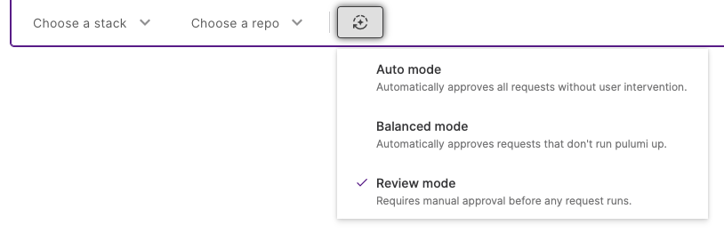
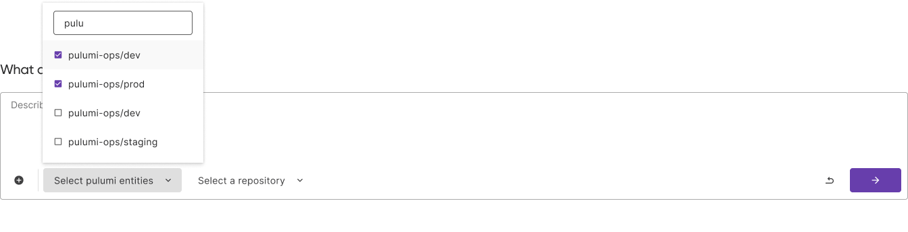

Tasks are Neo's primary unit of work. Each task represents a conversation where you describe what you want to accomplish, and Neo plans and executes the necessary infrastructure changes. A task moves through two phases: planning what to do, then executing it.

## Planning

Every task begins with planning. Neo creates a task plan outlining the steps it will take to accomplish your goal, giving you transparency into its approach and the opportunity to adjust before execution begins.

A representative plan for updating outdated Lambda functions might look like:

1. Identify all Lambda functions using Node.js
1. Determine the appropriate target runtime for each
1. Create code changes to update the runtime versions
1. Run a preview to validate all changes
1. Create a pull request with the updates

### Plan Mode

For complex tasks, you can enable Plan Mode to collaborate with Neo on a more thorough plan before any execution begins. Plan Mode creates a dedicated pre-execution phase where Neo focuses entirely on discovery and synthesis rather than moving toward execution.

When Plan Mode is enabled, Neo:

1. **Investigates your environment** by examining existing infrastructure, reading relevant code, checking dependencies, and researching patterns, showing you what it finds in real time
1. **Synthesizes a narrative plan** explaining what it will do and why, referencing specific things it discovered like stack configurations and dependencies
1. **Iterates with you** through normal conversation so you can challenge assumptions, ask for alternatives, or request more detail
1. **Waits for your explicit approval** before any execution begins

Plan Mode is opt-in. Use it when the task is complex enough that upfront thinking pays off, such as multi-stack operations, unfamiliar infrastructure, or tasks you plan to run autonomously. For simple tasks where you already know the approach, skip it.

## Execution

Once planning is complete, Neo moves to execution. How much autonomy Neo has during execution is controlled by task modes.

### Task modes

Task modes determine the level of autonomy for a given task. At any time during a task, the operating mode can be set to:

- **Review mode** (default): The proposed task plan, running `pulumi preview`, running `pulumi up`, and opening a PR all require approval.
- **Balanced mode**: Neo will only request approval before running `pulumi up`.
- **Auto mode**: Neo will not request any approvals.

Task modes are independent of Plan Mode. Task modes control what approvals Neo requires during execution, while Plan Mode controls what happens before execution. You can combine them: for example, use Plan Mode with Auto Mode to review the approach thoroughly up front, then let Neo execute without stopping.

### Approvals

Depending on the task mode, Neo will seek approval before taking certain actions like opening a PR or running a preview.

### Previews

At any time, you can ask Neo to run a [pulumi preview](/docs/iac/cli/commands/pulumi_preview/). If Neo proposes code changes as part of a task, it will also request to run a preview to validate the changes. [Learn more](/docs/ai/running-previews/) about Neo and previews.

### Pull requests

If a task results in code modifications, Neo will offer to open a [pull request](/docs/ai/pull-requests/) once you are satisfied with the implementation. PRs can also be modified after they have been opened.

## Setting entity context

You can set the [stack](/docs/iac/concepts/stacks/) and [repository](/docs/iac/concepts/projects/) context when initiating a task. This helps Neo understand exactly where to focus its operations.

## Ownership and sharing

Each task belongs to the user who created it. By default, tasks are private, but you can share any task with others in your organization by generating a read-only link. Shared tasks let teammates see the full conversation, including Neo's reasoning, the actions it took, and the outcome.

Sharing preserves security boundaries:

- Viewers can see the conversation but cannot trigger any actions
- Links to stacks or resources within the shared task still enforce the viewer's existing [RBAC](/docs/pulumi-cloud/access-management/rbac/) permissions
- The original task owner retains full control

## Interruptions and resuming

Tasks continue running even if you close your browser or navigate away. When you return to the task later, Neo will have continued working and will show you any progress made while you were away. You can pick up the conversation exactly where you left off, with full context preserved.

## Task history

Neo tasks are saved and accessible through the Agent Tasks page in Pulumi Cloud. Though the entire task history is available at any time, the task cache may be lost if the agent idles for an hour or more.
