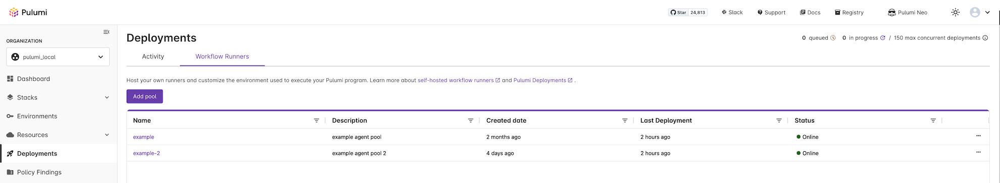

Customer-Managed Workflow Runners allow you to self-host workflow runners, bringing the same power and flexibility as Pulumi-hosted workflows. Self-hosting your workflow runners comes with many benefits for deployments, [Insights](/docs/insights/) discovery scans, and [policy evaluations](/docs/using-pulumi/crossguard/):

- **Host anywhere**: You can host the workflow runners anywhere to manage infrastructure, even within your fully private VPCs
- **Any hardware, any environment<sup>1</sup>**: Run the workflow runners on any hardware of your choice and configure the environment that meets your needs
- **Mix & match**: You can use standard Pulumi-hosted workflows for your development stacks and use self-hosted Customer-Managed Workflow Runners for your private network infrastructure. You can mix and match to suit your unique needs
- **Multiple pools**: You can set up multiple workflow runner pools, assign stacks to specific pools, and scale workflow runners dynamically to increase your workflow concurrency. Customers can have up to 150 concurrent workflows
- **Meet compliance**: You can configure the workflow runners with the credentials needed to manage your infrastructure. This way your cloud provider credentials never leave your private network

<sup>1</sup> *Currently Linux and MacOS are supported*

Customer-Managed Workflow Runners support all the [deployment triggers](/docs/deployments/deployments/#deployment-triggers) currently offered by Pulumi Deployments such as click to deploy, the Pulumi Deployments REST API, git push to deploy, Review Stacks, and remote Automation API. They also support running Insights discovery scans and policy evaluations.

{}
Customer-Managed Workflow Runners are available on the Business Critical edition of Pulumi Cloud. [Contact sales](/contact/?form=sales) if you are interested and want to enable Customer-Managed Workflow Runners.
{}

## Using Customer-Managed Workflow Runners

Before you begin, ensure you have [Docker](https://docs.docker.com/engine/) or [Kubernetes](https://kubernetes.io/docs/home/) installed, which is required for running the workflow runner. If you plan to use workflow runners for **deployments**, you must also install the [Pulumi Github App](/docs/using-pulumi/continuous-delivery/github-app/) and update the [source control settings](/docs/deployments/deployments/get-started) of the stack you want to deploy.

1. Navigate to **Workflow Runners** under Deployments
2. Create a new pool. Copy and save the token
3. Install the workflow runners as per the instructions on the page
4. Verify the workflow runner status by refreshing the page
5. Configure the workflow runner pool for the workflows you want to run:
   - **Deployments**: Go to **Stack Settings** > **Deploy** tab and select the pool under the **Deployment Runner** pool drop-down
   - **Insights discovery scans**: Go to **Management** > **Accounts** and select the pool for the account you want to scan
   - **Policy evaluation**: Go to **Management** > **Policies** > **Policy Groups** and select the pool for an audit policy group
6. **(Optional)** Add more workflow runners to the pool to increase concurrency by using the same token
7. Verify your setup:
   - **Deployments**: Run a `pulumi refresh` through the **Actions** drop-down in your stack page
   - **Insights discovery scans**: Trigger a scan from the **Management** > **Accounts** page and confirm it completes successfully
   - **Policy evaluation**: Run a policy evaluation against a stack and confirm the results appear as expected



Workflow runners poll Pulumi Cloud for pending workflows at a configurable interval (default: every 1 minute) and will disappear from the Pool details page 1-2 hours after being offline. On the deployments page, you can see all the deployments including pending deployments, and which workflow runners were used in a deployment.

Workflow runners support multiple workflow types beyond deployments, including Pulumi Insights scans and policy evaluations. By default, all workflow types are enabled. You can restrict which workflow types a workflow runner handles using the `enabled_workflow_types` configuration option.

{}
If you are running the workflow runner inside a firewall ensure to allow outbound requests to api.pulumi.com. Ensure workflow runners have the cloud provider credentials to be able to deploy in your environments.
{}

### Leveraging OpenID Authentication

It is possible to use OpenID authentication to fetch Pulumi Pool tokens dynamically instead of configuring a static token for the workflow runners. You must first register the OpenID provider as a trusted OIDC issuer in your Pulumi account, as documented at [OIDC documentation](/docs/administration/access-identity/oidc-client/).

After registering the provider, the workflow runner requires this information:

- `organization_name`: your Pulumi Organization name
- `runner_pool_id`: the pool ID that the instance will connect to
- `token_expiration` (optional): the expiration in seconds for the tokens requested by the workflow runner
- `oidc_token_file`: the location of the file where the OIDC token will be recorded

The workflow runner will attempt to read the `oidc_token_file` for a fresh OIDC token and exchange it automatically for a Pulumi token every time the Pulumi token expires.

## Providing Credentials to Workflow Runners

There are two methods to provide cloud provider credentials to the workflow runners:

1. Use [OpenID Connect (OIDC) to generate credentials](/docs/pulumi-cloud/oidc)
2. Directly provide credentials to workflow runners through environment variables configured in the host, or passing the environment variables when invoking the binary. Example:

   ```bash
   VARIABLE=value customer-managed-workflow-agent run
   ```

   You also need to update the `pulumi-workflow-agent.yaml` [configuration file](#configuration-reference) by setting `env_forward_allowlist`. `env_forward_allowlist` expects an array of strings. Example:

    ```yaml
    token: pul-d2d2….
    version: v0.0.5
    env_forward_allowlist:
        - key_one
        - key_two
        - key_three
    ```

## Configuration Reference

All configuration for customer-managed agents are done through the `pulumi-workflow-agent.yaml` file. This can be created manually or with the `customer-managed-workflow-agent configure` command.

The customer-managed agent will look for `pulumi-workflow-agent.yaml` in the following directories:

- Current directory
- Home directory
- `/etc`
- Location of the `customer-managed-workflow-agent` binary

\
Below are available configuration parameters and their default values. In most cases, only `token` is required.

```yaml
# pulumi-workflow-agent.yaml

## Required settings

# Pulumi token provided when creating a new workflow runner pool
# Environment variable override: PULUMI_AGENT_TOKEN
token: pul-xxx

## Optional settings

# Location of temp directory
# Uses the OS's preferred temporary file location (usually /tmp) by default
# Environment variable override: PULUMI_AGENT_SHARED_VOLUME_DIRECTORY
shared_volume_directory: ""

# The base path from which to load the runners
# This defaults to the location of the customer-managed-workflow-agent binary
# (usually ~/.pulumi/bin/customer-managed-workflow-agent)
# Environment variable override: PULUMI_AGENT_WORKING_DIRECTORY
working_directory: "<location of customer-managed-workflow-agent binary>"

# If using Self-Hosted Pulumi, set this to API domain of instance
# Environment variable override: PULUMI_AGENT_SERVICE_URL
service_url: "https://api.pulumi.com"

# If true, exit immediately after completing a single job
# Environment variable override: PULUMI_AGENT_SINGLE_RUN
single_run: false

# If true, always pull the Pulumi image from the Docker registry
# If false, use a local image
# Environment variable override: PULUMI_AGENT_PULL_IMAGE
pull_image: true

# If true, write errors to syslog instead of stderr
# Environment variable override: PULUMI_AGENT_SYSLOG
syslog: false

# Values for configuring OpenID Authentication
# Environment variable override: PULUMI_AGENT_ORGANIZATION_NAME
organization_name: ""
# Environment variable override: PULUMI_AGENT_RUNNER_POOL_ID
runner_pool_id: ""
# Environment variable override: PULUMI_AGENT_TOKEN_EXPIRATION
token_expiration: ""
# Environment variable override: PULUMI_AGENT_OIDC_TOKEN_FILE
oidc_token_file: ""

# List of environment variables to pass to the agent
# Environment variable override: PULUMI_AGENT_ENV_FORWARD_ALLOWLIST
# Environment variable format is: PULUMI_AGENT_ENV_FORWARD_ALLOWLIST="VAR1 VAR2"
env_forward_allowlist: []

# Deployment target for the agent: docker (default) or kubernetes
# Environment variable override: PULUMI_AGENT_DEPLOY_TARGET
deploy_target: "docker"

# Port of health check endpoint
# Environment variable override: PULUMI_AGENT_HTTP_SERVER_PORT
http_server_port: 8080

# Workflow types the workflow runner is allowed to execute
# Valid values: deployment, insights_scan, policy_evaluation
# All types are enabled by default
# Environment variable override: PULUMI_AGENT_ENABLED_WORKFLOW_TYPES
# Environment variable format is comma-separated: PULUMI_AGENT_ENABLED_WORKFLOW_TYPES="deployment,insights_scan,policy_evaluation"
enabled_workflow_types:
    - deployment
    - insights_scan
    - policy_evaluation

# Polling interval for checking for new workflow jobs
# Environment variable override: PULUMI_AGENT_POLLING_INTERVAL
polling_interval: "1m"

# If true, ignore the Retry-After header from the server and always use polling_interval
# Environment variable override: PULUMI_AGENT_POLLING_INTERVAL_OVERRIDE
polling_interval_override: false

# Timeout for API calls to fetch workflows and check workflow status
# Environment variable override: PULUMI_AGENT_REQUEST_TIMEOUT
request_timeout: "30s"

# Maximum number of retries for rate-limited requests
# Environment variable override: PULUMI_AGENT_REQUEST_RETRY_COUNT
request_retry_count: 2

# Wait time between retries
# Environment variable override: PULUMI_AGENT_REQUEST_RETRY_WAIT
request_retry_wait: "20s"

# Maximum wait time between retries
# Environment variable override: PULUMI_AGENT_REQUEST_RETRY_MAX_WAIT
request_retry_max_wait: "2m"

# Number of consecutive failures before the circuit breaker opens
# Environment variable override: PULUMI_AGENT_CIRCUIT_BREAKER_FAILURES
circuit_breaker_failures: 2

# Timeout for the circuit breaker to mark an operation as failed
# Environment variable override: PULUMI_AGENT_CIRCUIT_BREAKER_TIMEOUT
circuit_breaker_timeout: "10m"

# Interval for checking workflow job status (e.g., for cancellations)
# Environment variable override: PULUMI_AGENT_JOB_STATUS_LOOP_INTERVAL
job_status_loop_interval: "30s"
```

### Kubernetes-Managed Workflow Runners

For Kubernetes-native installations, configuration for customer-managed workflow runners is set on the Kubernetes Deployment that runs the workflow runner. Configuration values may be set as environment variables, or by mounting a configuration file in the workflow runner Pod.

The following Kubernetes-specific configuration options are available:

```yaml
# Kubernetes image pull policy https://kubernetes.io/docs/concepts/containers/images/#image-pull-policy
PULUMI_AGENT_IMAGE_PULL_POLICY: IfNotPresent
```
