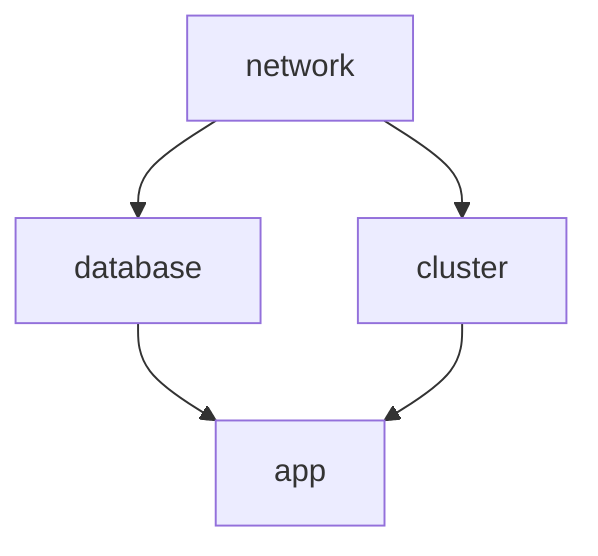

When you split your infrastructure across multiple stacks, an upstream stack often exposes outputs that downstream stacks consume through a [stack reference](/docs/iac/concepts/stacks/#stackreferences) — for example, a `network` stack whose VPC ID feeds a `database` stack, which in turn feeds a `compute` stack. A stack reference reads the *current* outputs of the upstream stack, but it does not re-run the downstream stack on its own. When the upstream stack changes, you need a way to cascade an update to the stacks that depend on it.

The supported way to do this is with Pulumi Deployments: configure the downstream stack to run automatically when the upstream stack's update succeeds. This page covers the recommended pattern, how to keep it from firing duplicate or looping deployments, and why to avoid rolling your own webhook.

## The recommended pattern

Trigger each downstream stack from the upstream stack's `update_succeeded` event, using Pulumi Deployments. There are two supported ways to wire this up:

1. [Deployment webhook destinations](#deployment-webhook-destinations) — declare one webhook per upstream → downstream edge.
2. [The Pulumi Auto Deploy package](#pulumi-auto-deploy) — declare the whole dependency graph and let it manage the webhooks for you.

These dependencies usually follow one of two patterns:

- **Layered infrastructure within an environment:** stacks in the same environment build on one another — a `network` stack feeds a `database` stack and a `cluster` stack, which in turn feed an `app` stack. Updating a lower layer cascades to the layers above it.
- **Promoting a change across environments:** the same layer flows from one environment to the next — updating `network/dev` promotes to `network/staging`, which promotes to `network/prod`.

Both patterns are directed acyclic graphs, and either approach below can express them.

Both approaches require that every stack you want to deploy automatically is configured with [deployment settings](/docs/deployments/concepts/settings/), since the trigger runs the target stack through Pulumi Deployments.

The examples on this page use the [Pulumi Service provider](/registry/packages/pulumiservice/) and Pulumi IaC to manage these webhooks declaratively, which is the recommended approach — your dependency wiring lives in code, is reviewed, and stays in sync with the rest of your infrastructure. You can also configure the same webhooks through the [Pulumi Cloud console](/docs/deployments/concepts/webhooks/) or the [REST API](/docs/reference/cloud-rest-api/webhooks/) if you prefer.

{}
Manage the webhooks and deployment settings in a **separate stack** from the infrastructure they orchestrate. The orchestration wiring and the infrastructure have different lifecycles — you don't want a change to (or a `pulumi destroy` of) your application infrastructure to also tear down the webhooks that keep your dependent stacks up to date, and vice versa.
{}

### Deployment webhook destinations

A [deployment webhook destination](/docs/deployments/concepts/webhooks/#deployment-webhooks) lets you pick one or more event types on a stack (for example, `update_succeeded`) and deliver the event to a destination — in this case, the Create Deployment API of another stack. In the example below, an update to the `network` stack triggers the `database` stack, and an update to the `database` stack triggers the `compute` stack.



{}

```typescript
import * as pulumi from "@pulumi/pulumi";
import * as pulumiservice from "@pulumi/pulumiservice";

const databaseWebhook = new pulumiservice.Webhook("databaseWebhook", {
    organizationName: "org",
    projectName: "network",
    stackName: "prod",
    format: pulumiservice.WebhookFormat.PulumiDeployments,
    payloadUrl: "database/prod",
    active: true,
    displayName: "deploy-database",
    filters: [pulumiservice.WebhookFilters.UpdateSucceeded],
});
const computeWebhook = new pulumiservice.Webhook("computeWebhook", {
    organizationName: "org",
    projectName: "database",
    stackName: "prod",
    format: pulumiservice.WebhookFormat.PulumiDeployments,
    payloadUrl: "compute/prod",
    active: true,
    displayName: "deploy-compute",
    filters: [pulumiservice.WebhookFilters.UpdateSucceeded],
});
```

{}
{}

```csharp
using System.Collections.Generic;
using System.Linq;
using Pulumi;
using PulumiService = Pulumi.PulumiService;

return await Deployment.RunAsync(() =>
{
    var databaseWebhook = new PulumiService.Webhook("databaseWebhook", new()
    {
        OrganizationName = "org",
        ProjectName = "network",
        StackName = "prod",
        Format = PulumiService.WebhookFormat.PulumiDeployments,
        PayloadUrl = "database/prod",
        Active = true,
        DisplayName = "deploy-database",
        Filters = new[]
        {
            PulumiService.WebhookFilters.UpdateSucceeded,
        },
    });

    var computeWebhook = new PulumiService.Webhook("computeWebhook", new()
    {
        OrganizationName = "org",
        ProjectName = "database",
        StackName = "prod",
        Format = PulumiService.WebhookFormat.PulumiDeployments,
        PayloadUrl = "compute/prod",
        Active = true,
        DisplayName = "deploy-compute",
        Filters = new[]
        {
            PulumiService.WebhookFilters.UpdateSucceeded,
        },
    });

});
```

{}

{}

```python
import pulumi
import pulumi_pulumiservice as pulumiservice

database_webhook = pulumiservice.Webhook("databaseWebhook",
    organization_name="org",
    project_name="network",
    stack_name="prod",
    format=pulumiservice.WebhookFormat.PULUMI_DEPLOYMENTS,
    payload_url="database/prod",
    active=True,
    display_name="deploy-database",
    filters=[pulumiservice.WebhookFilters.UPDATE_SUCCEEDED])
compute_webhook = pulumiservice.Webhook("computeWebhook",
    organization_name="org",
    project_name="database",
    stack_name="prod",
    format=pulumiservice.WebhookFormat.PULUMI_DEPLOYMENTS,
    payload_url="compute/prod",
    active=True,
    display_name="deploy-compute",
    filters=[pulumiservice.WebhookFilters.UPDATE_SUCCEEDED])
```

{}

{}

```go
package main

import (
	"github.com/pulumi/pulumi-pulumiservice/sdk/go/pulumiservice"
	"github.com/pulumi/pulumi/sdk/v3/go/pulumi"
)

func main() {
	pulumi.Run(func(ctx *pulumi.Context) error {
		_, err := pulumiservice.NewWebhook(ctx, "databaseWebhook", &pulumiservice.WebhookArgs{
			OrganizationName: pulumi.String("org"),
			ProjectName:      pulumi.String("network"),
			StackName:        pulumi.String("prod"),
			Format:           pulumiservice.WebhookFormatPulumiDeployments,
			PayloadUrl:       pulumi.String("database/prod"),
			Active:           pulumi.Bool(true),
			DisplayName:      pulumi.String("deploy-database"),
			Filters: pulumiservice.WebhookFiltersArray{
				pulumiservice.WebhookFiltersUpdateSucceeded,
			},
		})
		if err != nil {
			return err
		}
		_, err = pulumiservice.NewWebhook(ctx, "computeWebhook", &pulumiservice.WebhookArgs{
			OrganizationName: pulumi.String("org"),
			ProjectName:      pulumi.String("database"),
			StackName:        pulumi.String("prod"),
			Format:           pulumiservice.WebhookFormatPulumiDeployments,
			PayloadUrl:       pulumi.String("compute/prod"),
			Active:           pulumi.Bool(true),
			DisplayName:      pulumi.String("deploy-compute"),
			Filters: pulumiservice.WebhookFiltersArray{
				pulumiservice.WebhookFiltersUpdateSucceeded,
			},
		})
		if err != nil {
			return err
		}
		return nil
	})
}
```

{}

{}

```yaml
name: auto-deploy-demo
runtime: yaml
description: A simple auto-deploy example
resources:
  databaseWebhook:
    type: pulumiservice:Webhook
    properties:
      organizationName: org
      projectName: network
      stackName: prod
      format: pulumi_deployments
      payloadUrl: database/prod
      active: true
      displayName: deploy-database
      filters:
      - update_succeeded
  computeWebhook:
    type: pulumiservice:Webhook
    properties:
      organizationName: org
      projectName: database
      stackName: prod
      format: pulumi_deployments
      payloadUrl: compute/prod
      active: true
      displayName: deploy-compute
      filters:
      - update_succeeded
```

{}



### Pulumi Auto Deploy

The [Pulumi Auto Deploy](/registry/packages/auto-deploy) package lets you declaratively express dependencies between stacks in a Pulumi program and manages the necessary deployment webhooks for you. Because you describe the graph as a set of `downstreamRefs`, Auto Deploy keeps the wiring consistent and acyclic as your dependencies grow — you don't hand-maintain one webhook per edge.

{}
The Pulumi Auto Deploy package is currently in preview.
{}

The following example models the layered-infrastructure pattern: a `network` stack feeds a `database` stack and a `cluster` stack, both of which feed an `app` stack. Each `AutoDeployer` names a stack and lists the stacks that should update when it changes.





{}

```typescript
import * as autodeploy from "@pulumi/auto-deploy";
import * as pulumi from "@pulumi/pulumi";

// Layered infrastructure in a single environment: network -> database, cluster -> app.
// Updating a stack automatically updates every stack downstream of it via a webhook
// that triggers Pulumi Deployments.

const organization = pulumi.getOrganization();
const stack = "prod";

// The application sits at the top of the graph and has no downstream stacks.
export const app = new autodeploy.AutoDeployer("app", {
    organization,
    project: "app",
    stack,
    downstreamRefs: [],
});

// The database and the cluster each feed the application.
export const database = new autodeploy.AutoDeployer("database", {
    organization,
    project: "database",
    stack,
    downstreamRefs: [app.ref],
});

export const cluster = new autodeploy.AutoDeployer("cluster", {
    organization,
    project: "cluster",
    stack,
    downstreamRefs: [app.ref],
});

// The network underpins everything; updating it updates the database and the cluster.
export const network = new autodeploy.AutoDeployer("network", {
    organization,
    project: "network",
    stack,
    downstreamRefs: [database.ref, cluster.ref],
});
```

{}
{}

```csharp
using System.Collections.Generic;
using System.Linq;
using Pulumi;
using AutoDeploy = Pulumi.AutoDeploy;

// Layered infrastructure in a single environment: network -> database, cluster -> app.
// Updating a stack automatically updates every stack downstream of it via a webhook
// that triggers Pulumi Deployments.

return await Deployment.RunAsync(() =>
{
    var organization = "pulumi";
    var stack = "prod";

    // The application sits at the top of the graph and has no downstream stacks.
    var app = new AutoDeploy.AutoDeployer("app", new()
    {
        Organization = organization,
        Project = "app",
        Stack = stack,
        DownstreamRefs = new[] {},
    });

    // The database and the cluster each feed the application.
    var database = new AutoDeploy.AutoDeployer("database", new()
    {
        Organization = organization,
        Project = "database",
        Stack = stack,
        DownstreamRefs = new[] { app.Ref },
    });

    var cluster = new AutoDeploy.AutoDeployer("cluster", new()
    {
        Organization = organization,
        Project = "cluster",
        Stack = stack,
        DownstreamRefs = new[] { app.Ref },
    });

    // The network underpins everything; updating it updates the database and the cluster.
    var network = new AutoDeploy.AutoDeployer("network", new()
    {
        Organization = organization,
        Project = "network",
        Stack = stack,
        DownstreamRefs = new[]
        {
            database.Ref,
            cluster.Ref,
        },
    });

});
```

{}

{}

```python
import pulumi
import pulumi_auto_deploy as auto_deploy

# Layered infrastructure in a single environment: network -> database, cluster -> app.
# Updating a stack automatically updates every stack downstream of it via a webhook
# that triggers Pulumi Deployments.

organization = pulumi.get_organization()
stack = "prod"

# The application sits at the top of the graph and has no downstream stacks.
app = auto_deploy.AutoDeployer("app",
    organization=organization,
    project="app",
    stack=stack,
    downstream_refs=[])
# The database and the cluster each feed the application.
database = auto_deploy.AutoDeployer("database",
    organization=organization,
    project="database",
    stack=stack,
    downstream_refs=[app.ref])
cluster = auto_deploy.AutoDeployer("cluster",
    organization=organization,
    project="cluster",
    stack=stack,
    downstream_refs=[app.ref])
# The network underpins everything; updating it updates the database and the cluster.
network = auto_deploy.AutoDeployer("network",
    organization=organization,
    project="network",
    stack=stack,
    downstream_refs=[
        database.ref,
        cluster.ref,
    ])
```

{}

{}

```go
package main

import (
	"github.com/pulumi/pulumi-auto-deploy/sdk/go/autodeploy"
	"github.com/pulumi/pulumi/sdk/v3/go/pulumi"
)

func main() {
	// Layered infrastructure in a single environment: network -> database, cluster -> app.
	// Updating a stack automatically updates every stack downstream of it via a webhook
	// that triggers Pulumi Deployments.

	pulumi.Run(func(ctx *pulumi.Context) error {
		organization := "pulumi"
		stack := "prod"
		// The application sits at the top of the graph and has no downstream stacks.
		app, err := autodeploy.NewAutoDeployer(ctx, "app", &autodeploy.AutoDeployerArgs{
			Organization:   pulumi.String(organization),
			Project:        pulumi.String("app"),
			Stack:          pulumi.String(stack),
			DownstreamRefs: pulumi.StringArray{},
		})
		if err != nil {
			return err
		}
		// The database and the cluster each feed the application.
		database, err := autodeploy.NewAutoDeployer(ctx, "database", &autodeploy.AutoDeployerArgs{
			Organization: pulumi.String(organization),
			Project:      pulumi.String("database"),
			Stack:        pulumi.String(stack),
			DownstreamRefs: pulumi.StringArray{
				app.Ref,
			},
		})
		if err != nil {
			return err
		}
		cluster, err := autodeploy.NewAutoDeployer(ctx, "cluster", &autodeploy.AutoDeployerArgs{
			Organization: pulumi.String(organization),
			Project:      pulumi.String("cluster"),
			Stack:        pulumi.String(stack),
			DownstreamRefs: pulumi.StringArray{
				app.Ref,
			},
		})
		if err != nil {
			return err
		}
		// The network underpins everything; updating it updates the database and the cluster.
		_, err = autodeploy.NewAutoDeployer(ctx, "network", &autodeploy.AutoDeployerArgs{
			Organization: pulumi.String(organization),
			Project:      pulumi.String("network"),
			Stack:        pulumi.String(stack),
			DownstreamRefs: pulumi.StringArray{
				database.Ref,
				cluster.Ref,
			},
		})
		if err != nil {
			return err
		}
		return nil
	})
}
```

{}

{}

```yaml
name: auto-deploy-demo
runtime: yaml
description: Layered infrastructure with automatic dependent-stack updates
variables:
  stack: prod
resources:
  # The application sits at the top of the graph and has no downstream stacks.
  app:
    type: auto-deploy:AutoDeployer
    properties:
      organization: ${pulumi.organization}
      project: app
      stack: ${stack}
      downstreamRefs: []
  # The database and the cluster each feed the application.
  database:
    type: auto-deploy:AutoDeployer
    properties:
      organization: ${pulumi.organization}
      project: database
      stack: ${stack}
      downstreamRefs:
        - ${app.ref}
  cluster:
    type: auto-deploy:AutoDeployer
    properties:
      organization: ${pulumi.organization}
      project: cluster
      stack: ${stack}
      downstreamRefs:
        - ${app.ref}
  # The network underpins everything; updating it updates the database and the cluster.
  network:
    type: auto-deploy:AutoDeployer
    properties:
      organization: ${pulumi.organization}
      project: network
      stack: ${stack}
      downstreamRefs:
        - ${database.ref}
        - ${cluster.ref}
```

{}



## Choosing between the two approaches

Both approaches use the same underlying mechanism — a deployment webhook that runs the downstream stack when the upstream stack's update succeeds. Choose based on how you prefer to manage the wiring:

- **Deployment webhook destinations** give you explicit, per-edge control. They are a good fit when you have a small number of dependencies or want to manage each webhook individually.
- **The Pulumi Auto Deploy package** lets you declare the whole dependency graph in one place and manages the webhooks for you. It is a good fit when you have many stacks or a graph that changes over time, and declaring the graph in one place makes it easier to keep acyclic.

## Avoiding duplicate fires and re-trigger loops

The most common problems people hit when cascading deployments are the same stack deploying several times for a single upstream change, or two stacks re-triggering each other indefinitely. The supported pattern avoids both when you follow these rules:

- **Filter on a single terminal event.** Trigger on `update_succeeded` only. A single deployment emits several events over its lifecycle — `deployment_queued`, `deployment_started`, and finally `update_succeeded` — so subscribing to more than one event kind (or to lifecycle events instead of the terminal one) causes the downstream stack to fire multiple times per upstream change.
- **Target the downstream stack's deployment directly.** Use the built-in **Deployment** webhook destination, which calls the Create Deployment API of a specific stack. This is a directed edge with a known endpoint, unlike a generic HTTP webhook pointed at custom automation that runs `pulumi up` and can fan out to more work than you intended.
- **Keep the dependency graph acyclic.** Never let stack A trigger stack B while stack B triggers stack A, whether directly or through a longer chain. A cycle means each update triggers the next one forever. Model your stacks as a directed acyclic graph (DAG); declaring the whole graph in one place with the [Pulumi Auto Deploy package](#pulumi-auto-deploy) helps you keep this shape.

## What to avoid: the naive webhook workaround

A tempting shortcut is to attach a generic webhook to the upstream stack that points at a custom endpoint — a serverless function or a CI job — which then shells out to `pulumi up` on the downstream stack. Avoid this. In practice it tends to:

- **Fire far more often than intended,** because a generic webhook that isn't narrowly filtered receives every event kind for the stack, so one upstream change can kick off many downstream runs.
- **Re-trigger in loops,** because custom automation has no built-in awareness of the dependency graph and nothing stops a downstream update from triggering the upstream one again.
- **Duplicate deployment logic outside Pulumi,** reimplementing credentials, source configuration, and settings that [deployment settings](/docs/deployments/concepts/settings/) already manage.

Use a [deployment webhook destination](#deployment-webhook-destinations) or the [Pulumi Auto Deploy package](#pulumi-auto-deploy) instead. Both run the target stack through Pulumi Deployments with its saved settings, so the trigger stays scoped to one deployment per upstream change.

## Triggering with custom or one-off settings

A deployment webhook runs the target stack with its existing [deployment settings](/docs/deployments/concepts/settings/) and cannot override them. When you need to trigger a downstream deployment with custom or one-off settings — a different branch, environment variables, or pre-run commands — use the [REST API trigger](/docs/deployments/concepts/triggers/#rest-api) instead, which accepts settings in the request body.

## Related

- [Deployment triggers](/docs/deployments/concepts/triggers/) — every way a deployment can be initiated.
- [Deployment webhooks](/docs/deployments/concepts/webhooks/#deployment-webhooks) — the webhook and event-filtering reference.
- [Deployment settings](/docs/deployments/concepts/settings/) — required on any stack you deploy automatically.
- [Stack references](/docs/iac/concepts/stacks/#stackreferences) — how downstream stacks consume upstream outputs.
- [Pulumi Auto Deploy package](/registry/packages/auto-deploy) — declarative dependent-stack updates.
