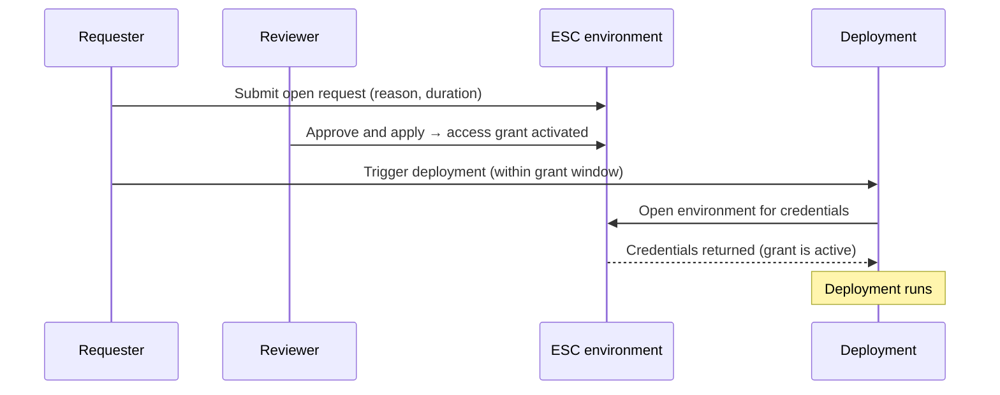

Pulumi Deployments does not currently support gated deployments: there is no built-in, deployment-level approval step that requires a reviewer to sign off before a deployment runs. This guide describes a **workaround** that achieves a similar outcome by gating the *credentials* a deployment needs rather than the deployment itself.

The workaround is to put an [Open approval](/docs/esc/concepts/approvals/#open-approvals) ruleset on the environment that supplies the deployment's cloud credentials through [Pulumi ESC](/docs/esc/). A deployment must *open* that ESC environment to obtain its credentials, and an Open approval ruleset blocks any attempt to open the environment until a reviewer has approved an access grant. With the ruleset in place, the deployment cannot obtain credentials — and therefore cannot run — until someone approves.

{}
This is a workaround, not a native approval gate, and it behaves differently from one in ways you should understand before adopting it:

- **It gates credential access, not the deployment.** The approval mechanism has no awareness that a deployment exists; the deployment simply fails when it can't get credentials.
- **An ungated run fails — it does not wait.** Without an active grant, the deployment reports an error rather than sitting in a "pending approval" state. See [Run the deployment](#run-the-deployment).
- **You approve *before* triggering**, within a time-bounded grant window — the reverse of a typical trigger-then-approve gate.
- **It fits user-initiated deployments best.** Git-push and pull-request deployments need extra setup and can't be gated as cleanly. See the note under [Request and approve access](#request-and-approve-access).

If a native deployment approval gate would serve you better, let us know in [pulumi/pulumi-cloud-requests](https://github.com/pulumi/pulumi-cloud-requests/issues).
{}

## Prerequisites

1. An ESC environment that already supplies your deployment's cloud credentials. If you haven't set this up yet, see [Supplying Cloud Credentials to Pulumi Deployments](/docs/deployments/guides/cloud-credentials/).
1. A deployment whose Pulumi access token has `OPEN` access to that environment (and to any environments it imports transitively). See [Deployment Permissions](/docs/deployments/operations/permissions/#minimum-required-token-permissions).
1. One or more reviewers who will approve access requests.

## How gating works

Because the gate lives on the credential environment rather than on the deployment, the "approval" is really an approval to open that environment. A deployment on its own would open the credential environment automatically and run without interruption. Adding an Open approval ruleset inserts a required approval before the environment can be opened:

Without an active access grant, the deployment's attempt to open the environment is denied and the deployment fails. This is what turns the ESC Open approval into a gate on the deployment.

## Add an Open approval ruleset to the credential environment

Configure the ruleset on the environment your deployment opens for credentials:

1. Navigate to the environment in the Pulumi Cloud console.
1. Open **Settings → Approval Rulesets** and select **Create Ruleset**.
1. Select **Open** for the **Action**.
1. Specify the approvers (teams, users, or permissions), the required number of approvals, and whether self-approval is allowed.
1. Enable the ruleset.

For full details on ruleset options, see [Configuring open approvals](/docs/esc/concepts/approvals/#configuring-open-approvals). Once the ruleset is enabled, any attempt to open the environment without an active access grant — including from a deployment — is denied.

## Request and approve access

Before the deployment can run, an approved access grant must be **active** on the environment for the identity the deployment will run as (see the note under [Run the deployment](#run-the-deployment)).

1. **Submit an open request** for the environment, stating why access is needed and for how long. In the Pulumi Cloud console, open the environment, select **Request Open Access**, and fill in the **Description**, **Access duration**, and **Grant expiration**.
1. **A reviewer approves the request.** Submitted requests appear in the **Approvals** tab. A reviewer selects **Review changes** and approves.
1. **Apply the request to activate the grant.** Once the required number of approvals is met, select **Apply changes**. Approval alone does not grant access — the request must be applied, which activates the access grant.

Two time-based controls bound the grant: **Grant expiration** is how long you have to activate the grant after it's approved, and **Access duration** is how long the grant stays valid after the environment is first opened. See [Understanding duration and expiration](/docs/esc/concepts/approvals/#understanding-duration-and-expiration) for details. Trigger the deployment while the grant is active.

{}
An access grant is tied to the identity that opens the environment, and a deployment opens the environment as the identity that started the run:

- **User-initiated** deployments — the console **Deploy** button, the REST API, or `pulumi deployment run` — run with the initiating user's permissions and use that user's grant. Obtain the grant as that user, then trigger the deployment within the grant window. This is the scenario open-approval gating fits best.
- **Git-push and pull-request** deployments run under an ephemeral stack token that has no way to hold a pre-approved grant, so open approvals can't gate them directly. To gate an automated deployment, configure it with a dedicated [`PULUMI_ACCESS_TOKEN`](/docs/deployments/operations/permissions/#granting-additional-permissions) principal whose access you approve ahead of each run.
{}

## Run the deployment

With an approved grant active for the identity the deployment runs as, trigger the deployment (the Pulumi Cloud console **Deploy** button, the REST API, or `pulumi deployment run`). The deployment opens the credential environment, obtains credentials, and runs.

Without an active grant, the deployment does **not** wait for approval — it fails as soon as it tries to open the environment, reporting that approval is required. Obtain the grant first, then run the deployment within its access window.

## Next steps

- [Supplying Cloud Credentials to Pulumi Deployments](/docs/deployments/guides/cloud-credentials/)
- [Deployment Permissions](/docs/deployments/operations/permissions/)
- [Approvals in Pulumi ESC](/docs/esc/concepts/approvals/)
