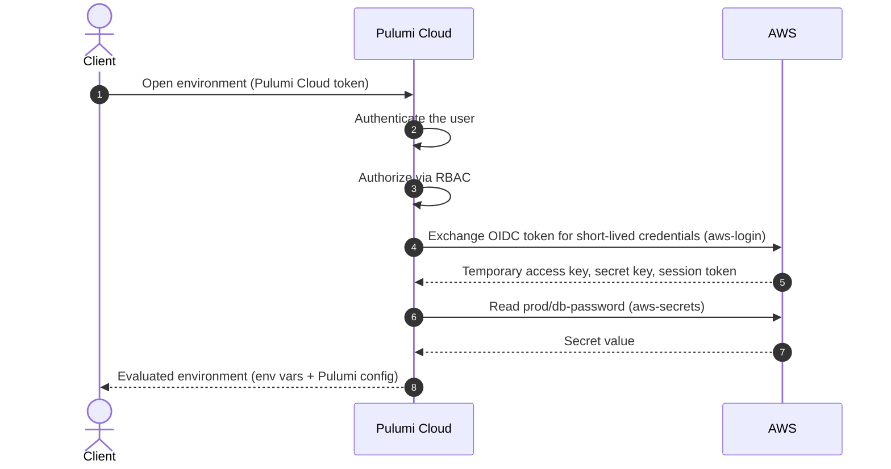

Pulumi ESC (Environments, Secrets, and Configuration) is a centralized secrets and configuration management service. You define collections of configuration values and secrets called [environments](/docs/esc/environments/), then consume them from your applications, infrastructure, and CI/CD pipelines—without copying secrets between tools or storing them in plaintext.

Pulumi ESC is available as a fully managed service in [Pulumi Cloud](/docs/pulumi-cloud/) and can be [self-hosted](/docs/support/faq/secrets-config/#can-i-self-host-pulumi-esc). The [pulumi/esc project](https://github.com/pulumi/esc) is open source and contains the evaluation engine and CLI.

## Key benefits

- **Scales [Pulumi IaC](/docs/esc/guides/integrate-with-pulumi-iac/).** ESC eliminates duplicated secrets and configuration across stacks and makes secure cloud credentials available in every context—local development, CI/CD, and automation—so the same environment can back many stacks instead of each one carrying its own copy.
- **Secure access from the command line.** [`esc run`](/docs/esc/environments/working-with-environments/#running-commands-with-environment-variables) injects an environment's configuration and secrets into any command, giving developers and pipelines short-lived, scoped access without exporting long-lived credentials into their shells.
- **Reach third-party secrets without sharing access directly.** Rather than granting every user and pipeline direct access to systems like AWS Secrets Manager or HashiCorp Vault, you grant access to Pulumi Cloud, which reads those secrets on the client's behalf. [Pulumi Cloud RBAC](/docs/esc/administration/access-control/) then governs who can read each secret from one central place.

## Core concepts

ESC is built around a small set of concepts, each covered in depth on its own page:

- [**Environments**](/docs/esc/environments/) — the fundamental unit of organization: YAML documents that hold configuration values and secrets, import other environments, and reference providers. You open an environment to produce its evaluated values.
- [**Providers and rotators**](/docs/esc/concepts/providers/) — the first-party plugins that issue short-lived logins, import secrets from external systems like AWS Secrets Manager and HashiCorp Vault, and rotate credentials on a schedule.
- [**SDKs**](/docs/esc/concepts/sdks/) — language libraries for reading and managing environments from your own code, including reading resolved values from workloads at runtime.

## How Pulumi ESC works

Environments are evaluated when they are *opened*, not when they are defined. When a client opens an environment, Pulumi Cloud authenticates the request, authorizes it against [role-based access control](/docs/esc/administration/access-control/), resolves any dynamic [providers](/docs/esc/concepts/providers/) on the client's behalf, and returns the fully evaluated result. *External services* here are the third-party systems an environment's providers reach into—cloud identity systems and secret stores such as AWS, Azure, Google Cloud, or HashiCorp Vault. Pulumi Cloud calls them on the client's behalf, so the client never needs direct credentials for them.

Consider an environment that logs into AWS through OIDC, reads one secret from AWS Secrets Manager, projects the login as environment variables, and exposes the secret as Pulumi configuration:

```yaml
values:
  aws:
    login:
      fn::open::aws-login:
        oidc:
          roleArn: arn:aws:iam::123456789012:role/esc-oidc
          sessionName: pulumi-environments-session
    secrets:
      fn::open::aws-secrets:
        region: us-west-2
        login: ${aws.login}
        get:
          dbPassword:
            secretId: prod/db-password
  environmentVariables:
    AWS_ACCESS_KEY_ID: ${aws.login.accessKeyId}
    AWS_SECRET_ACCESS_KEY: ${aws.login.secretAccessKey}
    AWS_SESSION_TOKEN: ${aws.login.sessionToken}
  pulumiConfig:
    dbPassword: ${aws.secrets.dbPassword}
```

Opening this environment drives the following sequence:



Because dynamic values are resolved at open time, the temporary AWS credentials are generated fresh on each open and are never stored in the environment definition. The client only ever holds the values returned to it—the `AWS_*` environment variables and the `dbPassword` config—and never needs standing access to AWS itself.

## Learn more

- [Environments](/docs/esc/environments/) — define, compose, version, and consume environments.
- [Providers and rotators](/docs/esc/concepts/providers/) — the plugins that produce and rotate values.
- [SDKs](/docs/esc/concepts/sdks/) — work with environments from your own code.
- [Integrations](/docs/esc/integrations/) — tools with a dedicated ESC integration component.
- [Access control](/docs/esc/administration/access-control/), [audit logs](/docs/esc/administration/audit-logs/), and [customer-managed keys](/docs/esc/administration/customer-managed-keys/) — administer and secure your environments.
- [ESC CLI](/docs/esc/cli/) — the command-line reference.
