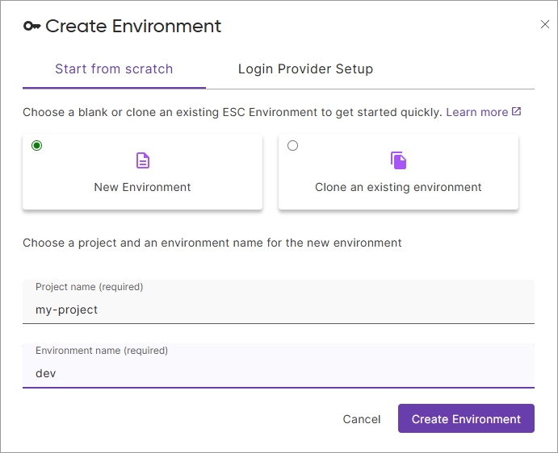
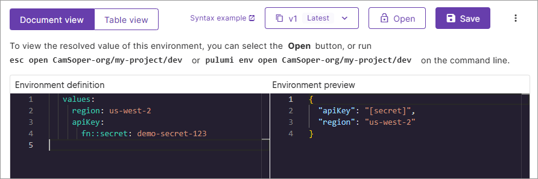

Pulumi ESC (Environments, Secrets, and Configuration) is a centralized secrets and configuration management service. In this quick start, you'll create your first environment, store a secret, and retrieve it programmatically.

## Prerequisites

1. **Create a Pulumi account** at [app.pulumi.com](https://app.pulumi.com)
1. **Install the ESC CLI**



{}

```bash
brew update && brew install pulumi/tap/esc
```

{}

{}

```bash
curl -fsSL https://get.pulumi.com/esc/install.sh | sh
```

{}

{}

<div class="mb-6 border-solid border-b-2 border-gray-200">
<div class="w-full">
<h3 class="no-anchor pt-4"><i class="fas fa-download pr-2"></i>Windows binary download</h3>
<p>
<a class="btn btn-secondary mx-2" href="https://get.pulumi.com/esc/releases/esc-v-windows-x64.zip">amd64</a>
</p>
</div>
</div>

{}

{}

See the [ESC installation docs](/docs/install/esc/) for more options.

## Create your first environment

1. **Log in** to the ESC CLI:

```bash
esc login
```

You'll be prompted to log in via your browser (which opens automatically) or with an access token.

1. **Create an environment** in the Pulumi Cloud console:

   1. Open [Pulumi Cloud](https://app.pulumi.com) and log in
   1. Select **Environments** in the left navigation
   1. Select **Create environment**
   1. Choose **New Environment**
   1. For **Project name**, enter: `my-project`
   1. For **Environment name**, enter: `dev`
   1. Select **Create Environment**



Your environment is now created and ready to store configuration and secrets.

## Store configuration and secrets

Add both plaintext configuration and encrypted secrets to your environment:

1. In the **Environment definition** editor, erase the contents and replace them with the following YAML:

   ```yaml
   values:
     region: us-west-2
     apiKey:
       fn::secret: demo-secret-123
   ```

   This defines two values: `region` (a plaintext value) and `apiKey` (a secret value, marked with `fn::secret`).



1. Select **Save**

Watch what happens: ESC automatically encrypts the secret value. The plaintext `demo-secret-123` is replaced with `[secret]` in the editor, showing that your secret is now encrypted and stored securely.

![ESC environment editor showing encrypted secret value displayed as [secret] after saving](./images/esc-env-edit-post-save.png)

## Retrieve your configuration and secrets

Open your environment to retrieve all values, including decrypted secrets:

```bash
esc env open my-project/dev
```

You should see output like:

```json
{
  "region": "us-west-2",
  "apiKey": "demo-secret-123"
}
```

That's it! You've created an environment, stored configuration and secrets, and retrieved them programmatically. Notice that the secret is automatically decrypted when you open the environment via the CLI.

## What's next?

### Use ESC in your infrastructure code

Pulumi users typically integrate ESC with their IaC workflows to centralize secrets and configuration across all stacks. If you already use Pulumi IaC, learn how to reference ESC environments in your Pulumi programs:

**[Integrate ESC with Pulumi IaC](/docs/esc/guides/integrate-with-pulumi-iac/)**

New to Pulumi IaC? Start with the [Pulumi IaC Get Started guide](/docs/get-started/) first.

### Explore other use cases

- **[Understand the concepts](/docs/esc/concepts/)** - Learn how ESC works under the hood
- **[Set up OIDC](/docs/esc/guides/setting-up-oidc/)** - Generate short-lived cloud credentials dynamically
- **[Pull secrets from external sources](/docs/esc/guides/external-secrets/)** - Integrate with AWS Secrets Manager, Azure Key Vault, and more
- **[Compose environments](/docs/esc/guides/importing-environments/)** - Share configuration across teams and projects
