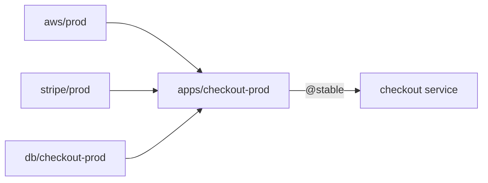
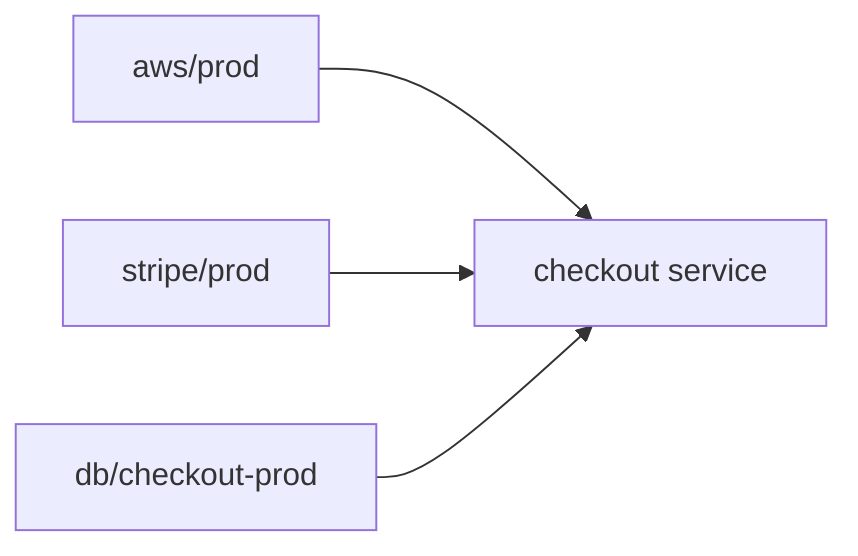

An environment is the unit of access in Pulumi ESC. Anyone who can open an environment can read every value in it, so a single environment holding your database password, your Stripe key, and your cloud credentials grants all three to every consumer that needs any one of them.

Splitting those values into smaller environments and composing them with [imports](/docs/esc/concepts/imports/) fixes that. This guide covers how granular to make an environment, two topologies for composing them, and how to split an environment that has already grown too large without breaking the consumers that depend on it.

## Size environments around ownership and blast radius

A good default is one environment per group of values that share all three of the following:

- **An owner.** The team that rotates the value and decides who may read it.
- **A lifecycle.** Values that change together belong together. A rotator runs on one schedule per environment, so credentials on different rotation schedules belong in different environments.
- **An audience.** If two values are never needed by the same consumer, keeping them together only widens exposure.

When those three disagree, split. Two database credentials owned by the same team but rotated on different schedules are two environments, not one.

Access is granted per environment through [RBAC](/docs/administration/reference/rbac-scopes/environments/), so this decomposition is what makes least-privilege possible. It also bounds your blast radius: a bad revision or a failed rotation affects only the consumers of that one environment.

The counterweight is that every environment is something to name, permission, and maintain. Splitting a value into its own environment because a *different* team owns it is worth the overhead. Splitting because the YAML felt long is not.

## Pattern 1: centralized composition

In this pattern, a platform team owns a set of small, atomic base environments and a composed environment for each consumer. The composed environment imports what that consumer needs and exposes only the values that consumer should see. Each consumer imports exactly one environment, pinned to a tag.



Start with atomic base environments, each owned and rotated independently:

```yaml
# myorg/db/checkout-prod
values:
  db:
    host: checkout.db.example.com
    port: 5432
    password:
      fn::secret: example-password
```

The composed environment imports the base environments it needs and projects the result into the shape the consumer expects. Pin each import to a [tag](/docs/esc/concepts/versioning/#tagging-versions) so a change to a base environment doesn't reach consumers until you move that tag. Use `merge: false` on an import when you want its values available for reference but not merged wholesale into the output:

```yaml
# myorg/apps/checkout-prod
imports:
  - aws/prod@stable
  - stripe/prod@stable
  - db/checkout-prod: { merge: false }

values:
  environmentVariables:
    AWS_REGION: ${aws.region}
    STRIPE_API_KEY: ${stripe.apiKey}
    DATABASE_URL: postgres://${imports["db/checkout-prod"].db.host}:${imports["db/checkout-prod"].db.port}/checkout
```

Because `db/checkout-prod` is imported with `merge: false`, its values never appear in the resolved output. They stay reachable through the [`imports` built-in property](/docs/esc/concepts/builtin-properties/#imports), which is how `DATABASE_URL` is assembled without exposing the password. The consumer receives a connection string, not the credentials behind it. This is the mechanism that keeps a composed environment from becoming another oversized one.

Note that `db/checkout-prod` is deliberately left unpinned. Pinning is what you want for configuration that should change only when you say so, but a rotated environment gets a new revision on every rotation, and pinning it to a tag would hand consumers a credential that has already been deactivated. Track the latest revision for rotated environments, and pin the rest.

The consumer then imports the composed environment, pinned to a [tag](/docs/esc/concepts/versioning/#tagging-versions):

```yaml
# Pulumi.prod.yaml
environment:
  - apps/checkout-prod@stable
```

Two things follow from this shape. The platform team controls what each consumer can see by editing the composed environment, without touching consumer configuration. And rotation stays invisible: a rotator updates `db/checkout-prod`, the composed environment picks up the new credential on its next evaluation, and the consumer keeps resolving the same `DATABASE_URL` with no change on its side. See [rotation best practices](/docs/esc/operations/rotation/best-practices/) for how to structure the rotated environments themselves, including why they should stay separate from the rest of your configuration.

## Pattern 2: direct consumption

Here consumers import the atomic base environments directly and manage their own pinning, with no composed layer between them.



```yaml
# Pulumi.prod.yaml
environment:
  - aws/prod@stable
  - db/checkout-prod@stable
```

This suits a small number of consumers whose owners you trust with the underlying values, and teams that want to adopt a new revision on their own schedule without asking anyone to move a tag. The cost is that exposure control moves to each consumer: whatever a base environment contains, its importers can read in full. Nothing sits in the path to narrow the output, so this pattern only stays least-privilege if your base environments are genuinely atomic.

It also means a change to a widely used base environment reaches consumers as soon as each one repins, with no single tag to hold the rollout behind.

## Choosing between them

|  | Centralized composition | Direct consumption |
|---|---|---|
| **Who controls exposure** | Platform team, in the composed environment | Each consumer, by what it imports |
| **Narrowing output** | Yes, via `merge: false` and interpolation | No |
| **Rollout control** | One tag move per consumer | Each consumer repins itself |
| **Coordination cost** | Higher: a new value needs a platform-team edit | Lower: consumers self-serve |
| **Scales to** | Many consumers | A handful |

Start with direct consumption while you have a few consumers and the base environments are small. Move to centralized composition once you have more consumers than you can repin by hand, or the first time you need a consumer to use a secret without being able to read it.

## Refactoring an environment without breaking consumers



The contract between an environment and its consumers is its **resolved output**, not its source YAML. As long as the output is unchanged, you can restructure the source freely. That is what makes it possible to split an oversized environment without a coordinated migration.

Suppose `myorg/apps/checkout-prod` has accumulated database credentials inline, and you want them in their own environment.

1. **Capture the current output.** Record what consumers see today, so you have something to compare against:

    ```bash
    pulumi env open myorg/apps/checkout-prod
    ```

1. **Create the new atomic environment** containing the values you're extracting, under the same key structure they currently use in the original.

1. **Import it back into the original.** Remove the inline values and import the new environment in their place. Because the import is merged, the resolved output is identical to what it was before:

    ```yaml
    # myorg/apps/checkout-prod
    imports:
      - db/checkout-prod

    values:
      environmentVariables:
        DATABASE_URL: postgres://${db.host}:${db.port}/checkout
    ```

1. **Verify the output didn't change.** Diff the new revision against the last one before the refactor:

    ```bash
    pulumi env diff myorg/apps/checkout-prod@12 myorg/apps/checkout-prod@11
    ```

    An empty value diff means consumers are unaffected. If the diff is not empty, fix the composed environment until it is — do not move the tag.

1. **Move the tag.** Once verified, point `stable` at the new revision:

    ```bash
    pulumi env version tag myorg/apps/checkout-prod@stable @12
    ```

Consumers pinned to `stable` now resolve the refactored environment and see no difference. The original environment has become a compatibility layer, which is a fine place to leave it. If you later want consumers importing the new environment directly, you can migrate them one at a time, and roll back any single consumer by repinning it.

{}
Do the restructuring and the narrowing as two separate changes. Moving values into a merged import holds the output constant, so it's safe and reversible. Switching that import to `merge: false` is what actually removes values from the output, and it's the step that can break a consumer still reading them — make it on its own, once the new structure is in place and you know who reads what.
{}

## Next steps

- [Imports](/docs/esc/concepts/imports/) - Merge semantics, implicit imports, and precedence rules
- [Versioning](/docs/esc/concepts/versioning/) - Revisions, tags, and comparing versions
- [Rotation best practices](/docs/esc/operations/rotation/best-practices/) - How to structure environments that contain rotators
- [Environment RBAC](/docs/administration/reference/rbac-scopes/environments/) - Granting access per environment
