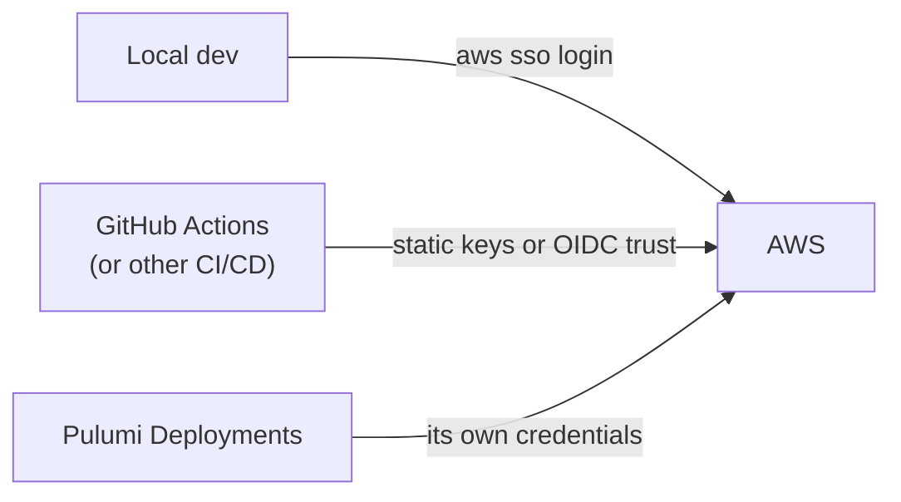
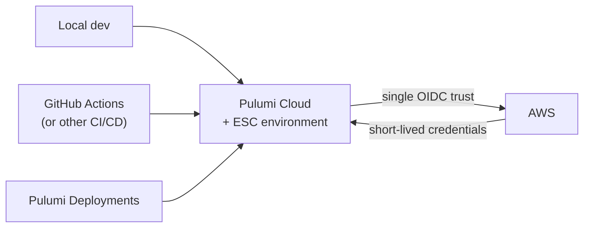

Every place Pulumi runs needs cloud credentials: an engineer's laptop, your CI/CD pipelines, and [Pulumi Deployments](/docs/deployments/). This guide describes a solution architecture for delivering those credentials consistently — short-lived, least-privilege, and centrally governed — using Pulumi ESC and OpenID Connect (OIDC).

Each component links to the how-to page that walks through the mechanics. The worked example is a small AWS stack deployed from GitHub Actions, but the architecture is cloud- and CI-agnostic.

## The problem: credentials for every consumer

Most teams arrive here having solved credential delivery one consumer at a time, with a different mechanism for each:

- **Local development** often relies on an interactive login such as `aws sso login`. That works well on a laptop, but it isn't portable: CI/CD can't run an interactive login, so it needs a different answer.
- **CI/CD** typically fills that gap with either static access keys stored as secrets — long-lived, duplicated across pipelines, and rotated by hand if at all — or direct CI-to-cloud OIDC, such as GitHub Actions assuming an AWS role via the GitHub OIDC provider. OIDC removes the static key, but the trust relationship is configured *per repository, per CI system, and per cloud account*, and every new pipeline re-implements and re-audits the same trust.

The common thread is fragmentation. Each consumer uses a different mechanism, scoped inconsistently, and governed and audited separately. Adding a cloud, a CI system, or a team multiplies the work.



## The goal

Deliver **short-lived** credentials to *every* consumer through **one** consistent path: configured once, governed centrally, and identical whether Pulumi runs on a laptop, in CI/CD, or in Pulumi Deployments.

## The architecture: ESC as the credential broker

Pulumi ESC sits between your credential consumers and your cloud. You configure a single OIDC trust relationship between Pulumi Cloud and AWS. Every consumer authenticates to Pulumi Cloud — itself over OIDC where the platform supports it — and *opens* a shared ESC environment. ESC exchanges its identity with AWS and returns short-lived credentials.



No matter how many consumers you add, you create, scope, and audit exactly **one** trust relationship to AWS. The consumers don't hold cloud credentials at all — they hold only the right to open an environment.

## Why this scales

- **One config, every environment.** The same ESC environment powers local development, CI/CD, and Pulumi Deployments identically, with no per-environment credentials to keep in sync. See [Integrate ESC with Pulumi IaC](/docs/esc/guides/integrate-with-pulumi-iac/) and [running commands with `pulumi env run`](/docs/esc/guides/running-commands/).
- **One trust relationship to maintain.** Adding a pipeline or a teammate grants access in Pulumi Cloud; it does not require touching AWS trust policies.
- **Central governance and audit.** Access to credentials is controlled by [RBAC](/docs/esc/administration/access-control/) on a single object, and every open is recorded in [audit logs](/docs/esc/administration/audit-logs/).
- **Automatic rotation, no stored secrets.** Credentials are returned on demand and expire on their own, so there is nothing long-lived to leak or rotate.
- **Least privilege.** You can scope the AWS trust policy so a given role is assumable only by a specific environment, tier, or user.

## How the pieces fit

### AWS OIDC trust

Configure AWS to trust Pulumi Cloud as an OIDC identity provider and create an IAM role for ESC to assume. This is the one trust relationship the whole architecture depends on. Follow [Configuring OpenID Connect for AWS](/docs/esc/guides/configuring-oidc/aws/) for the console steps.

To provision this with Pulumi itself rather than by hand, see the [`aws-ts-oidc-provider-pulumi-cloud`](https://github.com/pulumi/examples/tree/master/aws-ts-oidc-provider-pulumi-cloud) example, which creates the identity provider, the IAM role, and the ESC environment in code.


The example grants the role `AdministratorAccess` for simplicity. Edit the role's policy to grant only the permissions your stacks actually need — the architecture does not depend on broad access.


### The ESC environment

Create an ESC environment whose `aws.login` provider assumes the role over OIDC and projects the resulting credentials as environment variables and stack configuration:

```yaml
values:
  aws:
    login:
      fn::open::aws-login:
        oidc:
          duration: 1h
          roleArn: <your-oidc-iam-role-arn>
          sessionName: pulumi-environments-session
  pulumiConfig:
    aws:region: us-west-2
  environmentVariables:
    AWS_ACCESS_KEY_ID: ${aws.login.accessKeyId}
    AWS_SECRET_ACCESS_KEY: ${aws.login.secretAccessKey}
    AWS_SESSION_TOKEN: ${aws.login.sessionToken}
```

This is the single object every consumer opens. For the full provider reference, see [Dynamic login credentials](/docs/esc/providers/login/). Azure and GCP use the same pattern via `fn::open::azure-login` and `fn::open::gcp-login`.

### Consumers

Each consumer opens the same environment in the way that's natural for it:

- **Local development and Pulumi IaC.** Reference the environment from `Pulumi.<stack>.yaml` so `pulumi up` and friends pick up credentials automatically:

    ```yaml
    environment:
      - aws-oidc
    ```

    Run any other command against the same values with `pulumi env run`. See [Get started with ESC](/docs/esc/get-started/#add-esc-to-your-pulumi-stack).

- **GitHub Actions.** Authenticate to Pulumi Cloud over OIDC with [`pulumi/auth-actions`](/docs/esc/guides/github-actions/), then open the environment with [`pulumi/esc-action`](/docs/esc/guides/github-actions/). No cloud credentials are stored as repository secrets:

    ```yaml
    permissions:
      id-token: write
      contents: read

    steps:
      - uses: actions/checkout@v4
      - uses: pulumi/auth-actions@v1
        with:
          organization: your-org
          requested-token-type: urn:pulumi:token-type:access_token:organization
      - uses: pulumi/esc-action@v3
        with:
          environment: your-org/your-project/aws-oidc
    ```

    Trusting GitHub as an OIDC issuer in Pulumi Cloud is a one-time setup; see [Configuring OpenID Connect for GitHub](/docs/administration/access-identity/oidc-issuers/github/).

- **Pulumi Deployments.** Because the credentials live in the environment the stack already imports, Deployments need no additional credential configuration.

## Governance: controlling who can receive credentials

Two independent layers decide who can get cloud credentials, and how broad those credentials are.

**Pulumi Cloud RBAC** controls who may *open* the environment. Opening is the pivotal permission: it returns live cloud credentials. Set an organization-wide default and grant teams the role they need:

- *Environment reader* — view the definition only.
- *Environment opener* — open the environment and get credentials.
- *Environment editor* / *admin* — change the environment.

For sensitive environments, require approval before each open with [just-in-time access](/docs/esc/administration/access-control/#just-in-time-access). See [ESC access control](/docs/esc/administration/access-control/) and the broader [RBAC documentation](/docs/administration/access-identity/rbac/).

**AWS trust-policy scoping** controls what an opened credential can do. By default any environment in your organization can assume the role. Use `subjectAttributes` to bind a role to a specific environment, tier, or user:

```yaml
values:
  aws:
    login:
      fn::open::aws-login:
        oidc:
          roleArn: <your-oidc-iam-role-arn>
          sessionName: pulumi-environments-session
          subjectAttributes:
            - currentEnvironment.name
```

The resulting OIDC subject is then matched in the role's trust policy. See [Subject claim customization](/docs/esc/guides/configuring-oidc/aws/#subject-claim-customization) for the full list of attributes and trust-policy examples.

## Adopting at scale

The same architecture extends from one stack to a whole organization:

- **Define credentials once, import everywhere.** Put the `aws.login` block in a single base environment and [import](/docs/esc/concepts/imports/) it into per-team or per-stack environments. The login configuration lives in one place; each environment adds only what's specific to it.
- **Separate roles per tier.** Give development, staging, and production their own IAM roles — and ideally their own AWS accounts — each with a `subjectAttributes`-scoped trust policy so only the production environment can receive production credentials.
- **Roll out incrementally.** Migrate one consumer at a time, regardless of its starting point. Convert existing stack configuration into an environment with [`pulumi config env init`](/docs/iac/cli/commands/pulumi_config_env_init/), verify the consumer works against ESC, and only then decommission the old static keys or per-pipeline trust.

## Next steps

- [Configuring OpenID Connect for AWS](/docs/esc/guides/configuring-oidc/aws/) — set up the trust relationship.
- [Dynamic login credentials](/docs/esc/providers/login/) — the login providers for AWS, Azure, and GCP.
- [Pulumi ESC GitHub Action](/docs/esc/guides/github-actions/) — open environments from CI.
- [ESC access control](/docs/esc/administration/access-control/) — govern who can open environments.
- [Importing environments](/docs/esc/concepts/imports/) — compose configuration across many stacks.
