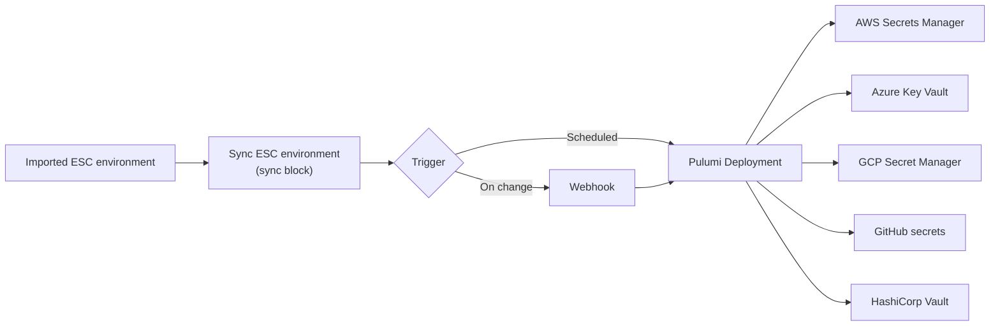

Traditional secret management leads to *secret sprawl*: the same secret is duplicated across repositories, cloud providers, and CI/CD pipelines, and every change has to be applied by hand in each place. This guide shows a pattern that uses Pulumi ESC together with [Pulumi IaC](/docs/iac/) and [Pulumi Deployments](/docs/pulumi-cloud/deployments/) to define secrets and configuration once in ESC and automatically push them out to the external platforms where they're consumed.


**This guide is for existing Pulumi IaC and ESC users.** If you're new to ESC, start with the [ESC Get Started guide](/docs/esc/get-started/). To consume an environment from a Pulumi program, see [Integrate ESC with Pulumi IaC](/docs/esc/guides/integrate-with-pulumi-iac/).


## How it works

You define the values to sync in an ESC environment, then run a Pulumi program on a schedule (or in response to a webhook) that reads those values and writes them into the target platform. ESC is the single source of truth; Pulumi IaC does the syncing.



## Prerequisites

- [Pulumi CLI](/docs/install/) installed
- [Pulumi account](https://app.pulumi.com/signup) created
- An ESC environment containing the secrets and configuration you want to distribute
- A GitHub repository connected to [Pulumi Deployments](/docs/pulumi-cloud/deployments/) for the target stack

## Define the secrets to sync

Create an ESC environment that imports the environment holding your source values and declares a `sync` block describing what to push and where. In this example, the values are synced to AWS Secrets Manager:

```yaml
imports:
  - my-project/my-imported-env@stable
values:
  sync:
    awsSecretsManager:
      value:
        myConfigKey: ${my-imported-env-foo}
        myNestedKey:
          haha: ${my-imported-env-bar}
        mySecret: ${my-imported-env-password}
      name: name-in-secrets-manager
```

The `value` field contains the data to sync, and `name` is the name of the secret to create in the target platform.

## Automate the sync

Next, define a Pulumi program that provisions the ESC environment, the target stack, and the [Pulumi Deployments](/docs/pulumi-cloud/deployments/) settings for that stack. The pre-run commands extract the values from the environment and set them as stack configuration, and a deployment schedule runs the sync on a recurring basis (hourly by default):

```typescript
import * as pulumi from "@pulumi/pulumi";
import * as service from "@pulumi/pulumiservice";

const config = new pulumi.Config();
const orgName = pulumi.getOrganization();

// projectName is the name of the project where the target stack is located
const projectName = config.require("projectName");

// stackName is the name of the target stack
const stackName = config.get("stackName") || "dev";

// repository is the GitHub repository where the target stack is located (for deployment settings)
const repository = config.require("repository");

// how often you want to sync. Default is hourly
const syncCronSchedule = config.get("syncCronSchedule") || "0 * * * *";

// envPath is the path to the environment file that contains the secrets or configuration to be synced
const envPath = config.get("envPath") || "syncEnv.yaml";

const env = new service.Environment("env", {
    organization: orgName,
    project: projectName,
    name: stackName,
    yaml: new pulumi.asset.FileAsset(envPath),
});

const stack = new service.Stack("esc-sync-aws-secretsmanager", {
    organizationName: orgName,
    projectName,
    stackName,
});

const fullyQualifiedStackName = pulumi.interpolate`${orgName}/${projectName}/${stackName}`;
const fullyQualifiedEnvName = pulumi.interpolate`${orgName}/${projectName}/${env.name}`;

const settings = new service.DeploymentSettings("deployment_settings", {
    organization: orgName,
    project: stack.projectName,
    stack: stack.stackName,
    github: {
        repository,
    },
    sourceContext: {
        git: {
            branch: "main",
            repoDir: "sync/target",
        },
    },
    operationContext: {
        preRunCommands: [
            "pulumi login",
            pulumi.interpolate`pulumi config env add ${projectName}/${env.name} -s ${fullyQualifiedStackName} --yes`,
            pulumi.interpolate`pulumi env open ${fullyQualifiedEnvName} sync.awsSecretsManager.value > sync.json`,
            pulumi.interpolate`pulumi config set -s ${fullyQualifiedStackName} secretName $(pulumi env open ${fullyQualifiedEnvName} sync.awsSecretsManager.name)`,
        ],
    },
});

const schedule = new service.DeploymentSchedule("update_schedule", {
    organization: orgName,
    project: settings.project,
    stack: settings.stack,
    scheduleCron: syncCronSchedule,
    pulumiOperation: "update",
});
```

## Create the external secret

The target stack is a separate Pulumi program that reads the synced values and writes them to the external platform. Here, it creates an AWS Secrets Manager secret from the `sync.json` file produced by the pre-run commands above:

```typescript
import * as pulumi from "@pulumi/pulumi";
import * as aws from "@pulumi/aws";
import * as fs from "fs";

const config = new pulumi.Config();
const name = config.require("secretName");

// Read a json file from the local filesystem using node.js fs module
const json = fs.readFileSync("sync.json", "utf8");

const secret = new aws.secretsmanager.Secret(name, {
    recoveryWindowInDays: 0,
});

const secretVersion = new aws.secretsmanager.SecretVersion(`${name}-version`, {
    secretId: secret.id,
    secretString: json,
});

// Export the name of the secret
export const secretName = secret.name;
```

Because the deployment runs on a schedule, the secret stays up to date in AWS Secrets Manager whenever the source values change in ESC.

## Sync on change with webhooks

Instead of a fixed schedule, you can sync in near real time by triggering a deployment whenever the imported ESC environment changes. Replace the `DeploymentSchedule` above with a [webhook](/docs/esc/concepts/webhooks/) that fires on environment changes:

```typescript
const webhook = new service.Webhook("webhook", {
    organizationName: orgName,
    projectName: settings.project,
    stackName: settings.stack,
    displayName: "Sync to AWS Secrets Manager",
    environmentName: pulumi.interpolate`${env.project}/${env.name}`,
    filters: [service.WebhookFilters.ImportedEnvironmentChanged],
    format: service.WebhookFormat.PulumiDeployments,
    payloadUrl: pulumi.interpolate`${stack.projectName}/${stack.stackName}`,
    active: true,
});
```

When the imported environment is updated, the webhook triggers a deployment that syncs the new values to the target platform.

## Sync to other platforms

The same pattern works for other targets — adjust the `sync` block and the target stack's resources accordingly. The [Pulumi ESC examples repository](https://github.com/pulumi/esc-examples/tree/main/sync) includes working examples for:

- [Azure Key Vault](https://github.com/pulumi/esc-examples/tree/main/sync/azure-key-vault)
- [GCP Secret Manager](https://github.com/pulumi/esc-examples/tree/main/sync/gcp-secrets-manager)
- [GitHub secrets](https://github.com/pulumi/esc-examples/tree/main/sync/github-secrets)
- [HashiCorp Vault](https://github.com/pulumi/esc-examples/tree/main/sync/vault)

## Next steps

- [Integrate ESC with Pulumi IaC](/docs/esc/guides/integrate-with-pulumi-iac/) — consume environments from a Pulumi program
- [Webhooks](/docs/esc/concepts/webhooks/) — respond to environment changes in real time
- [Secrets and configuration providers](/docs/esc/providers/secrets/) — dynamically import secrets from external systems
- [Pulumi Deployments](/docs/pulumi-cloud/deployments/) — run Pulumi programs on a schedule or in response to events
