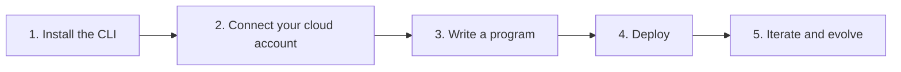

Pulumi is a modern [infrastructure as code](/what-is/what-is-infrastructure-as-code/) (IaC) platform that lets you use familiar programming languages and tools to automate, secure and manage everything you run in the cloud.

Pulumi IaC is free, [open source](https://github.com/pulumi/pulumi), and optionally pairs with [Pulumi Cloud](/docs/iac/guides/basics/pulumi-cloud-vs-oss/) to make managing infrastructure secure, reliable, and hassle-free.

## Why Pulumi

- **Use a real programming language.** Define infrastructure in TypeScript, Python, Go, C#, Java, or YAML — with loops, functions, testing, and full IDE support instead of a domain-specific language.
- **See every change before it happens.** Pulumi previews exactly what will be created, updated, or deleted before anything touches your cloud account.
- **Keep your existing credentials.** Pulumi has no credential system of its own — it uses the cloud access you already have, so there's nothing new to set up or secure.

For the full story, see [What is Pulumi?](/what-is/what-is-pulumi/).

## How getting started works

Getting started follows the same five steps on every cloud; only the provider details differ.

1. **Install the Pulumi CLI.** [Install Pulumi](/docs/install/) with your operating system's package manager or a one-line installer script. One CLI covers every cloud and every language.
1. **Connect your cloud account.** Pulumi authenticates to your cloud the same way your cloud provider's own CLI does — if that already works on your machine, you're done. See [Connect your cloud account](/docs/get-started/connect-cloud/) for how this works and how to set it up.
1. **Write a program.** Run `pulumi new` to scaffold a project from a template in your language of choice, then declare cloud resources as code.
1. **Deploy.** Run `pulumi up` to preview the planned changes and then apply them. Pulumi records what it created in a [stack](/docs/iac/concepts/stacks/), an isolated, configurable instance of your program — see [How Pulumi Works](/docs/iac/guides/basics/how-pulumi-works/) for the details.
1. **Iterate and evolve.** Change your code and run `pulumi up` again — Pulumi computes the difference and applies only what changed. When you're done experimenting, `pulumi destroy` tears everything down cleanly.

## Choose your cloud

Ready to begin? Choose a cloud provider and complete the full tutorial:

<section class="docs-home mt-4 mb-12">
    

        

            <a data-track="aws-get-started" href="/docs/iac/get-started/aws/">
                

                    

                

                

                    Get started with Pulumi &amp; AWS &rarr;
                

            </a>
            <a data-track="azure-get-started" href="/docs/iac/get-started/azure/">
                

                    

                

                

                    Get started with Pulumi &amp; Azure &rarr;
                

            </a>
            <a data-track="google-get-started" href="/docs/iac/get-started/gcp/">
                

                    

                

                

                    Get started with Pulumi &amp; Google Cloud &rarr;
                

            </a>
            <a data-track="kubernetes-get-started" href="/docs/iac/get-started/kubernetes/">
                

                    

                

                

                    Get started with Pulumi &amp; Kubernetes &rarr;
                

            </a>
        

    

</section>

Coming from Terraform? See [Pulumi for Terraform Users](/docs/iac/get-started/terraform/) to use Pulumi alongside your existing Terraform infrastructure.

## Learn more

The following sections are also useful when first learning how to use Pulumi:

    

        <h3 class="no-anchor pt-4"><a href="/docs/iac/concepts/">Concepts</a></h3>
        
Get details on the Pulumi programming model and core concepts.

    

    

        <h3 class="no-anchor pt-4"><a href="/docs/iac/guides/migration/">Migration</a></h3>
        
Learn how to support, migrate, or convert existing cloud infrastructure with Pulumi.

    

Beyond IaC, the Pulumi platform also includes [Pulumi ESC](/docs/esc/get-started/) for centralized secrets and configuration and [Pulumi Deployments](/docs/deployments/get-started/) for git-driven deployment workflows.
