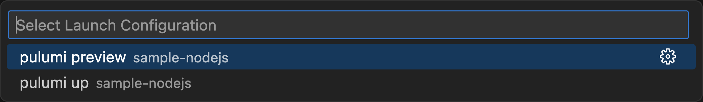
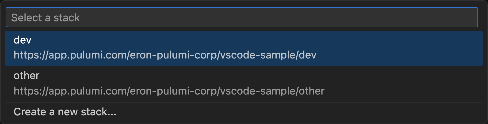
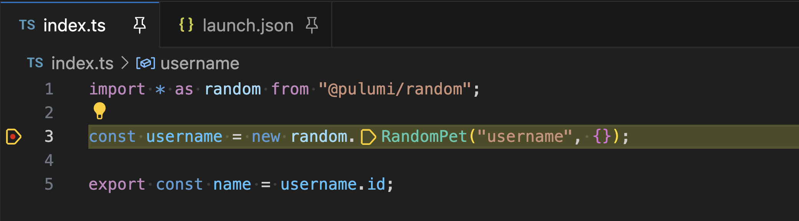
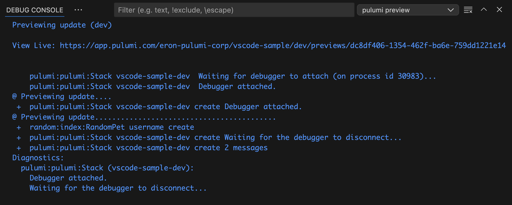

Because Pulumi uses general purpose programming languages to provision cloud resources, you can take advantage of native debugging tools to troubleshoot your infrastructure definitions.

Note that you can't directly F5-launch your Pulumi program from your IDE. Instead, you run the Pulumi CLI that will launch your program via its language runtime in a separate process, and then you attach to that process from your IDE. See [How Pulumi works](/docs/concepts/how-pulumi-works/) to learn more about Pulumi execution mode.

## Debugging with Visual Studio Code and Pulumi extension

Pulumi provides an extension that allows you to launch and debug Pulumi programs with a few simple steps.

### Install the extension

Install the [Pulumi extension](https://marketplace.visualstudio.com/items?itemName=pulumi.pulumi-vscode-copilot-tools) using Visual Studio Marketplace.

### Open a project

Open a new or existing Pulumi project as a VS Code workspace. The extension supports both [single-folder workspaces](https://code.visualstudio.com/docs/editor/workspaces#_singlefolder-workspaces)
and [multi-root workspaces](https://code.visualstudio.com/docs/editor/workspaces#_multiroot-workspaces).

### Start Debugging

Pulumi programs are run (with or without debugging) using a [launch configuration](https://code.visualstudio.com/docs/editor/debugging#_launch-configurations). Select the Run and Debug icon in the Activity Bar on the side of VS Code, then use an automatic debug configuration or create a launch configuration file for your project.

The extension automatically generates a debug configuration to run `pulumi up` or `pulumi preview` for the current Pulumi stack. To use an automatic debug configuration, do the following:

1. Open your program file in Code and set a breakpoint.
2. Select the __Run and Debug__ icon.
3. Choose __Show all automatic debug configurations__.
4. Select "Pulumi..." then "pulumi preview" or "pulumi up".  Debugging will start automatically.

    

    

5. Select or create a stack if prompted to do so.

    

### Debug your Program

Set breakpoints in your program code and enjoy the full functionality of the VS Code debugger.
See [VS Code Debugging](https://code.visualstudio.com/docs/editor/debugging) for more information.

### Pulumi CLI Output

Access the CLI output via the Debug Console view.

## Debugging with other IDEs

You can use any other IDE or editor that supports attaching to running programs using the [Debug Adapter Protocol](https://microsoft.github.io/debug-adapter-protocol/). The tools differ depending on your preference and the language you are using, but the process is similar:

1. Start with an existing Pulumi project that contains `Pulumi.yaml` and your program.
2. Open your IDE and set a breakpoint in your program.
3. Run `pulumi up --attach-debugger` from a command line.
4. Wait until `pulumi` is paused waiting for a debugger to attach.
5. Attach the debugger to a running process of your language runtime.
6. Step through the program to find the problem.
7. Run the program to completion and let `pulumi` shut down all the processes.
8. Change your program and repeat the process if needed.

Note that `pulumi up` runs your program twice: once for preview, and once for update, and both will trigger the debugger. Use `pulumi preview --attach-debugger` or `pulumi up --skip-preview --attach-debugger` to pick one of the two modes.
