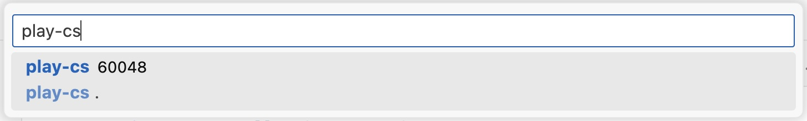

Because Pulumi uses general purpose programming languages to provision cloud resources, you can take advantage of native debugging tools to troubleshoot your infrastructure definitions.

Note that you can't directly F5-launch your Pulumi program from your IDE. Instead, you run the Pulumi CLI that will launch your program via its language runtime in a separate process, and then you attach to that process from your IDE. See [How Pulumi works](/docs/concepts/how-pulumi-works/) to learn more about Pulumi execution mode.

The tools differ depending on the language you are using, but the process stays similar:

1. Start with an existing Pulumi project that contains `Pulumi.yaml` and your program.
2. For some languages, you'll have to temporarily modify your program to pause until a debugger is attached.
3. Open your IDE and set a breakpoint in your program.
4. Run `pulumi up` from a command line. Note that `pulumi up` runs your program twice: once for preview, and once for update, and both will trigger the debugger. Use `pulumi preview` or `pulumi up --skip-preview` to pick one of the two modes.
5. Wait until `pulumi` is paused waiting for a debugger to attach.
6. Attach the debugger to a running process of your language runtime.
7. Step through the program to find the problem.
8. Run the program to completion and let `pulumi` shut down all the processes.
9. Change your program and repeat the process if needed.

Subsequent sections outline the specifics for each language runtime.

## Debugging Node.js programs

Run the Pulumi CLI by passing the [`--inspect-brk`](https://nodejs.org/en/learn/getting-started/debugging#command-line-options) option to node:

```bash
NODE_OPTIONS='--inspect-brk' pulumi up
```

The stack execution will pause until a debugger is attached:

```plain
Previewing update (dev)

     Type                      Name           Plan       Info
 +   pulumi:pulumi:Stack       aws-ts-dev     create     For help, see: https://nodejs.org/en/docs/inspector
```

Open your Pulumi program in your IDE and set a breakpoint at the line where you want the debugger to stop.

Then, attach your debugger to the process with the `node` runtime. For example, in [VS Code](https://code.visualstudio.com/docs/editor/debugging), you can define the following `.vscode/launch.json` file:

```json
{
    "version": "0.2.0",
    "configurations": [
        {
            "name": "Node.js: Attach",
            "type": "node",
            "request": "attach",
            "continueOnAttach": true,
            "skipFiles": [
                "${workspaceFolder}/node_modules/**/*.js",
                "${workspaceFolder}/lib/**/*.js",
                "<node_internals>/**/*.js"
            ]
        }
    ]
}
```

Alternatively, you can use the [Auto Attach](https://code.visualstudio.com/docs/nodejs/nodejs-debugging#_auto-attach) or [JavaScript Debug Terminal](https://code.visualstudio.com/docs/nodejs/nodejs-debugging#_javascript-debug-terminal) to attach automatically without any launch configurations.

Navigate to the `Run and Debug` menu on the left pane, and then click the Start Debugging (F5) button with the `Node.js: Attach` configuration.

Depending on your setup, you may need to attach multiple times until the right `node` process is found. For example, you may be running Node.js policy packs that will hit the debugger as well.

Now you can step through the program and inspect variables. Once completed, resume the execution and let the Pulumi CLI complete.

## Debugging Python programs

This guide uses [`debugpy`](https://github.com/microsoft/debugpy) to debug Pulumi programs.

You need to install the `debugpy` package to your Pulumi program by adding it to `requirements.txt`:

```txt
pulumi>=3.0.0,<4.0.0
debugpy>=1.0.0
```

At the beginning of your Pulumi program, add the following code to wait for a debugger to attach:

```py
import debugpy

debugpy.listen(("localhost", 5678))
debugpy.wait_for_client()

# ... Your normal Pulumi code follows here
```

Run the `pulumi up` command:

```bash
$ pulumi up
Previewing update (dev)

 Type                 Name  Plan   Info
 pulumi:pulumi:Stack  dev          0.00s - Note: Debugging will proceed.
```

Open your Pulumi program in your IDE and set a breakpoint at the line where you want the debugger to stop.

Navigate to your IDE and attach the debugger to the process with the `python` runtime. For example, in [VS Code](https://code.visualstudio.com/docs/editor/debugging), you can define the following `.vscode/launch.json` file:

```json
{
    "version": "0.2.0",
    "configurations": [
        {
            "name": "Python: Local Attach",
            "type": "debugpy",
            "request": "attach",
            "connect": {
                "host": "localhost",
                "port": 5678
            },
            "pathMappings": [
                {
                    "localRoot": "${workspaceFolder}",
                    "remoteRoot": "."
                }
            ],
            "justMyCode": true
        }
    ]
}
```

Navigate to the `Run and Debug` menu on the left pane, and then click the Start Debugging (F5) button with the `Python: Local Attach` configuration.

Now you can step through the program and inspect variables. Once completed, resume the execution and let the Pulumi CLI complete.

## Debugging .NET programs

Prepend your Pulumi program with the code to wait for a debugger to attach:

```cs
using System.Diagnostics;

return await Pulumi.Deployment.RunAsync(async () => // make sure you have the async keyword here
{
    while (!Debugger.IsAttached)
    {
        // keep waiting until the debugger is attached
        await System.Threading.Tasks.Task.Delay(1000);
    }

    // ... Your normal Pulumi code follows here
});
```

Run the `pulumi up` command:

```bash
$ pulumi up
Previewing update (dev)

 Type                 Name          Plan   Info
 pulumi:pulumi:Stack  play-cs-dev          'dotnet build -nologo .' completed successfully
```

Open your Pulumi program in your IDE and set a breakpoint at the line where you want the debugger to stop.

Navigate to your IDE and attach the debugger to the process with the name of your .NET project. For example, in [VS Code](https://code.visualstudio.com/docs/editor/debugging), you can define the following `.vscode/launch.json` file:

```json
{
    "version": "0.2.0",
    "configurations": [
        {
            "name": ".NET Core Attach",
            "type": "coreclr",
            "request": "attach"
        }
    ]
}
```

Navigate to the `Run and Debug` menu on the left pane, and then click the Start Debugging (F5) button with the `.NET Core Attach` configuration. Search for the process by your project name and attach:



Now you can step through the program and inspect variables. Once completed, resume the execution and let the Pulumi CLI complete.

## Debugging Go programs

To debug your Pulumi program, you need to override the way Pulumi compiles and runs the application:

- To enable debug compilation flags
- To run the binary under the [`Delve`](https://github.com/go-delve/delve) debugger

First, create a shell script that accomplishes those two tasks. For example, in macOS/Linux it can be a `debug.sh` script in your Pulumi application folder:

```bash
#!/bin/bash
go build -o goapp -gcflags "all=-N -l" .
exec dlv --listen=:2345 --headless=true --api-version=2 exec ./goapp
```

Be sure to allow to execute this script:

```bash
chmod +x debug.sh
```

Now, change your `Pulumi.yaml` file to invoke the debug script during program compilation:

```yaml
runtime:
  name: go
  options:
    binary: ./debug.sh
```

Run the `pulumi up` command:

```bash
$ pulumi up
Previewing update (dev)

 Type                 Name      Plan       Info
 pulumi:pulumi:Stack  dev       create...  warning layer=rpc Listening for remote connections
```

Open your Pulumi program in your IDE and set a breakpoint at the line where you want the debugger to stop.

Navigate to your IDE and connect the debugger to the same port as specified in the script (2345 in our case).

For example, in [VS Code](https://code.visualstudio.com/docs/editor/debugging), you can define the following `.vscode/launch.json` file:

```json
{
    "version": "0.2.0",
    "configurations": [
        {
            "name": "Connect to server",
            "type": "go",
            "request": "attach",
            "mode": "remote",
            "remotePath": "${workspaceFolder}",
            "port": 2345,
            "host": "127.0.0.1"
        }
    ]
}
```

Navigate to the `Run and Debug` menu on the left pane, and then click the Start Debugging (F5) button with the `Connect to server` configuration.

Now you can step through the program and inspect variables. Once completed, resume the execution and let the Pulumi CLI complete.

## Debugging Java programs

This approach assumes your project uses Maven and you have Maven shell scripts on your path.

Configure the runtime options in `Pulumi.yaml` to use `mvnDebug`:

```yaml
runtime:
  name: java
  options:
    use-executor: "mvnDebug"
```

Open your Pulumi program in your IDE and set a breakpoint at the line where you want the debugger to stop.

Navigate to your IDE and attach to the port 8000. For example, in [VS Code](https://code.visualstudio.com/docs/editor/debugging), you can define the following `.vscode/launch.json` file:

```json
{
    "version": "0.2.0",
    "configurations": [
        {
            "type": "java",
            "name": "Debug (Attach)",
            "projectName": "App",
            "request": "attach",
            "hostName": "localhost",
            "port": 8000
        }
    ]
}
```

Navigate to the `Run and Debug` menu on the left pane, and then click the Start Debugging (F5) button with the `Debug (Attach)` configuration.

Now you can step through the program and inspect variables. Once completed, resume the execution and let the Pulumi CLI complete.

## Debugging YAML programs

It's not possible to debug a YAML program with a step-by-step debugger because YAML is a configuration file, not an executable program.
