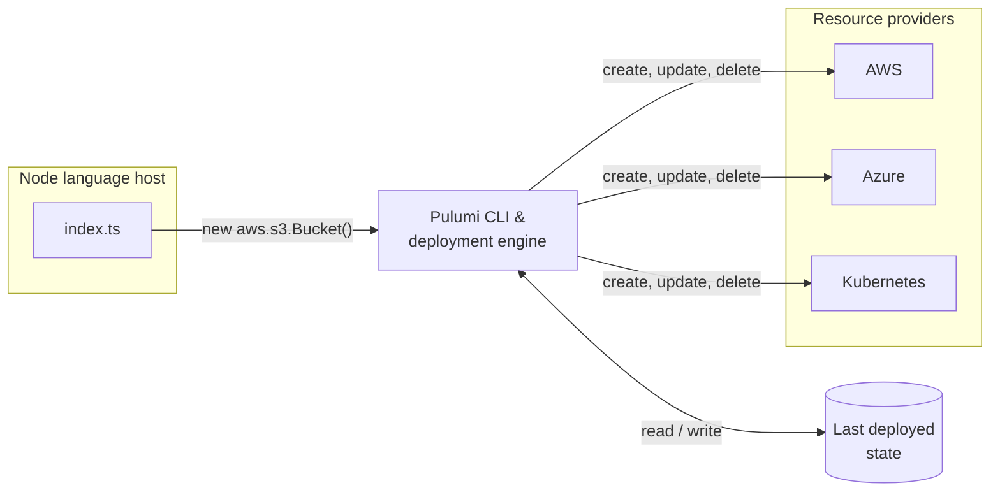
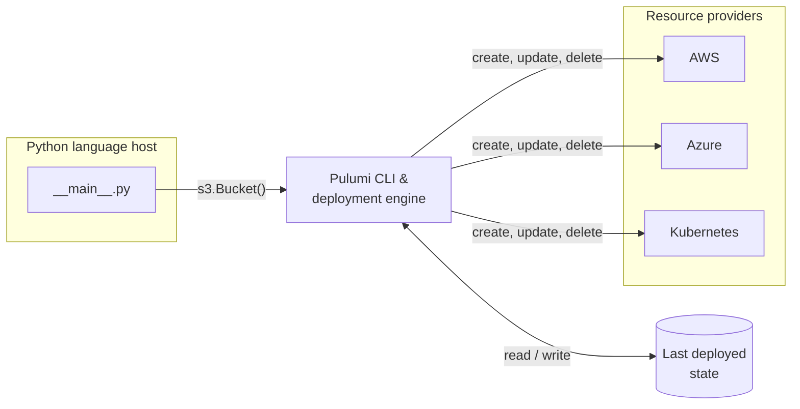
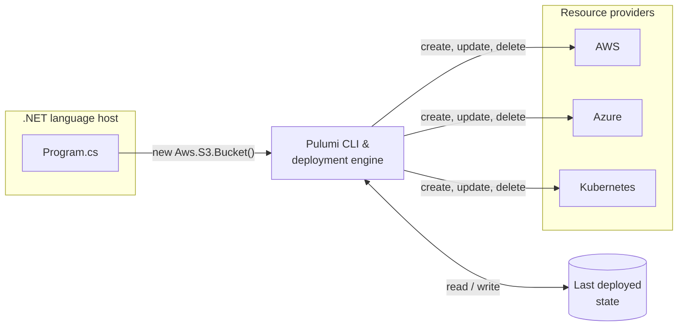
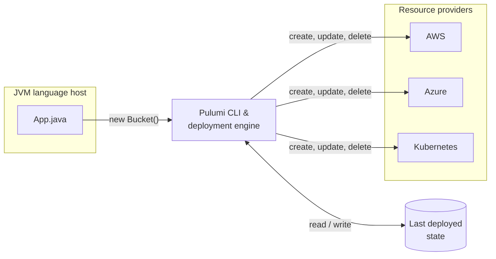
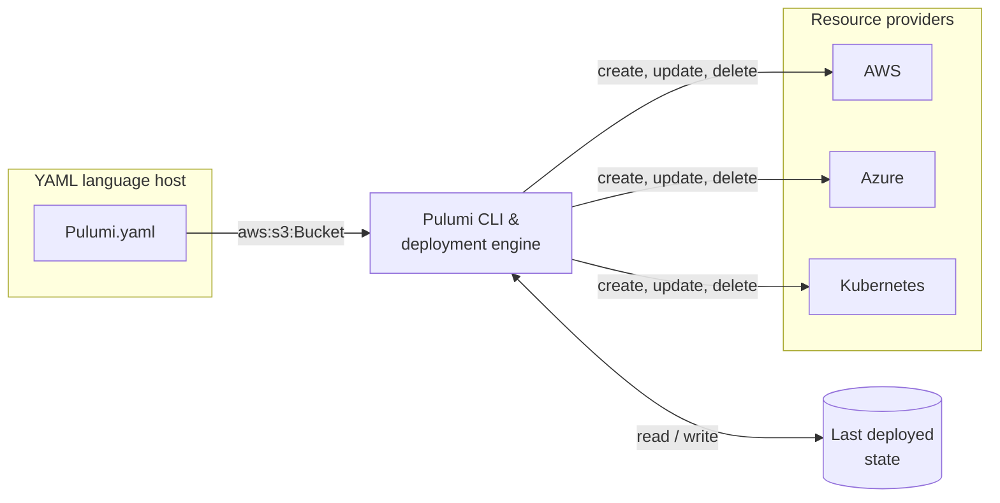

This page describes how Pulumi Infrastructure as Code (IaC) turns a program into deployed cloud resources.

## Running a Pulumi program

Let's walk through a simple example. Suppose we have the following Pulumi program, which creates two S3 buckets:



{}

```typescript
import * as aws from "@pulumi/aws";

const mediaBucket = new aws.s3.Bucket("media-bucket");
const contentBucket = new aws.s3.Bucket("content-bucket");
```

{}
{}

```python
from pulumi_aws import s3

media_bucket = s3.Bucket('media-bucket')
content_bucket = s3.Bucket('content-bucket')
```

{}
{}

```go
package main

import (
	"github.com/pulumi/pulumi-aws/sdk/v7/go/aws/s3"
	"github.com/pulumi/pulumi/sdk/v3/go/pulumi"
)

func main() {
	pulumi.Run(func(ctx *pulumi.Context) error {
		mediaBucket, err := s3.NewBucket(ctx, "media-bucket", nil)
		if err != nil {
			return err
		}
		contentBucket, err := s3.NewBucket(ctx, "content-bucket", nil)
		if err != nil {
			return err
		}
		ctx.Export("contentBucket", contentBucket.ID())
		ctx.Export("mediaBucket", mediaBucket.ID())
		return nil
	})
}
```

{}
{}

```csharp
using Pulumi;
using Aws = Pulumi.Aws;

return await Deployment.RunAsync(() =>
{
    var mediaBucket = new Aws.S3.Bucket("media-bucket");
    var contentBucket = new Aws.S3.Bucket("content-bucket");
});
```

{}
{}

```java
package myproject;

import com.pulumi.Pulumi;
import com.pulumi.aws.s3.Bucket;

public class App {
    public static void main(String[] args) {
        Pulumi.run(ctx -> {
            var mediaBucket = new Bucket("media-bucket");
            var contentBucket = new Bucket("content-bucket");
        });
    }
}
```

{}
{}

```yaml
name: my-yaml-project
runtime: yaml
resources:
    mediaBucket:
        type: aws:s3:Bucket
    contentBucket:
        type: aws:s3:Bucket
```

{}



Now, we run `pulumi stack init mystack`. Since `mystack` is a new [stack](/docs/iac/concepts/stacks/), the "last deployed state" has no resources.

Next, we run `pulumi up`. Since this program is written in {}, the Pulumi CLI launches the {} language host and requests that it execute the program. When the first {} object is constructed, the language host sends a _resource registration_ request to the deployment engine and then continues executing the program. This is subtle, but important: _When the call to_ {} _returns, it does not mean that the actual S3 bucket has been created in AWS_, it just means the language host has expressed that this bucket is part of the desired state of your infrastructure.  The language host continues to execute your program concurrently with the engine processing this request.

In this case, since the last deployed state has no resources, the engine determines that it needs to create the `media-bucket` resource. It uses the AWS resource plugin in order to create the resource and the AWS resource plugin uses the AWS SDK in order to go create it.  Note that the engine does not talk directly to AWS, instead it just asks the AWS Resource Plugin to create a Bucket. As new resource types are added, you can update the version of a resource provider to gain access to these new resources without having to update the CLI itself. When the operation to create this bucket is complete, the engine records information about the newly created resource in its state file.

As the engine was creating the `media-bucket` bucket, the language host continued to execute the Pulumi program. This caused another resource registration to be generated (for `content-bucket`). Since there is no dependency between these two buckets, the engine is able to process that request in parallel with the creation of `media-bucket`.

After both operations have completed, the language host exits as the program has finished running. Then the engine and resource providers shut down. The `pulumi up` output reports the resources that were created:

```
Updating (mystack)

     Type                      Name                Status
 +   pulumi:pulumi:Stack       my-project-mystack  created (6s)
 +   ├─ aws:s3/bucket:Bucket   media-bucket        created (2s)
 +   └─ aws:s3/bucket:Bucket   content-bucket      created (2s)

Resources:
    + 3 created

Duration: 7s
```

The names shown above—`media-bucket` and `content-bucket`—are the _logical names_ you gave the resources in your program. By default, Pulumi appends a random suffix to each resource's _physical name_ in AWS (for example, `media-bucket-653a4f2`). This is due to a process called [auto-naming](/docs/iac/concepts/resources/names/#autonaming), which Pulumi uses by default in order to allow you to deploy multiple copies of your infrastructure without creating name collisions for resources. This behavior can be disabled if desired.

Now, let's make a change to one of resources and run `pulumi up` again.  Since Pulumi operates on a desired state model, it will use the last deployed state to compute the minimal set of changes needed to update your deployed infrastructure. For example, imagine that we wanted to add tags to the S3 `media-bucket`.  We change our program to express this new desired state:



{}

```typescript
import * as aws from "@pulumi/aws";

const mediaBucket = new aws.s3.Bucket("media-bucket", {
    tags: {"owner": "media-team"},
});
const contentBucket = new aws.s3.Bucket("content-bucket");
```

{}
{}

```python
from pulumi_aws import s3

media_bucket = s3.Bucket('media-bucket', tags={'owner': 'media-team'})
content_bucket = s3.Bucket('content-bucket')
```

{}
{}

```go
package main

import (
	"github.com/pulumi/pulumi-aws/sdk/v7/go/aws/s3"
	"github.com/pulumi/pulumi/sdk/v3/go/pulumi"
)

func main() {
	pulumi.Run(func(ctx *pulumi.Context) error {
		mediaBucket, err := s3.NewBucket(ctx, "mediaBucket", &s3.BucketArgs{
			Tags: pulumi.StringMap{
				"owner": pulumi.String("media-team"),
			},
		})
		if err != nil {
			return err
		}
		contentBucket, err := s3.NewBucket(ctx, "contentBucket", nil)
		if err != nil {
			return err
		}
		ctx.Export("contentBucket", contentBucket.ID())
		ctx.Export("mediaBucket", mediaBucket.ID())
		return nil
	})
}
```

{}
{}

```csharp
using Pulumi;
using Aws = Pulumi.Aws;

return await Deployment.RunAsync(() =>
{
    var mediaBucket = new Aws.S3.Bucket("media-bucket", new()
    {
        Tags =
        {
            { "owner", "media-team" },
        },
    });
    var contentBucket = new Aws.S3.Bucket("content-bucket");
});
```

{}
{}

```java
package myproject;

import java.util.Map;
import com.pulumi.Pulumi;
import com.pulumi.aws.s3.Bucket;
import com.pulumi.aws.s3.BucketArgs;

public class App {
    public static void main(String[] args) {
        Pulumi.run(ctx -> {
            var mediaBucket = new Bucket("mediaBucket", BucketArgs.builder()
                .tags(Map.of("owner", "media-team"))
                .build());
            var contentBucket = new Bucket("content-bucket");
        });
    }
}
```

{}
{}

```yaml
name: my-yaml-project
runtime: yaml
resources:
  mediaBucket:
    type: aws:s3:Bucket
    properties:
      tags:
        owner: media-team
  contentBucket:
    type: aws:s3:Bucket
```

{}



When you run `pulumi preview` or `pulumi up`, the entire process starts over.  The language host starts running your program and the call to aws.s3.Bucket causes a new resource registration request to be sent to the engine. This time, however, our state already contains a resource named `media-bucket`, so engine asks the resource provider to compare the existing state from our previous run of `pulumi up` with the desired state expressed by the program. The process detects that the `tags` property has changed from empty to a map assigning the `owner` tag. By again consulting the resource provider the engine determines that it is able to update this property without creating a new bucket, and so it tells the provider to update the `tags` property to set the `owner` tag. When this operation completes, the current state is updated to reflect the change that had been made.

The engine also receives a resource registration request for "content-bucket".  However, since there are no changes between the current state and the desired state, the engine does not need to make any changes to the resource.

Now, suppose we rename `content-bucket` to `app-bucket`.



{}

```typescript
import * as aws from "@pulumi/aws";

const mediaBucket = new aws.s3.Bucket("media-bucket", {
    tags: {"owner": "media-team"},
});
const appBucket = new aws.s3.Bucket("app-bucket");
```

{}
{}

```python
from pulumi_aws import s3

media_bucket = s3.Bucket('media-bucket', tags={'owner': 'media-team'})
app_bucket = s3.Bucket('app-bucket')
```

{}
{}

```go
package main

import (
	"github.com/pulumi/pulumi-aws/sdk/v7/go/aws/s3"
	"github.com/pulumi/pulumi/sdk/v3/go/pulumi"
)

func main() {
	pulumi.Run(func(ctx *pulumi.Context) error {
		mediaBucket, err := s3.NewBucket(ctx, "mediaBucket", &s3.BucketArgs{
			Tags: pulumi.StringMap{
				"owner": pulumi.String("media-team"),
			},
		})
		if err != nil {
			return err
		}
		appBucket, err := s3.NewBucket(ctx, "appBucket", nil)
		if err != nil {
			return err
		}
		ctx.Export("appBucket", appBucket.ID())
		ctx.Export("mediaBucket", mediaBucket.ID())
		return nil
	})
}
```

{}
{}

```csharp
using Pulumi;
using Aws = Pulumi.Aws;

return await Deployment.RunAsync(() =>
{
    var mediaBucket = new Aws.S3.Bucket("media-bucket", new()
    {
        Tags =
        {
            { "owner", "media-team" },
        },
    });
    var appBucket = new Aws.S3.Bucket("app-bucket");
});
```

{}
{}

```java
package myproject;

import java.util.Map;
import com.pulumi.Pulumi;
import com.pulumi.aws.s3.Bucket;
import com.pulumi.aws.s3.BucketArgs;

public class App {
    public static void main(String[] args) {
        Pulumi.run(ctx -> {
            var mediaBucket = new Bucket("mediaBucket", BucketArgs.builder()
                .tags(Map.of("owner", "media-team"))
                .build());
            var appBucket = new Bucket("appBucket");
        });
    }
}
```

{}
{}

```yaml
name: my-yaml-project
runtime: yaml
resources:
  mediaBucket:
    type: aws:s3:Bucket
    properties:
      tags:
        owner: media-team
  appBucket:
    type: aws:s3:Bucket
```

{}



This time, the engine will not need to make any changes to `media-bucket` since its desired state matches its actual state. However, when the resource request for `app-bucket` is processed, the engine sees there's no existing resource named `app-bucket` in the current state so it must create a new S3 bucket. Once that process is complete and the language host has shut down, the engine looks for any resources in the current state which it did not see a resource registration for. In this case, since we removed the registration of `content-bucket` from our program, the engine calls the resource provider to delete the existing `content-bucket` bucket.

## Resource operations

When you run `pulumi up` or `pulumi preview`, Pulumi displays the operations it will perform on each resource. Understanding these operations helps you interpret what changes will occur.

### Operation types

Pulumi uses these operation types to indicate the changes it will make:

| Operation | Symbol | Description |
|-----------|--------|-------------|
| same | (none) | No changes detected. The resource's current state matches the desired state. |
| create | `+` | A new resource will be created. |
| update | `~` | An existing resource will be modified in place. |
| delete | `-` | An existing resource will be removed. |
| replace | `+-` | The resource must be replaced. Pulumi will create a new resource, then delete the old one. |
| create-replacement | `++` | A new resource is being created as part of a replacement operation. |
| delete-replaced | `--` | An old resource is being deleted after its replacement was created. |

### Additional operations

These operations appear in specific scenarios:

| Operation | Description |
|-----------|-------------|
| read | An existing resource is being imported or read into Pulumi's state. |
| read-replacement | Reading an existing resource as part of a replacement. |
| refresh | The resource's state is being synchronized with the actual cloud provider state. |
| import | A resource is being imported into Pulumi management. |
| import-replacement | An imported resource is replacing an existing resource. |

The `refresh` operation only occurs when you explicitly run `pulumi refresh` or pass the `--refresh` flag to `pulumi up` or `pulumi preview`. Pulumi does not refresh state automatically before every operation. To learn more about when and why to refresh, see [Refreshing state](/docs/iac/concepts/state-and-backends/#refreshing-state).

### Understanding replacements

When a resource property changes in a way that cannot be updated in place, Pulumi performs a _replacement_. This involves:

1. Creating the new resource with the updated configuration (create-replacement)
1. Deleting the old resource after the new one is ready (delete-replaced)

By default, Pulumi creates the replacement before deleting the original to minimize downtime. You can change this behavior with the [deleteBeforeReplace](/docs/iac/concepts/resources/options/deletebeforereplace/) option.

## Creation and deletion order

Pulumi executes resource operations in parallel whenever possible, but understands that some resources may have dependencies on other resources. If an [output](/docs/iac/concepts/inputs-outputs/) of one resource is provided as an input to another, the engine records the dependency between these two resources as part of the state and uses these when scheduling operations. This list can also be augmented by using the [dependsOn](/docs/iac/concepts/resources/options/dependson/) resource option.

By default, if a resource must be replaced, Pulumi will attempt to create a new copy of the resource before destroying the old one. This is helpful because it allows updates to infrastructure to happen without downtime. This behavior can be controlled by the [deleteBeforeReplace](/docs/iac/concepts/resources/options/deletebeforereplace/) option. If you have disabled [auto-naming](/docs/iac/concepts/resources/names/#autonaming) using configuration or by providing a specific name for a resource, it will be treated as if it was marked as `deleteBeforeReplace` automatically (otherwise the create operation for the new version would fail since the name is in use).

## Architecture

Three main components work together when you run `pulumi up`: a _language host_, a _deployment engine_, and [resource providers](/docs/iac/concepts/providers/). The following diagram illustrates how they interact. Because each language has its own language host and program entrypoint, select your language to see the corresponding diagram:



{}



{}
{}



{}
{}


{}
{}



{}
{}



{}
{}



{}



### Language hosts

The _language host_ is responsible for running a Pulumi program and setting up an environment where it can register resources with the _deployment engine_. Language hosts are implemented via [plugins](/docs/iac/concepts/plugins/) (specifically, language plugins). The language host consists of two different pieces:

1. A language executor, which is a binary named `pulumi-language-<language-name>`, that Pulumi uses to launch the runtime for the language your program is written in (e.g. Node or Python). This binary is distributed with the Pulumi CLI.
2. A language SDK is responsible for preparing your program to be executed and observing its execution in order to detect resource registrations. When a resource is _registered_—by constructing a resource object in your program—the language SDK communicates the registration request back to the _deployment engine_. The language SDK is distributed as a regular package, just like any other code that might depend on your program. For example, the TypeScript and JavaScript SDK is contained in the [`@pulumi/pulumi`](https://www.npmjs.com/package/@pulumi/pulumi) package available on npm, and the Python SDK is contained in the [`pulumi`](https://pypi.org/project/pulumi/) package available on PyPI.

### Deployment engine

The _deployment engine_ is responsible for computing the set of operations needed to drive the current state of your infrastructure into the desired state expressed by your program. When a _resource registration_ is received from the language host, the engine consults the existing [state](/docs/iac/concepts/state-and-backends/) to determine if that resource has been created before. If it has not, the engine uses a _resource provider_ to create it. If it already exists, the engine works with the resource provider to determine what, if anything, has changed by comparing the old state of the resource with the new desired state of the resource as expressed by the program. If there are changes, the engine determines if it can _update_ the resource in place or if it must _replace_ it by _creating_ a new version and _deleting_ the old version. The decision depends on what properties of the resource are changing and the type of the resource itself. When the language host communicates to the engine that it has completed the execution of the Pulumi program, the engine looks for any existing resources that it did not see a new resource registration and schedules these resources for deletion.

The deployment engine is embedded in the `pulumi` CLI itself.

### Resource providers

A resource provider is made up of two different pieces:

1. A _resource plugin_ is the binary used by the deployment engine to manage a resource. These plugins are stored in the _plugin cache_ (located in `~/.pulumi/plugins`) and can be managed using the [`pulumi plugin`](/docs/iac/cli/commands/pulumi_plugin) set of commands.
2. An _SDK_ which provides bindings for each type of resource the provider can manage.

Like the language runtime itself, the SDKs are available as regular packages. For example, there is a [`@pulumi/aws`](https://www.npmjs.com/package/@pulumi/aws) package for Node available on npm and a [`pulumi_aws`](https://pypi.org/project/pulumi-aws) package for Python available on PyPI.  When these packages are added to your project, they run [`pulumi plugin install`](/docs/iac/cli/commands/pulumi_plugin_install) behind the scenes to download the resource plugin from Pulumi.com.

### Pulumi Cloud architecture

The components described above—the language host, deployment engine, and resource providers—all run on the client, wherever the Pulumi CLI runs. When you use the default [Pulumi Cloud backend](/docs/iac/concepts/state-and-backends/) to store state, the CLI also coordinates with Pulumi Cloud.

Pulumi Cloud comprises two Internet-accessible endpoints—a web application at `app.pulumi.com` and a REST API at `api.pulumi.com`—along with supporting cloud infrastructure.

Pulumi Cloud never acquires your cloud credentials and does not communicate with your cloud provider directly. Instead, the CLI coordinates with both Pulumi Cloud's API and your cloud provider's API. This client/server division means your IAM and key management do not need to change when adopting Pulumi: if you run Pulumi from [within a CI/CD environment](/docs/iac/using-pulumi/continuous-delivery/), you can rely on the security mechanisms your organization already has in place.

Because the server does not have direct access to your cloud credentials, runtime data, or PII, Pulumi Cloud has been used in organizations with advanced compliance needs, including SOC 2, PCI, ISO 27001, and HIPAA. It is also possible to run your own instance of Pulumi Cloud in a private cloud environment—the architecture is very similar to the hosted version, but does not depend on public Internet access. To learn more, see [Self-Hosted Pulumi Cloud](/docs/pulumi-cloud/self-hosted/).
