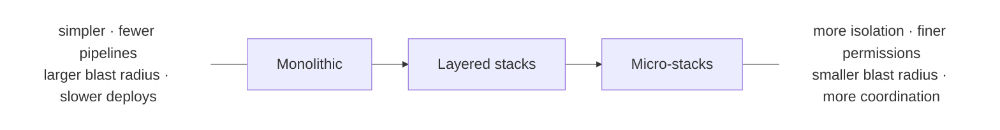
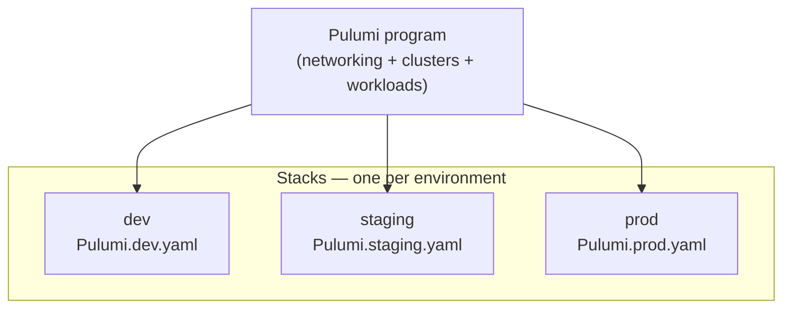
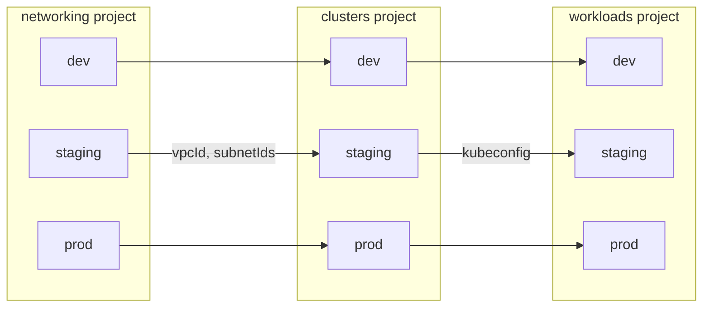

A [project](/docs/iac/concepts/projects/) is a collection of code, and a [stack](/docs/iac/concepts/stacks/) is a
unit of deployment with its own configuration, secrets, [role-based access controls (RBAC)](/docs/administration/access-identity/), policies, and concurrent deployments. Pulumi deliberately leaves the
relationship between the two flexible so that it can accommodate everything from a single developer's side project to
a large organization with many teams.

No single structure is correct for every team. The right choice depends on tradeoffs, so this guide describes those
tradeoffs first, then walks through the common patterns — monolithic, layered, and micro-stacks — and when each one is
the right fit.

## Design tradeoffs

Every decision about how to split (or not split) your infrastructure is a balance of four concerns:

* **Blast radius.** A stack is the unit of deployment, so it is also the unit of failure. The larger a stack, the more
  resources a single bad update can damage. Smaller stacks contain the impact of a mistake to a narrower slice of your
  infrastructure.

* **Ownership and permissions.** Stacks are the boundary at which you grant access. If your networking and your
  application live in the same stack, anyone who can deploy the application can also change the network. Splitting along
  team boundaries lets you use [stack permissions](/docs/administration/access-identity/rbac/permission-sets/) to give each team exactly the
  access it needs and no more.

* **Repository alignment.** Pulumi works naturally with GitOps-style continuous delivery, so most teams align their
  project structure to their Git repositories. That boundary is also a governance boundary: the repository is where
  pull-request review, `CODEOWNERS`, and branch protection decide who can propose and approve a change to a given piece
  of infrastructure. Splitting infrastructure across repositories (or scoping it with `CODEOWNERS` paths within one)
  lets those Git controls mirror your team ownership. Organizations that prefer monorepos tend toward fewer, larger
  projects with `CODEOWNERS` drawing the ownership lines; organizations that prefer fine-grained repos tend toward more,
  smaller projects, each with its own reviewers and merge rules.

* **Maintenance overhead.** Larger stacks take longer to preview and deploy. A stack with thousands of resources can be
  slow even when only a handful of resources actually changed, because the engine still has to refresh and diff
  everything. Splitting reduces that wall-clock time, but each new stack adds its own coordination cost: more stack
  references to wire up, more pipelines to maintain, and more places to look when something breaks.

## The granularity spectrum

Granularity is a spectrum, not a binary choice. The same workload can be deployed as one monolithic stack, as a small
number of layered stacks, or as many micro-stacks — and the right point is wherever the four tradeoffs above balance out
for your team. The three patterns this guide covers are points along that spectrum:

* **Monolithic** — one project with everything together, deployed as one stack per environment. The simplest thing to
  build and reason about; the whole service shares a single blast radius and permission boundary.
* **Layered stacks** — the infrastructure split along its major layers (networking → clusters → workloads), each its own
  project and stack, connected by stack references. The recommended default once a monolith starts to hurt.
* **Micro-stacks** — one stack per service, at the far, fine-grained end. Maximum isolation and the most targeted
  deploys, but the most coordination overhead; warranted only for genuinely independent services.

Moving right along the spectrum trades simplicity for isolation:



## Monolithic

Most teams start with a *monolithic* structure: a single project that defines all the infrastructure and application
resources for an entire service, with one stack per environment.



The program defines the *shape* of your infrastructure; each stack's configuration file (`Pulumi.dev.yaml`,
`Pulumi.staging.yaml`, `Pulumi.prod.yaml`) supplies the per-environment values — regions, instance sizes, subscription
IDs, and so on.

Most teams should start here, because against the four tradeoffs a monolith scores well on the ones that matter most
early:

* **Simplicity.** One project and a handful of stacks is the least you can build. Pulumi diffs your code and handles
  incremental deployments and dependency ordering for you.

* **Versioning.** With all your code in one project, sharing and versioning logic is trivial — there is no
  package-publishing or stack-reference boundary to cross.

The monolith's weaknesses are the other two axes: its blast radius is the whole service, its permissions are
all-or-nothing, and as it accumulates resources its deploys get slower. When those costs start to hurt, it is time to
split.

## Layered stacks

For most teams that outgrow a monolith, the right next step is **layered stacks**: split the infrastructure along its
major layers, each as its own project, connected by sharing outputs. The canonical decomposition is
**networking → clusters → workloads**. Each layer is a project with its own per-environment stacks, and layers connect
*within* an environment — the `clusters` stack for `staging` reads the `networking` stack for `staging`, `prod` reads
`prod`, and so on:



This layering tends to fall out of the tradeoffs naturally:

* **Blast radius.** A change to a workload can no longer take down the network it runs on.
* **Ownership.** The layers often map to real ownership boundaries — a platform team owns networking and clusters, while
  product teams own their workloads — so you can grant access per layer.
* **Maintenance overhead.** Each layer deploys on its own cadence. Foundational networking rarely changes and demands
  scrutiny when it does; workloads change daily. Keeping them separate means a routine workload deploy doesn't have to
  refresh and diff the entire network.

The layers correspond to lifecycle and ownership, not to individual cloud services. Resist the urge to give every cloud
primitive its own stack — that is the micro-stacks pattern below, and it is rarely warranted.

### Sharing data with stack references

Layers connect through [stack references](/docs/iac/concepts/stacks/#stackreferences), which let one stack read the
outputs another stack exported. The `clusters` program reads the network the `networking` program published:



{}

```typescript
import * as pulumi from "@pulumi/pulumi";

const config = new pulumi.Config();
const org = config.require("org");

// Resolves to e.g. "myorg/networking/prod" when deploying the prod stack.
const networking = new pulumi.StackReference(`${org}/networking/${pulumi.getStack()}`);

const vpcId = networking.getOutput("vpcId");
const privateSubnetIds = networking.getOutput("privateSubnetIds");

// Create cluster resources in the shared network...
```

{}

{}

```python
import pulumi

config = pulumi.Config()
org = config.require("org")

# Resolves to e.g. "myorg/networking/prod" when deploying the prod stack.
networking = pulumi.StackReference(f"{org}/networking/{pulumi.get_stack()}")

vpc_id = networking.get_output("vpcId")
private_subnet_ids = networking.get_output("privateSubnetIds")

# Create cluster resources in the shared network...
```

{}

{}

```go
package main

import (
    "fmt"

    "github.com/pulumi/pulumi/sdk/v3/go/pulumi"
    "github.com/pulumi/pulumi/sdk/v3/go/pulumi/config"
)

func main() {
    pulumi.Run(func(ctx *pulumi.Context) error {
        cfg := config.New(ctx, "")
        org := cfg.Require("org")

        // Resolves to e.g. "myorg/networking/prod" when deploying the prod stack.
        networking, err := pulumi.NewStackReference(ctx,
            fmt.Sprintf("%s/networking/%s", org, ctx.Stack()), nil)
        if err != nil {
            return err
        }

        vpcId := networking.GetOutput(pulumi.String("vpcId"))
        privateSubnetIds := networking.GetOutput(pulumi.String("privateSubnetIds"))

        // Create cluster resources in the shared network...
        _, _ = vpcId, privateSubnetIds
        return nil
    })
}
```

{}

{}

```csharp
using Pulumi;

return await Deployment.RunAsync(() =>
{
    var config = new Config();
    var org = config.Require("org");

    // Resolves to e.g. "myorg/networking/prod" when deploying the prod stack.
    var networking = new StackReference($"{org}/networking/{Deployment.Instance.StackName}");

    var vpcId = networking.GetOutput("vpcId");
    var privateSubnetIds = networking.GetOutput("privateSubnetIds");

    // Create cluster resources in the shared network...
});
```

{}

{}

```java
import com.pulumi.Pulumi;
import com.pulumi.resources.StackReference;

public class App {
    public static void main(String[] args) {
        Pulumi.run(ctx -> {
            var org = ctx.config().require("org");

            // Resolves to e.g. "myorg/networking/prod" when deploying the prod stack.
            var networking = new StackReference(
                String.format("%s/networking/%s", org, ctx.stackName()));

            var vpcId = networking.getOutput("vpcId");
            var privateSubnetIds = networking.getOutput("privateSubnetIds");

            // Create cluster resources in the shared network...
        });
    }
}
```

{}

{}

```yaml
config:
  org:
    type: string
resources:
  # Resolves to e.g. "myorg/networking/prod" when deploying the prod stack.
  networking:
    type: pulumi:pulumi:StackReference
    properties:
      name: ${org}/networking/${pulumi.stack}
variables:
  vpcId: ${networking.outputs["vpcId"]}
  privateSubnetIds: ${networking.outputs["privateSubnetIds"]}

# Create cluster resources in the shared network...
```

{}



The stack name resolves dynamically: deploying the `prod` stack of `clusters` reads the `prod` stack of `networking` in
the same organization, which keeps changes consistent across environments. Treat exported output names as a stable
interface — renaming or removing one breaks every stack that depends on it.

### Sharing data with Pulumi ESC

[Pulumi ESC](/docs/esc/) offers a more loosely coupled way to share data between stacks, and it is what we recommend over
stack references for most layered setups. Instead of one stack reaching into another in code, you pull a producing
stack's outputs into an [environment](/docs/esc/concepts/environments/) with the
[`pulumi-stacks` provider](/docs/esc/providers/iac/pulumi-stacks/), map them to `pulumiConfig`, and let any number of
consuming stacks read them as ordinary [configuration](/docs/iac/concepts/config/). The consumer never instantiates a
`StackReference`: the values it needs arrive as config, so the dependency is expressed as data rather than wired
into the program. That makes the coupling looser — the consumer depends on a handful of named config values, not on a
specific stack's output API — and the same environment can also carry secrets and
[dynamic cloud credentials](/docs/esc/providers/login/) alongside the shared outputs.


Pulumi ESC is available only with [Pulumi Cloud](/docs/pulumi-cloud/) (including a self-hosted Pulumi Cloud). If you use
a different [state backend](/docs/iac/concepts/state-and-backends/), share data with
[stack references](#sharing-data-with-stack-references) instead.


Because an ESC environment reads a specific stack, you create one ESC environment per deployment environment. Here is the
one for `prod`, reading the `networking` stack's `prod` outputs and exposing them as `pulumiConfig`:

```yaml
# ESC environment: networking-outputs-prod
values:
  stackRefs:
    fn::open::pulumi-stacks:
      stacks:
        networking:
          stack: networking/prod
  pulumiConfig:
    vpcId: ${stackRefs.networking.vpcId}
    privateSubnetIds: ${stackRefs.networking.privateSubnetIds}
```

Your other environments each need their own ESC environment: a parallel `networking-outputs-staging` would read
`networking/staging`, and likewise for `dev`. Import the matching environment from the corresponding `clusters` stack's
configuration file:

```yaml
# Pulumi.prod.yaml
environment:
  - networking-outputs-prod
```

The outputs now arrive as plain configuration, which your program reads exactly like any other config value — no
`StackReference` in sight:



{}

```typescript
import * as pulumi from "@pulumi/pulumi";

const config = new pulumi.Config();

// Supplied by the imported ESC environment — no StackReference needed.
const vpcId = config.require("vpcId");
const privateSubnetIds = config.requireObject<string[]>("privateSubnetIds");

// Create cluster resources in the shared network...
```

{}

{}

```python
import pulumi

config = pulumi.Config()

# Supplied by the imported ESC environment — no StackReference needed.
vpc_id = config.require("vpcId")
private_subnet_ids = config.require_object("privateSubnetIds")

# Create cluster resources in the shared network...
```

{}

{}

```go
package main

import (
    "github.com/pulumi/pulumi/sdk/v3/go/pulumi"
    "github.com/pulumi/pulumi/sdk/v3/go/pulumi/config"
)

func main() {
    pulumi.Run(func(ctx *pulumi.Context) error {
        cfg := config.New(ctx, "")

        // Supplied by the imported ESC environment — no StackReference needed.
        vpcId := cfg.Require("vpcId")
        var privateSubnetIds []string
        cfg.RequireObject("privateSubnetIds", &privateSubnetIds)

        // Create cluster resources in the shared network...
        _, _ = vpcId, privateSubnetIds
        return nil
    })
}
```

{}

{}

```csharp
using System.Collections.Generic;
using Pulumi;

return await Deployment.RunAsync(() =>
{
    var config = new Config();

    // Supplied by the imported ESC environment — no StackReference needed.
    var vpcId = config.Require("vpcId");
    var privateSubnetIds = config.RequireObject<List<string>>("privateSubnetIds");

    // Create cluster resources in the shared network...
});
```

{}

{}

```java
import com.pulumi.Pulumi;

public class App {
    public static void main(String[] args) {
        Pulumi.run(ctx -> {
            var config = ctx.config();

            // Supplied by the imported ESC environment — no StackReference needed.
            var vpcId = config.require("vpcId");
            var privateSubnetIds = config.requireObject("privateSubnetIds", String[].class);

            // Create cluster resources in the shared network...
        });
    }
}
```

{}

{}

```yaml
# The values below are supplied by the imported ESC environment as configuration.
config:
  vpcId:
    type: string
  privateSubnetIds:
    type: array
    items:
      type: string

# Create cluster resources in the shared network, referencing ${vpcId} and ${privateSubnetIds}...
```

{}



See [Integrate ESC with Pulumi IaC](/docs/esc/guides/integrate-with-pulumi-iac/) for the full workflow.

### Going finer: micro-stacks

At the far end of the spectrum is the *micro-stacks* pattern, where you go finer than layers and give each individual
service its own stack. This is only worth the overhead when you genuinely have many independent services — for example,
a fleet of serverless functions (AWS Lambda, Azure Functions) that ship on their own schedules.

The **upside** is highly targeted deployments: shipping one service touches only that service's stack, so previews and
updates are fast and the blast radius is small. The **downside** is maintenance overhead — every service adds another
stack to configure, another set of stack references to wire up, and another pipeline to operate. For most teams that
cost outweighs the benefit, so stop at layered stacks unless independent per-service lifecycles justify going further.

## Stacks beyond environments

`dev` / `staging` / `prod` is the most common way to slice a project into stacks, but it is not the only one. A stack is
just an independently deployed, independently configured instance of the same program, so *any* dimension along which
you need a separate copy of the same infrastructure — with its own configuration, secrets, and blast radius — can be a
stack. The program stays identical; each stack's `Pulumi.<stack>.yaml` supplies the values that make it distinct.

### Multi-tenancy: pooled vs. isolated tenants

When you run software for multiple customers, the tenancy model shows up directly in your stack layout:

* **Pooled (shared) tenancy.** A single `prod` stack serves every tenant, and application-level logic keeps tenants
  apart. This is the cheapest to operate and the simplest to deploy, but every tenant shares one blast radius: a bad
  update affects all of them at once.
* **Isolated tenancy.** Each tenant gets its own stack of the same project — `tenant-acme`, `tenant-globex`, and so on.
  Tenants are isolated in separate resources, can sit in different regions or on different tiers, and roll out
  independently, at the cost of more stacks to operate and a fleet you deploy across rather than a single update.

Isolation is expressed entirely through per-stack configuration:

```yaml
# Pulumi.tenant-acme.yaml
config:
  myapp:tenantId: acme
  myapp:tier: enterprise
  myapp:region: us-east-1
```

A tenant fleet is essentially the [micro-stacks](#going-finer-micro-stacks) tradeoff applied along the tenant axis, so
the same guidance holds: reach for it when tenants genuinely need isolation, and lean on
[Automation API](/docs/iac/concepts/automation-api/) to provision and update the fleet programmatically as tenants come
and go.

### Disaster recovery: primary and secondary stacks

For disaster recovery you often want two long-lived copies of production rather than one. Running them as two stacks of
the same project — say `prod-primary` and `prod-secondary` in different regions — keeps them defined by a single program
while letting configuration capture how they differ.

A [pilot-light](https://docs.aws.amazon.com/whitepapers/latest/disaster-recovery-workloads-on-aws/disaster-recovery-options-in-the-cloud.html)
setup is a natural fit: the secondary stack provisions only the minimal always-on resources needed to keep data
replicated and images warm, and scales up on failover. Those differences are just configuration:

```yaml
# Pulumi.prod-primary.yaml
config:
  myapp:region: us-east-1
  myapp:replicas: "6"
  myapp:standby: "false"
```

```yaml
# Pulumi.prod-secondary.yaml
config:
  myapp:region: us-west-2
  myapp:replicas: "1"     # pilot light: minimal warm capacity
  myapp:standby: "true"
```

The program reads `standby` and `replicas` to decide how much to run; failover becomes a configuration change and an
update to the secondary stack. These axes also compose — a SaaS provider running isolated tenants with DR might have
`acme-primary` and `acme-secondary` per tenant — and stack references and [ESC](#sharing-data-with-pulumi-esc) work the
same across all of them.

## Aligning to Git repositories

Because Pulumi enables GitOps-style continuous delivery, most teams align their project structure to their Git
repositories. A repository does not have to map one-to-one to a Pulumi project, though: a monorepo can hold many
projects side by side, and a single project can be spread across a repository however you like. A common convention is
to map a repository (or a directory within a monorepo) to a project and a Git branch to a stack. Read more about
[Continuous Delivery](/docs/iac/operations/continuous-delivery/).

Whether your layers live in one repository or many is itself a tradeoff. A monorepo keeps everything visible and
requires less cross-team coordination. A multi-repo setup gives each team its own access controls, CI/CD pipeline, and
release cadence — at the cost of having to agree on naming conventions and discover what other teams have published.
Sharing data works identically across both: a stack reference or ESC `pulumi-stacks` lookup resolves at deployment time
by the referenced stack's fully qualified name, `<organization>/<project>/<stack>`, regardless of which repository its
code lives in.

A common multi-repo layout puts a platform team's shared infrastructure in one repo and a service team's resources in
another:



{}

```
platform-infra/          # platform team: networking, clusters
├── index.ts
├── package.json
├── Pulumi.yaml
├── Pulumi.dev.yaml
└── Pulumi.prod.yaml

my-service/              # service team: one workload
├── index.ts
├── package.json
├── Pulumi.yaml
├── Pulumi.dev.yaml
└── Pulumi.prod.yaml
```

{}

{}

```
platform-infra/          # platform team: networking, clusters
├── __main__.py
├── requirements.txt
├── Pulumi.yaml
├── Pulumi.dev.yaml
└── Pulumi.prod.yaml

my-service/              # service team: one workload
├── __main__.py
├── requirements.txt
├── Pulumi.yaml
├── Pulumi.dev.yaml
└── Pulumi.prod.yaml
```

{}

{}

```
platform-infra/          # platform team: networking, clusters
├── main.go
├── go.mod
├── Pulumi.yaml
├── Pulumi.dev.yaml
└── Pulumi.prod.yaml

my-service/              # service team: one workload
├── main.go
├── go.mod
├── Pulumi.yaml
├── Pulumi.dev.yaml
└── Pulumi.prod.yaml
```

{}

{}

```
platform-infra/          # platform team: networking, clusters
├── Program.cs
├── platform-infra.csproj
├── Pulumi.yaml
├── Pulumi.dev.yaml
└── Pulumi.prod.yaml

my-service/              # service team: one workload
├── Program.cs
├── my-service.csproj
├── Pulumi.yaml
├── Pulumi.dev.yaml
└── Pulumi.prod.yaml
```

{}

{}

```
platform-infra/          # platform team: networking, clusters
├── src/main/java/myorg/App.java
├── pom.xml
├── Pulumi.yaml
├── Pulumi.dev.yaml
└── Pulumi.prod.yaml

my-service/              # service team: one workload
├── src/main/java/myorg/App.java
├── pom.xml
├── Pulumi.yaml
├── Pulumi.dev.yaml
└── Pulumi.prod.yaml
```

{}

{}

```
platform-infra/          # platform team: networking, clusters
├── Pulumi.yaml          # program is defined inline
├── Pulumi.dev.yaml
└── Pulumi.prod.yaml

my-service/              # service team: one workload
├── Pulumi.yaml          # program is defined inline
├── Pulumi.dev.yaml
└── Pulumi.prod.yaml
```

{}



The service program reads the platform stack with a stack reference, exactly as shown in
[Sharing data with stack references](#sharing-data-with-stack-references) above. When weighing a multi-repo structure,
keep these tradeoffs in mind:

* **Team ownership.** Each repository has its own access controls, pipeline, and release process, so the platform team
  can evolve shared infrastructure without touching service code.
* **Security.** [Stack permissions](/docs/administration/access-identity/rbac/permission-sets/) let you grant service teams read-only access
  to platform stack outputs without write access to the underlying infrastructure.
* **Stack reference coupling.** Stack references return the *current* outputs of the referenced stack, so a renamed or
  removed output breaks dependents until they are updated. Coordinate breaking changes to exported outputs carefully.
* **Discoverability.** In a monorepo every project is visible at a glance; in a multi-repo setup teams must agree on
  and document naming conventions for organizations, projects, and stacks.


**Components are mostly out of scope for this guide,** but they are worth knowing about here. When shared infrastructure
spans multiple repositories, a platform team can package reusable logic as a [component](/docs/iac/concepts/components/)
and distribute it as a versioned package — to a public registry such as npm or PyPI, or to the
[Pulumi Registry](/docs/idp/concepts/private-registry/) for private distribution. Service teams add it as a dependency
and instantiate it like any other resource, without access to its source. See
[Building & extending Pulumi](/docs/iac/guides/building-extending/) for guidance on authoring and distributing
components.


## Organizing code within a project

Once you've decided how many projects you have, you still have to organize the code *inside* each one. The layout below
is the monorepo approach — everything for a project lives together in one repository. Organize that code around **whole
workloads or aspects of your infrastructure** — the same networking / clusters / workloads layers from above — rather
than around individual cloud services. Files named for the *purpose* they serve stay meaningful as your infrastructure
grows; files named for cloud primitives do not.



{}

```
my-platform/
├── Pulumi.yaml
├── Pulumi.dev.yaml
├── Pulumi.prod.yaml
├── index.ts          # entrypoint: composes the layers
├── networking.ts     # VPC, subnets, security groups
├── clusters.ts       # Kubernetes / compute clusters
└── workloads.ts      # application services
```

{}

{}

```
my-platform/
├── Pulumi.yaml
├── Pulumi.dev.yaml
├── Pulumi.prod.yaml
├── __main__.py       # entrypoint: composes the layers
├── networking.py     # VPC, subnets, security groups
├── clusters.py       # Kubernetes / compute clusters
└── workloads.py      # application services
```

{}

{}

```
my-platform/
├── Pulumi.yaml
├── Pulumi.dev.yaml
├── Pulumi.prod.yaml
├── main.go           # entrypoint: composes the layers
├── networking.go     # VPC, subnets, security groups
├── clusters.go       # Kubernetes / compute clusters
└── workloads.go      # application services
```

{}

{}

```
my-platform/
├── Pulumi.yaml
├── Pulumi.dev.yaml
├── Pulumi.prod.yaml
├── Program.cs        # entrypoint: composes the layers
├── Networking.cs     # VPC, subnets, security groups
├── Clusters.cs       # Kubernetes / compute clusters
└── Workloads.cs      # application services
```

{}

{}

```
my-platform/
├── pom.xml
├── Pulumi.yaml
├── Pulumi.dev.yaml
├── Pulumi.prod.yaml
└── src/main/java/myorg/
    ├── App.java          # entrypoint: composes the layers
    ├── Networking.java   # VPC, subnets, security groups
    ├── Clusters.java     # Kubernetes / compute clusters
    └── Workloads.java    # application services
```

{}

{}

A Pulumi YAML program lives entirely in a single `Pulumi.yaml` file, so there is no file-level organization to apply.
When a YAML project grows large enough that you wish you could split it, that is the signal to break it into separate
[layered projects](#layered-stacks) instead.

```
my-platform/
├── Pulumi.yaml       # the entire program, defined inline
├── Pulumi.dev.yaml
└── Pulumi.prod.yaml
```

{}



Keep the bulk of your resources in these layer files and the project's entrypoint. Reserve additional files for genuinely
reusable building blocks — local [component resources](/docs/iac/concepts/components/) and shared helper functions — and
package those up when other projects need them.

### When to split into separate projects

If a single file starts to feel like the wrong place for something, the answer is usually a separate project, not just a
separate file. Split when one of the four tradeoffs pushes you to:

* **Blast radius:** sensitive or foundational resources should fail independently of everything else.
* **Ownership:** a platform team and an app team need different access to different resources.
* **Repository alignment:** the code belongs to a different team's repository and release process.
* **Maintenance overhead:** resources change at very different cadences, or the project has grown large enough that
  deploys are slow.

Share outputs between the projects you split out with [stack references](/docs/iac/concepts/stacks/#stackreferences)
or, preferably, the [`pulumi-stacks` provider in ESC](#sharing-data-with-pulumi-esc).

## Application code with or without infrastructure

A recurring question is whether application code (Lambda handlers, container source, and the like) should live in the
same project as the infrastructure that deploys it. The answer depends on your delivery model.

**Self-service model.** When application teams write their own Pulumi code — often consuming standardized
[components](/docs/iac/concepts/components/) from the [Pulumi Registry](/docs/idp/concepts/private-registry/) — it
works well to keep app code and infrastructure together. The same team owns both, so a single repository with the
application alongside its Pulumi program is the path of least friction:

```
my-service/
├── Pulumi.yaml
├── Pulumi.dev.yaml
├── Pulumi.prod.yaml
├── index.ts          # infrastructure: functions, queues, databases
└── app/              # application source the program deploys
    └── handler.ts
```

**Full internal developer platform (IDP) model.** When a platform team builds an IDP, the IDP typically *owns and
generates* all the infrastructure code in a repository. Mingling hand-written application code into that same repo
creates ownership conflicts — the IDP wants to manage the repo's contents, while app teams want to manage their own
code. In this model, keep application code in its own repositories owned by the app teams, and let the IDP own the
infrastructure code separately:

```
platform-idp/        # IDP owns and generates all IaC here
service-a-app/       # app team owns only application code
service-b-app/       # app team owns only application code
```

The deciding factor is ownership: keep app and infrastructure code together when one team owns both, and separate them
when an IDP needs to own the infrastructure independently of the applications it serves.

## Tagging stacks

Stacks have associated metadata in the form of name/value [stack tags](/docs/iac/concepts/stacks/#stack-tags). You can
assign custom tags to stacks when logged into the [Pulumi Cloud backend](/docs/iac/concepts/state-and-backends/) to
enable grouping stacks in [Pulumi Cloud](https://app.pulumi.com/signin). For example, if you have many projects with
separate stacks for production, staging, and testing environments, it may be useful to group stacks by environment
instead of by project. To do this, you could assign a custom `environment` tag to each stack — `production` to each
production stack, `staging` to each staging stack, and so on. Then in Pulumi Cloud you can group stacks by
`Tag: environment`.

Tags aren't only for grouping. On the [Pulumi Enterprise or Business Critical editions](/pricing/), they also drive
[tag-based (ABAC) rules](/docs/administration/access-identity/rbac/roles#tag-based-abac-rules) in Pulumi Cloud RBAC, so
you can grant permissions by tag — for example, giving a team access to every stack tagged `team: payments` — instead of
enumerating each stack individually. As new stacks pick up the tag, they inherit the access automatically.

## Conclusion

There is no universally correct project and stack structure — only the one that best balances blast radius, ownership,
repository alignment, and maintenance overhead for your team. Start monolithic: it is the simplest thing that works, and
most of the spectrum's cost is coordination you don't yet need. Move to layered stacks when a growing blast radius,
divergent ownership, or slow deploys begin to hurt, and connect the layers with Pulumi ESC or stack references. Reserve
micro-stacks for the uncommon case of many genuinely independent services. Wherever you land, revisit the decision as
your team and infrastructure grow — the right structure is the one that still fits.
