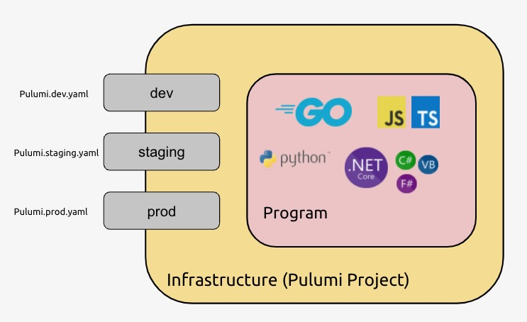
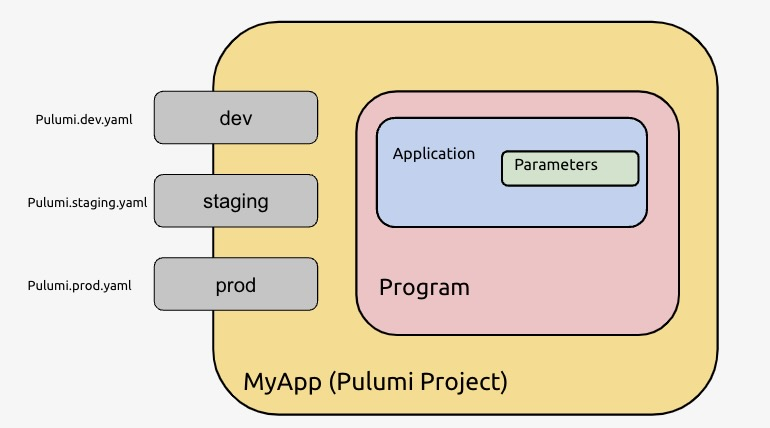

[Projects](/docs/concepts/projects/) and [stacks](/docs/concepts/stack/) are intentionally flexible so that they can accommodate
diverse needs across a spectrum of team, application, and infrastructure scenarios. This is very much like how Git
repos work and, much like Git repos, there are varying approaches to organizing your code within them. That said,
there are some clear best practices that, when followed, will ensure Pulumi works seamlessly for your situation. This
guide describes some of the most common approaches and when to choose one over another.

## Tradeoffs

Everything described within this guide is on a spectrum of tradeoffs. Remember that each project is a collection of code,
and that each stack is a unit of deployment. Each stack has its own separate configuration and secrets, role-based access controls (RBAC) and policies, and concurrent deployments.

## Monolithic

It's very common to start with a _monolithic_ project/stack structure. In this model, a single project defines
the infrastructure and application resources for an entire vertical service.

Each stack typically corresponds to a distinct _environment_ for that service, such as production, staging, and many
testing and development instances. There might even be multiple environments within each of these dimensions, such as
a production environment in each of the US east coast, west coast, Europe, and Asia.

Most users will start a monolithic structure, for a few good reasons:

* **Simplicity.** Having a single project and collection of stacks is the easiest thing you could
  possibly do. Pulumi diffs edits to your application and infrastructure code, and so this approach leaves the
  hard work of doing incremental deployments and tracking dependencies to the Pulumi engine.

* **Versioning.** By placing all code in one project, it's easier to share and version logic within your project.
  Of course, Pulumi supports package managers, so sharing across projects is also possible, but it entails dealing
  with packages which means introducing a loosely-coupled versioning boundary with distinct update cadences.

* **Agility.** Simplicity and versioning means that using a monolithic approach will almost always lead to the best
  productivity and therefore agility. For small projects or teams, this is usually the right place to start.

Although a monolithic structure is where most users begin their Pulumi journey, we find that most will ultimately
migrate to a finer grained decomposition of projects and stacks.

## Micro-Stacks

At the other end of the spectrum is a pattern we call _micro-stacks_. This is equivalent to microservices,
only in project and stack form. In this model, a project is broken into separately managed smaller projects, often across
different dimensions. This approach has several advantages:

* **Independence.** Although Pulumi can diff changes and make only those updates mandated by a code edit,
  certain projects sometimes deploy at radically different cadences and it makes sense to enforce this separation
  in the project structure. For instance, a service that revs every day may not be appropriate to live in the same project as
  critical infrastructure that changes infrequently and which demands intense scrutiny whenever it does.

* **Security.** In large organizations, it's important to use RBAC to secure access to individual aspects
  of your cloud infrastructure and applications. Perhaps you want to ensure your DevOps Architect is the only
  person who can approve changes to fundamental networking and clustering infrastructure, for example.

* **Complexity and Performance.** For many real-world services, there are a multitude of build artifacts. This
  includes traditional software builds (in Java, .NET, C++, etc), Docker image builds, and serverless function
  packaging. Putting all of these in one place may increase build times unless a hermetic build system with
  excellent caching has been used (and, even then, caching across CI/CD machines can be difficult). Breaking apart
  pieces that can be built independently can increase agility and improve performance, particularly when they
  evolve at different rates and/or are managed by different teams.

### Using Stack References with Micro-Stacks

If using the micro-stacks approach you will need a way to share information between stacks. [Stack references](/docs/concepts/stack#stackreferences) are the Pulumi concept you will want to use. Stack references allow you to access the outputs of one stack from another stack. Inter-Stack Dependencies allow one stack to reference the outputs of another stack.

To reference values from another stack, create an instance of the StackReference type using the fully qualified name of the stack as an input, and then read exported stack outputs by their name.

## Moving from a Monolithic Project Structure to Micro-Stacks

Here are a few (non-exhaustive) examples of how one might go about splitting up a monolithic project structure:

* Each micro-service in your architecture might get its own project.

* Application container images may be rebuilt and published independent of infrastructure projects.

* Similarly, application concepts like containers and serverless functions may be deployed independently.

* Core, low-level infrastructure -- like networks and cluster orchestrators -- may be independent from other
  infrastructure and applications resources.

* You may have one or more data tiers that are deployed and independently backed up.

Even with this alternative breakdown, it's likely your stack structure will mirror a monolithic structure. For
each project, you are apt to have multiple environments such as production, staging, testing, etc. And, indeed,
you may have inter-dependencies between your stacks -- something that Pulumi supports in a first-class manner with [stack references](/docs/concepts/stack#stackreferences).

## Aligning to Git Repos

Because Pulumi is a natural choice for enabling GitOps-style continuous deployment, many users opt to align their
project structure to their Git repo structure. Organizations that prefer mono-repos often prefer monolithic
project structures, and organizations that prefer fine-grained repos tend to prefer micro-project structures.

This alignment is not a requirement, of course. We have many users who have chosen to have multiple projects in a
single Git repo -- or the reverse, using Git submodules, they might deploy code from multiple Git repos in a single
Pulumi project. However, most users find that a close alignment between Git repo structure and Pulumi project
structure enables seamless continuous deployment. For a concrete walkthrough of the multi-repo approach using
stack references, see [Multi-repo structure](#multi-repo-structure) in the Examples section below.

In this model, there is a rough correspondence between a Git repo and a Pulumi project, and a Git branch and
its associated Pulumi stack. Read more about
[Continuous Delivery](/docs/using-pulumi/continuous-delivery/).

## Tagging Stacks

Stacks have associated metadata in the form of name/value [stack tags](/docs/concepts/stack#stack-tags). You can assign custom tags to stacks when logged into the [Pulumi Cloud backend](/docs/concepts/state/) to enable grouping stacks in the [Pulumi Cloud](https://app.pulumi.com). For example, if you have many projects with separate stacks for production, staging, and testing environments, it may be useful to group stacks by environment instead of by project. To do this, you could assign a custom `environment` tag to each stack, assigning a value of `production` to each production stack, `staging` to each staging stack, etc. Then in Pulumi Cloud, you'll be able to group stacks by `Tag: environment`.

## Examples

### Monorepo with base infrastructure project

Let's build an example of an organizational setup that leverages several different approaches to provide the most functionality and flexibility possible.

We start with a central base "infrastructure" project, which contains things that are common across multiple services (or perhaps even your entire organization!). This project can include resources like Azure Resource Groups or AWS VPCs.

Within this project, we create stacks for each unique configuration (often times stacks are related to SDLC environments like dev, staging, and production). These stacks are often deployed independently of each other and are often deployed in different regions. To use a metaphor, our Pulumi program code defines the shape of a dial, and the configuration in the different stack configuration files (e.g., `Pulumi.dev.yaml`, `Pulumi.staging.yaml`, `Pulumi.prod.yaml`) defines an actual dial setting. These "dial settings" might include things like subscription IDs, regions, etc. that are specific to that environment.

This project looks a bit like this:



{}

```
├─ infrastructure
  ├── index.ts
  ├── Pulumi.yaml
  ├── Pulumi.dev.yaml
  ├── Pulumi.staging.yaml
  └── Pulumi.prod.yaml
```

{}

{}

```
├─ infrastructure
  ├── main.go
  ├── Pulumi.yaml
  ├── Pulumi.dev.yaml
  ├── Pulumi.staging.yaml
  └── Pulumi.prod.yaml
```

{}



Now that we have our base infrastructure, we can create a separate Pulumi project per application or service for each one's deployment and configuration that will include all the resources that the service needs, which are not provided by the base infrastructure project.

These projects can be part of the [same monorepo as the infrastructure project](/blog/organizational-patterns-infra-repo/), or they can be separate repos, depending upon your organizational needs. One of the advantages to keeping the infrastructure project in a separate repo/project is that there is likely a limited number of users we want to be able to deploy these things; not every individual team needs to be able to do this. In this example, we will use a monorepo, however.

Our example service is made up of an API and a database (RDS, CosmosDB, etc.). Our Pulumi program for the project defines the resources for the API and the database, and it can also deploy the actual code, as well. When we add our example service, our monorepo starts to look like this:



{}

```
├── infrastructure
│   ├── index.ts
│   ├── Pulumi.yaml
│   ├── Pulumi.dev.yaml
│   ├── Pulumi.staging.yaml
│   └── Pulumi.prod.yaml
├── myApp
│   ├── index.ts
│   ├── Pulumi.yaml
│   ├── Pulumi.dev.yaml
│   ├── Pulumi.staging.yaml
│   └── Pulumi.prod.yaml
└── ...
```

{}

{}

```
├── infrastructure
│   ├── main.go
│   ├── Pulumi.yaml
│   ├── Pulumi.dev.yaml
│   ├── Pulumi.staging.yaml
│   └── Pulumi.prod.yaml
├── myApp
│   ├── main.go
│   ├── Pulumi.yaml
│   ├── Pulumi.dev.yaml
│   ├── Pulumi.staging.yaml
│   └── Pulumi.prod.yaml
└── ...
```

{}

It's generally a good practice to keep our projects on the smaller side as this helps reduce the effect and impact of a deployment. If you have applications that require different rates of change, it may be useful to split them up into separate repos, aka micro-stacks.

As we consider making our approach even more accessible and robust across teams, we bring in the idea of [Component Resources](/docs/concepts/resources/components/), which are a way to group affiliated resources together according the standard practices of the organization.

Back to our example, our service needs a database and a subnet (or other networking). We can template these resources by creating a component resource, which abstracts these details away from the rest of the program. So now, any time someone needs to use Pulumi to add a standard application, they can call a resource called `Application` with its associated parameters (e.g., the container, parcel, folder). Behind the scenes, everything is being set up according to your organization's standards.



These component resources can be packaged up and stored alongside all of your other package management, so consumers in your organization can access them like any other library or package. If we want to add component resources to our monorepo example, it will look like this:



{}

```
├── infrastructure
│   ├── index.ts
│   ├── Pulumi.yaml
│   ├── Pulumi.dev.yaml
│   └── Pulumi.prod.yaml
├── myApp
│   ├── index.ts
│   ├── Pulumi.yaml
│   ├── Pulumi.dev.yaml
│   ├── Pulumi.staging.yaml
│   └── Pulumi.prod.yaml
├── pkg
│   └──application
│     └── app.ts
└── ...
```

{}

{}

```
├── infrastructure
│   ├── main.go
│   ├── Pulumi.yaml
│   ├── Pulumi.dev.yaml
│   └── Pulumi.prod.yaml
├── myApp
│   ├── main.go
│   ├── Pulumi.yaml
│   ├── Pulumi.dev.yaml
│   ├── Pulumi.staging.yaml
│   └── Pulumi.prod.yaml
├── pkg
│   └──application
│     └── app.go
└── ...
```

{}

To be clear, each of the applications/services inside our monorepo (including the `infrastructure` project) are a separate Pulumi project, with their own stacks, and their own `Pulumi.yaml`. Given that each service is a separate Pulumi project, they can all use different programming languages. Let's take a look at how it might look if the `infrastructure` team prefers to write in Go, and the myApp team prefers TypeScript:

```
├── infrastructure
│   ├── main.go
│   ├── Pulumi.yaml
│   ├── Pulumi.dev.yaml
│   └── Pulumi.prod.yaml
├── myApp
│   ├── index.ts
│   ├── package.json
│   ├── Pulumi.yaml
│   ├── Pulumi.dev.yaml
│   ├── Pulumi.staging.yaml
│   └── Pulumi.prod.yaml
├── pkg
│   └──application
│     └── app.go
└── .etc
```

### Multi-repo structure

Not all teams work from a monorepo. Many organizations distribute infrastructure ownership across separate teams, each with their own Git repository and deployment lifecycle. A platform team might own shared networking and cluster infrastructure, while individual service teams own the resources specific to their applications. In this model, each team's code lives in its own repository, and Pulumi [stack references](/docs/concepts/stacks/#stack-references) provide the mechanism for connecting them.

A stack reference lets any Pulumi program read the outputs published by another stack, regardless of which repository that stack's code lives in. Pulumi Cloud stores stack outputs and makes them available to any authorized consumer by the stack's fully qualified name: `<organization>/<project>/<stack>`.

Consider a platform team responsible for shared networking infrastructure -- VPCs, subnets, and security groups -- and a service team responsible for deploying an application on top of it. The platform team's repository might look like this:



{}

```
platform-infra/
├── index.ts
├── package.json
├── Pulumi.yaml
├── Pulumi.dev.yaml
├── Pulumi.staging.yaml
└── Pulumi.prod.yaml
```

{}

{}

```
platform-infra/
├── main.go
├── go.mod
├── Pulumi.yaml
├── Pulumi.dev.yaml
├── Pulumi.staging.yaml
└── Pulumi.prod.yaml
```

{}

The platform team's program provisions the shared infrastructure and exports its key outputs so that downstream stacks can consume them:



{}

```typescript
import * as pulumi from "@pulumi/pulumi";
import * as aws from "@pulumi/aws";

const vpc = new aws.ec2.Vpc("main", { cidrBlock: "10.0.0.0/16" });

const privateSubnet = new aws.ec2.Subnet("private", {
    vpcId: vpc.id,
    cidrBlock: "10.0.1.0/24",
    availabilityZone: "us-west-2a",
});

export const vpcId = vpc.id;
export const privateSubnetId = privateSubnet.id;
```

{}

{}

```go
package main

import (
    "github.com/pulumi/pulumi-aws/sdk/v6/go/aws/ec2"
    "github.com/pulumi/pulumi/sdk/v3/go/pulumi"
)

func main() {
    pulumi.Run(func(ctx *pulumi.Context) error {
        vpc, err := ec2.NewVpc(ctx, "main", &ec2.VpcArgs{
            CidrBlock: pulumi.String("10.0.0.0/16"),
        })
        if err != nil {
            return err
        }
        subnet, err := ec2.NewSubnet(ctx, "private", &ec2.SubnetArgs{
            VpcId:            vpc.ID(),
            CidrBlock:        pulumi.String("10.0.1.0/24"),
            AvailabilityZone: pulumi.String("us-west-2a"),
        })
        if err != nil {
            return err
        }
        ctx.Export("vpcId", vpc.ID())
        ctx.Export("privateSubnetId", subnet.ID())
        return nil
    })
}
```

{}

The service team's repository has the same basic shape, but its program reads from the platform stack rather than recreating the shared infrastructure itself:



{}

```
my-service/
├── index.ts
├── package.json
├── Pulumi.yaml
├── Pulumi.dev.yaml
├── Pulumi.staging.yaml
└── Pulumi.prod.yaml
```

{}

{}

```
my-service/
├── main.go
├── go.mod
├── Pulumi.yaml
├── Pulumi.dev.yaml
├── Pulumi.staging.yaml
└── Pulumi.prod.yaml
```

{}

Inside the service program, a stack reference retrieves the outputs from the corresponding environment stack in the platform repository:



{}

```typescript
import * as pulumi from "@pulumi/pulumi";

const config = new pulumi.Config();
const org = config.require("org");

// Resolves to e.g. "myorg/platform-infra/dev" when deploying the dev stack.
const infra = new pulumi.StackReference(`${org}/platform-infra/${pulumi.getStack()}`);

const vpcId = infra.getOutput("vpcId");
const subnetId = infra.getOutput("privateSubnetId");

// Deploy service resources into the shared VPC...
```

{}

{}

```go
package main

import (
    "fmt"

    "github.com/pulumi/pulumi/sdk/v3/go/pulumi"
    "github.com/pulumi/pulumi/sdk/v3/go/pulumi/config"
)

func main() {
    pulumi.Run(func(ctx *pulumi.Context) error {
        cfg := config.New(ctx, "")
        org := cfg.Require("org")

        // Resolves to e.g. "myorg/platform-infra/dev" when deploying the dev stack.
        ref, err := pulumi.NewStackReference(ctx,
            fmt.Sprintf("%s/platform-infra/%s", org, ctx.Stack()), nil)
        if err != nil {
            return err
        }

        vpcId := ref.GetOutput(pulumi.String("vpcId"))
        subnetId := ref.GetOutput(pulumi.String("privateSubnetId"))

        // Deploy service resources into the shared VPC...
        _ = vpcId
        _ = subnetId
        return nil
    })
}
```

{}

The stack name resolves dynamically: when you run `pulumi up` against the `dev` stack in `my-service`, Pulumi looks up the `dev` stack of `platform-infra` in the same organization. This symmetry makes it straightforward to promote changes consistently across environments.

A second variant of the multi-repo pattern arises when a platform team authors a reusable [component resource](/docs/iac/concepts/components/) and publishes it as a versioned package to a package registry such as npm, PyPI, or NuGet. Service teams then add it as a dependency in their `package.json` or `go.mod` and instantiate it like any other resource, without needing access to the component's source repository. This is the right approach when the component interface is stable and multiple independent teams need to use it. See [Building and publishing packages](/docs/iac/guides/building-extending/) for guidance on authoring and distributing components.

There are several tradeoffs to weigh when adopting a multi-repo structure:

- **Team ownership.** Each repository has its own access controls, CI/CD pipeline, and release process. The platform team can evolve shared infrastructure on its own schedule without modifying service team code.
- **Security.** Pulumi Cloud's [stack permissions](/docs/pulumi-cloud/access-management/stack-permissions/) let you grant service teams read-only access to platform stack outputs without granting write access to the underlying infrastructure.
- **Stack reference coupling.** Stack references resolve at deployment time, so they always return the current outputs of the referenced stack. If the platform team renames or removes an exported output, service stacks that depend on it will fail until updated. Treat exported output names as a stable interface and coordinate breaking changes carefully.
- **Discoverability.** In a monorepo, all projects are visible at a glance. In a multi-repo setup, teams need to agree on and document naming conventions for organizations, projects, and stacks.

For most teams starting out, a monorepo is simpler to manage. Multi-repo structures become the right choice when team boundaries, access control requirements, or independent deployment lifecycles justify the additional coordination overhead.

### Other examples

See also the use of multiple projects and stacks in the [Kubernetes guides](/docs/clouds/kubernetes/guides/), which contains a reference architecture and collection of examples demonstrating best-practices for managing Kubernetes with a team.

## Organizing your project code

Within your Pulumi project, there are good practices to consider to help keep your code organized, maintainable, and understandable. While Pulumi doesn't enforce a specific project structure, following consistent patterns makes your infrastructure code easier to navigate, review, and maintain.

### Common project structures

Here are several approaches to organizing files within a Pulumi project, each with different tradeoffs:

#### Flat structure (simple projects)

For smaller projects with a handful of resources, a flat structure works well:

```
my-project/
├── Pulumi.yaml
├── Pulumi.dev.yaml
├── Pulumi.prod.yaml
├── index.ts          # Main entrypoint
└── config.ts         # Config helpers and constants
```

**When to use:** Small projects, prototypes, or single-purpose stacks with fewer than ~20 resources.

#### Organized by resource layer

For most projects, keep the majority of your resources in your main entrypoint file (e.g., `index.ts`). Use separate files primarily for:

* **Local component resources** - Reusable components you create within your project
* **Shared libraries** - Helper functions and utilities
* **Structured config classes** - Complex configuration structures

If your project grows large enough that splitting by infrastructure layer seems necessary, consider whether you should instead split into multiple Pulumi projects with [stack references](/docs/concepts/stack#stackreferences). This provides better separation of concerns, independent deployment cadences, and clearer ownership boundaries.

For projects where layer-based organization makes sense:

```
my-project/
├── Pulumi.yaml
├── Pulumi.dev.yaml
├── Pulumi.prod.yaml
├── index.ts              # Main entrypoint with most resources
├── components.ts         # Local component resources
└── config.ts             # Configuration helpers
```

**When to use:** Use this approach sparingly. If you have many resources that seem to require separate files (networking.ts, compute.ts, storage.ts, etc.), you likely need separate Pulumi projects instead.

#### Organized by service/feature

For projects that deploy multiple logical services:

```
my-project/
├── Pulumi.yaml
├── Pulumi.dev.yaml
├── Pulumi.prod.yaml
├── index.ts              # Main entrypoint - imports and composes all services
├── shared/
│   ├── networking.ts     # Shared VPC, DNS
│   └── iam.ts            # Shared IAM resources
├── api/
│   ├── index.ts          # API Gateway, Lambda functions
│   └── routes.ts         # Route definitions
├── web/
│   ├── index.ts          # CloudFront, S3 bucket
│   └── cdn.ts            # CDN configuration
└── data/
    ├── index.ts          # Database resources
    └── migrations.ts     # Migration helpers
```

**When to use:** Applications with multiple distinct components that share some common infrastructure.

### Pulumi-specific organization tips

#### Configuration helpers

Consider creating a dedicated file for reading configuration. This is optional for simple projects where inline config in your main file works well, but becomes helpful as your project grows:

```typescript
// config.ts
import * as pulumi from "@pulumi/pulumi";

const config = new pulumi.Config();

export const environment = pulumi.getStack();
export const region = config.require("region");
export const instanceSize = config.get("instanceSize") || "t3.medium";
```

#### Application code alongside infrastructure

If your Pulumi project contains application code (such as Lambda functions or Docker images), organize it into clearly labeled directories separate from your infrastructure code.

For serverless applications:

```
my-project/
├── Pulumi.yaml
├── Pulumi.dev.yaml
├── Pulumi.prod.yaml
├── index.ts              # Infrastructure definitions (API Gateway, Lambda resources)
├── app/                  # Application code
│   └── lambda/           # Lambda function source
│       └── handler.ts
└── scripts/              # Build and deployment scripts
    └── build.sh
```

For containerized applications:

```
my-project/
├── Pulumi.yaml
├── Pulumi.dev.yaml
├── Pulumi.prod.yaml
├── Makefile              # Orchestrates build and deployment
├── app/                  # Application code
│   ├── Dockerfile
│   └── src/
│       └── index.js
└── infra/                # Pulumi infrastructure code
    └── index.ts          # Container registry, ECS/K8s resources
```

### When to split into separate projects

Consider moving code to a separate Pulumi project when you have:

* **Different deployment cadences:** Database schemas change rarely while application code changes daily
* **Different owners:** A platform team manages core infrastructure while app teams manage their services
* **Different security requirements:** Sensitive resources (like KMS keys) need stricter access controls
* **Performance:** Very large projects (hundreds of resources) may benefit from splitting to reduce deployment time

Use [stack references](/docs/concepts/stack#stackreferences) to share outputs between projects.

### Breaking out reusable code



{}

Organize your code in a way that makes it easy to understand and maintain. One way to do this in TypeScript is to break out your code into separate files, and then import them into your main file. In this example, the entrypoint for our Pulumi program is `index.ts`, but we use the `utils.ts` file for supporting functions.

```typescript
// index.ts
import * as utils from "./utils";
...
const forwarderHandle = utils.forwardPrometheusService(p8sService, p8sDeployment, {
    localPort,
});
```

```typescript
// utils.ts
import * as k8s from "@pulumi/kubernetes";
import * as pulumi from "@pulumi/pulumi";

export function forwardPrometheusService(
    service: pulumi.Input<k8s.core.v1.Service>,
    deployment: pulumi.Input<k8s.extensions.v1beta1.Deployment>,
    opts: PromPortForwardOpts,
): pulumi.Output<() => void> {
    if (pulumi.runtime.isDryRun()) {
        return pulumi.output(() => undefined);
    }

    return pulumi.all([service, deployment]).apply(([s, d]) => pulumi.all([s.metadata, d.urn])).apply(([meta]) => {
        return new Promise<() => void>((resolve, reject) => {
            const forwarderHandle = spawn("kubectl", [
                "port-forward",
                `service/${meta.name}`,
                `${opts.localPort}:${opts.targetPort || 80}`,
            ]);

            forwarderHandle.stdout.on("data", data => resolve(() => forwarderHandle.kill()));
            forwarderHandle.stderr.on("data", data => reject());
        });
    });
}

```

{}

{}

Organize your code in a way that makes it easy to understand and maintain. One way to do this in Go is to break out your code into separate files, and then import them into your main file. In this example, the entrypoint for our Pulumi program is `main.go`, but we use the `utils.go` file for supporting functions.

```go
// main.go
package main
import (
  "github.com/pulumi/pulumi/sdk/v3/go/pulumi"
)

func main() {
  pulumi.Run(func(ctx *pulumi.Context) error {
    _, err := forwardPrometheusService(ctx)
      if err != nil {
        return err
      }
  }
}
```

```go
// utils.go
package main
import (
  appsv1 "github.com/pulumi/pulumi-kubernetes/sdk/v3/go/kubernetes/apps/v1"
  corev1 "github.com/pulumi/pulumi-kubernetes/sdk/v3/go/kubernetes/core/v1"
  metav1 "github.com/pulumi/pulumi-kubernetes/sdk/v3/go/kubernetes/meta/v1"
  "github.com/pulumi/pulumi/sdk/v3/go/pulumi"
  "github.com/pulumi/pulumi/sdk/v3/go/pulumi/config"
)

func forwardPrometheusService(ctx *pulumi.Context)  {
...

  return nil
}

```

{}

There are a couple of reasons that this pattern is helpful. One, in this particular case, is that the `forwardPrometheusService` function exists to forward the Prometheus service to localhost, so we can check it. If you are running in-cluster, we probably don't need it! So we could add a conditional to determine if we need to run that function - which makes our code a lot clearer.

Additionally, by breaking out the function, we can easily reuse it in other places in our code. For example, if we wanted to forward the Prometheus service to a different port, we could change the `localPort` parameter.
