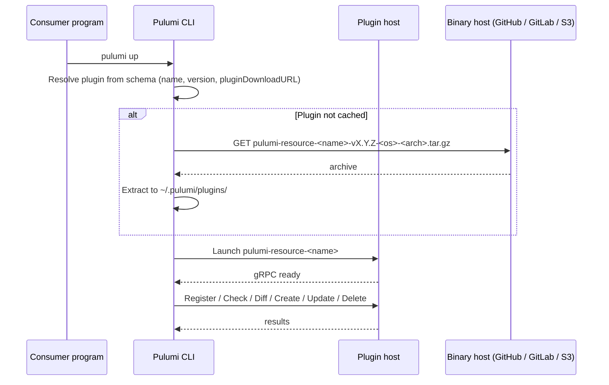

An **executable-based plugin package** ships as a pre-compiled binary per operating system and architecture. The Pulumi CLI downloads the binary on demand from a URL embedded in the package schema and runs it as a subprocess — so consumers never need the authoring language's runtime installed. This is the model used by almost every package in the public [Pulumi Registry](/registry/) (AWS, GCP, EKS, etc.).

{}
If you are looking to package and share components, a [source-based plugin package](./source-based-plugin/) is usually a better fit — see [Packaging Components](/docs/iac/guides/building-extending/components/packaging-components/) for the component-author overview. This guide covers the executable model, which applies when you are shipping custom resources, provider functions, or publishing to the public [Pulumi Registry](/registry/). See the [Pulumi Packages Guides](/docs/iac/guides/building-extending/packages/) index for the comparison against source-based packages.
{}

## Binary naming and archive layout

Every executable plugin follows a strict naming convention so the Pulumi CLI can locate and launch it.

**Binary name:** `pulumi-resource-<package-name>` (on Windows, append `.exe`). The `resource` kind is Pulumi's internal term for component/provider plugins — always use `resource` for this kind of package. Historical kinds like `converter`, `language`, and `tool` exist for other plugin classes and are not relevant here.

**Archive name:** `pulumi-resource-<package-name>-v<version>-<os>-<arch>.tar.gz`

- `<version>` is the plugin version without a leading `v` inside the archive, but the filename uses `v<version>`.
- `<os>` is one of `darwin`, `linux`, `windows`.
- `<arch>` is one of `amd64`, `arm64`.

**Archive contents:** the binary sits at the archive root — no leading directory.

Concrete example for an EKS-style package at version 3.0.0:

```text
pulumi-resource-eks-v3.0.0-linux-amd64.tar.gz
└── pulumi-resource-eks
```

You'll produce one archive per OS/arch target.

## Cross-compilation

Pulumi's own providers ship binaries for six targets: `linux/amd64`, `linux/arm64`, `darwin/amd64`, `darwin/arm64`, `windows/amd64`, `windows/arm64`. Match this matrix unless you have a reason to ship a subset.

Go is the practical choice for executable plugins: Pulumi's supported tooling for authoring them is Go-only (via [`pulumi-go-provider`](/docs/iac/guides/building-extending/packages/pulumi-go-provider-sdk/), which also infers the schema). Other languages are documented but require hand-authoring the schema. For Go, cross-compilation is a matter of setting `GOOS` and `GOARCH`:

```bash
mkdir -p dist
for os in linux darwin windows; do
  for arch in amd64 arm64; do
    ext=""
    [ "$os" = "windows" ] && ext=".exe"
    GOOS=$os GOARCH=$arch go build \
      -o "dist/pulumi-resource-<name>$ext" \
      ./provider/cmd/pulumi-resource-<name>
    tar -czf "dist/pulumi-resource-<name>-v<version>-$os-$arch.tar.gz" \
      -C dist "pulumi-resource-<name>$ext"
  done
done
```

For .NET, use `dotnet publish -c Release -r <rid> --self-contained` with one invocation per [runtime identifier](https://learn.microsoft.com/dotnet/core/rid-catalog) (`linux-x64`, `linux-arm64`, `osx-x64`, `osx-arm64`, `win-x64`, `win-arm64`), then package the output.

Node.js and Python plugins are typically not cross-compiled — tools like `pkg` can bundle a Node.js binary, but the workflow is uncommon in practice. For most executable plugins, Go is the pragmatic choice; .NET is the next most common.

## `pluginDownloadURL`

`pluginDownloadURL` is a field in the package [schema](./schema/) that tells the Pulumi CLI where to fetch the plugin binary. The CLI constructs the full archive URL by interpolating variables and appending the expected archive name:

```text
${pluginDownloadURL}/pulumi-${kind}-${name}-v${version}-${os}-${arch}.tar.gz
```

The CLI interpolates three variables into `pluginDownloadURL` itself if they appear there:

- `${VERSION}` — the plugin version (without the leading `v`).
- `${OS}` — the consumer's OS (`darwin`, `linux`, `windows`).
- `${ARCH}` — the consumer's architecture (`amd64`, `arm64`).

Typically you won't need the interpolation variables for GitHub or GitLab hosting (those have dedicated URL forms below); they are mostly useful for custom HTTP hosts whose layouts don't match the default archive-naming convention.

### Hosting options

Set `pluginDownloadURL` in your schema to one of the following:

**GitHub Releases** (most common; zero infrastructure): since Pulumi v3.35.3, the CLI understands a special URL form that resolves to release assets.

```text
github://api.github.com/<org>[/<repo>]
```

If the `<repo>` segment is omitted, the CLI defaults to `pulumi-<package-name>`. Upload your `.tar.gz` archives as release assets on a tag matching your plugin version.

**GitLab Releases** (since Pulumi v3.56.0):

```text
gitlab://gitlab.com/<project_id>
```

`<project_id>` is the numeric project ID shown below the project name on the GitLab project page.

**Custom S3, HTTP, or CDN:** set `pluginDownloadURL` to a plain URL. You own the layout — the archive must be reachable at `${pluginDownloadURL}/pulumi-resource-<name>-v<version>-<os>-<arch>.tar.gz`, or you must supply the interpolation variables in the URL to reshape the path.

If `pluginDownloadURL` is omitted, the Pulumi CLI falls back to `get.pulumi.com`. That fallback is meant for Pulumi-hosted providers; third-party authors should always set an explicit value.

## Building the release pipeline

Cross-compiling on tag push, uploading archives, generating SDKs, and publishing them to npm, PyPI, NuGet, and Maven is a lot of moving parts. Pulumi publishes template repositories that solve all of it end-to-end.

### Start from a boilerplate

Fork the template that matches your authoring model:

| Repository | Use when |
|---|---|
| [`pulumi/pulumi-provider-boilerplate`](https://github.com/pulumi/pulumi-provider-boilerplate) | Authoring a native Pulumi provider with custom resources, typically in Go |
| [`pulumi/pulumi-tf-provider-boilerplate`](https://github.com/pulumi/pulumi-tf-provider-boilerplate) | Bridging a Terraform provider |

For a Go component package, author a [source-based plugin](./source-based-plugin/) with [`pulumi-go-provider`](./pulumi-go-provider-sdk/) instead, or start from `pulumi/pulumi-provider-boilerplate` if you need full executable-plugin behavior alongside components.

### The general release pipeline

If the boilerplates don't fit, the common pattern they implement has four parts you can reproduce yourself:

1. **Cross-compilation.** A Makefile target or CI matrix job produces one `.tar.gz` per OS/arch target — the archive layout described in [Binary naming and archive layout](#binary-naming-and-archive-layout).
1. **Release workflow.** A tag-triggered workflow (typically on `v*.*.*`) runs the matrix build and uploads archives as GitHub Release assets (so `pluginDownloadURL: github://api.github.com/<org>` resolves to them), then generates and publishes per-language SDKs.
1. **SDK publishing.** The composite action [`pulumi/pulumi-package-publisher`](https://github.com/pulumi/pulumi-package-publisher) handles npm, PyPI, NuGet, and Maven Central in a single step. Select languages with the `sdk:` input (e.g., `sdk: "nodejs,python"`).
1. **Go module tag.** Push a Go module tag so consumers can `go get` the SDK — the boilerplates carry the canonical layout.

Pulumi-hosted providers additionally upload archives to `s3://get.pulumi.com/releases/plugins/` (the CLI's default fallback when `pluginDownloadURL` is omitted). Third-party providers do not need this step — point `pluginDownloadURL` at your own GitHub, GitLab, or S3 location instead.

## Publishing SDKs

The binary plugin is what removes the consumer runtime dependency — not the SDK. Consumers can still run [`pulumi package gen-sdk`](/docs/iac/cli/commands/pulumi_package_gen-sdk/) against your schema to generate a local SDK, the same as with a [source-based plugin package](./source-based-plugin/). Once you've committed to publishing a binary per release, though, publishing per-language SDKs to npm, PyPI, NuGet, Maven Central, and as a tagged Go module is a natural extension — and most packages in the public Pulumi Registry do both.

{}
A visible exception is [Any Terraform Provider](/registry/packages/terraform-provider), which publishes a binary but lets consumers generate SDKs locally on demand instead of pre-publishing them.
{}

A typical release pipeline for each tagged release looks like this:

1. Push a `vX.Y.Z` tag.
1. Cross-compile the binary matrix and upload archives to GitHub Releases (or your chosen host).
1. Run `pulumi package gen-sdk` once per target language.
1. Publish SDKs via [`pulumi/pulumi-package-publisher`](https://github.com/pulumi/pulumi-package-publisher) — it handles npm, PyPI, NuGet, and Maven Central.
1. Push a Go module tag so consumers can `go get` the Go SDK.

## Trade-offs vs. source-based plugins

| | Source-based plugin | Executable plugin |
|---|---|---|
| Consumer runtime required | Authoring language | None |
| Publishing overhead | Low | High |
| Pulumi IDP Private Registry | Supported | Supported |
| Public Pulumi Registry | Not supported today | Supported |
| Iteration speed | Fast | Slower |

For the full comparison against source-based plugin packages, see the [Pulumi Packages Guides](/docs/iac/guides/building-extending/packages/) index.

## Appendix: How it works at runtime

At `pulumi install` or `pulumi up` time, the Pulumi CLI resolves each package's plugin, downloads the matching binary archive for the consumer's OS and architecture, extracts it into the plugin cache, and launches it as a subprocess over gRPC. The binary runs independently of the consumer's language runtime; communication happens only through the Pulumi RPC boundary.



## Additional resources

- [Pulumi Packages Guides](/docs/iac/guides/building-extending/packages/)
- [Authoring a Source-Based Plugin Package](./source-based-plugin/)
- [Publishing a Package to the Pulumi Registry](./publishing-packages/)
- [Schema Reference](./schema/)
- [Pulumi Go Provider SDK](./pulumi-go-provider-sdk/)
