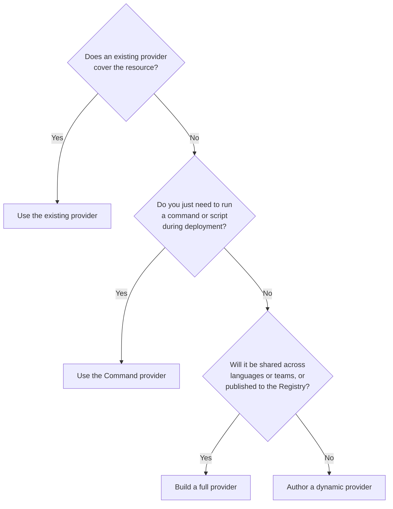

A dynamic provider lets you implement a resource's create, read, update, and delete (CRUD) logic directly inside a Pulumi program, without building and publishing a separate provider package. This guide walks through when to choose a dynamic provider, the interface you implement, and complete working examples in TypeScript and Python.

For a conceptual overview of what dynamic providers are and how they execute, see [Dynamic providers](/docs/iac/concepts/providers/dynamic-providers/) in the concepts documentation.

{}
Dynamic providers are supported only in TypeScript and Python. For other languages, build a [full provider](/docs/iac/guides/building-extending/providers/build-a-provider/).
{}

## When to use a dynamic provider

A dynamic provider is the right tool when you need to manage a resource that no existing Pulumi provider supports, the logic is specific to a single program, and you don't need to share it across languages or teams. Before reaching for one, consider the alternatives:

- **An existing provider.** Search the [Pulumi Registry](/registry/) first. If a well-maintained provider already covers your resource, use it. If a Terraform or OpenTofu provider exists, [Any Terraform Provider](/docs/iac/concepts/providers/any-terraform-provider/) lets you consume it directly.
- **The Command provider.** If you only need to run a command or script as part of provisioning — rather than model a resource with a real lifecycle — the [Command provider](https://www.pulumi.com/registry/packages/command/) is lighter weight.
- **A full provider.** If the provider should be reusable across languages, shared with other teams, published to the Registry, or needs `import` support, build a [full provider](/docs/iac/guides/building-extending/providers/build-a-provider/) instead.



Keep these constraints in mind when choosing a dynamic provider:

- A dynamic provider can only be used from programs written in the same language as the provider.
- The `read` method is not currently functional, so [`pulumi import`](/docs/iac/cli/commands/pulumi_import/) and the static [`get` method](/docs/iac/concepts/resources/get/) are not supported. This is tracked in [pulumi/pulumi#16175](https://github.com/pulumi/pulumi/issues/16175).
- Provider methods are serialized to run in a separate process, which limits what code they can capture. See [function serialization](/docs/iac/concepts/functions/function-serialization/).

## The resource provider interface

You author a dynamic provider by implementing the `pulumi.dynamic.ResourceProvider` interface. Only `create` is required; in practice you will usually implement `update` and `delete` as well, and often `check` and `diff`. Each method can be asynchronous, and most implementations perform network I/O to provision resources in a backing API.

Pulumi calls these methods at well-defined points in a deployment:

1. In all cases, Pulumi first calls `check` with the resource arguments to give the provider a chance to verify that the arguments are valid.
1. If Pulumi determines the resource has not yet been created, it calls `create`.
1. If another deployment happens and the resource already exists, Pulumi calls `diff` to determine whether a change can be made in place or whether a replacement is needed.
1. If no replacement is needed, Pulumi calls `update`.
1. If a replacement is needed, Pulumi calls `create` for the new resource and then `delete` for the old one.
1. If Pulumi needs to read an existing resource without managing it directly, it calls `read`. (Note: `read` is not currently functional for dynamic providers.)

### configure(ConfigureRequest)

The `configure` method is invoked once after the provider is loaded, before any other method. It receives a `ConfigureRequest` containing the current stack's configuration. Use it to perform setup and to read [configuration values](/docs/iac/concepts/config/) — such as credentials — for use in the other methods. This method is optional.

### check(olds, news)

The `check` method is invoked before any other method. It receives the old input properties stored in state after the previous update, and the new inputs from the current deployment. It has two jobs:

1. Verify that the inputs are valid, returning useful error messages if they are not.
1. Return a set of checked inputs.

The inputs returned from `check` are the inputs Pulumi uses for all further processing of the resource, including the values passed to `diff`, `create`, and `update`. In many cases the news can be returned directly. When the provider needs to populate defaults or normalize values, do so in `check` so the data is complete before it reaches the other methods.

### create(inputs)

The `create` method is invoked when the resource's URN is not found in the existing state. The engine passes it the checked inputs returned from `check`. The method creates the resource in the backing API and returns:

1. An `id` that uniquely identifies the resource in the backing provider for later lookups.
1. A set of `outputs` that are returned to the user code as properties on the resource and stored in state.

If an error occurs, throw an exception to surface it to the user.

### diff(id, olds, news)

The `diff` method is invoked when the resource's URN already exists. It receives the `id` returned by `create`, the old outputs from state, and the checked inputs from the current deployment. It returns four optional values:

- `changes`: `true` if the provider believes there is a difference between the olds and news that should trigger an update or replace.
- `replaces`: an array of property names whose change should force a replacement instead of an in-place update. Replacements might involve downtime, so use this only when a diff cannot be implemented as an in-place update.
- `stables`: an array of property names known not to change between updates. Pulumi uses this to process some [`apply`](/docs/iac/concepts/inputs-outputs/#working-with-outputs) calls during previews.
- `deleteBeforeReplace`: `true` if a replacement requires deleting the existing resource before creating the new one. By default, Pulumi creates the new resource before deleting the old one to avoid downtime.

### update(id, olds, news)

The `update` method is invoked when `diff` indicates a replacement is unnecessary. It receives the `id` of the resource, the old outputs from state, and the new checked inputs. It updates the existing resource in the backing API and returns a new set of `outputs`. If an error occurs, throw an exception to surface it to the user.

### delete(id, props)

The `delete` method is invoked when the URN exists in the previous state but not in the new desired state, or when a replacement is needed. It receives the `id` of the resource and the old outputs from state, and deletes the corresponding resource from the backing API. Nothing needs to be returned.

### read(id, props)

{}
The `read` method is not currently functional for dynamic providers. Attempting to invoke it — for example, by running `pulumi import` or using the static `get` method on a dynamic resource — results in an unimplemented exception. This is tracked in [pulumi/pulumi#16175](https://github.com/pulumi/pulumi/issues/16175). If your use case requires importing existing resources, implement a [component resource](/docs/iac/concepts/components/) backed by a [native provider](/docs/iac/guides/building-extending/providers/build-a-provider/) instead.
{}

When functional, `read` looks up an existing resource by `id` and returns its canonical `id` and output properties. It is intended to support the static [`get` method](/docs/iac/concepts/resources/get/), [`pulumi import`](/docs/iac/cli/commands/pulumi_import/), and [`pulumi refresh`](/docs/iac/cli/commands/pulumi_refresh/).

## Strongly typed inputs

Although the input properties passed to a `pulumi.dynamic.Resource` are usually [Input values](/docs/iac/concepts/inputs-outputs/), your provider's methods are invoked with the *fully resolved* input values. In statically typed languages, model this with two interfaces: one for the resource constructor, using `Input<T>` types, and one for the provider methods, using the un-wrapped `T` types.



{}

```typescript
// Exported type used by the resource constructor.
export interface MyResourceInputs {
    myStringProp: pulumi.Input<string>;
    myBoolProp: pulumi.Input<boolean>;
}

// Non-exported type used by the provider methods.
// The same inputs, but as un-wrapped types.
interface MyResourceProviderInputs {
    myStringProp: string;
    myBoolProp: boolean;
}

class MyResourceProvider implements pulumi.dynamic.ResourceProvider {
    async create(inputs: MyResourceProviderInputs): Promise<pulumi.dynamic.CreateResult> {
        // ...
    }
}

class MyResource extends pulumi.dynamic.Resource {
    constructor(name: string, props: MyResourceInputs, opts?: pulumi.CustomResourceOptions) {
        super(new MyResourceProvider(), name, props, opts);
    }
}
```

{}
{}

```python
from pulumi import Input, ResourceOptions
from pulumi.dynamic import Resource, ResourceProvider, CreateResult
from typing import Optional

# Type used by the resource constructor.
class MyResourceInputs(object):
    my_string_prop: Input[str]
    my_bool_prop: Input[bool]

    def __init__(self, my_string_prop, my_bool_prop):
        self.my_string_prop = my_string_prop
        self.my_bool_prop = my_bool_prop

# The same inputs, but as un-wrapped types, used by the provider methods.
class _MyResourceProviderInputs(object):
    my_string_prop: str
    my_bool_prop: bool

    def __init__(self, my_string_prop: str, my_bool_prop: bool):
        self.my_string_prop = my_string_prop
        self.my_bool_prop = my_bool_prop

class MyResourceProvider(ResourceProvider):
    def create(self, inputs: _MyResourceProviderInputs) -> CreateResult:
        # ...
        return CreateResult(id_="...", outs={})

class MyResource(Resource):
    def __init__(self, name: str, props: MyResourceInputs, opts: Optional[ResourceOptions] = None):
        super().__init__(MyResourceProvider(), name, {**vars(props)}, opts)
```

{}



{}
How data is passed between the core Pulumi program and your dynamic provider has some nuances. Learn more in [pulumi/pulumi#16582](https://github.com/pulumi/pulumi/issues/16582).
{}

## Strongly typed outputs

Any values returned in the `outs` property of your `create` (or `update`) result become outputs on the resource. By default these outputs are *not* type-safe: the base `pulumi.dynamic.Resource` class knows nothing about them. To access them with strong typing, declare each output as a class member on your `pulumi.dynamic.Resource` subclass. The member name must match the output property name returned by `create`.



{}

In TypeScript, declare each output with the `declare` keyword and the type `pulumi.Output<T>`:

```typescript
interface MyResourceProviderOutputs {
    myNumberOutput: number;
    myStringOutput: string;
}

class MyResourceProvider implements pulumi.dynamic.ResourceProvider {
    async create(inputs: MyResourceProviderInputs): Promise<pulumi.dynamic.CreateResult> {
        // Values are for illustration only.
        return { id: "...", outs: { myNumberOutput: 12, myStringOutput: "some value" } };
    }
}

export class MyResource extends pulumi.dynamic.Resource {
    declare readonly myStringOutput: pulumi.Output<string>;
    declare readonly myNumberOutput: pulumi.Output<number>;

    constructor(name: string, props: MyResourceInputs, opts?: pulumi.CustomResourceOptions) {
        super(new MyResourceProvider(), name, { myStringOutput: undefined, myNumberOutput: undefined, ...props }, opts);
    }
}
```

{}
Use the `declare` keyword rather than `public readonly` for output properties. Using `public readonly` with the definite assignment assertion (`!`) can cause outputs to be `undefined` in some TypeScript configurations. The `declare` keyword tells TypeScript the property exists without emitting any JavaScript, which is correct because Pulumi sets these properties dynamically.
{}

{}
{}

In Python, declare each output as a typed class member of type `Output[T]`, and seed it as `None` in the inputs passed to `super().__init__`:

```python
from pulumi import ResourceOptions, Output
from pulumi.dynamic import Resource, ResourceProvider, CreateResult
from typing import Optional

class MyResourceProvider(ResourceProvider):
    def create(self, inputs):
        # Values are for illustration only.
        return CreateResult(id_="foo", outs={"my_number_output": 12, "my_string_output": "some value"})

class MyResource(Resource):
    my_string_output: Output[str]
    my_number_output: Output[int]

    def __init__(self, name: str, props: MyResourceInputs, opts: Optional[ResourceOptions] = None):
        super().__init__(MyResourceProvider(), name, {"my_string_output": None, "my_number_output": None, **vars(props)}, opts)
```

{}



## A minimal example: a stable random ID

This example generates a random ID once, when the resource is created, and keeps it stable across subsequent deployments by storing it in state. Generating the value in regular program code instead would produce a new value on every run. It implements only `create` — the result is similar to the [`random` provider](https://www.pulumi.com/registry/packages/random/), specific to your program and language.



{}

```typescript

```

{}

{}

```python

```

{}



## A complete example: managing GitHub labels

This example manages GitHub repository labels through the GitHub REST API. It demonstrates the full interface — `configure`, `check`, `create`, `diff`, `update`, and `delete` — and the strongly typed inputs and outputs patterns described above.

A few things to note as you read it:

- `configure` reads the GitHub token from [Pulumi config](/docs/iac/concepts/config/) once, so individual resource declarations don't have to pass credentials.
- `check` validates the label color before any other method runs, returning a clear failure message for invalid input.
- `diff` reports whether the resource changed. Because GitHub labels can be updated in place, it never forces a replacement.
- The REST client is constructed inside each method rather than shared, because the methods are serialized and run in a separate process.



{}

```typescript

```

{}

{}

```python

```

{}



## Managing credentials

A dynamic provider that calls an API needs credentials. Passing credentials as resource inputs is an antipattern — it puts secrets in your resource declarations and in state. Instead, supply them to the provider out of band, in one of two ways:

- **Pulumi config**, read in `configure`, as the GitHub labels example does above. Set the value with `pulumi config set githubToken <VALUE> --secret`.
- **Environment variables**, read inside each provider method. A benefit of this approach is that if the credentials change before `pulumi destroy` runs, there is no need to first run `pulumi up` to refresh them.

The following example manages a fictional widget service through its REST API at `https://api.example.com`, reading an API token from the `WIDGET_API_TOKEN` environment variable. Each method reads the variable itself, rather than sharing a client, because the methods are serialized and run in a separate process:



{}

```typescript
import * as pulumi from "@pulumi/pulumi";

interface WidgetInputs {
    name: string;
    size: string;
}

const widgetProvider: pulumi.dynamic.ResourceProvider = {
    async create(inputs: WidgetInputs): Promise<pulumi.dynamic.CreateResult> {
        const apiKey = process.env.WIDGET_API_TOKEN;
        if (!apiKey) {
            throw new Error("the WIDGET_API_TOKEN environment variable is not set");
        }

        const response = await fetch("https://api.example.com/widgets", {
            method: "POST",
            headers: {
                "Authorization": `Bearer ${apiKey}`,
                "Content-Type": "application/json",
            },
            body: JSON.stringify({ name: inputs.name, size: inputs.size }),
        });
        if (!response.ok) {
            throw new Error(`failed to create widget: ${response.status} ${response.statusText}`);
        }

        const widget = await response.json();
        return { id: widget.id, outs: { ...inputs, ...widget } };
    },

    async delete(id: string, props: WidgetInputs): Promise<void> {
        const apiKey = process.env.WIDGET_API_TOKEN;
        if (!apiKey) {
            throw new Error("the WIDGET_API_TOKEN environment variable is not set");
        }

        const response = await fetch(`https://api.example.com/widgets/${id}`, {
            method: "DELETE",
            headers: { "Authorization": `Bearer ${apiKey}` },
        });
        if (!response.ok) {
            throw new Error(`failed to delete widget: ${response.status} ${response.statusText}`);
        }
    },
};

export class Widget extends pulumi.dynamic.Resource {
    constructor(name: string, props: WidgetInputs, opts?: pulumi.CustomResourceOptions) {
        super(widgetProvider, name, props, opts);
    }
}
```

{}

{}

```python
import os
import requests
import pulumi
from pulumi.dynamic import Resource, ResourceProvider, CreateResult

class WidgetProvider(ResourceProvider):
    def create(self, inputs) -> CreateResult:
        api_key = os.environ.get("WIDGET_API_TOKEN")
        if not api_key:
            raise Exception("the WIDGET_API_TOKEN environment variable is not set")

        response = requests.post(
            "https://api.example.com/widgets",
            headers={"Authorization": f"Bearer {api_key}"},
            json={"name": inputs["name"], "size": inputs["size"]})
        response.raise_for_status()

        widget = response.json()
        return CreateResult(id_=widget["id"], outs={**inputs, **widget})

    def delete(self, id: str, props):
        api_key = os.environ.get("WIDGET_API_TOKEN")
        if not api_key:
            raise Exception("the WIDGET_API_TOKEN environment variable is not set")

        response = requests.delete(
            f"https://api.example.com/widgets/{id}",
            headers={"Authorization": f"Bearer {api_key}"})
        response.raise_for_status()

class Widget(Resource):
    def __init__(self, name, props, opts=None):
        super().__init__(WidgetProvider(), name, props, opts)
```

{}



## Forcing updates after provider code changes

When you modify the code of a dynamic provider — for example, changing the logic in `create` or `update` — Pulumi does not automatically detect the change. From Pulumi's perspective the resource's inputs haven't changed, so no update is triggered.

To force an update after changing your provider code, use one of these options:

- **Add a version input.** Include a version property in your resource inputs and increment it when you change the provider code. Pulumi sees the difference and triggers an update.
- **Use `diff` to force changes.** Implement a `diff` method that returns `{ changes: true }` when you want to force an update.
- **Delete and recreate.** Remove the resource from your program, run `pulumi up`, then add it back. This recreates the resource with the updated provider code.
