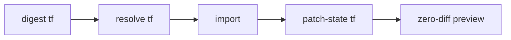

[`pulumi-tool-import`](https://github.com/pulumi-proserv/pulumi-tool-import) is a Pulumi CLI tool plugin that automates the import step of a Terraform-to-Pulumi migration: it analyzes Terraform state, resolves the import IDs `pulumi import` needs, runs the import in failure-isolating batches, and patches the imported state so `pulumi preview` comes back clean. It ships with agent skills that let an AI agent — Pulumi Neo, Claude Code, Cursor, Codex, or any agent that supports [Agent Skills](/docs/ai/skills/) — drive the full migration workflow and validate its own work at each stage.

The tool is built and maintained by [Pulumi Professional Services](/proserv/) and is not part of the core Pulumi product. It is pre-v1: pin the version you install and read the [changelog](https://github.com/pulumi-proserv/pulumi-tool-import/blob/main/CHANGELOG.md) before upgrading. For an overview of all Terraform migration options, see [Migrating from Terraform](/docs/iac/guides/migration/migrating-to-pulumi/from-terraform/).

## When to use this workflow

This workflow targets migrations where the goal is a **hand-authored, idiomatic Pulumi program** — typically TypeScript with [components](/docs/iac/concepts/components/) mirroring your Terraform modules — that imports the live infrastructure and reaches a **zero-diff preview** before the first `pulumi up`. It fills the gaps that make large imports slow by hand:

1. Import IDs, including composite ones (a Lambda permission imports as `FunctionName/StatementId`), must be discovered and formatted per resource.
1. Terraform state contains plaintext secrets that shouldn't pass through whoever (or whatever) orchestrates the migration.
1. A single bad import ID fails an entire `pulumi import` run.
1. Some fields are never returned by the cloud API or the provider's Read implementation, so freshly imported state shows diffs the program didn't cause.
1. Some resource types (`aws_iam_policy_attachment`, `aws_vpn_gateway_route_propagation`, and other association resources) declare no importer and cannot be imported at all.

For a small number of resources, [`pulumi import`](/docs/iac/guides/migration/import/) on its own is simpler. For automated code conversion instead of hand-authoring, see the [Terraform migration overview](/docs/iac/guides/migration/migrating-to-pulumi/from-terraform/).

## Prerequisites

1. The [Pulumi CLI](/docs/install/) — the plugin runs through the plugin runner and uses the Automation API, so the CLI is required.
1. Terraform state: a local `.tfstate` file **or** credentials for a TFC-compatible remote backend (Terraform Cloud/Enterprise or Scalr).
1. The Terraform configuration directory containing the `.tf` files, with `terraform init` (or `tofu init`) run so the provider in `.terraform.lock.hcl` is resolvable.
1. Cloud credentials in the environment for the commands that call AWS. If your organization sources credentials from [ESC](/docs/esc/), wrap commands with `pulumi env run <esc-env> -- <cmd>`.

Install the plugin from the repository's GitHub releases:

```bash
pulumi plugin install tool import \
  --server github://api.github.com/pulumi-proserv/pulumi-tool-import
```

The `github://api.github.com/<owner>/<repo>` server form is required; a plain `https://github.com/...` URL fails because release assets live under `/releases/download/<tag>/`. Verify the install:

```bash
pulumi plugin run import -- version
```

## Running with an agent (recommended)

The intended way to run the workflow is to load the [`pulumi-terraform-workspace-migration`](https://github.com/pulumi-proserv/pulumi-tool-import/blob/main/skills/pulumi-terraform-workspace-migration/SKILL.md) skill into your coding agent and let it orchestrate the pipeline below. The skill adds the judgment the commands don't encode:

1. **Node-by-node, zero-diff gated.** The migration proceeds through modules and resources in dependency order, and each node must reach a zero-diff targeted preview before the next begins.
1. **Value tracing.** Every value in the Pulumi program must trace to its Terraform source — `var.*` to stack config, locals to in-program derivations, `terraform_remote_state` to ESC environment references — never a hardcoded copy of an evaluated value.
1. **Deployed state wins.** When the Terraform code, the state, and the live cloud disagree, the deployed state is the source of truth, and each drift decision is documented.
1. **Modules become components.** The companion `pulumi-terraform-module-to-component` skill covers translating each Terraform module into a Pulumi component that reproduces the module's interface.

Every command also runs standalone, so the pipeline below works equally well by hand.

## The migration pipeline

The commands form a pipeline, and each one writes an artifact the next one reads:



Keep every generated artifact in a gitignored directory inside the Pulumi project (for example `.import/`) — digests and state exports can contain sensitive values, and an ignored *directory*, unlike filename patterns, can't miss a new artifact type.

### 1. Digest the Terraform state

`digest tf` analyzes the Terraform configuration and state into a single JSON sidecar describing every module instance, its inputs and outputs, and every resource with its attributes and import ID:

```bash
pulumi plugin run import -- digest tf \
  --from ./terraform --state-file terraform.tfstate \
  --pulumi-project myproject --pulumi-stack dev \
  --project-dir ./pulumi \
  --out .import/tf-digest.json
```

For a remote backend, replace `--state-file` with `--hostname`, `--organization`, `--workspace`, and `--token-env`; the state is read into memory only.

Two important things happen during the digest:

1. **Secrets are extracted safely.** Every attribute the provider schema marks sensitive is redacted from the digest and set as an encrypted stack config secret via `pulumi config set --secret`. An agent working from the digest never sees a secret value. (The standalone `set-secrets` command sets individual secrets by explicit mapping without re-running the digest.)
1. **Non-importable resource types are detected.** The digest loads the Terraform provider and probes each resource type's import support directly — no credentials or API calls involved — and flags types with no importer as `nonImportable` so later stages route around them.

Treat the digest as sensitive anyway: values embedded inside non-sensitive string fields are not redacted.

### 2. Generate and resolve the import file

Write the Pulumi program (or its first node), then generate an import skeleton and fill in the real import IDs:

```bash
pulumi preview --import-file import.json

pulumi plugin run import -- resolve tf \
  --digest .import/tf-digest.json --import-file import.json \
  --mapping-file mappings.yaml --out imports-ready.json
```

The skeleton's entries carry URNs built from your hand-authored program's Pulumi-style logical names, so the mappings file bridges the two naming schemes — Terraform addresses on the left, your program's names on the right. Resolution is deterministic: the digest plus the mappings fully determine the output, so rerunning `resolve tf` after a rename produces a corrected file rather than requiring hand edits.

```yaml
modules:
  # TF module path → Pulumi component instance name
  "module.core_rds": "coreRds"
resources:
  # TF resource address → Pulumi resource name (only where they differ)
  "module.core_rds.aws_rds_cluster.aurora_cluster": "coreRds-cluster"
```

Resources flagged `nonImportable` are held out of the import file — an entry for them is guaranteed to fail — and written to a sidecar (`imports-ready.non-importable.json`) for state injection in step 4.

### 3. Import in batches

```bash
pulumi plugin run import -- import \
  --file imports-ready.json --project-dir ./pulumi --stack dev
```

The command imports in batches (100 resources by default; tune with `--batch-size`). When a batch doesn't fully land, it re-imports the missing resources one at a time to identify exactly which IDs failed and carries on, so one run reports **every** bad import ID. Success is determined by reading stack state afterward, which makes reruns after fixing IDs skip everything already imported. Use `--dry-run` to inspect the plan first.

### 4. Patch state and inject non-importable resources

Fields the cloud API doesn't return — write-only values like an RDS `masterPassword`, Lambda function code (the API returns an expiring presigned URL, not the package), provider-side defaults — show up after import as diffs the program didn't cause. `patch-state tf` fills them from the digest, guided by a curated per-resource-type fields file, and injects the non-importable resources from step 2's sidecar directly into state:

```bash
pulumi plugin run import -- patch-state tf \
  --digest .import/tf-digest.json \
  --fields data/aws-import-diff-fields.json \
  --mapping-file mappings.yaml --config-dir ./terraform \
  --non-importable imports-ready.non-importable.json \
  --project-dir ./pulumi --stack dev
```

In this stack mode the command exports, backs up, patches, injects, imports, and verifies the state itself, restoring the backup automatically if any injected resource doesn't preview as unchanged. Never let a `pulumi up` create a non-importable resource that already exists — association resources typically fail against a pre-existing object partway through the deployment.

### 5. Verify with a zero-diff preview

```bash
pulumi preview
```

The migration is done when the preview shows no real diffs. Diffs that remain fall into known classes — provider defaults, computed cascades like a Lambda `qualifiedArn` — and anything outside them means a program bug or unpreserved drift to investigate. Investigate `replace` diffs first: they mean the program would destroy and recreate a live resource.

## Next steps

1. Read the [tool README](https://github.com/pulumi-proserv/pulumi-tool-import#readme) for the full flag reference of every command.
1. See [Migrating from Terraform](/docs/iac/guides/migration/migrating-to-pulumi/from-terraform/) for the other migration paths, including automated conversion.
1. Learn how [importing resources](/docs/iac/guides/migration/import/) works in Pulumi generally.
1. For help with a larger migration, [Pulumi Professional Services](/proserv/) runs these migrations using this exact workflow.
