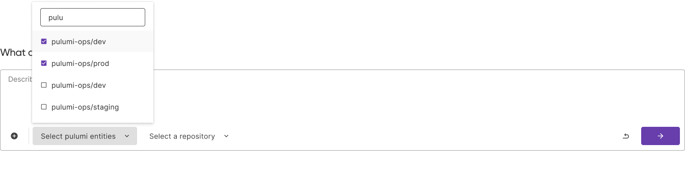

Tasks are Neo's primary unit of work. Each task represents a distinct conversation where you describe what you want to accomplish, and Neo plans and executes the necessary infrastructure changes. Tasks provide structure, context, and boundaries for Neo's operations.

## Key Characteristics

### User Isolation

Tasks are completely isolated between users:

- Each task belongs exclusively to the user who created it
- Tasks cannot be shared, transferred, or viewed by other users
- User permissions and [RBAC](/docs/pulumi-cloud/access-management/rbac/) are enforced within each task
- Conversation history and context remain private to the creating user

This isolation prevents the opportunity for escalation.

### Task Plans

When you give Neo a complex request, it creates a task plan outlining the steps it will take to accomplish your goal. This plan provides transparency into Neo's approach and gives you the opportunity to adjust the strategy before execution begins.

#### Example Plan

The following is a representative plan in response to a user requesting to locate and update outdated Lambda functions:

1. Identify all Lambda functions using Node.js
2. Determine the appropriate target runtime for each
3. Create code changes to update the runtime versions
4. Run a preview to validate all changes
5. Create a pull request with the updates

### Approvals

Neo will seek approval before opening a PR or running a preview.

### Pulumi Previews

At any time, you can explicitly ask Neo to run a [pulumi preview](/docs/iac/cli/commands/pulumi_preview/). As well, if Neo proposes code changes as part of a task, it will request to run a preview to help obtain feedback on the changes. [Learn more](/docs/iac/neo/running-previews/) about Neo and previews.

### Pull Requests

If a task results in Neo proposing code modifications, it will offer to open a [pull request](/docs/iac/neo/pull-requests/) once the user is satisfied with the implementation. PRs can also be modified after they've been opened.

## Setting the Entity Context

You can explicitly set the [stack](/docs/iac/concepts/stacks/) and [repository](/docs/iac/concepts/projects/) context when initiating a task. This helps Neo understand exactly where to focus its operations.

## Interruptions and Resuming

Tasks continue running even if you close your browser or navigate away. When you return to the task later, Neo will have continued working and will show you any progress made while you were away. You can pick up the conversation exactly where you left off, with full context preserved.

## Task History

Neo tasks are saved and accessible through the Agent Tasks page in Pulumi Cloud. Though the entire task history is available at any time, the task cache may be lost if the agent idles for an hour or more.
