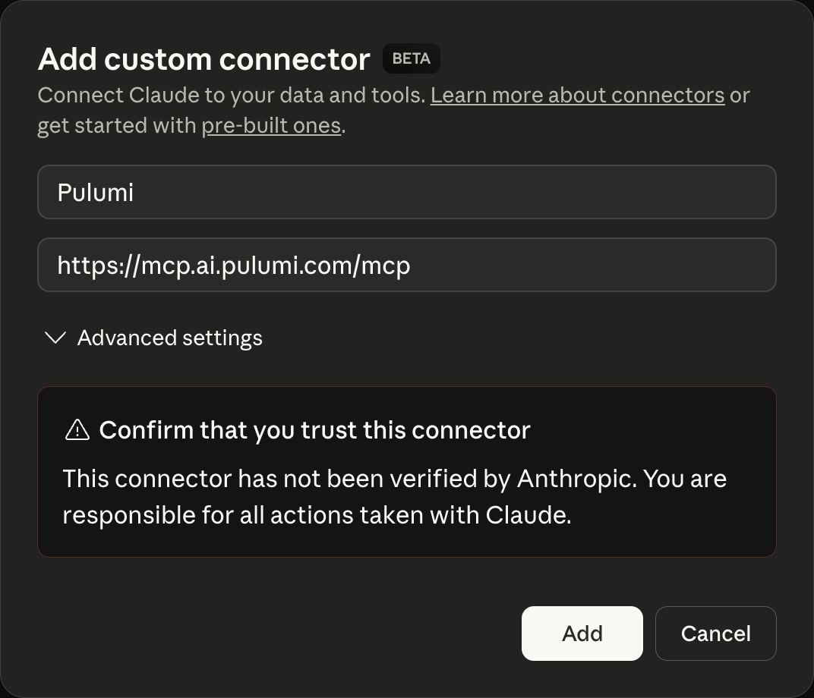

The Pulumi Model Context Protocol (MCP) server enables AI-powered coding assistants to access your Pulumi Cloud resources and delegate infrastructure tasks to [Pulumi Neo](/docs/pulumi-cloud/neo/). This integration allows you to query your cloud infrastructure, search for resources, and launch automated infrastructure workflows - all from within the AI assistant of your choice.

## What is the Pulumi MCP server?

The [Model Context Protocol (MCP)](https://modelcontextprotocol.io) is a specification that allows language models to interact with external tools and data sources in a structured way. Pulumi's MCP server implementation provides AI assistants with the ability to:

- **Query your Pulumi Cloud stacks** and their resources
- **Search across all cloud resources** in your organization using advanced queries
- **Access the Pulumi Registry** for resource information, properties, and documentation
- **Get policy violation reports** for your infrastructure
- **Manage organization members** and their access
- **Delegate complex infrastructure tasks to [Pulumi Neo](/docs/pulumi-cloud/neo)** for automated execution
- **Generate infrastructure code** using Registry tools and best practices

This enables a more intuitive, conversational approach to infrastructure development where you can describe what you want to build in natural language, and the AI assistant can discover resources, generate code, and launch automated workflows—all without leaving your editor.

## Supported AI assistants

The Pulumi MCP server works with various AI-powered development tools:

- **[Cursor](https://cursor.sh/)** - AI-first code editor
- **[Anthropic's Claude Code](https://claude.ai/code)** - AI assistant for coding
- **[Windsurf](https://codeium.com/windsurf)** - AI development environment
- **[Claude Desktop](https://claude.ai/download)** - Desktop app for Claude
- Any other AI assistant that supports the Model Context Protocol with OAuth

## Configuration

The Pulumi MCP server is hosted at `https://mcp.ai.pulumi.com/mcp` and uses OAuth authentication. When you first connect, a web page will open where you'll enter your Pulumi Access Token and select which organization to use.

### Cursor

Add the Pulumi MCP server to Cursor by clicking the following button:

[](cursor://anysphere.cursor-deeplink/mcp/install?name=pulumi&config=eyJ0cmFuc3BvcnQiOiJodHRwIiwidXJsIjoiaHR0cHM6Ly9tY3AuYWkucHVsdW1pLmNvbS9tY3AifQ%3D%3D)

Alternatively, add the Pulumi MCP server to your Cursor configuration. Create or edit `.cursor/mcp.json` in your home directory or project root:

```json
{
  "mcpServers": {
    "pulumi": {
      "transport": "http",
      "url": "https://mcp.ai.pulumi.com/mcp"
    }
  }
}
```

After adding the configuration:

1. Click "Connect" button on the "Tools & MCP" page
2. Enter your [Pulumi Access Token](https://app.pulumi.com/account/tokens)
3. Select your organization
4. Verify the connection in Cursor's MCP section

### Claude Code

Add the Pulumi MCP server to Claude Code by running:

```bash
claude mcp add pulumi https://mcp.ai.pulumi.com/mcp
```

Launch Claude Code, enter the `/mcp` slash-command, select "pulumi" and connect it. Authenticate via the browser popup.

### Claude Desktop

For Claude Desktop, add the MCP server to your configuration file:

<p align="center">
  
</p>

After adding the configuration:

1. Restart Claude Desktop
2. Authenticate via the browser popup when prompted
3. Verify the connection in Claude's settings

### Windsurf

In Windsurf, configure the MCP server through the IDE settings:

1. Open Windsurf Settings (Cmd/Ctrl + ,)
2. Navigate to "MCP Servers" section
3. Add a new server configuration:

```json
{
  "pulumi": {
    "serverUrl": "https://mcp.ai.pulumi.com/mcp"
  }
}
```

After adding the configuration, authenticate via browser when prompted.

## Available tools

The Pulumi MCP server provides several tools that AI assistants can use to interact with your Pulumi infrastructure:

### Pulumi Cloud tools

These tools query your Pulumi Cloud organization:

- **`get-stacks`** - List all Pulumi stacks in your organization. Returns stack names, descriptions, last update times, and resource counts.

- **`resource-search`** - Search and analyze Pulumi-managed cloud resources across all stacks using Lucene query syntax. Query by resource type, name, tags, properties, or any combination. Examples:
  - Find all S3 buckets: `type:aws:s3/bucket:Bucket`
  - Search by name: `name:*production*`
  - Find untagged resources: `NOT _exists_:tags`

- **`get-policy-violations`** - Get policy violations for your stacks. Returns violations detected by Pulumi's policy-as-code engine.

- **`get-users`** - List members of your Pulumi organization with their roles and details.

### Neo delegation tools

These tools launch and manage automated infrastructure tasks via Pulumi Neo:

- **`neo-bridge`** - Launch a new Pulumi Neo task. Neo will analyze your request, create a plan, and execute it autonomously. Returns a link to track progress in Pulumi Console.

- **`neo-get-tasks`** - List your Neo tasks and their current status.

- **`neo-continue-task`** - Continue with or switch to another Neo task.

- **`neo-reset-conversation`** - Reset the conversation context for Neo tasks.

### Registry tools

These tools query the Pulumi Registry for resource information:

- **`get-type`** - Get the JSON schema for a specific type reference.

- **`get-resource`** - Get detailed information about a Pulumi Registry resource, including all properties, methods, and examples.

- **`get-function`** - Get information about a Pulumi function (data source).

- **`list-resources`** - List all resource types for a given provider and module.

- **`list-functions`** - List all functions for a given provider and module.

### Deployment tools

- **`deploy-to-aws`** - Automatically analyzes your application files and generates Pulumi infrastructure code for AWS deployment.

## Available prompts

The Pulumi MCP server provides prompts for common workflows:

- **`deploy-to-aws`** - Deploy application code to AWS by generating Pulumi infrastructure

- **`convert-terraform-to-typescript`** - Converts Terraform HCL code to Pulumi TypeScript

## Getting started

Here's a typical workflow using an AI assistant with the Pulumi MCP server:

### 1. Authentication

When you first connect, you'll see a browser window open:

*A browser window opens prompting for authentication*

1. Enter your [Pulumi Access Token](https://app.pulumi.com/account/tokens)
2. Select which organization to use
3. Return to your AI assistant—it's now connected

### 2. Discover your infrastructure

Ask your AI assistant to explore what you have deployed:

**"What stacks do I have in my Pulumi organization?"**

The assistant will use `get-stacks` to list all your stacks.

**"Show me all the S3 buckets across my stacks"**

The assistant will use `resource-search` with the query `type:aws:s3/bucket:Bucket` to find all S3 buckets.

### 3. Generate infrastructure code

Use natural language to describe what you want to build:

**"I need to create an AWS Lambda function that processes S3 events. Look up the Lambda and S3 bucket properties and generate the TypeScript code."**

The AI assistant will:

- Use `list-resources` to find AWS Lambda and S3 resources
- Use `get-resource` to get detailed property information
- Generate TypeScript code with proper types and configurations

### 4. Delegate to Neo for execution

For complex infrastructure tasks, delegate to Neo:

**"Ask Neo to analyze all my S3 buckets for security issues and create a pull request with fixes"**

The assistant will:

- Use `neo-bridge` to launch a Neo task
- Provide a link to track Neo's progress in Pulumi Console
- Neo will autonomously create a plan, analyze buckets, generate fixes, and create a PR

## Integration with Pulumi Neo

The Pulumi MCP server enables seamless delegation to Pulumi Neo for complex infrastructure automation. Simply tell your AI assistant to invoke Neo, and it will create a task that executes autonomously in Pulumi Cloud.

### When to use Neo

Delegate to Neo for tasks that require:

- **Multi-step automation** - Complex workflows across multiple resources
- **Policy compliance** - Scanning and fixing policy violations
- **Code generation at scale** - Creating or modifying infrastructure across many stacks
- **Pull request workflows** - Automated changes with Git integration
- **Advanced analysis** - Security scans, cost optimization, resource cleanup

## Examples

### Finding and analyzing resources

**You:** "Do I have any S3 buckets with public access enabled? If so, which stacks are they in?"

**AI Assistant response:**

1. Uses `resource-search` with query: `type:aws:s3/bucket:Bucket AND acl:public-read`
2. Lists the buckets found with their stack names
3. Provides details about their configuration

### Generating infrastructure with Registry lookup

**You:** "I need to set up an Azure Container Registry with geo-replication. Look up the properties and generate the code."

**AI Assistant response:**

1. Uses `list-resources` to find Azure container registry resources
2. Uses `get-resource` to retrieve detailed property information
3. Generates TypeScript code with geo-replication configuration
4. Includes explanation of key properties

### Delegating security fixes to Neo

**You:** "Ask Neo to find all my AWS security groups that allow SSH from 0.0.0.0/0 and create a PR restricting them to my office IP range"

**AI Assistant response:**

1. Uses `neo-bridge` to launch a task with the instructions
2. Provides link: "Neo task created: https://app.pulumi.com/pulumi/tasks/abc123"
3. Neo autonomously:
   - Searches for security groups with overly permissive SSH rules
   - Creates a plan to restrict access
   - Generates the infrastructure code changes
   - Creates a pull request with the fixes
   - Comments on the PR with explanation

### Delegating infrastructure migration to Neo

**You:** "Ask Neo to migrate all my Lambda functions from Python 3.8 to Python 3.12, test them, and create PRs for each stack"

**AI Assistant response:**

1. Uses `neo-bridge` to launch the migration task
2. Neo creates a plan covering:
   - Finding all Lambda functions with Python 3.8 runtime
   - Updating runtime to Python 3.12
   - Checking for compatibility issues
   - Running tests
   - Creating separate PRs for each affected stack
3. Executes the plan autonomously
4. Reports progress and results

### Checking policy compliance

**You:** "What policy violations do I have in my production stacks?"

**AI Assistant response:**

1. Uses `get-stacks` to find stacks with "production" in the name
2. Uses `get-policy-violations` to retrieve violations
3. Groups and summarizes violations by type
4. Suggests: "Would you like Neo to fix these violations automatically?"

## Benefits

Using the Pulumi MCP server with AI assistants provides several key advantages:

### Reduced context switching

- Query your infrastructure without leaving your editor
- Get real-time answers about deployed resources
- Access organization information instantly

### Accelerated development

- Faster resource discovery through AI-powered search
- Automated code generation based on Registry schemas
- Quick access to documentation and examples

### Autonomous infrastructure automation

- Delegate complex tasks to Neo for hands-free execution
- Multi-step workflows completed automatically
- Pull request generation with explanations

### Enhanced learning

- Learn Pulumi concepts through conversational interaction
- Understand resource relationships across your infrastructure
- Get explanations of deployed infrastructure patterns

## Troubleshooting

### Authentication issues

If you're having trouble authenticating:

1. **Verify your Pulumi Access Token**: Ensure your token is valid at [app.pulumi.com/account/tokens](https://app.pulumi.com/account/tokens)
2. **Check organization access**: Verify you're a member of the organization you're trying to access
3. **Clear browser cache**: Clear your browser cache and retry authentication
4. **Check token permissions**: Ensure your token has appropriate permissions for your organization

### MCP server not connecting

If your AI assistant can't connect to the MCP server:

1. **Check network connectivity**: Ensure you can access `https://mcp.ai.pulumi.com`
2. **Verify configuration**: Check your MCP configuration file syntax
3. **Restart your editor**: Restart your AI assistant or editor application
4. **Check firewall**: Ensure your firewall allows HTTPS connections to pulumi.com domains

### Resource queries returning no results

If `resource-search` isn't finding resources:

1. **Verify stack has resources**: Use `get-stacks` to confirm stacks exist and have resources
2. **Check query syntax**: Ensure your Lucene query syntax is correct
3. **Try broader queries**: Start with `*` to find all resources, then narrow down
4. **Check organization**: Verify you're connected to the correct organization

### Neo tasks not starting

If `neo-bridge` fails to launch tasks:

1. **Check Neo access**: Verify you have access to Pulumi Neo in your organization
2. **Verify task description**: Ensure your task instructions are clear and actionable
3. **Check organization limits**: Some organizations may have task limits
4. **Review error message**: Check the error details for specific issues

## Learn more

- [Pulumi Neo documentation](/docs/pulumi-cloud/neo/)
- [Model Context Protocol specification](https://modelcontextprotocol.io)
- [Pulumi Registry](/registry/)
- [Pulumi Cloud API](https://www.pulumi.com/docs/pulumi-cloud/cloud-rest-api/)

## Next steps

Now that you have the Pulumi MCP server set up, explore these related topics:

- [Pulumi Neo](/docs/pulumi-cloud/neo/) for autonomous infrastructure automation
- [Pulumi concepts](/docs/iac/concepts/) to understand core IaC principles
- [Getting started guides](/docs/iac/get-started/) for your preferred cloud provider
- [Policy as Code](/docs/iac/crossguard/) for infrastructure compliance
