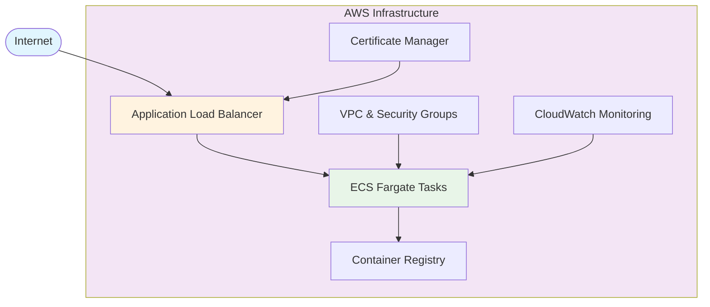

The Secure Web App Blueprint provides a production-ready foundation for deploying containerized web applications with security best practices built in. This blueprint combines Pulumi IDP's [Four Factors framework](/docs/idp/best-practices/four-factors) to deliver a comprehensive solution that enables product teams to quickly deploy secure, compliant web applications with minimal configuration.

> **Complete Implementation Available**: The full implementation of this blueprint is available in the [Secure Web App Blueprint repository](https://github.com/pulumi/idp-blueprint-secure-webapp), including templates, components, environments, policies, comprehensive documentation, and working examples.

## Overview

This blueprint is designed for teams that need to deploy web applications with enterprise-grade security, scalability, and operational excellence. It automates the provisioning of infrastructure components including container orchestration, load balancing, TLS termination, monitoring, and security controls.

### Use Cases

The Secure Web App Blueprint is ideal for:

- **Frontend applications**: React, Vue, Angular, or other single-page applications
- **API gateways**: RESTful APIs, GraphQL endpoints, microservice gateways  
- **Customer-facing web services**: E-commerce platforms, customer portals, marketing sites
- **Internal web tools**: Admin dashboards, internal applications, developer tools

### Key Features

- **Zero-trust networking**: Network segmentation with security groups and VPC isolation
- **Automated certificate management**: TLS/SSL certificates with automatic renewal
- **Horizontal scaling**: Auto-scaling based on CPU, memory, and request metrics
- **Container orchestration**: ECS Fargate for serverless container deployment
- **Load balancing**: Application Load Balancer with health checks
- **Monitoring and observability**: CloudWatch integration with custom metrics
- **Security scanning**: Container image vulnerability scanning
- **Compliance controls**: Built-in policy enforcement and audit logging

## Architecture

The Secure Web App Blueprint creates a secure, scalable architecture using AWS services:



For a detailed architectural overview, see the [Architecture Guide](https://github.com/pulumi/idp-blueprint-secure-webapp/blob/main/docs/architecture.md) in the blueprint repository.

### Core Components

The blueprint consists of the following infrastructure components:

#### WebAppComponent

The central component that orchestrates the deployment of a secure web application. It includes:

- **ECS Cluster**: Managed container orchestration platform
- **ECS Service**: Application service definition with desired capacity
- **Task Definition**: Container specifications, resource requirements, and environment variables
- **Application Load Balancer**: HTTP/HTTPS load balancing with SSL termination
- **Target Group**: Health check configuration and traffic routing
- **Security Groups**: Network access controls and traffic rules
- **VPC Configuration**: Private networking with public/private subnet architecture

#### Security Features

- **IAM Roles**: Least-privilege access controls for ECS tasks
- **KMS Encryption**: Data encryption at rest and in transit  
- **WAF Integration**: Web application firewall protection
- **VPC Flow Logs**: Network traffic monitoring and analysis
- **CloudTrail Logging**: API activity auditing and compliance tracking

#### Monitoring and Observability

- **CloudWatch Metrics**: Application and infrastructure monitoring
- **CloudWatch Logs**: Centralized log aggregation and analysis
- **Auto Scaling**: Dynamic scaling based on performance metrics
- **Health Checks**: Application and load balancer health monitoring

## Implementation

The Secure Web App Blueprint is implemented as a complete, production-ready solution following the [Four Factors framework](/docs/idp/best-practices/four-factors). The implementation includes:

### Four Factors Components

- **[Template](https://github.com/pulumi/idp-blueprint-secure-webapp/tree/main/template)**: Developer self-service interface with configurable parameters
- **[Component](https://github.com/pulumi/idp-blueprint-secure-webapp/tree/main/components)**: WebAppComponent with comprehensive AWS ECS implementation
- **[Environments](https://github.com/pulumi/idp-blueprint-secure-webapp/tree/main/environments)**: ESC environment configurations for dev, staging, and production
- **[Policies](https://github.com/pulumi/idp-blueprint-secure-webapp/tree/main/policies)**: CrossGuard policy pack enforcing security and compliance

### Additional Resources

- **[Documentation](https://github.com/pulumi/idp-blueprint-secure-webapp/tree/main/docs)**: Comprehensive guides for architecture, usage, and customization
- **[Examples](https://github.com/pulumi/idp-blueprint-secure-webapp/tree/main/examples)**: Basic and advanced usage patterns with complete working code

### Repository Structure

The blueprint follows the standard structure defined in the [Blueprint Structure guide](/docs/idp/best-practices/blueprints#blueprint-structure), providing a template for building additional blueprints.

## Getting Started

### Prerequisites

Before deploying the Secure Web App Blueprint, ensure you have:

1. **Pulumi IDP Environment**: Complete [IDP setup](/docs/idp/get-started) with your organization's configuration
2. **AWS Account**: Configured AWS account with appropriate permissions
3. **Container Registry**: ECR repository or external registry with your application image
4. **Domain Name**: Registered domain for TLS certificate (optional)
5. **Policy Framework**: [CrossGuard policies](/docs/iac/crossguard) configured for your organization

### Required Permissions

Your AWS user or role needs the following permissions:

- ECS cluster and service management
- Application Load Balancer creation and configuration
- VPC and subnet management
- IAM role and policy creation
- CloudWatch metrics and logs access
- Route 53 DNS management (if using custom domains)

### Installation

#### Step 1: Install the Blueprint

Create a new project using the secure web app template:

```bash
pulumi new secure-webapp
```

This will prompt you for configuration values and create a new project structure.

Alternatively, you can clone the complete blueprint repository and use the examples:

```bash
git clone https://github.com/pulumi/idp-blueprint-secure-webapp.git
cd idp-blueprint-secure-webapp/examples/basic
npm install
```

#### Step 2: Configure Your Application

Update the `Pulumi.yaml` configuration with your application details:

```yaml
name: my-web-app
runtime: nodejs

template:
  description: A secure web application deployment
  config:
    containerImage:
      description: Container image to deploy
      default: "nginx:latest"
    desiredCount:
      description: Number of tasks to run
      default: 2
    cpu:
      description: CPU units for the task
      default: 512
    memory:
      description: Memory in MB for the task
      default: 1024
    domainName:
      description: Custom domain name (optional)
      default: ""
```

#### Step 3: Deploy Your Application

Deploy the infrastructure and application:

```bash
pulumi up
```

The deployment will create all necessary AWS resources and deploy your containerized application.

## Configuration Reference

### WebAppComponent Inputs

The WebAppComponent accepts the following configuration parameters:

#### Required Parameters

- **`containerImage`** (string): The container image to deploy (e.g., `"my-app:v1.0.0"`)
- **`name`** (string): The name of the web application

#### Optional Parameters

- **`desiredCount`** (number): Number of tasks to run simultaneously (default: 2)
- **`cpu`** (number): CPU units allocated to each task (default: 512)  
- **`memory`** (number): Memory in MB allocated to each task (default: 1024)
- **`port`** (number): Container port to expose (default: 80)
- **`healthCheckPath`** (string): Health check endpoint (default: "/health")
- **`domainName`** (string): Custom domain name for the application
- **`enableWaf`** (boolean): Enable AWS WAF protection (default: true)
- **`enableLogging`** (boolean): Enable CloudWatch logging (default: true)

### Environment Variables

Pass environment variables to your container:

```yaml
config:
  environment:
    NODE_ENV: production
    DATABASE_URL: ${secrets.databaseUrl}
    API_KEY: ${secrets.apiKey}
```

### Advanced Configuration

For advanced use cases, you can customize:

- **Scaling policies**: Auto-scaling triggers and thresholds
- **Security groups**: Custom network access rules  
- **Load balancer settings**: SSL policies, listener rules
- **Monitoring**: Custom CloudWatch metrics and alarms

## Customization Guide

### Custom Container Images

To deploy your own application:

1. Build and push your container image to ECR or another registry
2. Update the `containerImage` configuration
3. Ensure your application exposes the correct port
4. Implement a health check endpoint

### Domain Configuration

To use a custom domain:

1. Configure your domain name in the template
2. Ensure Route 53 hosted zone exists
3. The blueprint will automatically create SSL certificates

### Security Customization

Customize security settings:

- Modify security group rules for specific access patterns
- Configure WAF rules for your application requirements
- Adjust IAM policies for additional AWS service access

### Monitoring and Alerting

Set up custom monitoring:

- Define application-specific CloudWatch metrics
- Create custom alarms and notifications
- Configure log retention policies

## Security Considerations

### Network Security

- **VPC Isolation**: Applications run in private subnets with controlled internet access
- **Security Groups**: Restrictive inbound/outbound rules following least-privilege principles
- **WAF Protection**: Web application firewall blocks common attack patterns

### Data Protection

- **Encryption in Transit**: All traffic encrypted using TLS 1.2+
- **Encryption at Rest**: EBS volumes and logs encrypted with KMS
- **Secrets Management**: Environment variables sourced from AWS Secrets Manager

### Access Control

- **IAM Roles**: Task-specific roles with minimal required permissions
- **Resource-based Policies**: Fine-grained access controls on AWS resources
- **Audit Logging**: All API calls logged via CloudTrail

### Compliance

- **Policy Enforcement**: CrossGuard policies ensure consistent security standards
- **Automated Scanning**: Container images scanned for vulnerabilities
- **Configuration Validation**: Infrastructure configurations validated before deployment

## Troubleshooting

### Common Issues

#### Deployment Failures

**Problem**: ECS service fails to start tasks

**Solution**:

- Check container image accessibility and validity
- Verify CPU/memory allocation limits
- Review CloudWatch logs for application errors

#### Health Check Failures

**Problem**: Load balancer health checks failing

**Solution**:

- Ensure application responds on the health check path
- Verify container port configuration
- Check security group rules allow health check traffic

#### DNS Resolution Issues

**Problem**: Custom domain not resolving

**Solution**:

- Verify Route 53 hosted zone configuration
- Check certificate validation status
- Confirm DNS propagation

### Debugging Steps

1. **Check ECS Service Status**: Review service events and task status
2. **Examine Logs**: Check CloudWatch logs for application and infrastructure errors
3. **Validate Configuration**: Ensure all required parameters are correctly set
4. **Test Connectivity**: Verify network connectivity and security group rules

### Support Resources

- **CloudWatch Logs**: Application and infrastructure logs
- **ECS Console**: Service and task status information
- **AWS CLI**: Command-line debugging tools
- **Pulumi Console**: Stack state and resource information

## Related Resources

### Blueprint Implementation

- **[Complete Repository](https://github.com/pulumi/idp-blueprint-secure-webapp)**: Full implementation with all Four Factors components
- **[Architecture Guide](https://github.com/pulumi/idp-blueprint-secure-webapp/blob/main/docs/architecture.md)**: Detailed architectural decisions and design patterns
- **[Template Usage](https://github.com/pulumi/idp-blueprint-secure-webapp/blob/main/docs/template-guide.md)**: Developer guide for using the template
- **[Component Customization](https://github.com/pulumi/idp-blueprint-secure-webapp/blob/main/docs/component-guide.md)**: Platform team guide for customizing the component
- **[Environment Management](https://github.com/pulumi/idp-blueprint-secure-webapp/blob/main/docs/environment-guide.md)**: Configuration and secrets management
- **[Policy Enforcement](https://github.com/pulumi/idp-blueprint-secure-webapp/blob/main/docs/policy-guide.md)**: Security and compliance policies
- **[Working Examples](https://github.com/pulumi/idp-blueprint-secure-webapp/tree/main/examples)**: Basic and advanced usage patterns

### Pulumi IDP Documentation

- [Four Factors Framework](/docs/idp/best-practices/four-factors)
- [Blueprint Structure](/docs/idp/best-practices/blueprints#blueprint-structure)
- [IDP Patterns](/docs/idp/best-practices/patterns)
- [Getting Started with IDP](/docs/idp/get-started)

### Other Blueprint Resources

- [Experimentation Sandbox Blueprint](/docs/idp/best-practices/blueprints/experimentation-sandbox)
- [Internal API Platform Blueprint](/docs/idp/best-practices/blueprints/internal-api-platform)

### AWS and Container Documentation

- [Amazon ECS Best Practices](https://docs.aws.amazon.com/AmazonECS/latest/bestpracticesguide/)
- [Application Load Balancer Documentation](https://docs.aws.amazon.com/elasticloadbalancing/latest/application/)
- [Container Security Best Practices](/docs/iac/guides/container-security)

### Policy and Security

- [Pulumi CrossGuard](/docs/iac/crossguard)
- [AWS Security Best Practices](/docs/iac/guides/aws-security)
- [Infrastructure Security Patterns](/docs/idp/best-practices/patterns/security-updates-using-components)
