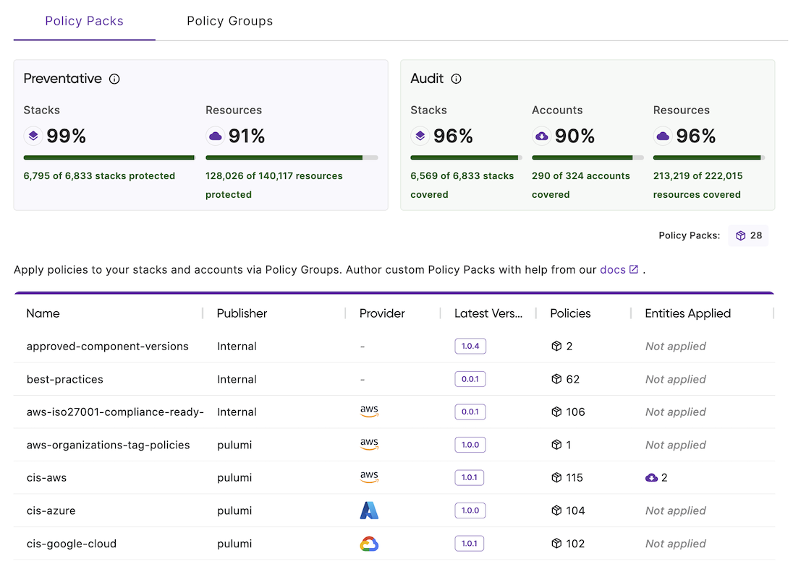
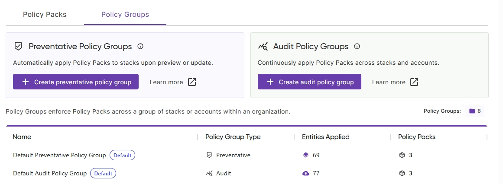

Pulumi Policy enforces compliance, security, and best practices across your cloud infrastructure, whether managed by Pulumi, provisioned by other tools, or created manually.

Policy enforcement is applied in two ways:

- **Preventative**: Blocking non-compliant resources before deployment during Pulumi stack updates
- **Audit**: Continuously scan existing resources discovered through [Insights Discovery](/docs/insights/discovery/) to identify violations

This guide walks you through getting started with Pulumi Policy using both preventative and audit policies.

## Prerequisites

To follow this guide, ensure you have:

- Access to Pulumi Cloud with Policy enabled for your organization.
- **For preventative policies**: One or more Pulumi stacks.
- **For audit policies**: Cloud accounts connected via [Insights Discovery](/docs/insights/discovery/).
- Organization admin permissions to configure policies.

## Understanding the Policies page

The Policies page is the central hub for managing Pulumi Policy. To get there, navigate to **Management** > **Policies** in the left navigation.

The page displays two tabs: **Policy Packs** and **Policy Groups**.

### Policy Packs

The Policy Packs tab has two switchable views:

- **Organization**: Policy packs published to your organization and ready to apply. This includes:
  - Custom policy packs you've authored and published
  - Pulumi-provided policy packs you've added from the marketplace
- **Available**: Pre-authored policy packs from Pulumi that you can add to your organization

Select any policy pack in either view to see its details across three tabs:

- **Overview**: Displays pack metadata including name, publisher, version, source, and tags
- **Policies**: Lists individual policies in the pack with their descriptions and enforcement levels
- **Entities Applied**: Shows which stacks or accounts use this pack and which policy groups apply it (disabled in the Available view)

{}
You may not see any packs in the Organization view until you add some from the Available view or publish your own.
{}

### Policy Groups

Policy groups enforce policy packs across stacks or accounts within your organization. The Policy Groups tab displays two types:

- **Preventative Policy Groups**: Automatically apply policy packs to stacks during `pulumi preview` or `pulumi up`
- **Audit Policy Groups**: Continuously apply policy packs to discovered cloud resources across accounts

The policy groups table shows:

- **Name**: The policy group identifier, with default groups marked with a badge
- **Policy Group Type**: Either Preventative (for stacks) or Audit (for accounts)
- **Entities Applied**: Number of stacks or accounts governed by this group
- **Policy Packs**: Number of policy packs included in this group

Your organization includes a default policy group for each type: one for preventative policies (applies to all stacks) and one for audit policies (applies to all accounts). These default groups automatically include new stacks and accounts as they're created.

#### Creating a preventative policy group

To create a policy group for stacks:

1. Select **Create preventative policy group**
1. **Name**: Enter a descriptive name for the policy group
1. **Entities**: Select **Choose stacks** to select which stacks this group will govern
1. **Policy Packs**: Select **Select policy packs** to choose which policy packs to enforce
1. Configure enforcement level (Advisory or Mandatory) for each policy pack
1. Select **Save Policy Group**

#### Creating an audit policy group

To create a policy group for cloud accounts:

1. Select **Create audit policy group**
1. **Name**: Enter a descriptive name for the policy group
1. **Entities**: Select **Choose accounts** to select which cloud accounts this group will scan
1. **Policy Packs**: Select **Select policy packs** to choose which policy packs to enforce
1. Configure enforcement level (Advisory or Mandatory) for each policy pack
1. Select **Save Policy Group**

## Monitor compliance

After setting up your policy groups, view violations and take action from the Policy Findings page.

To access policy findings:

1. Navigate to **Policy Findings** in the left navigation
1. View compliance issues organized by policy, resource, or account

Each policy violation creates an issue that you can act on:

- **Assign to team members**: Delegate remediation to the appropriate owner
- **Fix violations yourself**: Update the non-compliant resources directly
- **Assign to Pulumi Neo**: Let Pulumi's AI agent analyze and fix the violation automatically

This workflow—setting up policies, monitoring findings, and taking action—forms the core compliance management cycle in Pulumi Policy.

For detailed information on managing findings, see [Policy Findings](/docs/insights/policy/policy-findings/).

## Learn more

To deepen your understanding of Pulumi Policy:

- **Write custom policies**: [Authoring Guide](/docs/insights/policy/policy-packs/authoring/)
- **Explore pre-built policy packs**: [Pre-built Policy Packs](/docs/insights/policy/policy-packs/pre-built-packs/)
- **View and manage policy findings**: [Policy Findings](/docs/insights/policy/policy-findings/)
- **Learn about enforcement modes**: [Policy Groups](/docs/insights/policy/policy-groups/)
- **Configure policy pack settings**: [Policy Packs](/docs/insights/policy/policy-packs/)
- **Understand policy fundamentals**: [Policy Overview](/docs/insights/policy/)
