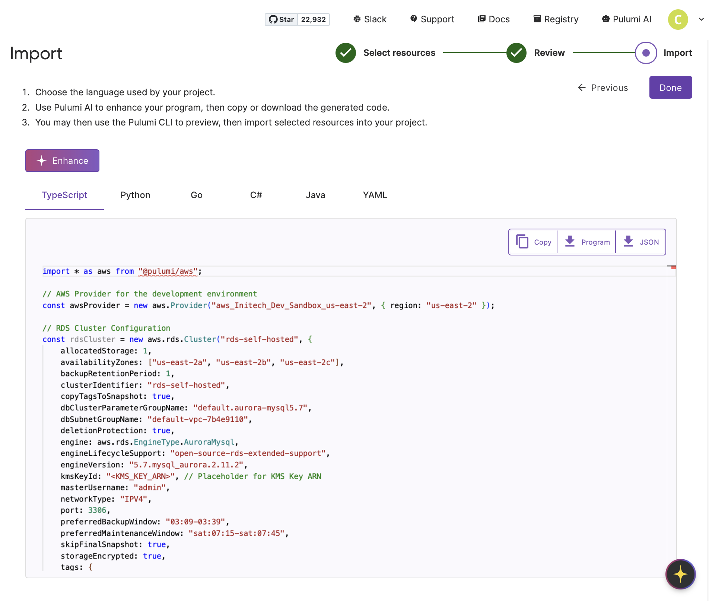

Pulumi Visual IaC Import allows platform and development teams to leverage [Pulumi Insights](/docs/insights/) to generate [Pulumi Infrastructure as Code (IaC)](https://www.pulumi.com/docs/iac/) from [discovered resources](/docs/insights/concepts/how-insights-works/#resource-discovery-process) in your cloud accounts. Visual Import provides an intuitive 5-step process to start managing your infrastructure resources using Pulumi IaC.

1. Discover and select existing cloud resources across accounts
2. Identify and review resources with a reference/dependent relationship to the previously selected resources
3. Generate and export IaC code in your preferred language
4. Enhance your IaC code using Pulumi Copilot
5. Refine and integrate that code into your own Pulumi projects

This feature is available to users on Team, Enterprise, and Business Critical SKUs with Pulumi Insights enabled.

## Prerequisites

Before you start, ensure you have at least one [Pulumi Insights account](/docs/insights/accounts/) set up with discovered resources

## Accessing Visual IaC Import

1. Log in to [Pulumi Cloud Console](https://app.pulumi.com/)
2. From the left navigation bar, select **IaC / Import**

This opens the Visual IaC Import workflow.

### Step 1: Select Resources

You begin by selecting the cloud resources you want to convert to code.

* Only resources that are not yet managed by Pulumi IaC are listed
* You can search, filter, group, and sort the list to locate relevant resources
* Use the checkboxes on each row to multi-select resources
* You can select individual resources only; grouped rows are not selectable
* Avoid selecting hundreds of resources at once; the intent is to codify logical components or services

Once you’ve selected the resources, click **Next** to proceed.

### Step 2: Review Referenced Resources

In this step, review the resources for which you want to generate IaC code. You will often see resources that are referenced by or dependent on your selected resources on this page. IaC Best Practices suggest creating logical groups or components for related resources as a single Pulumi IaC Stack. This page makes it easy to find these relationships.

* The page shows grouped resources based on their relationships
* Each group represents a top-level selected resource and its related resources
* You can filter the Reference and Relationship columns to fine-tune what to include

{}
The referenced resources will show a direction: 'from' or 'to'. 'from' refers to a dependent child resource. 'to' refers to the parent resource (depends on).
{}

You can deselect referenced resources if needed. When you're ready, click **Next**.

### Step 3: Generate and Review Code

This step lets you create, review, and refine the generated Pulumi IaC code.

* Choose the target language (e.g., TypeScript, Python, Go, C\#, Java, YAML)
* The editor displays the generated code as a single file and enables you to edit the code to ensure seamless integration into existing code

### Step 4: Copilot Enhance

The Copilot Enhance button enables Pulumi Copilot to take an additional pass over the generated code to improve formatting, provide more meaningful variable names and comments, and add references between selected components if available.

### Step 5: Integrate Code

Once the code is in the format you are happy with, you can:

* Copy the code or download it
* Add the code to an existing Pulumi Stack or to a new stack. You can create a new stack using `pulumi new` in your CLI
* Run `pulumi preview` to ensure everything is correct
* Run `pulumi up` to complete the import

When finished, click **Done** to return to the Visual IaC Import start page.

{}
Ensure that you run the pulumi CLI commands using credentials that match the cloud accounts for the imported resources, or the import will fail.
{}

All generated resources include the `import` property, which allows Pulumi to recognize and import them into the state during update or preview. Once `pulumi up` is complete, you can use make changes to the cloud resources from your IaC program.

After a successful stack update, these resources become Pulumi-managed. Changes to the stack will update the imported cloud resources in the same way as IaC-created resources.

## Best Practices

* **Start Small**: Select a small, logical grouping of resources (e.g., a single service or stack)
* **Validate**: Use `pulumi preview` after importing the generated code to confirm correctness
* **Enhance**: Let Copilot help improve readability and conformance with your coding standards
* **Integrate Carefully**: Consider how the generated code fits into your existing IaC structure

## Feedback and Support

We welcome your feedback on Visual IaC Import. If you encounter issues or have suggestions, please reach out via the [Pulumi feedback](https://github.com/pulumi/pulumi-cloud-requests)  site or your customer success representative.
