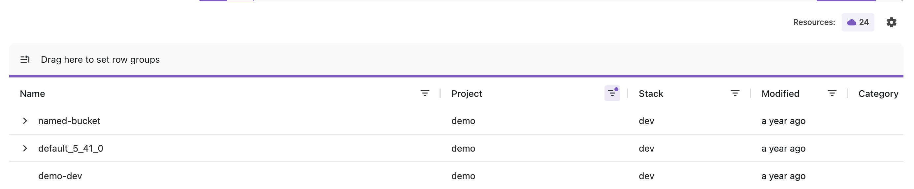
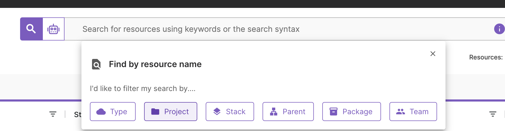
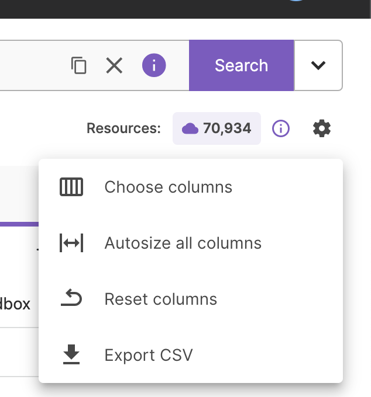
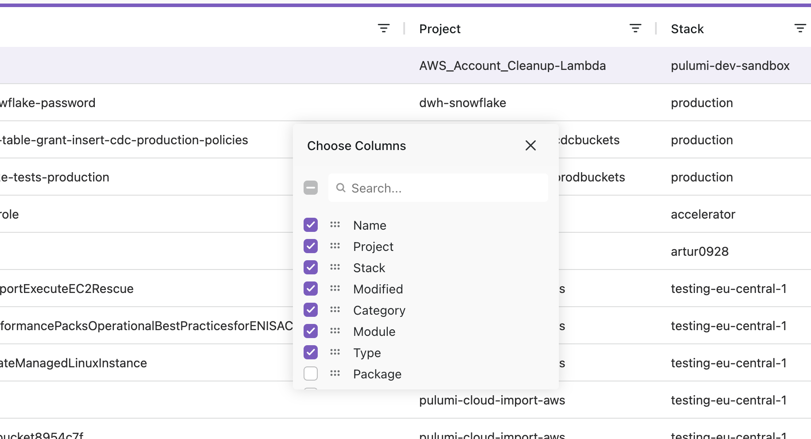
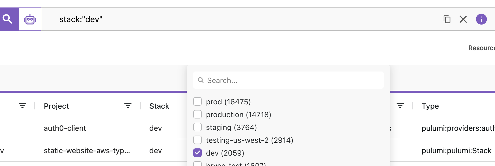
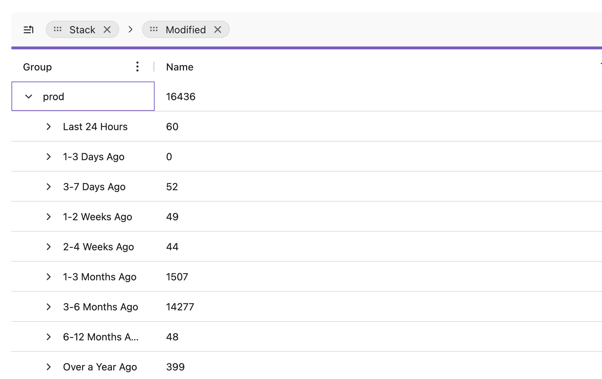

Pulumi Insights provides advanced search, analytics, and AI for your infrastructure as code.

It provides:

- **Resource Search**: Explore all of your resources under management.
  Filter, group, search, and sort resources by stack, project, or a number of other dimensions.

- **Resource Search Aggregates**: See aggregates at a glance for your resources under management.
  Start with a birds-eye view of your infrastructure, and leverage features like search, grouping, and filtering to dig deeper.

- **Cloud Import**: Bring your own cloud provider account and import all your existing resources into Pulumi to see how things break down. Zero code required.

- **Data Export**: Export your Pulumi resources into your business intelligence tool of choice to go even further.

- **Resource Search AI Assist**: (experimental) Use natural language processing to help craft search queries to explore your data.

## Resource Search

<iframe width="560" height="315" src="https://www.youtube.com/embed/pMEIX7LmXYo" title="YouTube video player" frameborder="0" allow="accelerometer; autoplay; clipboard-write; encrypted-media; gyroscope; picture-in-picture; web-share" allowfullscreen></iframe>

Resource Search can be accessed directly from the Pulumi Cloud dashboard or from the side navigation by navigating to **Resources**.

By default, you will see a table with the resources you have access to, ordered by most recently updated.

A count is shown the upper-right corner with the total number of resources matched by this query -- in this case, we have 24 resources.

The table of resources is paginated using infinite scroll so you are able to view up to **10,000** resources without needing to go page by page:

{}
If you need access to more resources, you can use the [Data Export](export) feature or access them programmatically via the [Pulumi Cloud Rest API](/docs/pulumi-cloud/cloud-rest-api#resource-search).
{}

Use the **search bar**, **row grouping**, or **column filters** to refine the resources displayed on the page.

Selecting **project** will pre-populate a query with `project:` which we can then extend to `project:production` to return resources with "production" in their project name.

The columns displayed on results can be modified to show or hide information by selecting the **gear icon**.

Selecting a column header will modify the query to sort by that column.

### Resource Search Aggregates

The **Column Filter** menu can be expanded to apply additional filters to each column and to view finer-grained resource sets.

In this example, the query has been restricted to the "dev" stack.

### Resource Search Grouping
The **Row Groups Header** allows you to drag columns from the table to enable grouping by that column. You can group by multiple columns at once. In this example, we have grouped by stack and modified so that we can see a breakdown of resources by stack and when they were last modified.

Selecting the **"X" in the search bar** will remove all previously selected filters.

## Data Export

{}
This feature is only available to organizations using the Enterprise and Business Critical editions.
If you don't see it in your organization, [contact us](/contact?form=sales).
{}

Organizations with Data Export enabled are able to export all resources matching a particular query in CSV format.

For a more detailed description of CSV schema, see the [export documentation](export).

## APIs

See the [Pulumi Cloud REST API](/docs/pulumi-cloud/cloud-rest-api#resource-search) for full details of the API endpoint to query and export resources.
