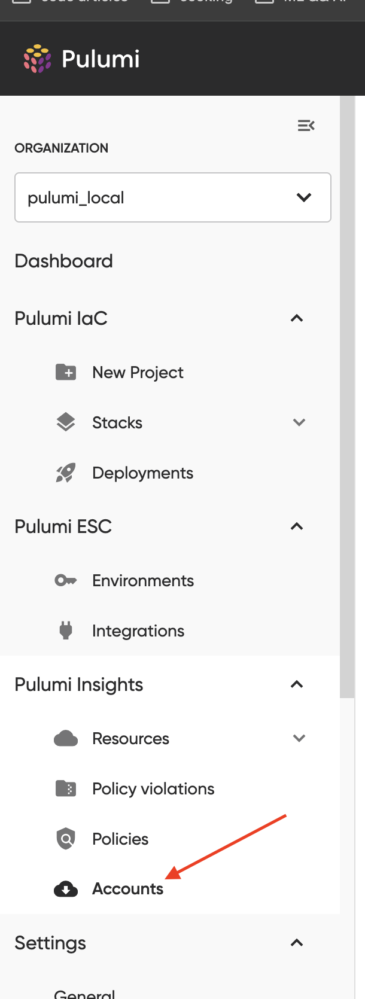
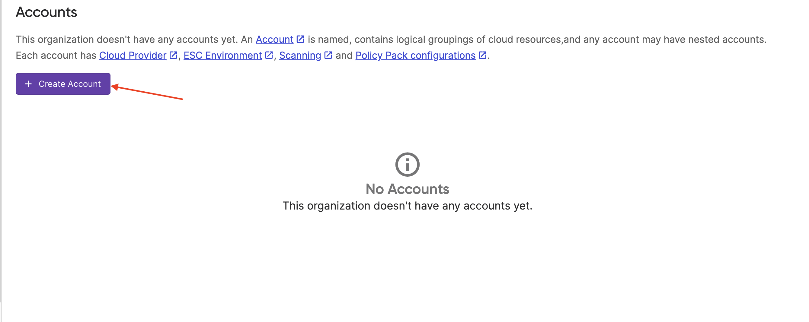
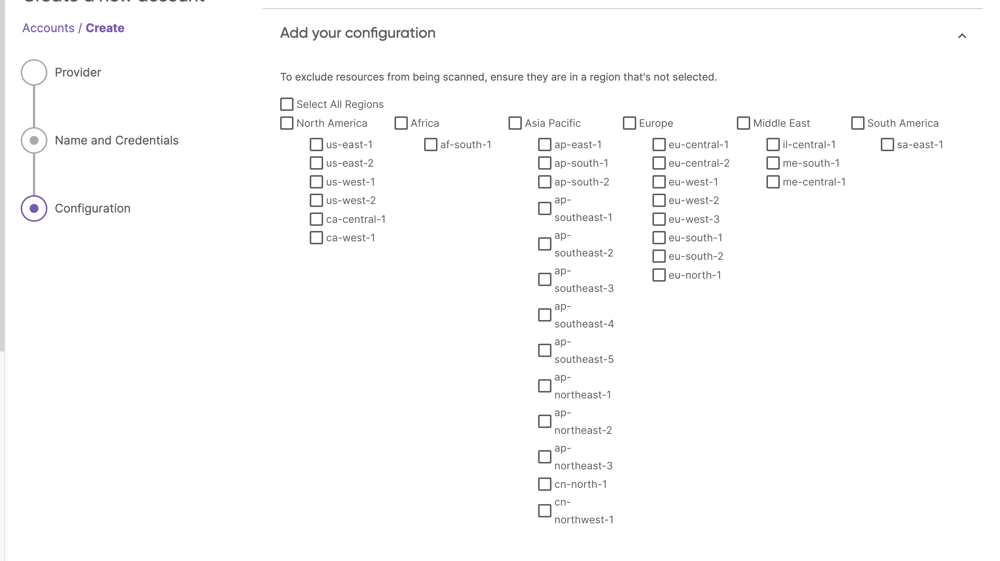
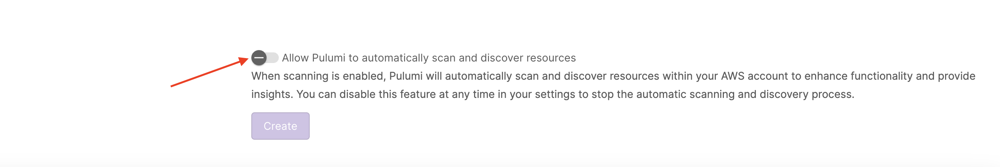

This document outlines the steps required to create and manage a Pulumi insights account used for scanning provider resources.

## Prerequisites

* You must be an admin of your Pulumi organization.

## Account creation

1. After logging into the Pulumi cloud console, you should see a tab titled "accounts", navigate to that page.
    
2. On this page, you should see a create buton that will take you to the account creation screen.
    
    
3. Here you can pick your provider (we currently support AWS, Azure, Oracle Cloud, and Kubernetes) and provide the required authentication details for pulumi cloud to scan it.
4. Select or create an ESC enviornment that has the right credentials to scan the provider you selected.

    See below for details on how to setup the ESC environment for each provider

5. Enter a name for the account. The name must be unique and can not contain any '/'.

    The reason the name can not contain any '/' is because Pulumi automatically names child accounts using '/'. For more information on child accounts, see below.

6. Add any specific configuration required for your selected provider such as the regions you want to scan for AWS.

7. To finish, select if you would like Pulumi to automatically run a new scan against this account on a schedule or if you would like to fire all scans manually.


  When scheduled scans are enabled, Pulumi will scan the account every 24 hours.


## Configure ESC credentials

### AWS

The AWS scanner for Pulumi cloud requires access to the AWS account you want to discover resources within. This access can be granted by creating an ESC environment that, when opened, produces valid credentials to use the Pulumi AWS provider. There are several ways to achieve this, but the suggested way is to use dynamic, short-lived secrets using [ESC's AWS provider](/docs/pulumi-cloud/access-management/oidc/provider/aws.md). A summary of the steps are below.

1. Create IAM role with the correct trust policy for Pulumi Cloud to assume it.

```json
{
    "Version": "2012-10-17",
    "Statement": [
        {
            "Effect": "Allow",
            "Principal": {
                "Federated": "arn:aws:iam::<ACCOUNT_ID>:oidc-provider/api.pulumi.com/oidc"
            },
            "Action": "sts:AssumeRoleWithWebIdentity",
            "Condition": {
                "StringEquals": {
                    "api.pulumi.com/oidc:aud": "aws:pulumi"
                }
            }
        }
    ]
}
```

1. Give that IAM role the right permissions to allow Pulumi access to scan resources

  For the fastest setup, you can use the role `ReadOnlyAccess` managed by [aws](https://docs.aws.amazon.com/aws-managed-policy/latest/reference/ReadOnlyAccess.html).
  
2. create an [ESC environment that assumes that role when opened using OIDC](/docs/pulumi-cloud/access-management/oidc/provider/aws.md#pulumi-esc)
3. assign that esc environment to your new insights account during the account creation phase.

### OCI

### K8s

### Azure
