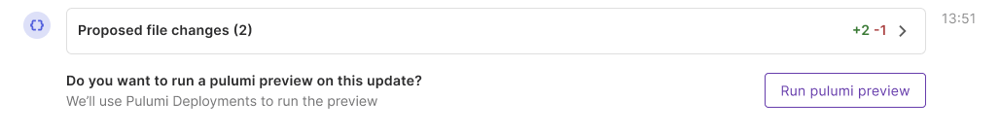
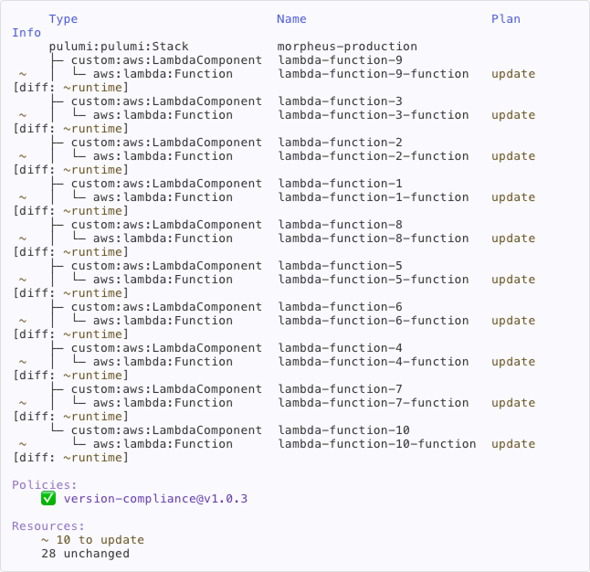

Neo can run [preview](/docs/iac/cli/commands/pulumi_preview/) directly from Pulumi Cloud to validate proposed infrastructure changes before creating pull requests. This capability provides confidence that suggested modifications do not result in unexpected resource changes and comply with [policies](/docs/iac/crossguard/).

## Public Preview Access

Neo is in public preview and currently free to use. Users will receive ample warning before any pricing changes go into effect. Using Neo to optionally run `pulumi preview` consumes workflow minutes. Lean more about workflow minutes on our [pricing page](https://www.pulumi.com/pricing/#faq-pricing).

## Prerequisites

### Configuration and Credentials

To execute a `pulumi preview`, Neo needs the necessary configuration and credentials.

- Applicable cloud provider credentials, such as [AWS](https://www.pulumi.com/registry/packages/aws/installation-configuration/#set-credentials-as-environment-variables), [Azure](https://www.pulumi.com/registry/packages/azure-native/installation-configuration/#set-configuration-using-environment-variables), or [GCP](https://www.pulumi.com/registry/packages/gcp/installation-configuration/#authenticate-using-a-service-account.)
- Any additional configuration required by your Pulumi programs

 The configuration and credentials can be supplied via [stack config](/docs/iac/concepts/config/) or an [ESC environment](/docs/esc/environments/).

### Stack Config

[Stack configuration](/docs/iac/concepts/config/) is a method of defining configuration directly on a stack, such as through the Pulumi CLI, a stack config file, or API.

### ESC Stack Association

Using [ESC](https://www.pulumi.com/docs/esc/) is the recommended approach for defining stack configuration and secrets. It is the most flexible and scalable option, and has native OIDC integration with all of the major cloud providers.

Learn more about [ESC](/docs/esc/) and [associating an ESC](/docs/esc/integrations/infrastructure/pulumi-iac/) environment with a stack.

## Using previews

When you ask Neo to make infrastructure changes, it utilizes previews to:

1. **Validate proposed changes**: Ensure the generated code is syntactically correct and will execute successfully
2. **Show impact analysis**: Display what resources will be created, updated, or deleted
3. **Check policy compliance**: Verify changes comply with your organization's [CrossGuard policies](/docs/iac/crossguard/)

### Preview Workflow

Once Neo has arrived at a solution for solving a task, it will request to run a `preview` to validate the changes. You can approve or decline the request. You can also manually run a preview at any time by simply prompting Neo.

 

Once the preview has executed, Neo will propose opening a pull request. You can approve opening a PR, or request that Neo make changes to its proposal.

### Preview Output

- Number of resources to be modified
- Specific changes for each resource
- Any errors or warnings
- Policy violations if applicable

### Policy Compliance Checking

If the stack executing the `preview` is associated with Pulumi IaC policies, the policies will be exercised as part of the preview, and any warnings or violations will be displayed.

## Troubleshooting

### Missing or Invalid Credentials

If Neo cannot run previews due to missing credentials:

1. Verify your ESC environment contains the necessary credentials
2. Check that the environment is associated with your stack. You can visit the stack details page to view the associated ESC environments.

## Best practices

### Always Preview Before Merging

While Neo runs previews before creating PRs, always run a final preview before merging to catch any changes that occurred since PR creation.

### Review Preview Output Carefully

Pay special attention to:

- Resources marked for replacement (not just update)
- Unexpected resources in the change set
- Policy warnings or violations

## Security Considerations

Neo's preview operations are limited by:

- The permissions of the user initiating the request
- The IAM roles associated with ESC credentials
- Organization-level policies and restrictions
