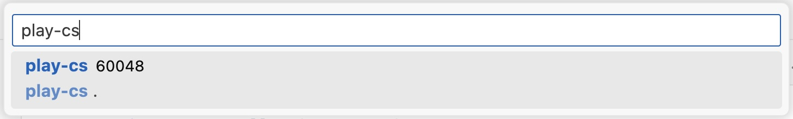
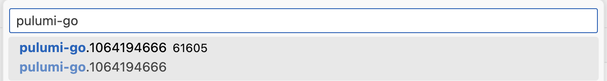

Because Pulumi uses general purpose programming languages to provision cloud resources, you can take advantage of native debugging tools to troubleshoot your infrastructure definitions.

The tools differ depending on the language you are using, but the process stays similar:

1. Start with an existing Pulumi project, that contains `Pulumi.yaml` and your program.
2. For some languages, you'll have to temporarily modify your program to pause until a debugger is attached.
3. Set a breakpoint in your program.
4. Run `pulumi up` or `pulumi preview` from a command line.
5. Wait until `pulumi` is paused waiting for a debugger to attach.
6. Attach the debugger to a running process of your language runtime.
7. Step through the program to find the problem.
8. Run the program to completion and let `pulumi` shut down all the processes.
9. Change your program and repeat the process if needed.

Subsequent sections outline the specifics for each language runtime.

## Debugging Node.js programs

Run the Pulumi CLI by passing the [`--inspect-brk`](https://nodejs.org/en/learn/getting-started/debugging#command-line-options) option to node:

```bash
NODE_OPTIONS='--inspect-brk' pulumi up
```

The stack execution will pause until a debugger is attached:

```bash
Previewing update (dev)

     Type                      Name           Plan       Info
 +   pulumi:pulumi:Stack       aws-ts-dev     create     For help, see: https://nodejs.org/en/docs/inspector
```

Set a breakpoint in your program.

Then, attach your debugger to the process with the `node` runtime. For example, in VS Code, you can define the following `launch.json` file:

```json
{
    "version": "0.2.0",
    "configurations": [
        {
            "name": "Node.js: Attach",
            "type": "node",
            "request": "attach",
            "continueOnAttach": true,
            "skipFiles": [
                "${workspaceFolder}/node_modules/**/*.js",
                "${workspaceFolder}/lib/**/*.js",
                "<node_internals>/**/*.js"
            ]
        }
    ]
}
```

navigate to the `Run and Debug` menu on the left pane, and then click the Start Debugging (F5) button with the `Node.js: Attach` configuration.

Depending on your setup, you may need to attach multiple times until the right node process is found. For example, you may be running Node.js policy packs that will hit the debugger as well.

Now you can step through the program and inspect variables. Once completed, resume the execution and let the Pulumi CLI complete.

## Debugging Python programs

This guide uses [`debugpy`](https://github.com/microsoft/debugpy) to debug Pulumi programs.

You need to install the `debugpy` package to your Pulumi program by adding it to `requirements.txt`:

```txt
pulumi>=3.0.0,<4.0.0
debugpy>=1.0.0
```

Then, prepend your Pulumi program with the code to wait for a debugger to attach:

```py
import debugpy

debugpy.listen(("localhost", 5678))
debugpy.wait_for_client()

# ... Your normal Pulumi code follows here
```

Run `pulumi up` the usual way:

```bash
pulumi up
Previewing update (dev)

 Type                 Name  Plan   Info
 pulumi:pulumi:Stack  dev          0.00s - Note: Debugging will proceed.
```

Set a breakpoint in your Pulumi code.

Navigate to your IDE and attach the debugger to the process with the `python` runtime. For example, in VS Code, you can define the following `launch.json` file:

```json
{
    "version": "0.2.0",
    "configurations": [
        {
            "name": "Python: Local Attach",
            "type": "debugpy",
            "request": "attach",
            "connect": {
                "host": "localhost",
                "port": 5678
            },
            "pathMappings": [
                {
                    "localRoot": "${workspaceFolder}",
                    "remoteRoot": "."
                }
            ],
            "justMyCode": true
        }
    ]
}
```

navigate to the `Run and Debug` menu on the left pane, and then click the Start Debugging (F5) button with the `Python: Local Attach` configuration.

Now you can step through the program and inspect variables. Once completed, resume the execution and let the Pulumi CLI complete.

## Debugging .NET programs

Prepend your Pulumi program with the code to wait for a debugger to attach:

```cs
using System.Diagnostics;

return await Pulumi.Deployment.RunAsync(async () =>
{
    while (!Debugger.IsAttached)
    {
        await System.Threading.Tasks.Task.Delay(1000);
    }
    Debugger.Break();

    // ... Your normal Pulumi code follows here
});
```

Run `pulumi up` the usual way:

```bash
pulumi up
Previewing update (dev)

 Type                 Name          Plan   Info
 pulumi:pulumi:Stack  play-cs-dev          'dotnet build -nologo .' completed successfully
```

Navigate to your IDE and attach the debugger to the process with the name of your .NET project. For example, in VS Code, you can define the following `launch.json` file:

```json
{
    "version": "0.2.0",
    "configurations": [
        {
            "name": ".NET Core Attach",
            "type": "coreclr",
            "request": "attach"
        }
    ]
}
```

navigate to the `Run and Debug` menu on the left pane, and then click the Start Debugging (F5) button with the `.NET Core Attach` configuration. Search for the process by your project name and attach:



Now you can step through the program and inspect variables. Once completed, resume the execution and let the Pulumi CLI complete.

## Debugging Go programs

Prepend your Pulumi program with the code to pause and give yourself time to attach the debugger:

```go
package main

import (
 "time"

 "github.com/pulumi/pulumi/sdk/v3/go/pulumi"
)

func main() {
 pulumi.Run(func(ctx *pulumi.Context) error {
  time.Sleep(20 * time.Second)

  // ... Your normal Pulumi code follows here
 })
}
```

Run `pulumi up` the usual way:

```bash
pulumi up
Previewing update (dev)

 Type                 Name      Plan       Info
 pulumi:pulumi:Stack  dev       create...
```

Set a breakpoint in your program.

Navigate to your IDE and attach the debugger to the process with the name like `pulumi-go.xxxxxxxxxx`. For example, in VS Code, you can define the following `launch.json` file:

```json
{
    "version": "0.2.0",
    "configurations": [
        {
            "name": "Attach to Process",
            "type": "go",
            "request": "attach",
            "mode": "local",
            "processId": 0
        }
    ]
}
```

navigate to the `Run and Debug` menu on the left pane, and then click the Start Debugging (F5) button with the `Attach to Process` configuration. Search for the process with the `pulumi-go` prefix and attach:



Now you can step through the program and inspect variables. Once completed, resume the execution and let the Pulumi CLI complete.

## Debugging Java programs

This approach assumes your project uses Maven and you have Maven shell scripts on your path.

Configure the runtime options in `Pulumi.yaml` to use `mvnDebug`:

```yaml
runtime:
  name: java
  options:
    use-executor: "mvnDebug"
```

Set a breakpoint in your Pulumi code.

Navigate to your IDE and attach to the port 8000. For example, in VS Code, you can define the following `launch.json` file:

```json
{
    "version": "0.2.0",
    "configurations": [
        {
            "type": "java",
            "name": "Debug (Attach)",
            "projectName": "App",
            "request": "attach",
            "hostName": "localhost",
            "port": 8000
        }
    ]
}
```

navigate to the `Run and Debug` menu on the left pane, and then click the Start Debugging (F5) button with the `Debug (Attach)` configuration.

Now you can step through the program and inspect variables. Once completed, resume the execution and let the Pulumi CLI complete.

## Debugging YAML programs

It's not possible to debug Pulumi YAML projects.
