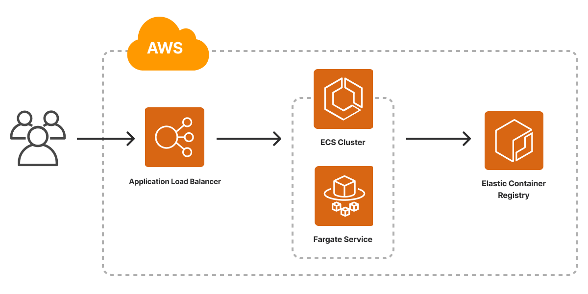

The AWS Container Service template scaffolds a Pulumi project that deploys a containerized service to AWS. The architecture includes an [Amazon ECS cluster](/registry/packages/aws/api-docs/ecs/cluster) for orchestration, [AWS Fargate](/registry/packages/awsx/api-docs/ecs/fargateservice/) for serverless compute, an [Application Load Balancer](/registry/packages/awsx/api-docs/lb/) for internet ingress, and an [Amazon Elastic Container Registry (ECR)](/registry/packages/awsx/api-docs/ecr/repository) repository for the container image. The template ships with an Nginx Dockerfile so the project deploys end to end out of the box.



## Using this template

To use this template to deploy an ECS cluster running your container service, make sure you've [installed Pulumi](/docs/install/) and [configured your AWS credentials](/registry/packages/aws/installation-configuration#credentials), then create a new [project](/docs/iac/concepts/projects/) using the template in the language of your choice:



Follow the prompts to complete the new-project wizard. When it's done, you'll have a complete Pulumi project that's ready to deploy and configured with the most common settings. Feel free to inspect the code in  for a closer look.

## Deploying the project

The template requires no additional configuration. Once the new project is created, you can deploy it immediately with [`pulumi up`](/docs/iac/cli/commands/pulumi_up):

```bash
$ pulumi up
```

When the deployment completes, Pulumi exports the following [stack output](/docs/iac/concepts/stacks/#outputs) values:

url
: The HTTP URL for the container's endpoint.

Output values like these are useful in many ways, most commonly as inputs for other stacks or related cloud resources. The computed `url`, for example, can be used from the command line to open the newly deployed container service in your favorite web browser:

```bash
$ open $(pulumi stack output url)
```

## Customizing the project

Projects created with the Container Service template expose the following [configuration](/docs/iac/concepts/config/) settings:

container_port
: Specifies the port mapping for the container. Defaults to port 80.

cpu
: Specifies the amount of CPU to use with each task or each container within a task. Defaults to 512.

memory
: Specifies the amount of memory to use with each task or each container within a task. Defaults to 128.

image
: Specifies the location of the Dockerfile used to build the container image that is run. Defaults to the Dockerfile in the `app` folder.

All of these settings are optional and may be adjusted either by editing the stack configuration file directly (by default, `Pulumi.dev.yaml`) or by changing their values with [`pulumi config set`](/docs/iac/cli/commands/pulumi_config_set) as shown below.

### Using your own container image

If you already have a container image you'd like to build your container service with, you can do so either by replacing the Dockerfile in the `app` folder or by configuring the stack to point to another folder on your computer with the `image` setting:

```bash
$ pulumi config set image ../my-existing-image
$ pulumi up
```

## Cleaning up

You can cleanly destroy the stack and all of its infrastructure with [`pulumi destroy`](/docs/iac/cli/commands/pulumi_destroy):

```bash
$ pulumi destroy
```

## Learn more

* Browse other architecture templates in the [Templates gallery](/templates).
* Explore the [AWS](/registry/packages/aws/) and [AWSx](/registry/packages/awsx) provider API docs in the Pulumi Registry.
* Walk through Pulumi from the ground up in [Pulumi Tutorials](/tutorials/).
* Read the latest [container posts on the Pulumi blog](/blog/tag/containers).
