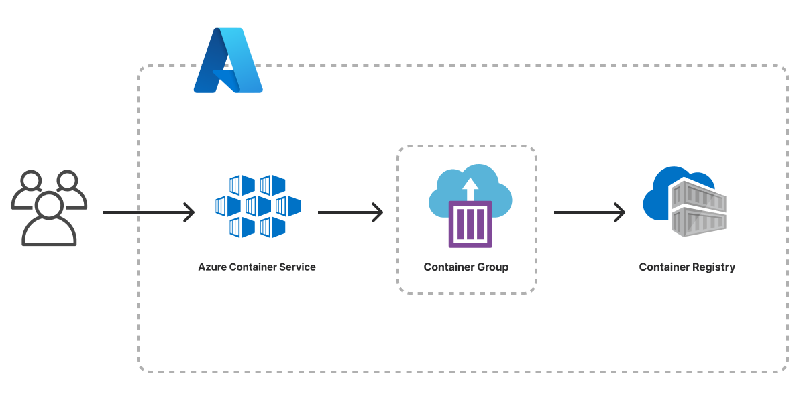

The Azure Container Service template scaffolds a Pulumi project that deploys a containerized service to Azure. The architecture includes an [Azure Container Registry](/registry/packages/azure-native/api-docs/containerregistry) for the container image and [Azure Container Instances (ACI)](/registry/packages/azure-native/api-docs/containerinstance) for serverless container execution. The template ships with placeholder app content so the project deploys end to end out of the box.



## Using this template

To use this template to deploy your own container service, make sure you've [installed Pulumi](/docs/install/) and [configured your Azure credentials](/registry/packages/azure-native/installation-configuration#credentials), then create a new [project](/docs/iac/concepts/projects/) using the template in the language of your choice:



Follow the prompts to complete the new-project wizard. When it's done, you'll have a complete Pulumi project that's ready to deploy and configured with the most common settings. Feel free to inspect the code in  for a closer look.

## Deploying the project

The template requires no additional configuration. Once the new project is created, you can deploy it immediately with [`pulumi up`](/docs/iac/cli/commands/pulumi_up):

```bash
$ pulumi up
```

When the deployment completes, Pulumi exports the following [stack output](/docs/iac/concepts/stacks/#outputs) values:

hostname
: The hostname of the container group.

ip
: The public IP address of the container group.

url
: The HTTP URL of the container group.

Output values like these are useful in many ways, most commonly as inputs for other stacks or related cloud resources. The computed `url`, for example, can be used from the command line to open the newly deployed application in your favorite web browser:

```bash
$ open $(pulumi stack output url)
```

## Customizing the project

Projects created with the Container Service template expose the following [configuration](/docs/iac/concepts/config/) settings:

appPath
: The path to the folder containing the application and Dockerfile. Defaults to `app`, which contains a "Hello world" example.

containerPort
: The port to expose on the container. Defaults to `80`.

cpu
: The number of CPU cores to allocate on the container. Defaults to `1`.

memory
: The amount of memory, in GB, to allocate on the container. Defaults to `2`.

imageName
: The name of the container image to be published to Azure Container Registry. Defaults to `my-app`.

imageTag
: The tag applied to published container images. Defaults to `latest`.

All of these settings are optional and may be adjusted either by editing the stack configuration file directly (by default, `Pulumi.dev.yaml`) or by changing their values with [`pulumi config set`](/docs/iac/cli/commands/pulumi_config_set):

```bash
$ pulumi config set containerPort 8080
$ pulumi up
```

## Cleaning up

You can cleanly destroy the stack and all of its infrastructure with [`pulumi destroy`](/docs/iac/cli/commands/pulumi_destroy):

```bash
$ pulumi destroy
```

## Learn more

* Browse other architecture templates in the [Templates gallery](/templates).
* Explore the [Azure Native provider API docs](/registry/packages/azure-native) in the Pulumi Registry.
* Walk through Pulumi from the ground up in [Pulumi Tutorials](/tutorials/).
* Read the latest [container posts on the Pulumi blog](/blog/tag/containers).
