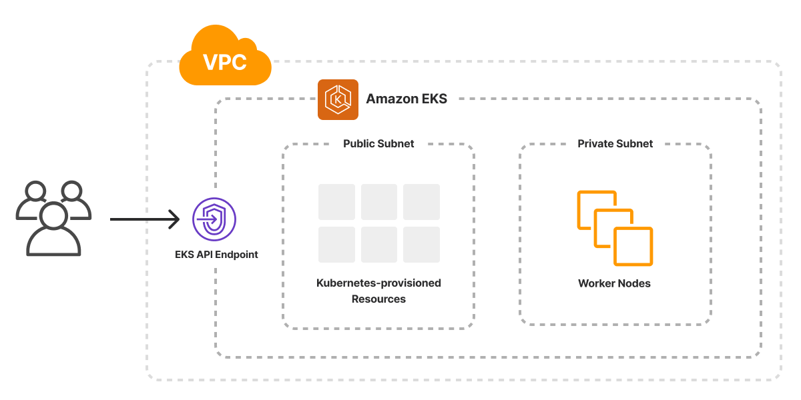

The AWS Kubernetes Cluster template scaffolds a Pulumi project that provisions a managed [Amazon EKS cluster](/registry/packages/eks/api-docs/cluster/) inside a new VPC with public and private subnets. Worker nodes run in the private subnets for improved security; load balancers created by cluster workloads are automatically placed in the public subnets.



## Using this template

To use this template to deploy your own managed Kubernetes cluster, make sure you've [installed Pulumi](/docs/install/) and [configured your AWS credentials](/registry/packages/aws/installation-configuration#credentials), then create a new [project](/docs/iac/concepts/projects/) using the template in the language of your choice:



Follow the prompts to complete the new-project wizard. When it's done, you'll have a complete Pulumi project that's ready to deploy and configured with the most common settings. Feel free to inspect the code in  for a closer look.

## Deploying the project

The template requires no additional configuration. Once the new project is created, you can deploy it immediately with [`pulumi up`](/docs/iac/cli/commands/pulumi_up):

```bash
$ pulumi up
```

When the deployment completes, Pulumi exports the following [stack output](/docs/iac/concepts/stacks/#outputs) values:

kubeconfig
: The cluster's kubeconfig file, which you can use with `kubectl` to access and communicate with your cluster.

vpcId
: The ID of the VPC that your cluster is running in.

Output values like these are useful in many ways, most commonly as inputs for other stacks or related cloud resources.

## Customizing the project

Projects created with the Kubernetes template expose the following [configuration](/docs/iac/concepts/config/) settings:

minClusterSize
: The minimum number of nodes to allow in the cluster. Defaults to `3`.

maxClusterSize
: The maximum number of nodes to allow in the cluster. Defaults to `6`.

desiredClusterSize
: The desired number of nodes in the cluster. Defaults to `3`.

eksNodeInstanceType
: The EC2 instance type to use for the nodes. Defaults to `t2.medium`.

vpcNetworkCidr
: The network CIDR to use for the VPC. Defaults to `10.0.0.0/16`.

All of these settings are optional and may be adjusted either by editing the stack configuration file directly (by default, `Pulumi.dev.yaml`) or by changing their values with [`pulumi config set`](/docs/iac/cli/commands/pulumi_config_set).

## Cleaning up

You can cleanly destroy the stack and all of its infrastructure with [`pulumi destroy`](/docs/iac/cli/commands/pulumi_destroy):

```bash
$ pulumi destroy
```

## Learn more

* Browse other architecture templates in the [Templates gallery](/templates).
* Explore the [Amazon EKS](/registry/packages/eks/) and [AWSx](/registry/packages/awsx) provider API docs in the Pulumi Registry.
* Walk through Pulumi from the ground up in [Pulumi Tutorials](/tutorials/).
* Read the latest [Kubernetes posts on the Pulumi blog](/blog/tag/kubernetes).
